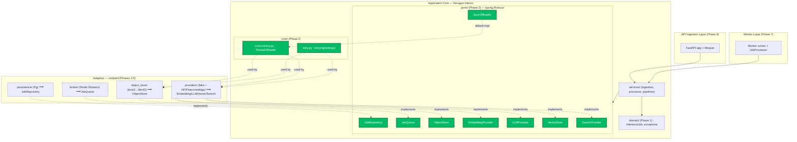
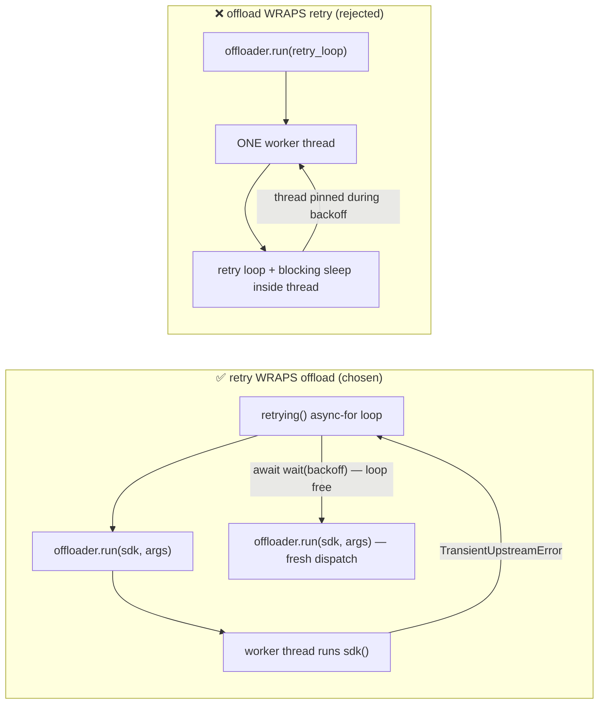
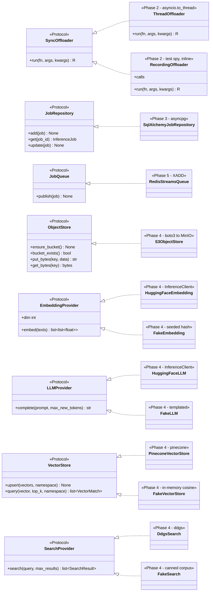
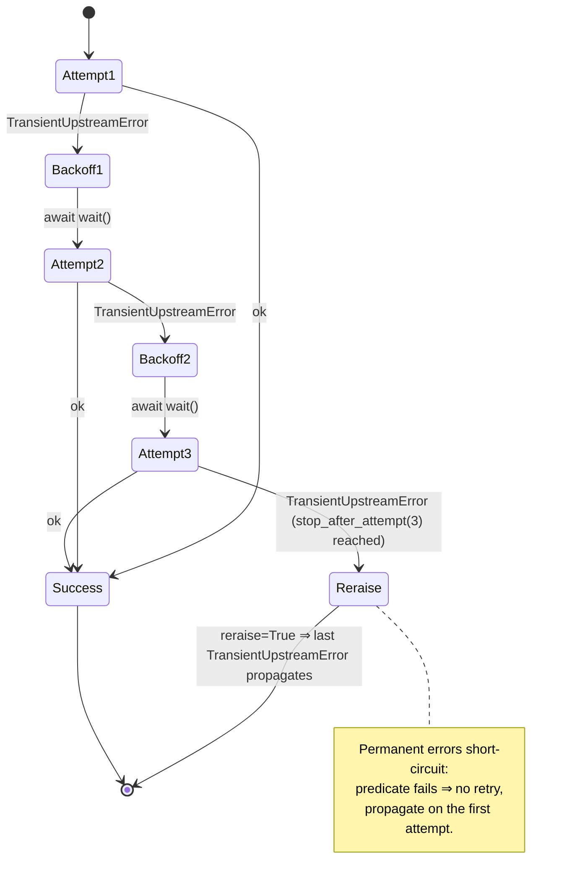
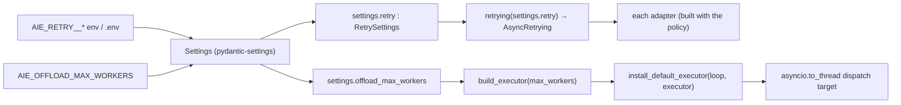

# Phase 2 — Concurrency Core, Retry Policy, Ports

> **Part of:** [Asynchronous AI Serving Engine](../implementation-plan.md) · [Problem Statement](../problem-statement.md)
> **Status:** Planned (greenfield) · **Depends on:** [Phase 1 — Scaffold, Toolchain, Settings, Domain Core](phase-1-scaffold-toolchain-domain.md) · **Unlocks:** Phases 3–7 (persistence, object store/providers, broker, API, worker)
> **Delivers:** The structural seams of the entire engine — a `SyncOffloader` port (default `ThreadOffloader` over `asyncio.to_thread`), a `tenacity`-based retry policy that *wraps* the offload, the seven `typing.Protocol` ports every adapter will implement, and a deterministic, clock-free `RecordingOffloader` spy that proves the non-blocking invariant without timing.
> **Primary skills applied:** async-python-patterns, python-pro, error-handling-patterns, software-architecture, architecture-patterns, python-testing-patterns, docs-architect, mermaid-expert

---

## Table of Contents

1. [Overview & Objectives](#1-overview--objectives)
2. [Where This Fits](#2-where-this-fits)
3. [Prerequisites & Inputs](#3-prerequisites--inputs)
4. [Deliverables](#4-deliverables)
5. [Design Decisions & Rationale](#5-design-decisions--rationale)
6. [Detailed Implementation](#6-detailed-implementation)
7. [Flow & Sequence Diagrams](#7-flow--sequence-diagrams)
8. [Configuration & Environment](#8-configuration--environment)
9. [Testing Strategy](#9-testing-strategy)
10. [Verification & Exit-Criteria Mapping](#10-verification--exit-criteria-mapping)
11. [Windows & Cross-Platform Notes](#11-windows--cross-platform-notes)
12. [Common Pitfalls & Troubleshooting](#12-common-pitfalls--troubleshooting)
13. [Definition of Done](#13-definition-of-done)
14. [References & Further Reading](#14-references--further-reading)
15. [Navigation](#15-navigation)

---

## 1. Overview & Objectives

Phase 1 produced the inert parts of the engine: configuration (`Settings`), the domain entity (`InferenceJob` with its `PENDING → RUNNING → SUCCESS|FAILED` state machine), and the domain exceptions. None of those types touch the network, the event loop, or a thread pool. **Phase 2 introduces the first moving parts** — the abstractions through which every byte of upstream I/O will eventually travel.

This phase is deliberately *interface-heavy and implementation-light*. We write almost no logic that talks to a real database, a real Redis, or a real model API. Instead, we define the **contracts** (ports) and the two pieces of cross-cutting machinery that every adapter in Phases 3–7 will reuse verbatim:

1. **The concurrency boundary** — a `SyncOffloader` port and its production implementation, `ThreadOffloader`, which is a thin, *typed* passthrough to `asyncio.to_thread`. Every synchronous SDK call in the system (boto3, HuggingFace `InferenceClient`, Pinecone, `ddgs`) will be funnelled through `offloader.run(sdk_method, *args)` so it never blocks the event loop.
2. **The resilience boundary** — a `retrying(settings) -> AsyncRetrying` factory built on `tenacity`, configured from `Settings` so that the number of attempts and the backoff profile are data, not hard-coded constants. Crucially, **retry wraps offload**: each retry attempt re-issues a fresh offload, so a transient failure that surfaces from inside a worker thread is retried correctly.

Alongside these two mechanisms we declare the **seven ports** that describe everything the engine needs from the outside world, and we build the **`RecordingOffloader` spy** plus stub fakes that make the engine's most important non-functional requirement — *"blocking calls are properly wrapped inside thread executors"* — verifiable as a **deterministic unit assertion** rather than a flaky, clock-dependent integration test.

### Concrete objectives

By the end of Phase 2 the following must be true:

| # | Objective | Done when |
|---|-----------|-----------|
| O1 | A `SyncOffloader` `Protocol` exists with a precise, `mypy --strict`-clean generic signature using PEP 695 `[**P, R]`. | `ports/offloader.py` type-checks; `ThreadOffloader` is recognised as a structural subtype. |
| O2 | `ThreadOffloader` offloads to a worker thread and preserves argument/return types. | A thread-identity test proves the function runs off the loop thread; mypy infers the return type from `fn`. |
| O3 | `RecordingOffloader` records every offloaded call **and runs it inline** (no thread, no clock). | The spy exposes a `calls` list of `(qualname, args, kwargs)`; replaying yields the real return value. |
| O4 | `retrying(settings)` produces an `AsyncRetrying` that retries **only** `TransientUpstreamError`, stops after `settings.retry.max_attempts`, and uses jittered exponential backoff. | An attempt-counting test with `base_delay_s = 0` asserts the function is invoked exactly `max_attempts` times. |
| O5 | The error-translation contract is specified: adapters convert raw SDK errors into `TransientUpstreamError` / `PermanentUpstreamError` **before** the retry layer sees them. | A documented helper pattern + a toy adapter demonstrating it. |
| O6 | Seven ports — `JobRepository`, `JobQueue`, `ObjectStore`, `EmbeddingProvider`, `LLMProvider`, `VectorStore`, `SearchProvider` — are declared as `Protocol`s with async signatures and docstrings. | `ports/` modules type-check; a `classDiagram` documents the planned implementers. |
| O7 | Two clock-free proofs exist: the spy proves *routing through the boundary*; the thread-identity test proves *the boundary actually leaves the loop thread*. | `tests/unit/test_concurrency.py` and `tests/unit/test_retry.py` pass under `pytest -m "not integration"`. |

> [!IMPORTANT]
> Phase 2 is the phase that makes Exit Criterion #1 — *"Deterministic Concurrency Gates"* — achievable for the rest of the project. If the offloader/retry seams are wrong here, every adapter test downstream becomes a timing race. Get the seams right and the remaining phases inherit determinism for free.

---

## 2. Where This Fits

Phase 2 lives at the **center of the hexagon**: it is the `core/` machinery plus the `ports/` package — the inward-facing contracts that the application core depends on, and that the outward adapters (Phases 3–7) implement. Nothing here imports FastAPI, SQLAlchemy, Redis, or any SDK; those arrive only as *implementations* of these ports in later phases.



**Looking backward:** Phase 2 consumes the domain exceptions hierarchy and `Settings`/`RetrySettings` from [Phase 1](phase-1-scaffold-toolchain-domain.md). The retry factory reads its parameters from `Settings`; the ports reference `InferenceJob` and `JobStatus` in their signatures.

**Looking forward:** Every adapter built in Phases 3–5 is constructed as `Adapter(sdk_client, offloader, retry_settings)` and routes its calls through `retrying(...)` → `offloader.run(...)`. The composition root in [Phase 6](phase-6-composition-root-fastapi-api.md) instantiates exactly one `ThreadOffloader` and installs a sized `ThreadPoolExecutor` as the loop's default executor, so the entire system shares one bounded pool. The deterministic `RecordingOffloader` defined here becomes the workhorse of the parametrized "offload invariant" test in [Phase 4](phase-4-object-store-providers.md).

---

## 3. Prerequisites & Inputs

This phase assumes Phase 1 is complete. Concretely, the following must already exist and be green under `uv run poe check`:

| Input | Produced by | Why Phase 2 needs it |
|-------|-------------|----------------------|
| `pyproject.toml` with `requires-python >= 3.12`, ruff, mypy strict, `pytest` `asyncio_mode = "auto"`, `integration` marker | [Phase 1](phase-1-scaffold-toolchain-domain.md) | PEP 695 `[**P, R]` syntax and `async`-aware tests require Python 3.12 + the configured toolchain. |
| `src/app/domain/exceptions.py` — `DomainError`, `UpstreamError` (with `cause`), `TransientUpstreamError`, `PermanentUpstreamError` | [Phase 1](phase-1-scaffold-toolchain-domain.md) | The retry predicate keys off these types; Phase 2 **imports** them (does not redefine). |
| `src/app/domain/models.py` — `InferenceJob`, `JobStatus`, `JobType` | [Phase 1](phase-1-scaffold-toolchain-domain.md) | Port signatures reference these (e.g. `JobRepository.get(...) -> InferenceJob`). |
| `src/app/core/config.py` — `Settings`, `RetrySettings` | [Phase 1](phase-1-scaffold-toolchain-domain.md) | `retrying(settings)` reads `settings.retry.max_attempts`, `base_delay_s`, `max_delay_s`. |
| `tests/conftest.py` baseline | [Phase 1](phase-1-scaffold-toolchain-domain.md) | New fixtures (`recording_offloader`, `retry_settings`) hang off this. |

> [!NOTE]
> `RetrySettings` is defined in [Phase 1](phase-1-scaffold-toolchain-domain.md) with exactly the fields Phase 2 consumes: `max_attempts`, `base_delay_s`, `max_delay_s`, `exp_base`, `jitter_s` — all with `ge`/`gt` validation so tests can pin delays to `0`. Phase 2 reads them in `retrying(settings.retry)`; **Phase 1 is the source of truth**. See [§8 Configuration](#8-configuration--environment).

> [!IMPORTANT]
> No infrastructure (Docker, Postgres, Redis, MinIO) is required for Phase 2. Every test in this phase runs in-process with **zero network and zero clock dependence**. That is the whole point: the concurrency seam is validated before any real adapter exists.

---

## 4. Deliverables

| File | Type | Purpose |
|------|------|---------|
| `src/app/ports/__init__.py` | new | Re-export the seven ports + `SyncOffloader` for ergonomic imports (`from app.ports import JobRepository`). |
| `src/app/ports/offloader.py` | new | `SyncOffloader` `Protocol` — the sync→async boundary contract. |
| `src/app/ports/repository.py` | new | `JobRepository` `Protocol` — `add` / `get` / `update` over `InferenceJob`. |
| `src/app/ports/queue.py` | new | `JobQueue` `Protocol` — `publish` a job pointer to the broker. |
| `src/app/ports/object_store.py` | new | `ObjectStore` `Protocol` — `ensure_bucket` / `put_bytes` / `get_bytes`. |
| `src/app/ports/providers.py` | new | `EmbeddingProvider`, `LLMProvider`, `VectorStore`, `SearchProvider` `Protocol`s + value `TypedDict`s (`SearchResult`, `VectorMatch`). |
| `src/app/core/concurrency.py` | new | `ThreadOffloader` — production `SyncOffloader` over `asyncio.to_thread`; helper to build/install the sized executor. |
| `src/app/core/retry.py` | new | `retrying(settings) -> AsyncRetrying` factory + the `translate_upstream_error` helper pattern adapters apply first. |
| `src/app/domain/exceptions.py` | reference (no change) | `UpstreamError` (with `cause`) / `TransientUpstreamError` / `PermanentUpstreamError` are defined in Phase 1; Phase 2 imports them. |
| `tests/support/__init__.py` | new | Marks the test-support package. |
| `tests/support/offloader.py` | new | `RecordingOffloader` spy (records + runs inline) and a `BlockingOffloader` variant for negative tests. |
| `tests/support/fakes.py` | new | *Stub* fakes (shapes only) for the seven ports, referenced by later phases; full fakes land in [Phase 4](phase-4-object-store-providers.md). |
| `tests/unit/test_concurrency.py` | new | Spy-routing test + thread-identity test for `ThreadOffloader`. |
| `tests/unit/test_retry.py` | new | Attempt-counting tests (`base_delay_s = 0`), predicate tests, error-translation tests. |
| `tests/conftest.py` | changed | Add `recording_offloader` and `retry_settings` fixtures. |

> [!TIP]
> Keep `ports/` a *pure* package: it may import from `app.domain` and the standard library only. A quick guard in CI (`mypy` + a `ruff` import-linter rule, or a one-line test that imports `app.ports` and asserts no `fastapi`/`sqlalchemy`/`redis`/`boto3` modules were loaded) catches accidental coupling early. The hexagon's whole value comes from this discipline.

---

## 5. Design Decisions & Rationale

| Decision | Choice | Why | Rejected alternative |
|----------|--------|-----|----------------------|
| Port mechanism | `typing.Protocol` (structural) | Adapters/fakes conform **without importing** the abstraction; mypy verifies conformance at injection sites; zero inheritance coupling. | `abc.ABC` (nominal) — forces adapters to import and subclass the port, coupling the SDK layer to core. |
| Offload primitive | `asyncio.to_thread` behind a `SyncOffloader` port | Spec mandates `to_thread`; the port lets tests substitute a deterministic spy. One-line production impl. | `loop.run_in_executor` *called directly in adapters* — spreads loop access through the SDK layer and is harder to spy on. |
| Pool sizing | Composition root sets a sized `ThreadPoolExecutor` as the loop **default executor** | `to_thread` dispatches to the default executor, so installing a sized pool gives "spec letter (`to_thread`) + bounded pool" in **one** path. | A custom executor passed into every adapter — more wiring, two ways to offload, easy to forget. |
| Retry library | `tenacity.AsyncRetrying` | Mature, async-native, composable stop/wait/retry predicates, `reraise` support; params are data. | Hand-rolled `for`-loop with `asyncio.sleep` — reinvents jitter, predicates, and reraise; harder to test. |
| Backoff profile | `wait_exponential_jitter(initial, max, exp_base, jitter)` | Exponential backoff with additive jitter avoids thundering-herd; one object, no separate `wait_random` composition. | `wait_exponential + wait_random` combination — more moving parts; `wait_exponential_jitter` is the canonical single helper. |
| Retry predicate | `retry_if_exception_type(TransientUpstreamError)` | Retries *only* errors adapters classified as transient; permanent errors fail fast. | `retry_if_exception_type(Exception)` — retries programming bugs and permanent 4xx, masking real failures. |
| Composition order | **Retry wraps offload** (retry is outermost) | Each attempt must re-issue a *fresh* `to_thread` call; a thread cannot be "re-awaited". | Offload wraps retry — would run the entire retry loop *inside one worker thread*, blocking that thread on `sleep` and defeating async backoff. |
| Error classification site | In the **adapter**, before retry sees the error | Keeps SDK-specific knowledge (botocore error codes, HF status) at the edge; core only knows `Transient`/`Permanent`. | Classifying inside `core/retry.py` — would force core to import every SDK's exception types. |
| Spy strategy | `RecordingOffloader` runs the fn **inline** and records metadata | Fully deterministic: no thread scheduling, no clock; the assertion is on *what was offloaded*, not *how fast*. | A `Mock`/timing-based spy — flaky, asserts nothing about the actual call, couples tests to wall-clock. |

### 5.1 Why "retry wraps offload" is non-negotiable

This is the single most important design call in the phase, so it earns prose.

A `SyncOffloader.run(fn, *args)` returns an **awaitable that resolves once `fn` has finished in a worker thread**. You await it exactly once. If `fn` raises, the awaitable raises. There is no way to "retry" that same awaitable — the thread has already done its work and gone.

Therefore the retry loop must sit *outside* the offload and call it afresh on each attempt:

```text
attempt 1:  await offloader.run(sdk_call, *args)   # new thread dispatch
            └─ raises TransientUpstreamError
            wait(backoff)                            # async sleep, loop free
attempt 2:  await offloader.run(sdk_call, *args)   # NEW thread dispatch
            └─ succeeds
```

The inverse — `await offloader.run(lambda: retry_loop(sdk_call))` — pushes the entire `tenacity` loop, including its `sleep`, into one worker thread. That thread then **blocks on backoff sleeps**, occupying a slot in the bounded pool the whole time, and the backoff is no longer cooperative. With a pool of 32 and a handful of slow-failing jobs you would starve the pool. So retry is always the outer layer, offload the inner.



> [!WARNING]
> If you ever see backoff sleeps happening *inside* `offloader.run`, the composition order has been inverted. The symptom in production is thread-pool exhaustion under partial upstream outages: healthy requests queue behind threads that are merely sleeping. The fix is structural, not a tuning knob.

### 5.2 Why a port for offloading at all (vs. calling `to_thread` directly)

It would be tempting for each adapter to just `await asyncio.to_thread(self._client.method, arg)`. We reject that because it makes the **non-blocking invariant untestable without a clock**. With a `SyncOffloader` port we inject a `RecordingOffloader` in tests; the adapter calls `self._offload.run(self._client.method, arg)`; the spy records that the *real SDK method* was the thing handed to the boundary. We then assert `("Client.method", (arg,), {})` is in `spy.calls`. That is a *structural* assertion — it proves the call crossed the offload boundary — and it never measures time. (See [§9.1](#91-the-recordingoffloader-spy-two-clock-free-proofs).)

---

## 6. Detailed Implementation

The implementation order follows the dependency arrows: exceptions first (everything keys off them), then the offloader port + impl, then the ports package, then the retry factory, then the test-support doubles, then the tests.

### 6.1 `src/app/domain/exceptions.py` (reference — defined in Phase 1)

**Purpose & responsibilities.** Define the *semantic* error vocabulary the retry layer and adapters share. Core code must never reason about `botocore.exceptions.ClientError` or `huggingface_hub` errors directly — it reasons about two outcomes: *retry might help* (`TransientUpstreamError`) or *retrying is pointless* (`PermanentUpstreamError`).

> [!IMPORTANT]
> This module is **owned by [Phase 1](phase-1-scaffold-toolchain-domain.md)** and is **not modified** in Phase 2. Phase 1 defines the full hierarchy: the `DomainError` base, the domain `InvalidTransition` / `JobNotFound`, and the upstream trio below (with `UpstreamError` carrying the optional `cause`). Phase 2 simply **imports** `TransientUpstreamError` / `PermanentUpstreamError` (for the retry predicate) and `UpstreamError` (for `translate_upstream_error`). The classes are reproduced here only so the retry code reads in context.

```python
"""Domain-level exceptions (defined in full in Phase 1 — shown for reference).

These types are intentionally free of any SDK imports: they are the lingua
franca between adapters (which classify raw SDK errors) and the retry policy
(which decides whether to retry).
"""

from __future__ import annotations


class DomainError(Exception):
    """Base class for every error originating in the domain/application core."""


class UpstreamError(DomainError):
    """Base for any failure crossing an external (network) boundary.

    Carries an optional ``cause`` (the original SDK/transport exception) so
    structured logs can record it without core importing the SDK's error types.
    ``raise ... from cause`` also sets ``__cause__``; the explicit ``cause``
    handle is for structured logging. Adapters translate raw SDK exceptions into
    a concrete subclass *before* the retry policy observes them (see §6.4).
    """

    def __init__(self, message: str, *, cause: BaseException | None = None) -> None:
        super().__init__(message)
        self.cause = cause


class TransientUpstreamError(UpstreamError):
    """A *retryable* upstream failure.

    Examples adapters map here: HTTP 5xx, connection resets, DNS hiccups,
    socket timeouts, throttling/429, S3 ``SlowDown``. The retry policy
    (:func:`app.core.retry.retrying`) retries *only* this type.
    """


class PermanentUpstreamError(UpstreamError):
    """A *non-retryable* upstream failure.

    Examples: HTTP 4xx other than 429 (400/401/403/404), schema/validation
    errors, malformed credentials. Retrying cannot help, so the policy lets
    these propagate immediately.
    """
```

**Walkthrough & rationale.**

- The split is *binary on purpose*. Tenacity's predicate is dead simple (`retry_if_exception_type(TransientUpstreamError)`), and the decision of *what counts as transient* is made exactly once, at the adapter edge, where the SDK's error taxonomy is known.
- `cause` keeps the original exception attached for `structlog` without leaking the SDK type into `core/`. Adapters will do `raise TransientUpstreamError(str(e), cause=e) from e`.

> [!NOTE]
> These classes live in Phase 1's `app/domain/exceptions.py` — the `DomainError` base plus the upstream trio, with `UpstreamError` carrying the optional `cause`. Phase 2 **imports** them and does not redefine them. `core/retry.py` does `from app.domain.exceptions import PermanentUpstreamError, TransientUpstreamError`.

---

### 6.2 `src/app/ports/offloader.py` (new)

**Purpose & responsibilities.** Declare the contract for "run this synchronous, blocking callable somewhere that isn't the event-loop thread, and give me its result." This is the *single* sync→async boundary in the codebase.

```python
"""The synchronous-offload port.

Every blocking SDK call in the engine goes through a ``SyncOffloader`` so it
never runs on the event-loop thread. Production uses ``ThreadOffloader``
(``app.core.concurrency``); tests inject ``RecordingOffloader``
(``tests.support.offloader``) for deterministic, clock-free assertions.
"""

from __future__ import annotations

from collections.abc import Callable
from typing import Protocol, runtime_checkable


@runtime_checkable
class SyncOffloader(Protocol):
    """Run a blocking callable off the event-loop thread and await its result.

    The signature is generic over the callable's parameters (``P``) and return
    type (``R``) using PEP 695 syntax (Python 3.12+), so a call such as::

        text: str = await offloader.run(client.read_text, "key")

    type-checks end-to-end: ``mypy --strict`` infers ``R`` from ``fn`` and
    verifies ``*args``/``**kwargs`` against ``fn``'s parameters via ``P``.

    Implementations MUST:
      * call ``fn(*args, **kwargs)`` exactly once;
      * propagate its return value unchanged;
      * let any exception ``fn`` raises propagate unchanged (the retry policy,
        layered *outside* the offloader, decides what to do with it).
    """

    async def run[**P, R](
        self,
        fn: Callable[P, R],
        /,
        *args: P.args,
        **kwargs: P.kwargs,
    ) -> R:
        """Execute ``fn(*args, **kwargs)`` off-thread and return its result.

        ``fn`` is positional-only (the ``/``) so a keyword named ``fn`` in the
        wrapped callable cannot collide with this parameter.
        """
        ...
```

**Walkthrough of the non-obvious parts.**

- **`async def run[**P, R](...)`** — PEP 695 type-parameter syntax, new in **Python 3.12**. `**P` declares a `ParamSpec` and `R` a `TypeVar`, *scoped to this method*, with no module-level `TypeVar`/`ParamSpec` declarations. Verified against the [Python 3.12 language reference for generic functions](https://docs.python.org/3/reference/compound_stmts.html#generic-functions).
- **`fn: Callable[P, R]` + `*args: P.args, **kwargs: P.kwargs`** — `ParamSpec` lets the type checker bind the *exact* parameter list of `fn` to `args`/`kwargs`. If you call `offloader.run(client.put, key)` but `put` needs `(key, body)`, mypy reports the missing argument *at the call site* — the offloader is invisible to the type system, exactly as intended.
- **`-> R`** — the awaited result type is whatever `fn` returns. There is no `Any` anywhere in this signature; that is what makes it `--strict`-clean.
- **`/` after `fn`** — positional-only. Without it, a wrapped callable that itself takes a keyword argument named `fn` would clash with the offloader's own parameter. (`asyncio.to_thread` uses the same positional-only `func` for the same reason — see [its signature](https://docs.python.org/3/library/asyncio-task.html#asyncio.to_thread).)
- **`@runtime_checkable`** — allows `isinstance(x, SyncOffloader)` in defensive assertions/tests. It only checks *method presence*, not signatures, so we still rely on mypy for the real conformance check; but it is handy in a smoke test.

> [!TIP]
> `Protocol` classes are *structural*. `ThreadOffloader` and `RecordingOffloader` never write `class ThreadOffloader(SyncOffloader)`. They simply define a matching `async def run[**P, R](...)`, and any function annotated `def make_adapter(off: SyncOffloader)` accepts them. This is the crux of why the SDK layer never imports `app.ports`.

> [!WARNING]
> Do **not** annotate `run` as `Callable[..., Awaitable[R]]` or sprinkle `Any`. The `[**P, R]` form is what gives you compile-time safety that a botched `offloader.run(client.method, wrong, args)` is caught before runtime. Losing the ParamSpec silently turns the boundary into an untyped hole.

---

### 6.3 `src/app/core/concurrency.py` (new)

**Purpose & responsibilities.** Provide the *production* `SyncOffloader` (`ThreadOffloader`) and the small helper the composition root uses to build and install the shared, sized `ThreadPoolExecutor`.

```python
"""Concurrency core: the production offloader and the shared thread pool.

``ThreadOffloader`` is the runtime implementation of the ``SyncOffloader``
port — a literal, typed passthrough to :func:`asyncio.to_thread`. Because
``to_thread`` dispatches to the *running loop's default executor*, installing a
sized pool there (via ``install_default_executor``) bounds the engine's total
off-thread concurrency in one place.
"""

from __future__ import annotations

import asyncio
from collections.abc import Callable
from concurrent.futures import ThreadPoolExecutor


class ThreadOffloader:
    """Run blocking callables in the event loop's default thread pool.

    Structurally implements :class:`app.ports.offloader.SyncOffloader`. The
    body is a one-liner on purpose: all sizing/policy lives in the executor the
    composition root installs as the loop default (see
    :func:`install_default_executor`).
    """

    async def run[**P, R](
        self,
        fn: Callable[P, R],
        /,
        *args: P.args,
        **kwargs: P.kwargs,
    ) -> R:
        # asyncio.to_thread:
        #   * runs fn(*args, **kwargs) in the running loop's default executor,
        #   * copies the current contextvars.Context into the worker thread,
        #   * returns a coroutine resolving to fn's return value.
        # (Added in Python 3.9; see the asyncio docs.)
        return await asyncio.to_thread(fn, *args, **kwargs)


def build_executor(max_workers: int, *, thread_name_prefix: str = "aie-offload") -> ThreadPoolExecutor:
    """Create the sized pool the offloader will dispatch into.

    ``thread_name_prefix`` makes worker threads identifiable in tracebacks and
    profilers (e.g. ``aie-offload_0``).
    """
    return ThreadPoolExecutor(
        max_workers=max_workers,
        thread_name_prefix=thread_name_prefix,
    )


def install_default_executor(loop: asyncio.AbstractEventLoop, executor: ThreadPoolExecutor) -> None:
    """Register ``executor`` as the loop's default executor.

    After this call, every ``asyncio.to_thread(...)`` — and therefore every
    ``ThreadOffloader.run(...)`` — dispatches into ``executor`` rather than the
    lazily-created, *unbounded-by-default* fallback pool. Must be called once,
    at composition-root startup, on the loop the app will run on.

    ``set_default_executor`` requires a ``ThreadPoolExecutor`` instance
    (enforced since Python 3.11).
    """
    loop.set_default_executor(executor)
```

**Walkthrough of the non-obvious parts.**

- **`return await asyncio.to_thread(fn, *args, **kwargs)`** — verbatim passthrough. We verified against the [`asyncio.to_thread` docs](https://docs.python.org/3/library/asyncio-task.html#asyncio.to_thread): "*Any `*args` and `**kwargs` supplied for this function are directly passed to `func`. Also, the current `contextvars.Context` is propagated…*". So `structlog` context bound on the loop thread (e.g. `job_id`) is visible inside the worker thread — a genuine benefit for log correlation.
- **`to_thread` → default executor.** `asyncio.to_thread` is implemented in terms of `loop.run_in_executor(None, ...)`, and `None` means "the default executor." The [event-loop docs](https://docs.python.org/3/library/asyncio-eventloop.html#asyncio.loop.run_in_executor) state that if no default is set, a `ThreadPoolExecutor` is *lazily created*. The default `ThreadPoolExecutor` worker count is `min(32, os.cpu_count() + 4)` — fine, but not *ours*. By calling `install_default_executor` with `Settings.offload_max_workers` (default 32) we make the bound explicit and configurable.
- **`build_executor` / `install_default_executor` are separate** so the composition root can keep a handle on the executor to shut it down deterministically (`executor.shutdown(wait=...)`) during `AppContainer.aclose()` — that handle is what the Phase 6 leak test asserts on. `set_default_executor` does *not* hand you back the executor, so we must keep our own reference.

**How it honors the locked architecture.**

- `core/` imports only `asyncio` and `concurrent.futures` — no FastAPI, no SDKs. ✅
- One offloader, one pool, installed once at the composition root — no global singletons (the instance lives on `AppContainer`). ✅
- The spec's letter ("offload via `asyncio.to_thread` to an optimized thread pool executor") and intent (bounded concurrency) are satisfied by the *same* code path. ✅

> [!IMPORTANT]
> `install_default_executor` must run on the **same loop** the application serves on, *after* that loop exists. In FastAPI that is inside the lifespan (which runs on the serving loop); in the worker it is right after `asyncio.run(...)` enters. Calling `loop.set_default_executor` on a throwaway loop has no effect on the real one. See [§11 Windows notes](#11-windows--cross-platform-notes) for the Proactor-loop caveat (the default executor is loop-policy-independent, so this works identically on Windows).

> [!CAUTION]
> Never call `loop.set_default_executor()` with `None`-typed or already-shut-down executors, and never share one `ThreadPoolExecutor` across two event loops (e.g. a test loop and the app loop). A shut-down pool raises `RuntimeError: cannot schedule new futures after shutdown` on the next offload — a confusing failure that looks like a deadlock. Construct one pool per `AppContainer` lifecycle.

---

### 6.4 `src/app/core/retry.py` (new)

**Purpose & responsibilities.** Turn `Settings` into a configured `tenacity.AsyncRetrying`, and provide the small `translate_upstream_error` helper adapters use to classify raw SDK errors *before* the retry layer sees them.

```python
"""Retry policy: a Settings-driven tenacity AsyncRetrying factory.

Composition order across the engine is **retry wraps offload**: the retry loop
re-issues a fresh ``offloader.run(...)`` on each attempt. Adapters translate raw
SDK errors into ``TransientUpstreamError`` / ``PermanentUpstreamError`` first;
this policy retries *only* the transient kind.
"""

from __future__ import annotations

from collections.abc import Callable
from typing import TYPE_CHECKING, NoReturn

from tenacity import (
    AsyncRetrying,
    retry_if_exception_type,
    stop_after_attempt,
    wait_exponential_jitter,
)

from app.domain.exceptions import (
    PermanentUpstreamError,
    TransientUpstreamError,
)

if TYPE_CHECKING:
    # Imported only for typing to keep core import-light; RetrySettings is a
    # nested model on Settings (Phase 1).
    from app.core.config import RetrySettings


def retrying(settings: RetrySettings) -> AsyncRetrying:
    """Build an ``AsyncRetrying`` from retry settings.

    Parameters are pulled from ``settings`` so tests can construct a policy with
    ``base_delay_s=0`` (instant attempts) and assert the *attempt count* without
    ever measuring wall-clock time.

    Configuration:
      * ``stop_after_attempt(max_attempts)`` — total tries, not *additional*
        retries. ``max_attempts=3`` ⇒ at most 3 invocations.
      * ``wait_exponential_jitter(initial, max, exp_base, jitter)`` — backoff
        ``min(initial * exp_base**n + uniform(0, jitter), max)``.
      * ``retry_if_exception_type(TransientUpstreamError)`` — retry ONLY
        transient upstream errors; everything else propagates immediately.
      * ``reraise=True`` — on exhaustion, re-raise the *last* underlying
        exception (e.g. ``TransientUpstreamError``) rather than wrapping it in a
        ``tenacity.RetryError``. Callers/services then see a domain error.
    """
    return AsyncRetrying(
        stop=stop_after_attempt(settings.max_attempts),
        wait=wait_exponential_jitter(
            initial=settings.base_delay_s,
            max=settings.max_delay_s,
            exp_base=settings.exp_base,
            jitter=settings.jitter_s,
        ),
        retry=retry_if_exception_type(TransientUpstreamError),
        reraise=True,
    )


def translate_upstream_error(
    error: Exception,
    *,
    is_transient: Callable[[Exception], bool],
    context: str,
) -> NoReturn:
    """Re-raise a raw SDK ``error`` as a transient or permanent upstream error.

    Adapters call this in their ``except`` block; ``is_transient`` encodes the
    SDK-specific rule (e.g. "5xx or connection error → transient"). This keeps
    SDK error taxonomy at the edge and feeds the retry predicate a clean
    domain type.

    Always raises — annotated ``NoReturn`` so mypy knows control does not return.
    """
    if is_transient(error):
        raise TransientUpstreamError(f"{context}: {error}", cause=error) from error
    raise PermanentUpstreamError(f"{context}: {error}", cause=error) from error
```

**Walkthrough of the non-obvious parts.**

- **`AsyncRetrying(...)` returned, not awaited.** The factory builds a *reusable* policy object. Adapters consume it via the documented async-iterator protocol (next section). Building it per-call is cheap, but adapters typically build it once in `__init__` from injected settings.
- **`stop_after_attempt(n)` counts total attempts.** Verified against the [tenacity API](https://tenacity.readthedocs.io/en/latest/api.html): "*Stop when the previous attempt >= max_attempt.*" So `n=3` allows attempts 1, 2, 3 and then stops — exactly the value the attempt-counting test asserts.
- **`wait_exponential_jitter` formula.** Per the [tenacity API](https://tenacity.readthedocs.io/en/latest/api.html), the wait is `min(initial * 2**n + random.uniform(0, jitter), max)` (with `exp_base` configurable). With `initial = base_delay_s = 0` and `jitter` small, the *first* waits collapse toward ~0, so tests run instantly while still exercising the real wait object.
- **`reraise=True`.** Without it, tenacity raises its own `RetryError` on exhaustion, hiding the real cause. With `reraise=True`, the *last* exception (a `TransientUpstreamError`) bubbles up. The Phase 5 broker then sees a domain error it understands and routes the job to retry/DLQ. Confirmed `reraise` is a real `Retrying`/`AsyncRetrying` constructor parameter (`reraise: bool = False`) in the [tenacity API reference](https://tenacity.readthedocs.io/en/latest/api.html).
- **`translate_upstream_error(...) -> NoReturn`.** `NoReturn` tells mypy this function never returns normally, so an adapter's `except` block that ends in `translate_upstream_error(...)` is understood to not fall through. The `is_transient` callback is where boto3's `ClientError.response["Error"]["Code"]` or an HTTP status check lives — *in the adapter module*, not here.

**The canonical adapter usage (the "retry wraps offload" call site).** This snippet is what Phases 4–5 paste into every adapter method. It uses tenacity's **documented** async-iterator API (verified verbatim against the [tenacity async docs](https://tenacity.readthedocs.io/en/latest/index.html#async-and-retry)):

```python
# Inside an adapter method, e.g. S3ObjectStore.get_bytes(...)
# The bucket is bound at construction (self._bucket); no per-call bucket arg.
async def get_bytes(self, key: str) -> bytes:
    async for attempt in self._retrying:          # self._retrying = retrying(settings.retry)
        with attempt:                              # tenacity records success/failure of this block
            # RETRY (outer) WRAPS OFFLOAD (inner): each attempt re-dispatches.
            return await self._offload.run(self._read_object, key)
    raise AssertionError("unreachable: AsyncRetrying always returns or raises")

def _read_object(self, key: str) -> bytes:
    """Synchronous boto3 call; translates SDK errors to domain errors."""
    try:
        resp = self._client.get_object(Bucket=self._bucket, Key=key)
        return resp["Body"].read()
    except ClientError as e:                        # botocore exception
        translate_upstream_error(e, is_transient=_s3_is_transient, context="s3.get_object")
```

> [!NOTE]
> The `raise AssertionError("unreachable")` after the `async for` exists only to satisfy mypy's "missing return" check — `AsyncRetrying` with `reraise=True` either `return`s from inside the loop or raises, so the line never executes. An alternative is tenacity's **callable form**, `return await self._retrying(self._read_object, bucket, key)`, which `AsyncRetrying` also supports (`__call__`); we prefer the explicit `async for`/`with attempt` form here because it is the one shown verbatim in the tenacity docs and makes the "each attempt re-offloads" structure visible at the call site.

> [!WARNING]
> The error translation (`try/except` → `translate_upstream_error`) lives in the **synchronous** `_read_object`, which runs *inside* the worker thread. That is correct and intentional: the raw SDK exception is born in the thread, gets converted to a domain exception in the thread, propagates out through `to_thread`'s awaitable, and *then* the retry predicate (running on the loop) inspects it. If you put the translation on the async side you would be catching the already-propagated exception — which also works — but doing it in the sync helper keeps each adapter method's async body to a single clean line.

---

### 6.5 The ports package

All ports follow the same template: a `Protocol` (with `@runtime_checkable` where a runtime `isinstance` smoke test is useful), precise async signatures referencing domain types, and docstrings that state the *contract* (what implementations must guarantee), not the implementation.

The class diagram below names every port declared in this phase alongside the concrete types that will satisfy it. The real SDK-backed adapters land in Phases 3–5; the *full* deterministic fakes (the dev/test/demo default) land in [Phase 4](phase-4-object-store-providers.md); the *stub* fakes in [§6.7](#67-testssupportfakespy-new--stub-shapes-only) are the placeholders Phase 2 ships. Note that conformance is **structural** — none of these implementers inherit from the `Protocol`; the dashed `..|>` arrows denote *"realizes the protocol structurally,"* verified by mypy at injection sites, not by subclassing.



> [!NOTE]
> The diagram shows two implementers for each *provider* port — a real SDK adapter and a deterministic fake — because the engine selects between them at composition time based on whether API keys are configured (the plan's "fakes are the dev/test/demo default" decision). `JobRepository`, `JobQueue`, and `ObjectStore` likewise gain in-memory fakes for unit tests, omitted from the diagram for brevity; their stub shapes appear in [§6.7](#67-testssupportfakespy-new--stub-shapes-only).

#### 6.5.1 `src/app/ports/repository.py` (new)

**Purpose.** The persistence contract over the `InferenceJob` domain entity. Implemented by the SQLAlchemy adapter in [Phase 3](phase-3-persistence-sqlalchemy-alembic.md) and by `FakeJobRepository` in tests.

```python
"""Persistence port: store and retrieve InferenceJob aggregates.

PostgreSQL is the single source of truth for job state. This port exposes the
*minimal* surface services need: create, fetch-by-id, and persist updates after
a state transition. Row↔domain mapping lives entirely in the adapter
(Phase 3); this contract speaks only the domain language.
"""

from __future__ import annotations

from typing import Protocol
from uuid import UUID

from app.domain.models import InferenceJob


class JobRepository(Protocol):
    """Async repository for :class:`app.domain.models.InferenceJob`.

    Implementations MUST be safe to use within a single logical unit of work
    (e.g. one SQLAlchemy ``AsyncSession``); the adapter, not this port, owns
    transaction boundaries.
    """

    async def add(self, job: InferenceJob) -> None:
        """Persist a brand-new job (status ``PENDING``).

        Raises a domain/persistence error if a job with the same id already
        exists. Does not return the entity (the caller already holds it).
        """
        ...

    async def get(self, job_id: UUID) -> InferenceJob:
        """Load a job by id.

        Raises ``JobNotFound`` (domain error) if no such job exists. The
        returned entity is a *detached* domain object — mutating it does not
        write back until ``update`` is called.
        """
        ...

    async def update(self, job: InferenceJob) -> None:
        """Persist the current state of an existing job.

        Used after ``mark_running``/``mark_success``/``mark_failed``/``requeue``.
        Implementations should be idempotent w.r.t. re-applying the same
        terminal state (supports at-least-once delivery, Phase 5).
        """
        ...
```

#### 6.5.2 `src/app/ports/queue.py` (new)

**Purpose.** The broker-publish contract. The message is a *pointer*, never the payload (the plan's locked decision: "Stream messages are pointers `{job_id, job_type, attempt}`"). Implemented by the Redis Streams producer in [Phase 5](phase-5-redis-streams-broker.md).

```python
"""Queue port: publish a job *pointer* onto the broker.

Per the locked design, stream messages carry only ``{job_id, job_type,
attempt}`` — PostgreSQL holds the authoritative payload/status. Keeping the
port to a single ``publish`` method means the consumer side (the worker's
``consume_once`` loop) is *not* part of this port; consumption is an adapter
internal detail (Phase 5), not something services call.
"""

from __future__ import annotations

from typing import Protocol

from app.domain.models import InferenceJob


class JobQueue(Protocol):
    """Async producer for enqueuing work."""

    async def publish(self, job: InferenceJob) -> None:
        """Enqueue a job's *pointer* (``{id, job_type, attempt=1}``) for async work.

        The queue extracts only the pointer fields from ``job`` — the payload and
        status stay in PostgreSQL (the source of truth). Retries are issued by the
        consumer internally (re-XADD with ``attempt+1``), not through this port.
        The ingestion service wraps this call in the retry policy so a transient
        broker blip does not fail the API request on the first attempt.
        """
        ...
```

#### 6.5.3 `src/app/ports/object_store.py` (new)

**Purpose.** The S3-compatible object-store contract. Implemented by `S3ObjectStore` (boto3 → MinIO in dev) in [Phase 4](phase-4-object-store-providers.md).

```python
"""Object-store port: S3-compatible blob storage.

Returns ``s3://bucket/key`` reference strings rather than presigned URLs or raw
clients, so the rest of the system stores a stable pointer in PostgreSQL.
"""

from __future__ import annotations

from typing import Protocol


class ObjectStore(Protocol):
    """Async S3-compatible object store, bound to a single bucket.

    The target bucket is fixed at construction time — the adapter is
    ``S3ObjectStore(client, bucket, offloader, retry)`` (Phase 4) — so no method
    takes a ``bucket`` argument. This matches the single-artifacts-bucket design
    and keeps every call site free of bucket bookkeeping.
    """

    async def ensure_bucket(self) -> None:
        """Create the configured bucket if it does not exist; no-op if it does.

        Called by the composition root in dev/test only (idempotent). In prod
        the bucket is assumed provisioned out-of-band.
        """
        ...

    async def bucket_exists(self) -> bool:
        """Return True if the configured bucket exists (non-mutating probe).

        Used by the readiness endpoint (Phase 6 ``GET /health/ready``) — a HEAD
        on the bucket, never a create.
        """
        ...

    async def put_bytes(self, key: str, data: bytes, content_type: str = "application/octet-stream") -> str:
        """Store ``data`` at ``key`` in the bound bucket; return its ``s3://`` ref.

        Overwrites any existing object at the same key (last-write-wins). The
        returned ref (``f"s3://{bucket}/{key}"``) is what gets persisted as the
        job's ``result_ref``.
        """
        ...

    async def get_bytes(self, key: str) -> bytes:
        """Fetch the object at ``key`` (in the bound bucket) as bytes.

        Raises a transient/permanent upstream error per the adapter's
        classification if the fetch fails.
        """
        ...
```

#### 6.5.4 `src/app/ports/providers.py` (new)

**Purpose.** The four AI-capability contracts plus their small value objects. Implemented by deterministic fakes (default) and by real HF/Pinecone/`ddgs` adapters in [Phase 4](phase-4-object-store-providers.md). These four ports are what the RAG pipeline in [Phase 7](phase-7-worker-pipelines.md) orchestrates in sequence.

```python
"""Provider ports: the engine's four AI capabilities.

Each is a small ``Protocol`` so that a deterministic in-process fake and a real
SDK-backed adapter are interchangeable at the injection site. The pipelines
(Phase 7) depend on these ports, never on a concrete SDK.

Vectors are plain ``list[float]`` to avoid coupling core to numpy; fakes and
adapters convert at their boundary if they use ndarrays internally.
"""

from __future__ import annotations

from typing import Protocol, TypedDict


class SearchResult(TypedDict):
    """One web-search hit, normalized across providers."""

    title: str
    url: str
    snippet: str


class VectorMatch(TypedDict):
    """One vector-search hit, normalized across providers.

    The matched chunk's text (when stored) lives in ``metadata`` (e.g.
    ``metadata["text"]``), mirroring how Pinecone returns arbitrary metadata.
    """

    id: str
    score: float
    metadata: dict[str, object]


class EmbeddingProvider(Protocol):
    """Turn text into dense vectors."""

    dim: int  # fixed embedding dimensionality (callers may read it to size an index)

    async def embed(self, texts: list[str]) -> list[list[float]]:
        """Embed a batch of ``texts``.

        Returns one vector per input, in input order, all of identical
        dimensionality. A blocking SDK call here is offloaded by the adapter.
        """
        ...


class LLMProvider(Protocol):
    """Generate a single-shot text completion for a prompt."""

    async def complete(self, prompt: str, *, max_new_tokens: int) -> str:
        """Return the model's text completion for ``prompt``.

        RAG grounding is the caller's job: the pipeline folds retrieved context
        into ``prompt`` before calling. ``max_new_tokens`` bounds the output.
        """
        ...


class VectorStore(Protocol):
    """Upsert and query dense vectors (e.g. Pinecone, or an in-memory fake)."""

    async def upsert(
        self,
        vectors: list[tuple[str, list[float], dict[str, object]]],
        *,
        namespace: str,
    ) -> None:
        """Insert/replace ``(id, values, metadata)`` triples in ``namespace``.

        ``namespace`` partitions vectors (e.g. per job) so concurrent jobs do
        not pollute each other's retrieval results.
        """
        ...

    async def query(
        self,
        vector: list[float],
        *,
        top_k: int,
        namespace: str,
    ) -> list[VectorMatch]:
        """Return the ``top_k`` nearest matches to ``vector`` within ``namespace``,
        ordered by descending similarity score."""
        ...


class SearchProvider(Protocol):
    """Fetch external knowledge (e.g. DuckDuckGo via ``ddgs``, or a canned fake)."""

    async def search(self, query: str, *, max_results: int) -> list[SearchResult]:
        """Return up to ``max_results`` hits for ``query``.

        Implementations offload the blocking HTTP/SDK call and translate
        transport errors to upstream errors.
        """
        ...
```

#### 6.5.5 `src/app/ports/__init__.py` (new)

**Purpose.** Ergonomic, stable import surface so the rest of the codebase writes `from app.ports import JobRepository, SyncOffloader` rather than reaching into submodules.

```python
"""Public port surface (all structural ``typing.Protocol`` contracts).

Importing from ``app.ports`` (not the submodules) keeps adapters and services
decoupled from the file layout and makes the hexagon's inward boundary explicit.
"""

from __future__ import annotations

from app.ports.object_store import ObjectStore
from app.ports.offloader import SyncOffloader
from app.ports.providers import (
    EmbeddingProvider,
    LLMProvider,
    SearchProvider,
    SearchResult,
    VectorMatch,
    VectorStore,
)
from app.ports.queue import JobQueue
from app.ports.repository import JobRepository

__all__ = [
    "EmbeddingProvider",
    "JobQueue",
    "JobRepository",
    "LLMProvider",
    "ObjectStore",
    "SearchProvider",
    "SearchResult",
    "SyncOffloader",
    "VectorMatch",
    "VectorStore",
]
```

> [!NOTE]
> All seven ports are async even where a fake implementation is trivially synchronous (e.g. an in-memory `VectorStore`). The async-ness is part of the *contract*: services `await` every port call, so swapping a fake for a real network adapter never changes a single line of calling code. This uniformity is what lets Phase 7's pipeline run identically against fakes (demo) and real SDKs (prod).

---

### 6.6 `tests/support/offloader.py` (new) — the deterministic doubles

**Purpose & responsibilities.** Provide the `RecordingOffloader` spy that is the linchpin of the project's deterministic-concurrency story, plus a `BlockingOffloader` used to *prove a negative* (that a not-yet-offloaded design would block).

```python
"""Test doubles for the SyncOffloader port.

``RecordingOffloader`` is the workhorse: it RECORDS every offloaded call
(callable qualname + args/kwargs) and RUNS the callable INLINE on the calling
(event-loop) thread. Inline execution makes it fully deterministic — no thread
scheduling, no clock — so adapter tests assert *what crossed the offload
boundary*, never *how long it took*.
"""

from __future__ import annotations

import threading
from collections.abc import Callable
from dataclasses import dataclass, field
from typing import Any


@dataclass(frozen=True, slots=True)
class OffloadCall:
    """One recorded offload: the callable's qualified name and its arguments."""

    qualname: str
    args: tuple[object, ...]
    kwargs: dict[str, object]


@dataclass(slots=True)
class RecordingOffloader:
    """A ``SyncOffloader`` spy that records calls and executes them inline.

    Structurally conforms to ``app.ports.offloader.SyncOffloader`` (same
    ``run`` signature). Inject it anywhere a real offloader is expected to make
    a test deterministic.
    """

    calls: list[OffloadCall] = field(default_factory=list)
    #: Thread the most recent fn actually ran on — proves "inline" (== caller).
    last_run_thread_id: int | None = None

    async def run[**P, R](
        self,
        fn: Callable[P, R],
        /,
        *args: P.args,
        **kwargs: P.kwargs,
    ) -> R:
        # 1) Record BEFORE executing, so a raising fn is still recorded.
        self.calls.append(
            OffloadCall(
                qualname=getattr(fn, "__qualname__", repr(fn)),
                args=tuple(args),
                kwargs=dict(kwargs),
            )
        )
        # 2) Run INLINE on the current (event-loop) thread — deterministic.
        self.last_run_thread_id = threading.get_ident()
        return fn(*args, **kwargs)

    # --- convenience assertions used by tests -------------------------------

    @property
    def qualnames(self) -> list[str]:
        """Just the recorded callable names, in call order."""
        return [c.qualname for c in self.calls]

    def assert_offloaded(self, qualname: str) -> OffloadCall:
        """Assert a call to ``qualname`` was offloaded; return the first match.

        This is the core 'routed through the boundary' assertion. It is purely
        structural — no timing involved.
        """
        for call in self.calls:
            if call.qualname == qualname or call.qualname.endswith(f".{qualname}"):
                return call
        raise AssertionError(
            f"expected an offloaded call to {qualname!r}; recorded: {self.qualnames}"
        )


@dataclass(slots=True)
class BlockingOffloader:
    """A degenerate offloader that runs ``fn`` inline WITHOUT recording.

    Used only to demonstrate the *anti-pattern* in a teaching test: it stands in
    for "no offloading at all". Adapters must never be wired with this in
    production; it exists so a test can contrast it against ``ThreadOffloader``.
    """

    async def run[**P, R](
        self,
        fn: Callable[P, R],
        /,
        *args: P.args,
        **kwargs: P.kwargs,
    ) -> R:
        return fn(*args, **kwargs)
```

**Walkthrough of the non-obvious parts.**

- **Record *before* execute.** A blocking SDK call that raises (the transient-error case) must still be recorded, otherwise the spy would under-count offloads in exactly the scenario the retry tests care about. Recording first guarantees the call ledger reflects *intent to offload*, independent of outcome.
- **`getattr(fn, "__qualname__", repr(fn))`.** Bound methods, plain functions, and `functools.partial` differ in what they expose. Methods and functions carry `__qualname__` (e.g. `"FakeClient.get_object"`); `partial` does not, so we fall back to `repr`. Adapters always offload a *bound SDK method* (`self._client.get_object`), which has a stable qualname — that is what `assert_offloaded("get_object")` matches via the `.endswith` clause.
- **`last_run_thread_id = threading.get_ident()`** then run inline. Because the spy runs `fn` on the calling thread, `last_run_thread_id` equals the test's thread id. The companion thread-identity test (next section) uses the *real* `ThreadOffloader` and asserts the *opposite* — that the id differs — proving the production offloader genuinely leaves the loop thread. The spy and the real offloader thus form a matched pair: one proves *routing*, the other proves *off-thread execution*.
- **`@runtime_checkable` not needed here.** The doubles only need to *match the structural protocol* for mypy at the injection site; we don't `isinstance`-check them. A one-line `mypy` smoke (`_: SyncOffloader = RecordingOffloader()`) in the test asserts conformance at type-check time.

> [!TIP]
> The spy's `calls` list is the entire test contract. Downstream (Phase 4) a *parametrized* test iterates every adapter method, invokes it with stub SDK objects, and asserts the SDK method appears in `spy.qualnames`. One spy, one assertion shape, every adapter covered — no timing, no sleeps. This is the concrete mechanism behind Exit Criterion #1.

---

### 6.7 `tests/support/fakes.py` (new) — stub shapes only

**Purpose & responsibilities.** Provide *minimal* in-process implementations of the ports so that (a) Phase 2's own tests have something to type-check ports against, and (b) later phases have an import target. **Full, behavior-rich fakes (seeded-hash embeddings, in-memory cosine vector store, templated LLM, canned search corpus) are built in [Phase 4](phase-4-object-store-providers.md).** Here we commit only to the shapes.

```python
"""Stub fakes for the ports — *shapes only*.

These minimal in-memory implementations exist so Phase 2 can type-check
conformance and later phases have a stable import target. The behavior-rich
deterministic fakes (seeded embeddings, cosine vector store, templated LLM,
canned search) are implemented in Phase 4 — see
``Docs/phases/phase-4-object-store-providers.md``.
"""

from __future__ import annotations

from dataclasses import dataclass, field
from uuid import UUID

from app.domain.models import InferenceJob
from app.ports import SearchResult, VectorMatch


@dataclass(slots=True)
class FakeJobRepository:
    """In-memory ``JobRepository`` stub (shape only; expanded in later phases)."""

    _store: dict[UUID, InferenceJob] = field(default_factory=dict)

    async def add(self, job: InferenceJob) -> None:
        self._store[job.id] = job

    async def get(self, job_id: UUID) -> InferenceJob:
        return self._store[job_id]  # KeyError → tests expecting JobNotFound refine this in Phase 6

    async def update(self, job: InferenceJob) -> None:
        self._store[job.id] = job


@dataclass(slots=True)
class FakeJobQueue:
    """In-memory ``JobQueue`` stub recording published job ids."""

    published: list[UUID] = field(default_factory=list)

    async def publish(self, job: InferenceJob) -> None:
        self.published.append(job.id)


@dataclass(slots=True)
class FakeObjectStore:
    """In-memory ``ObjectStore`` stub (dict-backed), bound to one bucket."""

    bucket: str = "aie-artifacts"
    _blobs: dict[str, bytes] = field(default_factory=dict)

    async def ensure_bucket(self) -> None:
        return None

    async def bucket_exists(self) -> bool:
        return True

    async def put_bytes(self, key: str, data: bytes, content_type: str = "application/octet-stream") -> str:
        self._blobs[key] = data
        return f"s3://{self.bucket}/{key}"

    async def get_bytes(self, key: str) -> bytes:
        return self._blobs[key]


@dataclass(slots=True)
class StubEmbeddingProvider:
    """Returns fixed-dimensionality zero vectors (shape only)."""

    dim: int = 8

    async def embed(self, texts: list[str]) -> list[list[float]]:
        return [[0.0] * self.dim for _ in texts]


@dataclass(slots=True)
class StubLLMProvider:
    """Echoes a templated answer (shape only)."""

    async def complete(self, prompt: str, *, max_new_tokens: int) -> str:
        return f"stub-answer for: {prompt[:32]}"


@dataclass(slots=True)
class StubVectorStore:
    """No-op upsert; empty query (shape only)."""

    async def upsert(
        self, vectors: list[tuple[str, list[float], dict[str, object]]], *, namespace: str
    ) -> None:
        return None

    async def query(
        self, vector: list[float], *, top_k: int, namespace: str
    ) -> list[VectorMatch]:
        return []


@dataclass(slots=True)
class StubSearchProvider:
    """Returns an empty result set (shape only)."""

    async def search(self, query: str, *, max_results: int) -> list[SearchResult]:
        return []
```

> [!NOTE]
> These stubs are intentionally *boring*. Their job in Phase 2 is purely to prove the ports are implementable and to give `tests/support/fakes.py` a stable identity. Resist the urge to add cosine math or seeded hashing here — that logic, and its own focused tests, belong in [Phase 4](phase-4-object-store-providers.md) where the fakes become the demo/test default for the whole engine.

---

### 6.8 `tests/conftest.py` (changed) — shared fixtures

**Purpose.** Expose the two doubles most tests need: a fresh `RecordingOffloader` per test and a zero-delay `RetrySettings`.

```python
"""Shared pytest fixtures (extends the Phase 1 baseline).

``asyncio_mode = "auto"`` (set in pyproject) means ``async def test_*`` run
without an explicit ``@pytest.mark.asyncio`` decorator.
"""

from __future__ import annotations

import pytest

from app.core.config import RetrySettings
from tests.support.offloader import RecordingOffloader


@pytest.fixture
def recording_offloader() -> RecordingOffloader:
    """A fresh recording spy per test (no shared state across tests)."""
    return RecordingOffloader()


@pytest.fixture
def retry_settings() -> RetrySettings:
    """Zero-delay retry config so attempt-counting tests run instantly.

    ``base_delay_s=0`` and ``jitter_s=0`` make ``wait_exponential_jitter``
    collapse to ~0s — we never sleep meaningfully, yet exercise the real wait
    object. ``max_attempts=3`` is the count tests assert against.
    """
    return RetrySettings(
        max_attempts=3,
        base_delay_s=0.0,
        max_delay_s=0.0,
        exp_base=2.0,
        jitter_s=0.0,
    )
```

> [!IMPORTANT]
> Setting `max_delay_s=0.0` **and** `base_delay_s=0.0` **and** `jitter_s=0.0` guarantees `min(0 * 2**n + uniform(0, 0), 0) == 0` for every attempt — the retry loop spins through all attempts with no measurable delay. This is *the* mechanism that lets us assert attempt counts without `freezegun`, `time.sleep`, or any clock. If `RetrySettings` validation forbids `0` (e.g. a `gt=0` constraint from Phase 1), relax it to `ge=0` so tests can pin delays to zero — production simply never sets them that low.

---

## 7. Flow & Sequence Diagrams

### 7.1 A single offloaded SDK call (no failure)

```mermaid
sequenceDiagram
    autonumber
    participant SVC as Service / Pipeline (loop thread)
    participant AD as Adapter (loop thread)
    participant OFF as ThreadOffloader
    participant LOOP as Event loop default executor
    participant TH as Worker thread
    participant SDK as Sync SDK (boto3 / HF / pinecone)

    SVC->>AD: await get_bytes(key)
    AD->>OFF: await run(self._read_object, key)
    OFF->>LOOP: asyncio.to_thread(fn, *args)  (copies contextvars)
    LOOP->>TH: schedule fn in sized pool
    TH->>SDK: client.get_object(...)  (blocking)
    SDK-->>TH: bytes
    TH-->>LOOP: return value
    LOOP-->>OFF: future resolves
    OFF-->>AD: bytes
    AD-->>SVC: bytes
    Note over SVC,LOOP: Loop thread was free the whole time the SDK blocked.
```

### 7.2 Retry wrapping offload, with one transient failure then success

```mermaid
sequenceDiagram
    autonumber
    participant AD as Adapter (loop thread)
    participant RET as AsyncRetrying (loop thread)
    participant OFF as Offloader
    participant TH as Worker thread
    participant SDK as Sync SDK

    AD->>RET: async for attempt in retrying
    rect rgb(255, 244, 224)
    Note over RET: attempt 1
    RET->>OFF: with attempt: await run(fn, args)
    OFF->>TH: dispatch fn
    TH->>SDK: call → 503
    SDK-->>TH: 503
    TH-->>OFF: raise TransientUpstreamError (translated in-thread)
    OFF-->>RET: exception propagates
    RET->>RET: predicate matches Transient → schedule retry
    RET-->>RET: await wait_exponential_jitter (loop FREE during backoff)
    end
    rect rgb(224, 255, 232)
    Note over RET: attempt 2 — FRESH offload
    RET->>OFF: with attempt: await run(fn, args)
    OFF->>TH: dispatch fn (new thread task)
    TH->>SDK: call → 200
    SDK-->>TH: bytes
    TH-->>OFF: bytes
    OFF-->>RET: bytes
    RET-->>AD: return bytes (loop exits)
    end
```

### 7.3 Exhaustion path (all attempts transiently fail)



### 7.4 Where the spy intercepts (test-time wiring)

```mermaid
flowchart LR
    T["unit test"] -->|injects| AD["adapter under test"]
    AD -->|"offloader.run(client.method, args)"| SPY["RecordingOffloader"]
    SPY -->|records (qualname,args)| LEDGER["calls: list[OffloadCall]"]
    SPY -->|runs inline| STUBSDK["stub SDK object"]
    STUBSDK -->|return value| SPY
    SPY -->|value| AD
    T -->|"assert_offloaded('method')"| LEDGER
    classDef hot fill:#0b6,stroke:#063,color:#fff;
    class SPY,LEDGER hot;
```

---

## 8. Configuration & Environment

Phase 2 introduces no *new* env vars of its own; it **consumes** settings defined in Phase 1 and pins the field contract for `RetrySettings`. The composition root (Phase 6) reads `offload_max_workers` to size the pool. All vars use the `AIE_` prefix and `pydantic-settings` nested-delimiter convention (`__`).

| Env var | Default | Used by | Notes |
|---------|---------|---------|-------|
| `AIE_RETRY__MAX_ATTEMPTS` | `3` | `retrying()` → `stop_after_attempt` | Total attempts (not *extra* retries). Tests pin via fixture, not env. |
| `AIE_RETRY__BASE_DELAY_S` | `0.2` | `retrying()` → `wait_exponential_jitter(initial=...)` | First backoff base. Tests set `0.0`. Must allow `0` (`ge=0`). |
| `AIE_RETRY__MAX_DELAY_S` | `10.0` | `retrying()` → `wait_exponential_jitter(max=...)` | Caps backoff growth. Tests set `0.0`. |
| `AIE_RETRY__EXP_BASE` | `2.0` | `retrying()` → `wait_exponential_jitter(exp_base=...)` | Growth factor per attempt. |
| `AIE_RETRY__JITTER_S` | `1.0` | `retrying()` → `wait_exponential_jitter(jitter=...)` | Additive uniform jitter ceiling; mitigates thundering herd. Tests set `0.0`. |
| `AIE_OFFLOAD_MAX_WORKERS` | `32` | `build_executor()` in composition root | Bounds total off-thread concurrency. Should be ≥ `BrokerSettings.worker_concurrency` so worker jobs aren't starved by the pool. |

**How the values flow:**



**Reference `RetrySettings` shape (defined in [Phase 1](phase-1-scaffold-toolchain-domain.md), reproduced here).** Phase 2 consumes this exact model; the `ge`/`gt` constraints are what let tests pin delays to `0`:

```python
# Defined in app/core/config.py (Phase 1). Shown for reference only.
from pydantic import BaseModel, Field


class RetrySettings(BaseModel):
    max_attempts: int = Field(default=3, ge=1)
    base_delay_s: float = Field(default=0.2, ge=0.0)   # ge=0 so tests can pin to 0
    max_delay_s: float = Field(default=10.0, ge=0.0)
    exp_base: float = Field(default=2.0, gt=1.0)
    jitter_s: float = Field(default=1.0, ge=0.0)
```

> [!WARNING]
> The most common config bug here is a `gt=0` constraint on the delay fields (a reasonable-looking "delays must be positive" rule). It makes the zero-delay test fixture raise a `ValidationError` and silently pushes teams toward clock-based tests. Use `ge=0.0` on `base_delay_s`, `max_delay_s`, and `jitter_s`. Production never sets them to zero; tests always do.

---

## 9. Testing Strategy

Every test in this phase is a **unit test** with **zero infrastructure** and **zero clock dependence**. They run in the default CI lane (`pytest -m "not integration"`). The strategy has three pillars:

1. **Spy-based structural proof** — `RecordingOffloader` proves SDK calls *route through the offload boundary* (Exit Criterion #1, "blocking calls wrapped in thread executors").
2. **Thread-identity proof** — the real `ThreadOffloader` proves the boundary *actually leaves the loop thread* (the spy can't show this because it runs inline).
3. **Attempt-counting proof** — `retrying(...)` with `base_delay_s=0` proves the retry policy invokes the callable exactly `max_attempts` times and respects the transient/permanent split, *without measuring time*.

### 9.1 The `RecordingOffloader` spy: two clock-free proofs

`tests/unit/test_concurrency.py`:

```python
"""Deterministic proofs for the offload boundary.

Proof A (spy): a toy adapter's SDK call is recorded as having crossed the
               offloader — purely structural, no timing.
Proof B (thread identity): the real ThreadOffloader runs fn on a DIFFERENT
               thread than the event loop — proving it truly offloads.
"""

from __future__ import annotations

import asyncio
import threading
from dataclasses import dataclass

import pytest

from app.core.concurrency import ThreadOffloader
from app.ports.offloader import SyncOffloader
from tests.support.offloader import RecordingOffloader


# --- A toy adapter that depends ONLY on the SyncOffloader port --------------

@dataclass(slots=True)
class _ToyClient:
    """Stands in for a blocking SDK client (boto3 / HF / pinecone)."""

    def fetch(self, key: str) -> str:
        # In a real adapter this would be a blocking network call.
        return f"value:{key}"


@dataclass(slots=True)
class ToyAdapter:
    """Minimal adapter: every external call goes through the offloader port."""

    client: _ToyClient
    offload: SyncOffloader

    async def read(self, key: str) -> str:
        # The line under test: the SDK method is handed to the offload boundary.
        return await self.offload.run(self.client.fetch, key)


# --- Proof A: the spy proves routing through the boundary -------------------

async def test_adapter_routes_sdk_call_through_offloader(
    recording_offloader: RecordingOffloader,
) -> None:
    adapter = ToyAdapter(client=_ToyClient(), offload=recording_offloader)

    result = await adapter.read("abc")

    # The call returned the real value (spy ran fn inline)...
    assert result == "value:abc"
    # ...AND the SDK method was recorded as offloaded — the structural assertion.
    call = recording_offloader.assert_offloaded("fetch")
    assert call.args == ("abc",)
    assert call.kwargs == {}
    # Exactly one offload happened (no accidental double-dispatch).
    assert recording_offloader.qualnames == ["_ToyClient.fetch"]


async def test_spy_records_even_when_sdk_raises(
    recording_offloader: RecordingOffloader,
) -> None:
    """A raising SDK call is still recorded (record-before-execute)."""

    def boom() -> str:
        raise RuntimeError("upstream down")

    with pytest.raises(RuntimeError, match="upstream down"):
        await recording_offloader.run(boom)

    assert recording_offloader.assert_offloaded("boom") is not None


def test_recording_offloader_is_structural_subtype() -> None:
    """mypy-level conformance, exercised at runtime as documentation."""
    off: SyncOffloader = RecordingOffloader()  # assignable ⇒ structurally conforms
    assert isinstance(off, SyncOffloader)      # runtime_checkable presence check


# --- Proof B: ThreadOffloader actually leaves the event-loop thread ---------

async def test_thread_offloader_runs_off_the_loop_thread() -> None:
    """Clock-free proof that ThreadOffloader offloads: different thread id."""
    offloader = ThreadOffloader()
    loop_thread_id = threading.get_ident()

    def capture_thread_id() -> int:
        # Runs inside the worker thread; returns ITS id.
        return threading.get_ident()

    worker_thread_id = await offloader.run(capture_thread_id)

    # The function executed on a DIFFERENT thread than the test/loop thread.
    assert worker_thread_id != loop_thread_id


async def test_thread_offloader_passes_args_and_returns_value() -> None:
    """The offloader forwards *args/**kwargs and returns fn's value verbatim."""
    offloader = ThreadOffloader()

    def add(a: int, b: int, *, scale: int = 1) -> int:
        return (a + b) * scale

    assert await offloader.run(add, 2, 3, scale=10) == 50


async def test_default_executor_bounds_concurrency() -> None:
    """A sized default executor caps simultaneous off-thread work.

    With a 2-worker pool installed, no more than 2 offloaded fns run at once,
    even when 5 are awaited concurrently. We prove the bound WITHOUT timing by
    tracking concurrent occupancy with a lock and an Event gate.
    """
    from app.core.concurrency import build_executor, install_default_executor

    loop = asyncio.get_running_loop()
    executor = build_executor(max_workers=2, thread_name_prefix="test-pool")
    install_default_executor(loop, executor)
    offloader = ThreadOffloader()

    lock = threading.Lock()
    state = {"current": 0, "peak": 0}
    release = threading.Event()  # gate so threads pile up before releasing

    def occupy() -> None:
        with lock:
            state["current"] += 1
            state["peak"] = max(state["peak"], state["current"])
        # Block until the test lets go — no sleep/clock, an explicit gate.
        release.wait(timeout=5)
        with lock:
            state["current"] -= 1

    try:
        tasks = [asyncio.create_task(offloader.run(occupy)) for _ in range(5)]
        # Let the 2 pool threads reach the gate, then release deterministically.
        await asyncio.sleep(0)            # yield once so tasks get scheduled
        release.set()
        await asyncio.gather(*tasks)
        # Peak concurrency never exceeded the pool size.
        assert state["peak"] <= 2
    finally:
        executor.shutdown(wait=True)
```

**Why these are deterministic.**

- **Proof A** asserts on `spy.calls`, a data structure. It cannot flake: either the adapter handed `client.fetch` to the boundary or it didn't.
- **Proof B** asserts `worker_thread_id != loop_thread_id`. `threading.get_ident()` is exact and synchronous. There is no race: the worker thread's id is captured *inside* the function and returned through the awaitable. (Verified: `asyncio.to_thread` runs `fn` in a separate thread per the [asyncio docs](https://docs.python.org/3/library/asyncio-task.html#asyncio.to_thread).)
- **The concurrency-bound test** uses a `threading.Event` *gate* instead of `sleep` to make threads pile up before releasing them. `state["peak"]` is read after all tasks complete; the `await asyncio.sleep(0)` is a single cooperative yield (not a timed wait) to let the loop schedule the tasks onto the pool. The assertion `peak <= 2` is exact.

> [!CAUTION]
> `test_default_executor_bounds_concurrency` mutates the **running loop's default executor**. Always `executor.shutdown(wait=True)` in a `finally` and never let it leak into other tests. Because `asyncio_mode="auto"` gives each test its own event loop by default (function-scoped), the mutation does not bleed across tests — but the explicit shutdown also frees the threads promptly. If you later switch to a session-scoped loop, isolate this test (e.g. its own loop fixture).

### 9.2 Retry: attempt-counting and predicate proofs

`tests/unit/test_retry.py`:

```python
"""Deterministic proofs for the retry policy.

All tests use base_delay_s=0 (the ``retry_settings`` fixture) so the retry loop
spins instantly — we count attempts, we never measure time.
"""

from __future__ import annotations

import pytest

from app.core.config import RetrySettings
from app.core.retry import retrying, translate_upstream_error
from app.domain.exceptions import (
    PermanentUpstreamError,
    TransientUpstreamError,
)


async def _run_with_policy(settings: RetrySettings, fn) -> object:
    """Drive a callable through the policy using the documented async-for API."""
    retryer = retrying(settings)
    async for attempt in retryer:
        with attempt:
            return fn()
    raise AssertionError("unreachable")  # reraise=True returns or raises above


# --- Attempt counting -------------------------------------------------------

async def test_retries_transient_until_max_attempts(retry_settings: RetrySettings) -> None:
    """A perpetually-transient call is attempted exactly max_attempts times."""
    calls = 0

    def always_transient() -> str:
        nonlocal calls
        calls += 1
        raise TransientUpstreamError("503 from upstream")

    with pytest.raises(TransientUpstreamError):
        await _run_with_policy(retry_settings, always_transient)

    assert calls == retry_settings.max_attempts  # == 3 (fixture)


async def test_succeeds_on_second_attempt_counts_two(retry_settings: RetrySettings) -> None:
    """Transient-then-success stops as soon as it succeeds (2 calls)."""
    calls = 0

    def fail_once_then_ok() -> str:
        nonlocal calls
        calls += 1
        if calls == 1:
            raise TransientUpstreamError("first blip")
        return "ok"

    result = await _run_with_policy(retry_settings, fail_once_then_ok)

    assert result == "ok"
    assert calls == 2


async def test_permanent_error_is_not_retried(retry_settings: RetrySettings) -> None:
    """Permanent errors short-circuit: exactly one attempt, then propagate."""
    calls = 0

    def permanent() -> str:
        nonlocal calls
        calls += 1
        raise PermanentUpstreamError("403 forbidden")

    with pytest.raises(PermanentUpstreamError):
        await _run_with_policy(retry_settings, permanent)

    assert calls == 1  # predicate did NOT match ⇒ no retry


async def test_unrelated_exception_is_not_retried(retry_settings: RetrySettings) -> None:
    """Non-upstream errors (e.g. bugs) are not retried — fail fast."""
    calls = 0

    def bug() -> str:
        nonlocal calls
        calls += 1
        raise ValueError("programming error")

    with pytest.raises(ValueError):
        await _run_with_policy(retry_settings, bug)

    assert calls == 1


async def test_success_first_try_counts_one(retry_settings: RetrySettings) -> None:
    calls = 0

    def ok() -> str:
        nonlocal calls
        calls += 1
        return "done"

    assert await _run_with_policy(retry_settings, ok) == "done"
    assert calls == 1


@pytest.mark.parametrize("max_attempts", [1, 2, 5])
async def test_attempt_count_tracks_setting(max_attempts: int) -> None:
    """The attempt count equals whatever max_attempts is configured to."""
    settings = RetrySettings(
        max_attempts=max_attempts,
        base_delay_s=0.0,
        max_delay_s=0.0,
        exp_base=2.0,
        jitter_s=0.0,
    )
    calls = 0

    def always_transient() -> str:
        nonlocal calls
        calls += 1
        raise TransientUpstreamError("boom")

    with pytest.raises(TransientUpstreamError):
        await _run_with_policy(settings, always_transient)

    assert calls == max_attempts


# --- Error translation (the adapter-side classification helper) -------------

def _is_transient_status(error: Exception) -> bool:
    """Toy classifier: treat errors whose message starts '5' as transient."""
    return str(error).startswith("5")


def test_translate_maps_transient() -> None:
    with pytest.raises(TransientUpstreamError) as exc:
        translate_upstream_error(
            RuntimeError("503 Service Unavailable"),
            is_transient=_is_transient_status,
            context="toy.call",
        )
    # Original cause preserved for logging.
    assert isinstance(exc.value.cause, RuntimeError)
    assert "toy.call" in str(exc.value)


def test_translate_maps_permanent() -> None:
    with pytest.raises(PermanentUpstreamError) as exc:
        translate_upstream_error(
            RuntimeError("403 Forbidden"),
            is_transient=_is_transient_status,
            context="toy.call",
        )
    assert exc.value.__cause__ is not None  # raise ... from error set __cause__
```

### 9.3 The combined "toy adapter" demonstration (spy + retry together)

This is the test the plan calls out explicitly: *"the toy-adapter spy demonstration test and the attempt-counting retry test."* It shows the two seams composed exactly as a real adapter composes them — **retry wraps offload** — using the deterministic spy so it stays clock-free.

```python
"""Toy adapter wiring retry AROUND the offloader — the canonical composition.

Demonstrates, deterministically, that each retry attempt RE-OFFLOADS: the spy's
call ledger length equals the number of attempts.
"""

from __future__ import annotations

from dataclasses import dataclass

import pytest

from app.core.retry import retrying
from app.domain.exceptions import TransientUpstreamError
from app.ports.offloader import SyncOffloader
from tests.support.offloader import RecordingOffloader


@dataclass(slots=True)
class _FlakyClient:
    """A stub SDK that fails transiently a fixed number of times."""

    fail_times: int
    _calls: int = 0

    def call(self) -> str:
        self._calls += 1
        if self._calls <= self.fail_times:
            raise TransientUpstreamError(f"transient #{self._calls}")
        return "ok"


@dataclass(slots=True)
class _RetryingToyAdapter:
    """Adapter that wraps offload in retry — the production pattern, in miniature."""

    client: _FlakyClient
    offload: SyncOffloader
    retry_settings: object  # RetrySettings; typed loosely for the toy

    async def call(self) -> str:
        retryer = retrying(self.retry_settings)  # type: ignore[arg-type]
        async for attempt in retryer:
            with attempt:
                # RETRY (outer) WRAPS OFFLOAD (inner): fresh offload per attempt.
                return await self.offload.run(self.client.call)
        raise AssertionError("unreachable")


async def test_each_retry_attempt_reoffloads(
    recording_offloader: RecordingOffloader,
    retry_settings,
) -> None:
    """Two transient failures then success ⇒ THREE offloads recorded."""
    adapter = _RetryingToyAdapter(
        client=_FlakyClient(fail_times=2),
        offload=recording_offloader,
        retry_settings=retry_settings,  # max_attempts=3, base_delay_s=0
    )

    result = await adapter.call()

    assert result == "ok"
    # The headline assertion: each attempt re-offloaded ⇒ 3 recorded calls.
    assert len(recording_offloader.calls) == 3
    assert recording_offloader.qualnames == ["_FlakyClient.call"] * 3


async def test_exhaustion_offloads_exactly_max_attempts(
    recording_offloader: RecordingOffloader,
    retry_settings,
) -> None:
    """Never-succeeding transient ⇒ exactly max_attempts offloads, then raise."""
    adapter = _RetryingToyAdapter(
        client=_FlakyClient(fail_times=99),
        offload=recording_offloader,
        retry_settings=retry_settings,
    )

    with pytest.raises(TransientUpstreamError):
        await adapter.call()

    assert len(recording_offloader.calls) == retry_settings.max_attempts  # 3
```

**What this proves, and why it is the centerpiece.** `len(recording_offloader.calls) == 3` is only possible if the retry loop re-entered `offloader.run` on every attempt. If someone inverted the composition (offload-wraps-retry), the ledger would show **one** offload of a function that internally looped — and this assertion would fail. The test thus *encodes the locked composition order as an executable invariant*, with no clock anywhere.

### 9.4 Test inventory

| Test file | Tests | Needs infra? | Proves |
|-----------|-------|--------------|--------|
| `tests/unit/test_concurrency.py` | spy-routing, record-on-raise, structural-subtype, thread-identity, args/return, pool-bound | No | Offload boundary is real + bounded (Exit #1) |
| `tests/unit/test_retry.py` | attempt counting (×6 incl. parametrized), transient/permanent/unrelated split, translation | No | Retry policy is correct + clock-free (Exit #1) |
| `tests/unit/test_concurrency.py` (toy-adapter section) | each-attempt-reoffloads, exhaustion-count | No | "Retry wraps offload" composition is real |

> [!TIP]
> Keep the toy adapters (`ToyAdapter`, `_RetryingToyAdapter`, `_FlakyClient`) *inside the test modules*, not in `tests/support`. They are teaching/illustrative doubles specific to these tests. `tests/support` is reserved for doubles reused across phases (`RecordingOffloader`, the fakes). This keeps the support package small and its purpose sharp.

---

## 10. Verification & Exit-Criteria Mapping

**Run command (default lane, no infra):**

```bash
uv run poe check      # ruff check + ruff format --check + mypy --strict + pytest -m "not integration"
# or, just this phase's tests:
uv run pytest tests/unit/test_concurrency.py tests/unit/test_retry.py -v
```

| Spec exit criterion | How this phase proves it | Command / test file |
|---------------------|--------------------------|---------------------|
| **Deterministic Concurrency Gates** — "verify blocking calls are wrapped inside thread executors" via DI overrides & unit assertions, *not* clock-time tests | `RecordingOffloader` spy asserts the SDK method crossed the offload boundary (`assert_offloaded`); attempt-counting retry tests assert call counts with `base_delay_s=0`; the toy adapter proves each attempt re-offloads (`len(calls)==max_attempts`). No `sleep`, no `freezegun`. | `tests/unit/test_concurrency.py`, `tests/unit/test_retry.py` |
| **Deterministic Concurrency Gates** — offload genuinely leaves the loop thread | `ThreadOffloader` thread-identity test: `worker_thread_id != loop_thread_id`. | `tests/unit/test_concurrency.py::test_thread_offloader_runs_off_the_loop_thread` |
| **Self-healing retries with exponential backoff at every network boundary** | `retrying()` configures `wait_exponential_jitter` + `retry_if_exception_type(TransientUpstreamError)`; the documented `async for attempt / with attempt` call site is the template every adapter (Phases 4–5) uses. | `src/app/core/retry.py`, `tests/unit/test_retry.py` |
| **Framework-agnostic DI / no global singletons** | Ports are `typing.Protocol`; the offloader/retry are injected, not imported globally; `core/` imports no FastAPI/SDK. | `src/app/ports/*.py`, `src/app/core/{concurrency,retry}.py` |
| **Bounded, "optimized" thread pool** | `build_executor(max_workers)` + `install_default_executor`; pool-bound test asserts peak concurrency ≤ pool size. | `tests/unit/test_concurrency.py::test_default_executor_bounds_concurrency` |

> [!NOTE]
> This phase does **not** yet prove "Zero-Cloud Isolation" or "Zero Resource Leaking" — those map to Phase 1's settings validator and Phase 6's container leak test respectively (see the [implementation plan's traceability table](../implementation-plan.md)). Phase 2's single owned exit criterion is *Deterministic Concurrency Gates*, and it owns it completely.

---

## 11. Windows & Cross-Platform Notes

The development host is Windows 11 (Proactor event loop, repo path contains a space). Phase 2 is almost entirely cross-platform because it sits above the loop policy, but a few points matter.

| Topic | Detail |
|-------|--------|
| **Proactor loop & `to_thread`** | `asyncio.to_thread` and `loop.set_default_executor` are loop-policy-independent — they use a `ThreadPoolExecutor`, not OS async I/O. So `ThreadOffloader` behaves identically on Windows' `ProactorEventLoop` and Linux' `SelectorEventLoop`/uvloop. No special-casing needed in this phase. |
| **uvloop** | Not installed on Windows (`uvicorn[standard]`'s marker skips it). Irrelevant here: `to_thread` works the same on the stock loop. uvloop activates only inside the Linux container (Phase 8) and does not change offloader semantics. |
| **Thread-identity test portability** | `threading.get_ident()` returns an opaque, platform-specific integer but is *comparable* on all platforms. The assertion `worker_id != loop_id` holds on Windows and Linux alike. |
| **No signal handling yet** | The `loop.add_signal_handler` → `NotImplementedError` Windows gotcha belongs to the worker ([Phase 7](phase-7-worker-pipelines.md)). Phase 2 introduces no signal code. |
| **CRLF / line endings** | New `.py` files inherit `.gitattributes` `* text=auto eol=lf` and ruff `line-ending = "lf"` from Phase 1. Author/save as LF; CI's `ruff format --check` enforces it. |
| **Path with a space (`Study supply`)** | Phase 2 ships no scripts or file paths; nothing to quote. Tests use package imports (`tests.support.offloader`), not filesystem paths, so the space is a non-issue. |

> [!NOTE]
> Because the offloader's behavior is loop-policy-independent, the deterministic concurrency tests written here run identically in local Windows dev, the Linux CI runner, and the Linux container — a deliberate consequence of choosing `to_thread` (threads) over any loop-specific async primitive for SDK offloading.

---

## 12. Common Pitfalls & Troubleshooting

| Symptom | Likely cause | Fix |
|---------|--------------|-----|
| `mypy` error: *"Argument 1 to 'run' has incompatible type"* at an adapter call site | The wrapped SDK method's signature doesn't match the args passed — exactly what ParamSpec is *supposed* to catch. | Fix the call to match the SDK method; the offloader is correctly surfacing a real bug. |
| `mypy` error: *"Missing type parameters"* / `run` typed as returning `Any` | `run` was annotated with `Callable[..., Awaitable[Any]]` instead of `[**P, R]`. | Restore the PEP 695 generic signature exactly as in [§6.2](#62-srcappportsoffloaderpy-new). |
| `SyntaxError` on `def run[**P, R]` | Running under Python < 3.12. | Ensure `requires-python >= 3.12` and the active interpreter is 3.12+ (`uv run python -V`). |
| Retry never retries (1 attempt then propagate) on a clearly transient failure | Adapter raised a raw SDK error (or a `PermanentUpstreamError`), not `TransientUpstreamError`; the predicate didn't match. | Ensure the adapter's `except` calls `translate_upstream_error` and the classifier returns `True` for that error. |
| Retry loops on a *bug* (e.g. `KeyError`) and masks it | Predicate too broad, or a bug accidentally wrapped as transient. | Predicate must be `retry_if_exception_type(TransientUpstreamError)` only; never `Exception`. |
| Test "hangs" or is slow | A real delay leaked in: `RetrySettings` rejected `0` (so defaults applied), or a `time.sleep` crept into a fake. | Use the `retry_settings` fixture (`base_delay_s=0`); make `RetrySettings` delay fields `ge=0`; never `sleep` in fakes. |
| `RuntimeError: cannot schedule new futures after shutdown` on an offload | The shared executor was shut down (e.g. a prior test's `finally`) but reused. | One executor per `AppContainer`/loop lifecycle; the pool-bound test shuts down its *own* pool in `finally`, not a shared one. |
| Thread-pool exhaustion under partial upstream outage in prod | Composition inverted: offload wraps retry, so backoff sleeps pin pool threads. | Restore *retry wraps offload* — backoff must `await` on the loop, not `sleep` in a thread. See [§5.1](#51-why-retry-wraps-offload-is-non-negotiable). |
| `RetryError` surfaces to a service instead of a domain error | `reraise=True` was omitted from `AsyncRetrying`. | Add `reraise=True` so the last `TransientUpstreamError` propagates. |
| Spy records `<lambda>` or `functools.partial(...)` instead of the SDK name | The adapter offloaded a wrapper lambda/partial rather than the bound SDK method. | Offload the bound method directly (`self._client.get_object`); if a partial is unavoidable, assert on `call.args` instead of qualname. |
| `assert_offloaded("method")` fails though the call happened | Qualname is `Class.method`; the helper matches on suffix `.method` — but a typo'd name won't match. | Pass the exact method name; inspect `recording_offloader.qualnames` in the assertion message. |

> [!WARNING]
> A subtle correctness trap: catching the *raw* SDK exception on the **async** side (after `await offloader.run(...)`) and translating it there also "works," but it is easy to accidentally translate `asyncio.CancelledError` or unrelated errors. Translating in the *synchronous* helper (`_read_object`) scopes the `try/except` tightly around the one SDK call. Prefer that placement.

---

## 13. Definition of Done

- [ ] `src/app/ports/offloader.py` defines `SyncOffloader` with `async def run[**P, R](self, fn, /, *args, **kwargs) -> R` and `@runtime_checkable`.
- [ ] `src/app/core/concurrency.py` defines `ThreadOffloader` (one-line `asyncio.to_thread` passthrough), `build_executor`, and `install_default_executor`.
- [ ] `src/app/core/retry.py` defines `retrying(settings) -> AsyncRetrying` (`stop_after_attempt`, `wait_exponential_jitter`, `retry_if_exception_type(TransientUpstreamError)`, `reraise=True`) and `translate_upstream_error(...) -> NoReturn`.
- [ ] `src/app/domain/exceptions.py` exposes `UpstreamError` (with `cause`), `TransientUpstreamError`, `PermanentUpstreamError` (defined in Phase 1; imported here, not redefined).
- [ ] All seven ports (`JobRepository`, `JobQueue`, `ObjectStore`, `EmbeddingProvider`, `LLMProvider`, `VectorStore`, `SearchProvider`) exist as `Protocol`s with async signatures + docstrings, re-exported from `app.ports`.
- [ ] `tests/support/offloader.py` provides `RecordingOffloader` (records + runs inline) and `BlockingOffloader`.
- [ ] `tests/support/fakes.py` provides stub implementations of all seven ports (shapes only; full fakes deferred to Phase 4).
- [ ] `tests/conftest.py` exposes `recording_offloader` and a zero-delay `retry_settings` fixture.
- [ ] **Proof A** (spy routing) green: `assert_offloaded` confirms SDK calls cross the boundary.
- [ ] **Proof B** (thread identity) green: `ThreadOffloader` runs `fn` on a different thread than the loop.
- [ ] Attempt-counting tests green: perpetually-transient ⇒ exactly `max_attempts` calls; permanent/unrelated ⇒ 1 call.
- [ ] Toy-adapter "each attempt re-offloads" test green: `len(recording_offloader.calls) == max_attempts`.
- [ ] `core/` and `ports/` import nothing from `fastapi`, `sqlalchemy`, `redis`, `boto3`, or any provider SDK (hexagon boundary intact).
- [ ] `uv run poe check` passes: `ruff` clean, `ruff format --check` clean, `mypy --strict` clean, `pytest -m "not integration"` green.
- [ ] No `time.sleep`, `freezegun`, or wall-clock assertion appears anywhere in this phase's tests.

---

## 14. References & Further Reading

**Standard library — concurrency**
- [`asyncio.to_thread` — Python docs](https://docs.python.org/3/library/asyncio-task.html#asyncio.to_thread) — signature, contextvars propagation, "added in 3.9".
- [`loop.run_in_executor` & `loop.set_default_executor` — Python docs](https://docs.python.org/3/library/asyncio-eventloop.html#asyncio.loop.run_in_executor) — default-executor behavior; `set_default_executor` requires a `ThreadPoolExecutor` (3.11+).
- [`concurrent.futures.ThreadPoolExecutor` — Python docs](https://docs.python.org/3/library/concurrent.futures.html#concurrent.futures.ThreadPoolExecutor) — `max_workers`, `thread_name_prefix`, default sizing, `shutdown`.
- [`contextvars` — Python docs](https://docs.python.org/3/library/contextvars.html) — why context propagates into the worker thread (log correlation).

**Typing — PEP 695 & ParamSpec**
- [Generic functions — Python language reference (3.12)](https://docs.python.org/3/reference/compound_stmts.html#generic-functions) — the `[**P, R]` type-parameter-list syntax.
- [PEP 695 — Type Parameter Syntax](https://peps.python.org/pep-0695/) — rationale and full grammar for `[T]`, `[**P]`, `[*Ts]`.
- [PEP 612 — Parameter Specification Variables](https://peps.python.org/pep-0612/) — `ParamSpec`, `P.args`, `P.kwargs` semantics.
- [`typing.Protocol` — Python docs](https://docs.python.org/3/library/typing.html#typing.Protocol) — structural subtyping and `@runtime_checkable`.
- [PEP 544 — Protocols: Structural subtyping](https://peps.python.org/pep-0544/) — the model behind the ports.

**Retry**
- [tenacity — API reference](https://tenacity.readthedocs.io/en/latest/api.html) — `AsyncRetrying`, `stop_after_attempt`, `wait_exponential_jitter(initial, max, exp_base, jitter)`, `retry_if_exception_type`, `reraise`.
- [tenacity — Async usage](https://tenacity.readthedocs.io/en/latest/index.html#async-and-retry) — the `async for attempt in AsyncRetrying(...): with attempt:` pattern (verbatim source for the call-site template).

**Testing**
- [pytest — documentation](https://docs.pytest.org/) — fixtures, parametrize, `pytest.raises`.
- [pytest-asyncio — documentation](https://pytest-asyncio.readthedocs.io/) — `asyncio_mode = "auto"` (run `async def test_*` without per-test markers).

**Architecture**
- [Hexagonal Architecture (Ports & Adapters) — Alistair Cockburn](https://alistair.cockburn.us/hexagonal-architecture/) — the pattern the whole engine follows.
- [Project implementation plan](../implementation-plan.md) · [Problem statement](../problem-statement.md) — locked decisions and exit criteria.

---

## 15. Navigation

| ← Previous | Index | Next → |
|-----------|-------|--------|
| [Phase 1 — Scaffold, Toolchain, Settings, Domain Core](phase-1-scaffold-toolchain-domain.md) | [All phases](README.md) | [Phase 3 — Persistence: SQLAlchemy, Alembic, Repository](phase-3-persistence-sqlalchemy-alembic.md) |
