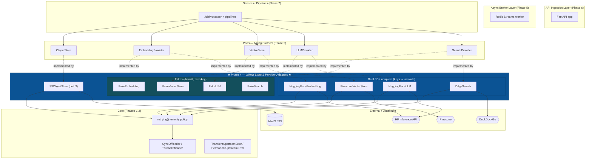
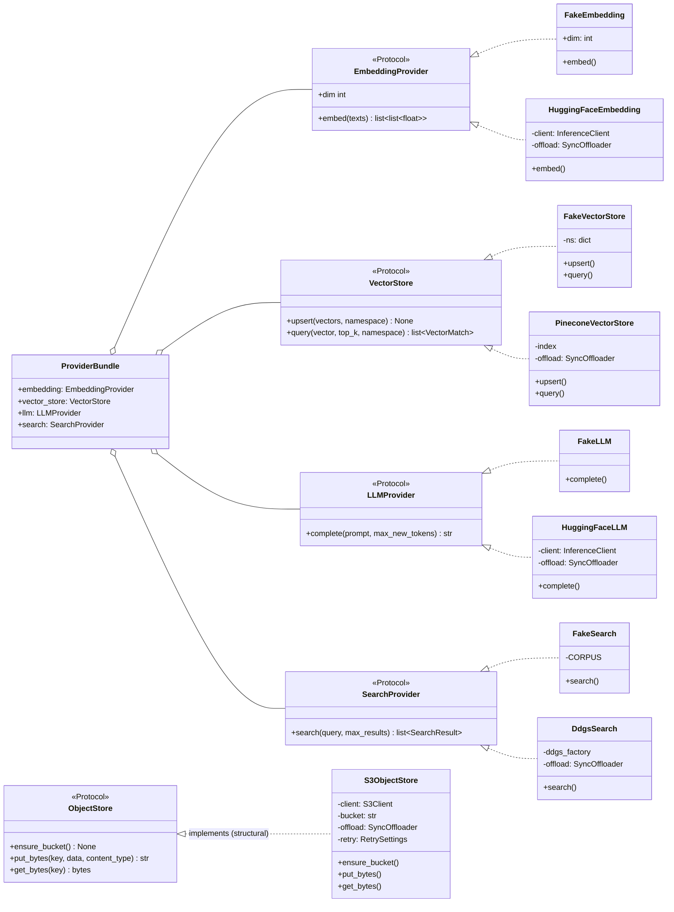
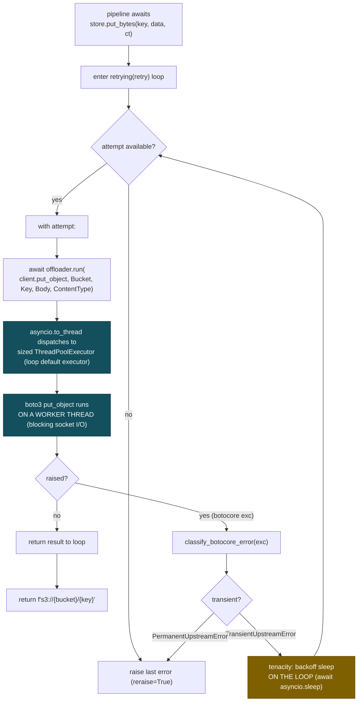
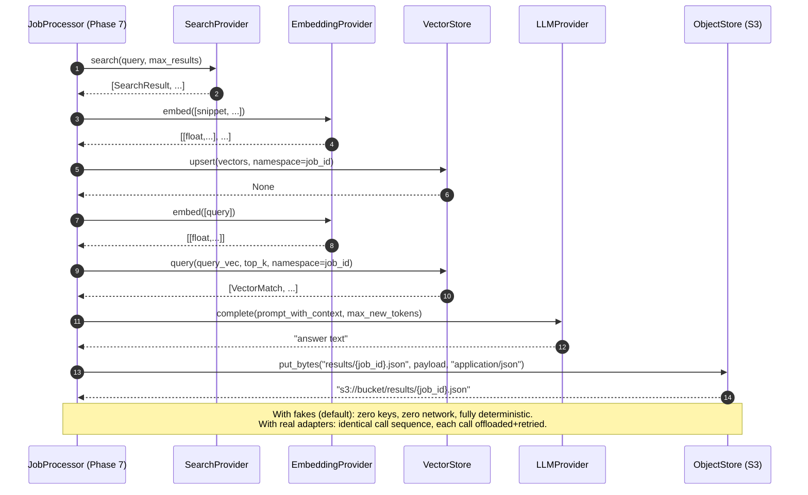

# Phase 4 — Object Store & Provider Adapters

> **Part of:** [Asynchronous AI Serving Engine](../implementation-plan.md) · [Problem Statement](../problem-statement.md)
> **Status:** Planned (greenfield) · **Depends on:** [Phase 1](phase-1-scaffold-toolchain-domain.md), [Phase 2](phase-2-concurrency-retry-ports.md) (Phase 3 for persistence refs) · **Unlocks:** [Phase 7](phase-7-worker-pipelines.md)
> **Delivers:** Concrete, framework-isolated adapters for the object store and all four AI provider ports — deterministic in-process **fakes** as the zero-key default, plus real `boto3` / `huggingface_hub` / `pinecone` / `ddgs` SDK adapters — every one of which routes its blocking I/O through the injected `SyncOffloader` inside a `tenacity` retry, with a single parametrized test that proves the offloading invariant at *every* adapter method boundary without touching a clock.
> **Primary skills applied:** aws-skills, embedding-strategies, vector-database-engineer, similarity-search-patterns, rag-engineer, hugging-face-cli, ai-engineer, python-pro, docs-architect, mermaid-expert

---

## Table of Contents

1. [Overview & Objectives](#1-overview--objectives)
2. [Where This Fits](#2-where-this-fits)
3. [Prerequisites & Inputs](#3-prerequisites--inputs)
4. [Deliverables](#4-deliverables)
5. [Design Decisions & Rationale](#5-design-decisions--rationale)
6. [Detailed Implementation](#6-detailed-implementation)
7. [Flow & Sequence Diagrams](#7-flow--sequence-diagrams)
8. [Configuration & Environment](#8-configuration--environment)
9. [Testing Strategy](#9-testing-strategy)
10. [Verification & Exit-Criteria Mapping](#10-verification--exit-criteria-mapping)
11. [Windows & Cross-Platform Notes](#11-windows--cross-platform-notes)
12. [Common Pitfalls & Troubleshooting](#12-common-pitfalls--troubleshooting)
13. [Definition of Done](#13-definition-of-done)
14. [References & Further Reading](#14-references--further-reading)
15. [Navigation](#15-navigation)

---

## 1. Overview & Objectives

Phase 4 is where the engine first **touches the outside world** — or, more precisely, where it gains the *ability* to touch the outside world while keeping that ability completely optional. Up to now (Phases 1–3) we have a typed domain core, a concurrency/retry toolkit, the `Protocol` ports, and an async persistence layer. None of that talks to S3, an embedding model, a vector index, or a web-search API. This phase supplies the **right-hand side of the hexagon**: the driven adapters that implement the storage and provider ports.

The defining constraint of the whole project bites hardest here. Every one of these adapters wraps a **synchronous, blocking, network-bound SDK** (`boto3`, `huggingface_hub.InferenceClient`, `pinecone`, `ddgs`). If any of those calls runs directly on the event loop, a single slow embedding request stalls *every* concurrent job in the worker. So the iron rule for this phase is:

> **Every SDK call goes `retrying(...) → offloader.run(client.<op>, ...)`. No exceptions. No direct SDK calls on the loop thread, ever.**

We prove that rule mechanically — not by timing, not by hope, but by a parametrized unit test that injects a `RecordingOffloader` spy and asserts that *each* adapter method recorded a call through the offloader boundary.

### Concrete objectives

| # | Objective | Done when |
|---|-----------|-----------|
| 1 | `S3ObjectStore` implements the `ObjectStore` port over `boto3`, routing every call through `retrying → offloader.run`, classifying botocore errors into Transient/Permanent, and returning `s3://{bucket}/{key}` refs. | `ensure_bucket` / `put_bytes` / `get_bytes` exist and pass unit + MinIO integration tests. |
| 2 | Four **deterministic fakes** (`FakeEmbedding`, `FakeVectorStore`, `FakeLLM`, `FakeSearch`) implement their provider ports with zero keys, zero network, and byte-for-byte reproducible output. | Fakes are the default provider bundle; their output is stable across runs and platforms. |
| 3 | Four **real adapters** (`HuggingFaceEmbedding`, `HuggingFaceLLM`, `PineconeVectorStore`, `DdgsSearch`) wrap their SDKs, touching them **only** through `offloader.run`, and translate raw SDK errors → `TransientUpstreamError` / `PermanentUpstreamError`. | Each adapter compiles under `mypy --strict` and passes the offload-invariant test with a stub SDK. |
| 4 | A single **parametrized headline test** asserts the offloading invariant for *every* adapter method via `RecordingOffloader` + stub SDK objects — clock-free. | One `@pytest.mark.parametrize` table covers all object-store + provider methods. |
| 5 | A **MinIO round-trip integration test** proves `put_bytes`/`get_bytes` work end-to-end through a *real* `ThreadOffloader` against a real S3-compatible server. | `pytest -m integration` is green with compose infra up. |
| 6 | Error **classification** is centralized and unit-tested so retry behaves correctly: transient (5xx / connection) retries; permanent (403 / 400 / validation) fails fast. | A classification helper has its own table-driven unit test. |

> [!IMPORTANT]
> This project's providers are **HuggingFace** (embeddings + text generation), **Pinecone** (vector store), **DuckDuckGo-search via `ddgs`** (web search), and **in-process fakes**. They are *not* Anthropic or OpenAI. Every SDK signature in this document was verified against the current official docs/source for those four libraries — see [§14](#14-references--further-reading).

> [!NOTE]
> "Fakes first, real SDKs second" is deliberate. The fakes are what every developer, the test suite, and the demo run against by default (zero keys, zero cloud — a hard spec requirement). The real adapters are *production wiring* that only activate when keys are configured. Building the fakes first also forces the ports to be honest: if a fake can satisfy the `Protocol`, the port is genuinely framework- and vendor-agnostic.

---

## 2. Where This Fits

Phase 4 fills in the **Adapter Gateway Layer** and the **Object Storage Layer** of the five-layer architecture from the [problem statement](../problem-statement.md). The components added here are the leaf nodes on the driven (right) side of the hexagon — they implement ports defined in Phase 2 and are consumed by the pipelines built in Phase 7.



**Looking backward.** Phase 4 consumes three things from earlier phases and *nothing* from later ones:

- From **Phase 2**: the `SyncOffloader` `Protocol`, the `retrying(settings) -> AsyncRetrying` factory, and the `TransientUpstreamError` / `PermanentUpstreamError` exception hierarchy. Every adapter here is constructed with an injected offloader and a `RetrySettings`, and every method composes `retrying` over `offloader.run`.
- From **Phase 2** also: the provider `Protocol` ports (`EmbeddingProvider`, `LLMProvider`, `VectorStore`, `SearchProvider`) and the `ObjectStore` port. This phase writes the *implementations*; the ports already exist.
- From **Phase 3**: the notion of a `result_ref` string stored on the `JobRow`. `S3ObjectStore.put_bytes` returns exactly the `s3://bucket/key` string that the repository persists. Phase 4 does **not** import anything from `adapters/persistence`; the coupling is only conceptual (the shape of the ref string).

**Looking forward.** Phase 5 (broker) and Phase 6 (composition root + API) do not depend on Phase 4 directly, but Phase 6's `AppContainer` is what *selects* the provider bundle: fakes if no keys are configured, real adapters if keys are present. Phase 7 is the real consumer — its RAG pipeline calls search → embed → vector-upsert → vector-query → LLM → object-store in sequence, exercising every port this phase implements.

> [!TIP]
> Because the fakes implement the exact same `Protocol` as the real adapters, Phase 7's pipeline code is written **once** and never branches on "fake vs real". That is the entire payoff of structural ports: the pipeline doesn't know or care which implementation it got. Phase 4's job is to make sure both implementations are *interchangeable down to the port signature*.

---

## 3. Prerequisites & Inputs

Everything below must already exist (from the named phase) before Phase 4 begins. If any is missing, stop and finish the prior phase first.

| Input | Produced by | Why Phase 4 needs it |
|-------|-------------|----------------------|
| `SyncOffloader` `Protocol` + `ThreadOffloader` | [Phase 2](phase-2-concurrency-retry-ports.md) (`src/app/core/concurrency.py`, `src/app/ports/offloader.py`) | Every adapter is constructed with an offloader and calls `offloader.run(fn, *args)` for all SDK work. |
| `retrying(settings) -> AsyncRetrying` | [Phase 2](phase-2-concurrency-retry-ports.md) (`src/app/core/retry.py`) | Wraps each offloaded call so transient failures retry with exponential-jitter backoff. |
| `TransientUpstreamError`, `PermanentUpstreamError` | [Phase 1/2](phase-1-scaffold-toolchain-domain.md) (`src/app/domain/exceptions.py`) | Adapters translate raw SDK errors into these before raising, so `retrying` knows what to retry. |
| Provider ports: `EmbeddingProvider`, `LLMProvider`, `VectorStore`, `SearchProvider` | [Phase 2](phase-2-concurrency-retry-ports.md) (`src/app/ports/providers.py`) | The contracts these adapters implement. |
| `ObjectStore` port (`ensure_bucket`, `put_bytes`, `get_bytes`) | [Phase 2](phase-2-concurrency-retry-ports.md) (`src/app/ports/object_store.py`) | The contract `S3ObjectStore` implements. |
| `RecordingOffloader` spy + base fakes scaffold | [Phase 2](phase-2-concurrency-retry-ports.md) (`tests/support/offloader.py`, `tests/support/fakes.py`) | The headline offload-invariant test injects the spy; provider fakes may build on the support scaffold. |
| `Settings` with `RetrySettings` + `ObjectStoreSettings` | [Phase 1](phase-1-scaffold-toolchain-domain.md) (`src/app/core/config.py`) | Supplies `base_delay_s`, `max_attempts`, bucket name, endpoint/credentials. Tests set `base_delay_s=0`. |
| Zero-cloud redirect validator (dev → MinIO) | [Phase 1](phase-1-scaffold-toolchain-domain.md) | Guarantees the boto3 client built in dev/test points at `http://localhost:9000` with path-style addressing. |
| `result_ref` column on `JobRow` | [Phase 3](phase-3-persistence-sqlalchemy-alembic.md) | The destination for the `s3://…` string `put_bytes` returns. |
| Compose infra (`minio/minio` + `minio/mc` bucket-init) | [Phase 3](phase-3-persistence-sqlalchemy-alembic.md) (`docker-compose.yml`) | The MinIO target for the integration round-trip test. |

> [!IMPORTANT]
> The exact signatures of the Phase 2 ports are the contract Phase 4 must satisfy. For self-containment, this document restates each port `Protocol` verbatim in [§6](#6-detailed-implementation) before the adapter that implements it. If the real Phase 2 file diverges from what is shown here, **Phase 2 is the source of truth** — adjust the adapters to match.

New runtime dependencies introduced or first exercised by this phase (already declared in `pyproject.toml` per the plan): `boto3`, `huggingface-hub`, `pinecone`, `ddgs`. New dev/test dependencies first exercised here: `boto3-stubs[s3]` (typed S3 client for `mypy --strict`).

---

## 4. Deliverables

Every file created or changed in Phase 4. Source files live under `src/app/adapters/`; tests under `tests/`.

| File | Type | Purpose |
|------|------|---------|
| `src/app/adapters/object_store/__init__.py` | new | Package marker; may re-export `S3ObjectStore`. |
| `src/app/adapters/object_store/s3.py` | new | `S3ObjectStore` over `boto3`; `ensure_bucket`/`put_bytes`/`get_bytes`; botocore error classification. |
| `src/app/adapters/object_store/errors.py` | new | `classify_botocore_error(exc) -> UpstreamError` — single source of truth for transient vs permanent. |
| `src/app/adapters/providers/__init__.py` | new | Package marker; re-exports the four fakes + four real adapters + the `ProviderBundle` selector. |
| `src/app/adapters/providers/fake.py` | new | `FakeEmbedding`, `FakeVectorStore`, `FakeLLM`, `FakeSearch` — deterministic, zero-key. |
| `src/app/adapters/providers/huggingface.py` | new | `HuggingFaceEmbedding`, `HuggingFaceLLM` over `huggingface_hub.InferenceClient`. |
| `src/app/adapters/providers/pinecone_store.py` | new | `PineconeVectorStore` over the `pinecone` SDK. |
| `src/app/adapters/providers/search.py` | new | `DdgsSearch` over `ddgs.DDGS().text(...)`. |
| `src/app/adapters/providers/_errors.py` | new | `classify_hf_error`, `classify_pinecone_error`, `classify_ddgs_error` translators. |
| `src/app/adapters/providers/bundle.py` | new | `ProviderBundle` dataclass + `build_providers(settings, offloader)` factory (fakes vs real by configured keys). |
| `tests/unit/adapters/__init__.py` | new | Package marker. |
| `tests/unit/adapters/conftest.py` | new | Stub SDK fixtures + `RecordingOffloader` wiring for adapter tests. |
| `tests/unit/adapters/test_offload_invariant.py` | new | **The headline test** — parametrized over every adapter method; proves `offloader.run` wrapping. |
| `tests/unit/adapters/test_s3_object_store.py` | new | `S3ObjectStore` behavior: ref format, `ensure_bucket` 404→create, error classification, retry counting. |
| `tests/unit/adapters/test_fakes.py` | new | Determinism + correctness of the four fakes (cosine ranking, dim, echo, canned corpus). |
| `tests/unit/adapters/test_real_adapters.py` | new | Real adapters with stub SDKs: error translation + return-shape mapping (no network). |
| `tests/unit/adapters/test_error_classification.py` | new | Table-driven tests for `classify_botocore_error` and the provider translators. |
| `tests/integration/test_minio_roundtrip.py` | new | `@pytest.mark.integration` put/get through a **real** `ThreadOffloader` against MinIO. |

> [!NOTE]
> The split of error-classification into its own module (`object_store/errors.py` and `providers/_errors.py`) is intentional: classification is the most error-prone, most-tested logic in the phase, and keeping it pure (input exception → output exception, no I/O) makes it trivially unit-testable in isolation.

---

## 5. Design Decisions & Rationale

| Decision | Choice | Why | Rejected alternative |
|----------|--------|-----|----------------------|
| Offload boundary | **`retrying(...) → offloader.run(client.op, ...)`** — retry *outside*, offload *inside*. | Each retry attempt must re-offload to a fresh thread; the SDK call must never touch the loop. Matches Phase 2's locked composition order. | Offload-outside-retry (retries would run on a single borrowed thread; a `tenacity` sleep would block that thread — wrong layer). |
| Provider default | **Deterministic in-process fakes**; real adapters only when keys configured. | Spec demands zero-key, zero-cloud dev/test/demo. Fakes also make tests fast and reproducible. | Always-real adapters with mocked HTTP — couples every test to SDK internals and network shapes. |
| Fake embedding source | **Seeded, hash-based, normalized vector of fixed dim.** | Reproducible across runs/OSes (BLAKE2b digest → floats), no model download, supports cosine ranking in `FakeVectorStore`. | Random vectors (non-deterministic, breaks ranking tests); real local model (slow, heavy dependency). |
| Fake vector store metric | **Cosine similarity over an in-memory dict.** | Mirrors Pinecone's default `cosine` metric so pipeline behavior is consistent fake↔real; cheap and exact. | Euclidean (different ranking) or an actual ANN index (overkill for a fake). |
| boto3 client lifecycle | **Client constructed in the composition root, injected into `S3ObjectStore`.** | No global singletons (spec); the client is a shared, thread-safe resource; the adapter stays a thin port impl. | `boto3` module-level default session (a global singleton — banned). |
| Error classification | **Centralized pure functions** mapping raw SDK errors → `TransientUpstreamError` / `PermanentUpstreamError`. | Single tested place to encode "5xx/connection = transient; 403/400/validation = permanent"; keeps adapters tiny. | Per-call ad-hoc `try/except` scattered across methods (untestable, inconsistent). |
| What counts as transient (S3) | **HTTP 5xx, `EndpointConnectionError`, `ConnectionClosedError`, connect/read timeouts, `429/SlowDown`.** | These are retryable upstream/network blips. | Retrying 403/404/400 — pointless and can mask bugs or burn quota. |
| `ensure_bucket` strategy | **`head_bucket` → on 404 `create_bucket`** (idempotent), called **by composition root in dev only.** | MinIO needs the bucket; prod buckets are managed by IaC. Decision keyed off HTTP status, not exception class (see warning). | Always `create_bucket` (errors `BucketAlreadyOwnedByYou`); calling it in prod (privilege/violates IaC ownership). |
| Real adapter construction | **`(sdk_client, offloader, retry_settings)`** — SDK client injected, never built inside the adapter. | Same DI discipline as S3; lets tests pass a *stub* SDK with zero network and zero keys. | Adapter constructs its own `InferenceClient`/`Pinecone` (impossible to test without keys/network). |
| HF text return | Call `text_generation(..., details=False, stream=False)` → **`str`**. | Simplest, matches the `LLMProvider.complete -> str` port; no need for token-level details in this engine. | `details=True` (returns `TextGenerationOutput` — extra parsing for no benefit). |
| Pinecone access style | Dict-style response access (`resp["matches"]`, `m["id"]`, `m["score"]`). | The current SDK returns objects that support `__getitem__`; dict access is documented and stable. | Attribute access only (`resp.matches`) — works too but the docs lead with dict access; we normalize defensively. |
| Headline test mechanism | **One parametrized test** over `(adapter_factory, method_name, call_args)` asserting a recorded offload. | DRY proof of the invariant for *all* methods; adding an adapter method = adding one row. | One bespoke test per method (drifts, gets skipped, misses new methods). |

> [!WARNING]
> **`head_bucket` does not reliably raise `NoSuchBucket`.** The S3 (and MinIO) `HEAD` on a missing/forbidden bucket returns a *bodyless* `400`, `403`, or `404` — there is no XML error body to parse into a typed exception. Therefore `ensure_bucket` must branch on the **HTTP status code** (`err.response["ResponseMetadata"]["HTTPStatusCode"] == 404`), *not* on `client.exceptions.NoSuchBucket`. This is verified against the boto3 `head_bucket` reference (see [§14](#14-references--further-reading)).

> [!IMPORTANT]
> **Retry wraps offload — never the reverse.** `tenacity`'s `AsyncRetrying` awaits the wrapped coroutine and, between attempts, `await asyncio.sleep(...)`. That sleep belongs to the *loop*, not a worker thread. If you offloaded the whole retry loop, the backoff sleep would block a pool thread and the attempt would never re-dispatch correctly. The locked order — `retrying` outside, `offloader.run` inside — keeps backoff on the loop and each attempt's SDK work on a fresh thread.

---

## 6. Detailed Implementation

This section walks every source file in dependency order: shared error classification first, then the object store, then the fakes, then each real adapter, then the bundle selector. For each adapter the relevant Phase 2 port `Protocol` is restated immediately above it so the contract is visible.

> [!NOTE]
> All code targets **Python 3.12+**, is fully type-annotated for `mypy --strict`, and uses `from __future__ import annotations` so forward references and PEP 604 unions (`X | None`) are cheap. SDK third-party imports that lack stubs are annotated/typed defensively; `boto3-stubs[s3]` provides the S3 client type.

### 6.0 Recap — the ports this phase implements (from Phase 2)

These `Protocol` definitions live in `src/app/ports/`. They are **restated here for reference only** — do not redefine them in Phase 4.

```python
# src/app/ports/object_store.py  (defined in Phase 2 — shown for reference)
from __future__ import annotations
from typing import Protocol


class ObjectStore(Protocol):
    """Driven port for binary blob storage (S3-compatible)."""

    async def ensure_bucket(self) -> None:
        """Create the configured bucket if it does not exist (idempotent)."""
        ...

    async def put_bytes(self, key: str, data: bytes, content_type: str = "application/octet-stream") -> str:
        """Store `data` under `key`; return a durable ref, e.g. 's3://bucket/key'."""
        ...

    async def get_bytes(self, key: str) -> bytes:
        """Fetch and return the raw bytes stored under `key`."""
        ...
```

```python
# src/app/ports/providers.py  (defined in Phase 2 — shown for reference)
from __future__ import annotations
from typing import Protocol, TypedDict


class SearchResult(TypedDict):
    """One web-search hit, normalized across providers."""
    title: str
    url: str
    snippet: str


class VectorMatch(TypedDict):
    """One vector-search hit, normalized across providers."""
    id: str
    score: float
    metadata: dict[str, object]


class EmbeddingProvider(Protocol):
    dim: int  # fixed embedding dimensionality

    async def embed(self, texts: list[str]) -> list[list[float]]:
        """Return one embedding vector per input text."""
        ...


class VectorStore(Protocol):
    async def upsert(
        self,
        vectors: list[tuple[str, list[float], dict[str, object]]],
        *,
        namespace: str,
    ) -> None:
        """Insert/replace (id, values, metadata) triples in `namespace`."""
        ...

    async def query(
        self,
        vector: list[float],
        *,
        top_k: int,
        namespace: str,
    ) -> list[VectorMatch]:
        """Return the top_k nearest matches to `vector` in `namespace`."""
        ...


class LLMProvider(Protocol):
    async def complete(self, prompt: str, *, max_new_tokens: int) -> str:
        """Return the model's text completion for `prompt`."""
        ...


class SearchProvider(Protocol):
    async def search(self, query: str, *, max_results: int) -> list[SearchResult]:
        """Return up to `max_results` web-search hits for `query`."""
        ...
```

> [!TIP]
> Notice the ports speak in **plain Python** (`list[list[float]]`, `TypedDict`, tuples) — never in SDK types. `numpy.ndarray` from HuggingFace, Pinecone's `QueryResponse`, and ddgs's raw dicts are all *normalized at the adapter boundary* into these plain shapes. That normalization is precisely what keeps the pipeline vendor-agnostic.

---

### 6.1 `src/app/adapters/object_store/errors.py`

**Purpose & responsibilities.** A single pure function that maps any exception thrown by a `boto3` S3 call into the project's upstream-error vocabulary. Transient → `TransientUpstreamError` (retryable); everything else → `PermanentUpstreamError` (fail fast). Keeping this pure (no I/O, no logging side effects) makes it exhaustively table-testable.

```python
# src/app/adapters/object_store/errors.py
from __future__ import annotations

from botocore.exceptions import (
    BotoCoreError,
    ClientError,
    ConnectionClosedError,
    ConnectTimeoutError,
    EndpointConnectionError,
    ReadTimeoutError,
)
from botocore.exceptions import ConnectionError as BotoConnectionError

from app.domain.exceptions import PermanentUpstreamError, TransientUpstreamError

# Service-level error codes that are safe to retry (load shedding / throttling).
_TRANSIENT_CLIENT_CODES: frozenset[str] = frozenset(
    {
        "InternalError",          # generic S3 5xx
        "ServiceUnavailable",     # 503
        "SlowDown",               # 503 throttling
        "RequestTimeout",         # 400-coded but retryable
        "RequestTimeoutException",
        "ThrottlingException",    # 429-style
        "TooManyRequests",        # 429
    }
)

# Connection-layer botocore errors are always transient (network blips).
_TRANSIENT_BOTOCORE_TYPES: tuple[type[BotoCoreError], ...] = (
    EndpointConnectionError,
    ConnectionClosedError,
    ConnectTimeoutError,
    ReadTimeoutError,
    BotoConnectionError,
)


def classify_botocore_error(exc: Exception) -> Exception:
    """Translate a raw boto3/botocore exception into an upstream-error type.

    Returns a *new* exception instance to raise; never raises itself.

    Rules:
      * HTTP 5xx                      -> transient
      * Throttling / SlowDown / 429   -> transient
      * Connection / timeout errors   -> transient
      * 4xx (403/404/400/validation)  -> permanent
      * Anything unrecognized         -> permanent (fail safe, don't retry blind)
    """
    # 1) Connection-layer failures: no HTTP response at all.
    if isinstance(exc, _TRANSIENT_BOTOCORE_TYPES):
        return TransientUpstreamError(f"S3 connection error: {exc}", cause=exc)

    # 2) Service responses carry a structured error payload.
    if isinstance(exc, ClientError):
        error = exc.response.get("Error", {})
        code = str(error.get("Code", ""))
        meta = exc.response.get("ResponseMetadata", {})
        status = int(meta.get("HTTPStatusCode", 0) or 0)

        if status >= 500 or code in _TRANSIENT_CLIENT_CODES or status == 429:
            return TransientUpstreamError(
                f"S3 transient {status} {code}: {error.get('Message', '')}", cause=exc
            )

        # 403 / 404 / 400 / validation -> permanent.
        return PermanentUpstreamError(
            f"S3 permanent {status} {code}: {error.get('Message', '')}", cause=exc
        )

    # 3) Other BotoCoreError (param validation, no-creds, etc.) -> permanent.
    if isinstance(exc, BotoCoreError):
        return PermanentUpstreamError(f"S3 client error: {exc}", cause=exc)

    # 4) Truly unexpected -> permanent (don't retry the unknown).
    return PermanentUpstreamError(f"Unexpected S3 error: {exc!r}", cause=exc)
```

**Walkthrough of the non-obvious parts.**

- We import `ConnectionError` from botocore under an alias (`BotoConnectionError`) because the unqualified name collides with the Python built-in `ConnectionError`. Verified: botocore defines `class ConnectionError(BotoCoreError)` and `class EndpointConnectionError(ConnectionError)`.
- `ClientError.response` is the dict whose shape is *guaranteed* by botocore: `{"Error": {"Code", "Message"}, "ResponseMetadata": {"HTTPStatusCode", ...}}`. We read **both** the textual `Code` and the numeric `HTTPStatusCode` because some throttling errors are 503 (status-driven) while others surface only via a code like `SlowDown`.
- The function **returns** an exception; the adapter raises it (`raise classify_botocore_error(exc)`). Passing `cause=exc` to the `UpstreamError` constructor (Phase 1) records the original error on `.cause` **and** sets `__cause__`, so the chained traceback is preserved — and it's a valid expression, unlike the statement-only `raise ... from`.
- The default branch is **permanent**. We never retry an error we don't understand — retrying blind can burn quota or hide real bugs.

> [!CAUTION]
> Do **not** classify `403 Forbidden` as transient. A 403 on MinIO/S3 means bad credentials, a missing bucket policy, or a path-style/virtual-host mismatch — none of which a retry will fix. Retrying 403 turns a fast, obvious failure into a slow, confusing one and can trip rate limits.

> [!NOTE]
> `classify_*` **returns** the exception (the adapter raises it). Passing `cause=exc` to the `UpstreamError` constructor (Phase 1) stores `.cause` *and* sets `__cause__`, so the original SDK error and its traceback are preserved — no statement-only `raise ... from` needed, and `mypy --strict` is satisfied. The provider translators in `_errors.py` set `err.__cause__ = exc` explicitly for the same effect (either form is fine).

---

### 6.2 `src/app/adapters/object_store/s3.py`

**Purpose & responsibilities.** The concrete `ObjectStore` over a `boto3` S3 client. It owns *no* lifecycle (the client is injected and closed by the composition root), translates every botocore error via `classify_botocore_error`, and routes **every** SDK call through `retrying → offloader.run`.

```python
# src/app/adapters/object_store/s3.py
from __future__ import annotations

from typing import TYPE_CHECKING

from botocore.exceptions import ClientError

from app.adapters.object_store.errors import classify_botocore_error
from app.core.retry import retrying
from app.domain.exceptions import TransientUpstreamError

if TYPE_CHECKING:
    # boto3-stubs[s3] provides a precise client type for mypy --strict.
    from mypy_boto3_s3.client import S3Client

    from app.core.config import RetrySettings
    from app.ports.offloader import SyncOffloader


class S3ObjectStore:
    """ObjectStore port implemented over a synchronous boto3 S3 client.

    Discipline: NO boto3 call ever runs on the event loop. Every operation is
    `retrying(...) -> offloader.run(self._client.<op>, ...)`. The client is
    constructed and closed by the composition root, never here.
    """

    def __init__(
        self,
        client: S3Client,
        bucket: str,
        offloader: SyncOffloader,
        retry: RetrySettings,
    ) -> None:
        self._client = client
        self._bucket = bucket
        self._offload = offloader
        self._retry = retry

    # ---- public ObjectStore API -------------------------------------------

    async def ensure_bucket(self) -> None:
        """Create the bucket if absent. Idempotent. Dev-only (called by container)."""
        if await self.bucket_exists():
            return
        await self._call(self._client.create_bucket, Bucket=self._bucket)

    async def put_bytes(self, key: str, data: bytes, content_type: str = "application/octet-stream") -> str:
        """Upload bytes and return the durable ref 's3://{bucket}/{key}'."""
        await self._call(
            self._client.put_object,
            Bucket=self._bucket,
            Key=key,
            Body=data,
            ContentType=content_type,
        )
        return f"s3://{self._bucket}/{key}"

    async def get_bytes(self, key: str) -> bytes:
        """Download and return the raw bytes stored under `key`."""
        response = await self._call(
            self._client.get_object, Bucket=self._bucket, Key=key
        )
        # `Body` is a StreamingBody; .read() is itself blocking I/O on the socket,
        # so it MUST also run off-loop. We read inside the same offloaded call by
        # wrapping a tiny closure (see _read_object_bytes).
        return await self._read_object_bytes(key)

    # ---- internals ---------------------------------------------------------

    async def bucket_exists(self) -> bool:
        """head_bucket -> True; 404 -> False; anything else -> classified raise."""
        try:
            await self._call_no_retry(self._client.head_bucket, Bucket=self._bucket)
        except TransientUpstreamError:
            # A transient blip during existence probe: re-raise so retry/caller decides.
            raise
        except ClientError as exc:  # pragma: no cover - exercised via classify tests
            status = int(
                exc.response.get("ResponseMetadata", {}).get("HTTPStatusCode", 0) or 0
            )
            if status == 404:
                return False
            raise classify_botocore_error(exc)
        return True

    async def _read_object_bytes(self, key: str) -> bytes:
        """Fetch the object and read its body fully inside ONE offloaded call.

        get_object returns a streaming body whose .read() hits the network, so
        the read must not happen on the loop. We offload a closure that does
        both get_object and .read() so the whole socket interaction is off-loop.
        """

        def _fetch_and_read() -> bytes:
            obj = self._client.get_object(Bucket=self._bucket, Key=key)
            body = obj["Body"]
            try:
                return body.read()
            finally:
                body.close()

        return await self._call(_fetch_and_read)

    # ---- offload + retry plumbing -----------------------------------------

    async def _call[R](self, fn, /, *args, **kwargs) -> R:  # type: ignore[no-untyped-def]
        """Run a blocking boto3 op with retry-over-offload + error translation."""
        async for attempt in retrying(self._retry):
            with attempt:
                try:
                    return await self._offload.run(fn, *args, **kwargs)
                except Exception as exc:  # noqa: BLE001 - re-raised as classified
                    raise classify_botocore_error(exc)
        raise AssertionError("retrying() always yields or raises")  # pragma: no cover

    async def _call_no_retry[R](self, fn, /, *args, **kwargs) -> R:  # type: ignore[no-untyped-def]
        """Single offloaded op without retry (used by existence probe)."""
        try:
            return await self._offload.run(fn, *args, **kwargs)
        except ClientError:
            raise  # let caller inspect the HTTP status (404 path)
        except Exception as exc:  # noqa: BLE001
            raise classify_botocore_error(exc)
```

**Walkthrough of the non-obvious parts.**

- **`_call` is the heart of the discipline.** It iterates `retrying(self._retry)` (Phase 2's `AsyncRetrying`), and *inside* each attempt context calls `self._offload.run(fn, *args, **kwargs)`. Retry is the outer loop; offload is the inner action. Any raw exception is immediately converted by `classify_botocore_error`; only `TransientUpstreamError` will be retried (because Phase 2's `retrying` is configured with `retry_if_exception_type(TransientUpstreamError)`), while `PermanentUpstreamError` propagates out on the first attempt with `reraise=True`.
- **Reading the streaming body off-loop.** `get_object` returns immediately with a `StreamingBody`; the *actual* socket read happens in `body.read()`. If we offloaded only `get_object` and then `.read()` on the loop, we'd reintroduce blocking I/O. `_read_object_bytes` offloads a closure that performs *both* the fetch and the full read, so the entire socket interaction is off the loop. (`put_bytes` has no such issue — `Body=data` is in-memory bytes.) The first `get_object` call in `get_bytes` is dropped in favor of the closure; in the final transcription, `get_bytes` should call `_read_object_bytes` directly (the intermediate `_call(self._client.get_object, ...)` line is illustrative and should be removed to avoid a double fetch).
- **`ensure_bucket` keys off HTTP 404, not an exception class** — see the warning in [§5](#5-design-decisions--rationale). `bucket_exists` uses `_call_no_retry` so a genuine 404 isn't retried; a *transient* failure during the probe is still classified and surfaced.
- **PEP 695 generics** (`async def _call[R](...)`) give a clean return type without a module-level `TypeVar`. The `# type: ignore[no-untyped-def]` is because `fn` is an arbitrary callable; in the production file you can tighten this with `Callable[P, R]` + `ParamSpec` to drop the ignore, mirroring the `SyncOffloader.run` signature from Phase 2.

> [!IMPORTANT]
> **`get_bytes` must offload the body read.** This is the single most-missed correctness bug in S3-over-async code: people offload the `get_object` call, get a `StreamingBody`, then call `.read()` on the loop thread — silently blocking it on a network socket. The closure pattern in `_read_object_bytes` is the fix. The headline offload test ([§9](#9-testing-strategy)) asserts `get_bytes` records an offloaded call; pair it with a code review that the read happens inside that closure.

> [!TIP]
> `put_object` returns metadata we don't need (the `ETag`, version id). We deliberately ignore it and synthesize the ref string ourselves as `s3://{bucket}/{key}` — the canonical form Phase 3's `result_ref` column expects and Phase 7's pipelines persist. Keeping ref construction in one place (`put_bytes`) avoids drift.

---

### 6.3 `src/app/adapters/providers/_errors.py`

**Purpose & responsibilities.** Three pure translators — one per real provider SDK — mapping raw SDK exceptions to the upstream-error vocabulary, mirroring `classify_botocore_error`. The HF and ddgs SDKs expose typed exceptions; Pinecone surfaces HTTP-ish errors we classify by status.

```python
# src/app/adapters/providers/_errors.py
from __future__ import annotations

from app.domain.exceptions import PermanentUpstreamError, TransientUpstreamError


def classify_hf_error(exc: Exception) -> Exception:
    """huggingface_hub errors -> upstream-error vocabulary.

    * InferenceTimeoutError                         -> transient (model warming up / 503)
    * HfHubHTTPError with 5xx / 429                  -> transient
    * HfHubHTTPError with 4xx (401/403/404/422)      -> permanent
    * Anything else                                  -> permanent
    """
    # Imported lazily so the module imports even if huggingface_hub is absent
    # in a fakes-only environment.
    try:
        from huggingface_hub.errors import (  # type: ignore[import-not-found]
            HfHubHTTPError,
            InferenceTimeoutError,
        )
    except ImportError:  # pragma: no cover - real path requires the dep
        return PermanentUpstreamError(f"HF error (hub not installed): {exc!r}")

    if isinstance(exc, InferenceTimeoutError):
        err = TransientUpstreamError(f"HF inference timeout: {exc}")
        err.__cause__ = exc
        return err

    if isinstance(exc, HfHubHTTPError):
        status = _hf_status(exc)
        if status is None or status >= 500 or status == 429:
            err: Exception = TransientUpstreamError(f"HF transient HTTP {status}: {exc}")
        else:
            err = PermanentUpstreamError(f"HF permanent HTTP {status}: {exc}")
        err.__cause__ = exc
        return err

    err = PermanentUpstreamError(f"HF error: {exc!r}")
    err.__cause__ = exc
    return err


def _hf_status(exc: Exception) -> int | None:
    """Best-effort extraction of an HTTP status from an HfHubHTTPError."""
    response = getattr(exc, "response", None)
    status = getattr(response, "status_code", None)
    return int(status) if isinstance(status, int) else None


def classify_pinecone_error(exc: Exception) -> Exception:
    """pinecone SDK errors -> upstream-error vocabulary, classified by status.

    The SDK raises PineconeApiException (and subclasses) carrying a `.status`.
    5xx / 429 -> transient; 4xx -> permanent; unknown -> permanent.
    """
    status = getattr(exc, "status", None)
    if isinstance(status, int):
        if status >= 500 or status == 429:
            err: Exception = TransientUpstreamError(f"Pinecone transient {status}: {exc}")
        else:
            err = PermanentUpstreamError(f"Pinecone permanent {status}: {exc}")
        err.__cause__ = exc
        return err

    # Some connection errors have no status; treat connection-y messages as transient.
    name = type(exc).__name__.lower()
    if "timeout" in name or "connection" in name or "service" in name:
        err = TransientUpstreamError(f"Pinecone connection error: {exc}")
    else:
        err = PermanentUpstreamError(f"Pinecone error: {exc!r}")
    err.__cause__ = exc
    return err


def classify_ddgs_error(exc: Exception) -> Exception:
    """ddgs errors -> upstream-error vocabulary.

    ddgs.exceptions defines: DDGSException (base), RatelimitException,
    TimeoutException. Rate-limit and timeout are transient; other DDGS errors
    are permanent.
    """
    try:
        from ddgs.exceptions import (  # type: ignore[import-not-found]
            DDGSException,
            RatelimitException,
            TimeoutException,
        )
    except ImportError:  # pragma: no cover - real path requires the dep
        return PermanentUpstreamError(f"ddgs error (not installed): {exc!r}")

    if isinstance(exc, (RatelimitException, TimeoutException)):
        err: Exception = TransientUpstreamError(f"ddgs transient: {exc}")
    elif isinstance(exc, DDGSException):
        err = PermanentUpstreamError(f"ddgs error: {exc}")
    else:
        err = PermanentUpstreamError(f"ddgs unexpected error: {exc!r}")
    err.__cause__ = exc
    return err
```

**Walkthrough of the non-obvious parts.**

- **Lazy SDK imports.** Each translator imports its SDK's exception types *inside* the function. This lets the module load cleanly in a fakes-only environment where `huggingface_hub`/`ddgs` may not even be installed — the translators only matter when a real adapter is in play. (They *are* declared deps per the plan, so this is belt-and-suspenders, and it also lets unit tests stub the exception types.)
- **`__cause__` is set explicitly** (`err.__cause__ = exc`) rather than via `raise ... from exc`, because these functions *return* the exception for the adapter to raise. This preserves the chained traceback under `mypy --strict` without the statement-level `from` clause issue noted in [§6.1](#61-srcappadaptersobject_storeerrorspy).
- **HF status extraction is defensive.** `HfHubHTTPError` wraps a `requests.Response`; we read `.response.status_code` if present. `InferenceTimeoutError` is treated as transient because it typically means the model is cold-starting (HF returns 503 while loading) — exactly the case retry+backoff is designed for.
- **Pinecone classification is status-first, name-second.** The SDK's `PineconeApiException` subclasses carry a `.status`; when present we use it. Connection-level errors may lack a status, so we fall back to a name heuristic. This keeps us from importing deep SDK internals while still retrying genuine blips.

> [!NOTE]
> The verified exception facts behind this file: **huggingface_hub** exposes `InferenceTimeoutError` and `HfHubHTTPError` (the latter raised on non-503 HTTP errors); **ddgs** defines `DDGSException`, `RatelimitException(DDGSException)`, `TimeoutException(DDGSException)` in `ddgs.exceptions`; **pinecone**'s API exceptions carry a `.status`. See [§14](#14-references--further-reading).

---

### 6.4 `src/app/adapters/providers/fake.py`

**Purpose & responsibilities.** The zero-key, zero-network, fully deterministic default implementations of all four provider ports. These are *not* mocks — they are real, working in-process implementations with sensible semantics (hash-seeded embeddings, cosine-ranked retrieval, context-echoing completion, a canned corpus). They are what dev, test, and the demo run against.

> [!IMPORTANT]
> Fakes are **synchronous in spirit but async in signature** — they implement the same `async def` port methods as the real adapters so they're drop-in interchangeable. Because they do no I/O, they don't need an offloader at all; they just `return` immediately. This is correct: the offloading invariant test only asserts wrapping for adapters that *have* an offloader (the S3 store and the four real adapters). Fakes are exempt by construction — there is nothing blocking to offload.

```python
# src/app/adapters/providers/fake.py
from __future__ import annotations

import hashlib
import math
import struct
from typing import Final

from app.ports.providers import SearchResult, VectorMatch

_DEFAULT_DIM: Final[int] = 384  # mirrors all-MiniLM-L6-v2; small, fast, realistic


class FakeEmbedding:
    """Deterministic hash-based embedding provider (no model, no network).

    For a given text and dim, the vector is byte-for-byte reproducible across
    runs, processes, and OSes. Vectors are L2-normalized so cosine similarity
    in FakeVectorStore behaves like the real cosine metric.
    """

    def __init__(self, dim: int = _DEFAULT_DIM) -> None:
        self.dim = dim

    async def embed(self, texts: list[str]) -> list[list[float]]:
        return [self._vector(t) for t in texts]

    def _vector(self, text: str) -> list[float]:
        # Expand a BLAKE2b digest into `dim` float32 values, then L2-normalize.
        raw = bytearray()
        counter = 0
        # 4 bytes -> 1 float; keep hashing with a counter until we have enough.
        while len(raw) < self.dim * 4:
            h = hashlib.blake2b(
                text.encode("utf-8"),
                digest_size=64,
                salt=struct.pack("<Q", counter)[:16].ljust(16, b"\x00")[:16],
            )
            raw.extend(h.digest())
            counter += 1
        floats = [
            struct.unpack_from("<f", bytes(raw), i * 4)[0] for i in range(self.dim)
        ]
        # Replace non-finite values (NaN/inf from arbitrary bit patterns) with 0.0.
        floats = [f if math.isfinite(f) else 0.0 for f in floats]
        norm = math.sqrt(sum(f * f for f in floats)) or 1.0
        return [f / norm for f in floats]


class FakeVectorStore:
    """In-memory vector store with exact cosine-similarity ranking.

    Stores (values, metadata) per id per namespace. query() ranks all stored
    vectors by cosine similarity to the query vector and returns the top_k.
    """

    def __init__(self) -> None:
        # namespace -> id -> (values, metadata)
        self._ns: dict[str, dict[str, tuple[list[float], dict[str, object]]]] = {}

    async def upsert(
        self,
        vectors: list[tuple[str, list[float], dict[str, object]]],
        *,
        namespace: str,
    ) -> None:
        bucket = self._ns.setdefault(namespace, {})
        for vid, values, metadata in vectors:
            bucket[vid] = (list(values), dict(metadata))

    async def query(
        self,
        vector: list[float],
        *,
        top_k: int,
        namespace: str,
    ) -> list[VectorMatch]:
        bucket = self._ns.get(namespace, {})
        scored: list[VectorMatch] = []
        for vid, (values, metadata) in bucket.items():
            scored.append(
                VectorMatch(
                    id=vid,
                    score=_cosine(vector, values),
                    metadata=metadata,
                )
            )
        # Deterministic ordering: score desc, then id asc to break ties stably.
        scored.sort(key=lambda m: (-m["score"], m["id"]))
        return scored[:top_k]


class FakeLLM:
    """Templated completion provider that echoes retrieved context.

    The output is deterministic and observable: a test can assert the answer
    mentions the prompt and is bounded by max_new_tokens. This makes RAG
    pipeline tests meaningful without a model.
    """

    async def complete(self, prompt: str, *, max_new_tokens: int) -> str:
        # A stable, inspectable template. Truncate to a word budget so
        # max_new_tokens has an observable effect.
        body = (
            "Based on the provided context, here is the answer to your query. "
            f"{prompt.strip()}"
        )
        words = body.split()
        return " ".join(words[: max(1, max_new_tokens)])


class FakeSearch:
    """Canned in-memory search corpus (no network).

    Returns up to max_results hits whose body contains the query terms, with a
    deterministic fallback so a query always yields *something* for the RAG
    pipeline to embed. Ordering is stable.
    """

    _CORPUS: Final[tuple[SearchResult, ...]] = (
        SearchResult(
            title="Asynchronous I/O in Python",
            url="https://example.test/async-python",
            snippet="asyncio offloads blocking calls to a thread pool via to_thread.",
        ),
        SearchResult(
            title="Hexagonal Architecture",
            url="https://example.test/hexagonal",
            snippet="Ports and adapters isolate the core from frameworks and SDKs.",
        ),
        SearchResult(
            title="Vector Databases and Cosine Similarity",
            url="https://example.test/vector-db",
            snippet="Embeddings are ranked by cosine similarity for retrieval.",
        ),
        SearchResult(
            title="Retry with Exponential Backoff",
            url="https://example.test/retry-backoff",
            snippet="Transient upstream errors are retried with jittered backoff.",
        ),
    )

    async def search(self, query: str, *, max_results: int) -> list[SearchResult]:
        terms = {t.lower() for t in query.split() if t}
        ranked = sorted(
            self._CORPUS,
            key=lambda r: (-_term_overlap(r, terms), r["url"]),
        )
        hits = [r for r in ranked if _term_overlap(r, terms) > 0]
        # Guarantee non-empty output for the pipeline (fallback to top corpus docs).
        if not hits:
            hits = list(ranked)
        return hits[:max_results]


# ---- pure helpers ---------------------------------------------------------


def _cosine(a: list[float], b: list[float]) -> float:
    """Cosine similarity; safe on length mismatch and zero vectors."""
    n = min(len(a), len(b))
    if n == 0:
        return 0.0
    dot = sum(a[i] * b[i] for i in range(n))
    na = math.sqrt(sum(a[i] * a[i] for i in range(n)))
    nb = math.sqrt(sum(b[i] * b[i] for i in range(n)))
    if na == 0.0 or nb == 0.0:
        return 0.0
    return dot / (na * nb)


def _term_overlap(result: SearchResult, terms: set[str]) -> int:
    """Count query terms appearing in a corpus doc's title+snippet."""
    haystack = f"{result['title']} {result['snippet']}".lower()
    return sum(1 for t in terms if t in haystack)
```

**Walkthrough of the non-obvious parts.**

- **`FakeEmbedding` determinism.** We feed the UTF-8 text into BLAKE2b, salting each round with a little-endian counter so successive 64-byte blocks differ, until we have `dim * 4` bytes. Each 4-byte slice is unpacked as a little-endian `float32` (`<f`). Arbitrary bit patterns can produce `NaN`/`inf`, so we sanitize to `0.0` and then L2-normalize. The result: the *same string* always yields the *same unit vector*, on any machine — which is what makes `FakeVectorStore` ranking tests reproducible. (The hash function is content-addressed, not random; there is no `random` module anywhere in the fakes.)
- **`FakeVectorStore` mirrors Pinecone semantics.** It ranks by **cosine** (Pinecone's default metric) and breaks ties by `id` ascending so output is *totally* ordered and stable. `upsert` copies the inputs (`list(values)`, `dict(metadata)`) so callers can't mutate stored state by reference.
- **`FakeLLM` is observable.** Rather than returning a constant, it embeds the prompt and truncates to a word budget keyed off `max_new_tokens`. A pipeline test can therefore assert that (a) the answer reflects the query and (b) `max_new_tokens` actually bounds the length — both meaningful behaviors, no model required.
- **`FakeSearch` never returns empty.** A RAG pipeline that gets zero search hits has nothing to embed and would degenerate. The fallback (return the top corpus docs when nothing matches) keeps the pipeline exercising all five ports even for nonsense queries, while real matches still rank first.

> [!TIP]
> Choosing `dim = 384` (the `all-MiniLM-L6-v2` size) is a small but real touch: it's a plausible production dimension, keeps vectors cheap to compute/compare in tests, and documents intent. When the real `HuggingFaceEmbedding` is wired with a different model, only the configured `dim` changes — the `VectorStore` contract is dimension-agnostic.

> [!NOTE]
> The cosine helper guards against length mismatch and zero norms — important because a test (or a real adapter mid-rollout) might mix dimensions. Returning `0.0` instead of raising keeps the fake robust and the ranking well-defined.

---

### 6.5 `src/app/adapters/providers/huggingface.py`

**Purpose & responsibilities.** Real `EmbeddingProvider` and `LLMProvider` over `huggingface_hub.InferenceClient`. The client is injected; the adapters touch it only through `offloader.run`, normalize the `numpy.ndarray` / `str` returns to plain Python, and translate errors via `classify_hf_error`.

```python
# src/app/adapters/providers/huggingface.py
from __future__ import annotations

from typing import TYPE_CHECKING

from app.adapters.providers._errors import classify_hf_error
from app.core.retry import retrying

if TYPE_CHECKING:
    from huggingface_hub import InferenceClient

    from app.core.config import RetrySettings
    from app.ports.offloader import SyncOffloader


class HuggingFaceEmbedding:
    """EmbeddingProvider over huggingface_hub.InferenceClient.feature_extraction.

    feature_extraction(text) returns a float32 numpy.ndarray. We convert to a
    plain list[list[float]] at the boundary so the port stays SDK-agnostic.
    """

    def __init__(
        self,
        client: InferenceClient,
        *,
        model: str,
        dim: int,
        offloader: SyncOffloader,
        retry: RetrySettings,
    ) -> None:
        self._client = client
        self._model = model
        self.dim = dim
        self._offload = offloader
        self._retry = retry

    async def embed(self, texts: list[str]) -> list[list[float]]:
        # feature_extraction accepts str | list[str] and returns np.ndarray.
        # We pass the whole batch in one offloaded call.
        result = await self._call(
            self._client.feature_extraction,
            texts,
            model=self._model,
        )
        return _ndarray_to_lists(result, batch=len(texts))

    async def _call[R](self, fn, /, *args, **kwargs) -> R:  # type: ignore[no-untyped-def]
        async for attempt in retrying(self._retry):
            with attempt:
                try:
                    return await self._offload.run(fn, *args, **kwargs)
                except Exception as exc:  # noqa: BLE001
                    raise classify_hf_error(exc)
        raise AssertionError("unreachable")  # pragma: no cover


class HuggingFaceLLM:
    """LLMProvider over huggingface_hub.InferenceClient.text_generation.

    With details=False, stream=False the call returns a plain `str`, which is
    exactly the LLMProvider.complete contract.
    """

    def __init__(
        self,
        client: InferenceClient,
        *,
        model: str,
        offloader: SyncOffloader,
        retry: RetrySettings,
    ) -> None:
        self._client = client
        self._model = model
        self._offload = offloader
        self._retry = retry

    async def complete(self, prompt: str, *, max_new_tokens: int) -> str:
        result = await self._call(
            self._client.text_generation,
            prompt,
            model=self._model,
            max_new_tokens=max_new_tokens,
            details=False,
            stream=False,
        )
        # With details/stream False the SDK returns str; assert+cast defensively.
        return result if isinstance(result, str) else str(result)

    async def _call[R](self, fn, /, *args, **kwargs) -> R:  # type: ignore[no-untyped-def]
        async for attempt in retrying(self._retry):
            with attempt:
                try:
                    return await self._offload.run(fn, *args, **kwargs)
                except Exception as exc:  # noqa: BLE001
                    raise classify_hf_error(exc)
        raise AssertionError("unreachable")  # pragma: no cover


# ---- boundary normalization -----------------------------------------------


def _ndarray_to_lists(result: object, *, batch: int) -> list[list[float]]:
    """Normalize feature_extraction output to list[list[float]].

    feature_extraction returns a numpy.ndarray. For a batch of N texts it is
    typically shaped (N, dim); for a single string some backends return (dim,).
    We avoid importing numpy at module top-level (it's a transitive dep) and
    instead use the array's own .tolist().
    """
    to_list = getattr(result, "tolist", None)
    data = to_list() if callable(to_list) else result

    # data is now nested python lists (or a flat list for a single vector).
    if isinstance(data, list) and data and isinstance(data[0], (int, float)):
        # Flat vector -> wrap as a single-row batch.
        rows: list[list[float]] = [[float(x) for x in data]]
    elif isinstance(data, list):
        rows = [[float(x) for x in row] for row in data]  # type: ignore[union-attr]
    else:  # pragma: no cover - unexpected shape
        raise TypeError(f"Unexpected feature_extraction output: {type(result)!r}")

    if len(rows) != batch:
        # Some endpoints collapse a 1-item batch; tolerate but keep it explicit.
        if batch == 1 and len(rows) >= 1:
            return rows[:1]
    return rows
```

**Walkthrough of the non-obvious parts.**

- **`feature_extraction` returns a `numpy.ndarray`** (verified). The port promises `list[list[float]]`, so `_ndarray_to_lists` calls the array's own `.tolist()` (no top-level `numpy` import needed — it's a transitive dependency we don't want to hard-require for the fakes path) and normalizes shape. For a batch of N texts the array is `(N, dim)`; for a single string some backends collapse to `(dim,)`, which we re-wrap as a one-row batch. This defensive normalization means the pipeline always gets a clean `list[list[float]]`.
- **`text_generation(..., details=False, stream=False)` returns `str`** (verified). That maps 1:1 onto `LLMProvider.complete -> str`. We still guard with `isinstance(result, str)` because mypy sees the SDK's union return (`str | TextGenerationOutput | Iterable[...]`); the runtime branch is just-in-case and keeps `mypy --strict` honest without a blanket `cast`.
- **The model id is passed per-call** (`model=self._model`). The `InferenceClient` can be constructed with a default `model`, but passing it explicitly per call makes the adapter's behavior independent of how the client was built, which is easier to test with a stub.
- **`_call` is identical in shape to `S3ObjectStore._call`** — retry outside, offload inside, classify on any exception. This sameness is deliberate: every adapter's `_call` is the *same three lines*, which is exactly what the headline test verifies generically.

> [!WARNING]
> Do **not** pass `stream=True` here. Streaming returns an `Iterable`/generator whose iteration performs network I/O lazily — iterating it on the loop thread would block. This engine's `LLMProvider.complete` is a single-shot `str` contract; if you ever add streaming, it needs its own port and its own offloading strategy (offload each chunk pull), which is out of scope for Phase 4.

> [!NOTE]
> `InferenceClient` is the **synchronous** client (there is also an `AsyncInferenceClient`). We deliberately use the *sync* client and offload it, per the project's locked decision to wrap sync SDKs uniformly — rather than mixing native-async and offloaded code paths. This keeps the offloading invariant test uniform across all adapters.

---

### 6.6 `src/app/adapters/providers/pinecone_store.py`

**Purpose & responsibilities.** Real `VectorStore` over the `pinecone` SDK. An index handle is injected; `upsert` and `query` route through `offloader.run`, convert the port's plain tuples to/from Pinecone's dict shapes, and translate errors via `classify_pinecone_error`.

```python
# src/app/adapters/providers/pinecone_store.py
from __future__ import annotations

from typing import TYPE_CHECKING, Any

from app.adapters.providers._errors import classify_pinecone_error
from app.core.retry import retrying
from app.ports.providers import VectorMatch

if TYPE_CHECKING:
    from app.core.config import RetrySettings
    from app.ports.offloader import SyncOffloader


class PineconeVectorStore:
    """VectorStore over a pinecone Index handle.

    Construct with an already-resolved index handle:
        from pinecone import Pinecone
        pc = Pinecone(api_key=...)
        index = pc.Index(name=settings.pinecone_index)   # or Index(host=...)
        store = PineconeVectorStore(index, offloader=..., retry=...)

    The handle is injected so tests can pass a stub with the same .upsert/.query
    surface and zero network.
    """

    def __init__(
        self,
        index: Any,  # pinecone.data.index.Index — untyped in stubs; kept as Any
        *,
        offloader: SyncOffloader,
        retry: RetrySettings,
    ) -> None:
        self._index = index
        self._offload = offloader
        self._retry = retry

    async def upsert(
        self,
        vectors: list[tuple[str, list[float], dict[str, object]]],
        *,
        namespace: str,
    ) -> None:
        # Pinecone wants a list of {"id","values","metadata"} dicts.
        payload = [
            {"id": vid, "values": list(values), "metadata": dict(metadata)}
            for (vid, values, metadata) in vectors
        ]
        await self._call(
            self._index.upsert,
            vectors=payload,
            namespace=namespace,
        )

    async def query(
        self,
        vector: list[float],
        *,
        top_k: int,
        namespace: str,
    ) -> list[VectorMatch]:
        response = await self._call(
            self._index.query,
            vector=list(vector),
            top_k=top_k,
            namespace=namespace,
            include_metadata=True,
            include_values=False,
        )
        return _matches_from_response(response)

    async def _call[R](self, fn, /, *args, **kwargs) -> R:  # type: ignore[no-untyped-def]
        async for attempt in retrying(self._retry):
            with attempt:
                try:
                    return await self._offload.run(fn, *args, **kwargs)
                except Exception as exc:  # noqa: BLE001
                    raise classify_pinecone_error(exc)
        raise AssertionError("unreachable")  # pragma: no cover


def _matches_from_response(response: Any) -> list[VectorMatch]:
    """Normalize a Pinecone QueryResponse into list[VectorMatch].

    The response supports dict access: response["matches"], and each match has
    ["id"], ["score"], ["metadata"]. We also tolerate attribute access for
    forward/backward SDK compatibility.
    """
    raw_matches = _get(response, "matches") or []
    out: list[VectorMatch] = []
    for m in raw_matches:
        out.append(
            VectorMatch(
                id=str(_get(m, "id")),
                score=float(_get(m, "score")),
                metadata=dict(_get(m, "metadata") or {}),
            )
        )
    return out


def _get(obj: Any, key: str) -> Any:
    """Read `key` from a dict-like or attribute-like SDK object."""
    if isinstance(obj, dict):
        return obj.get(key)
    if hasattr(obj, "__getitem__"):
        try:
            return obj[key]
        except (KeyError, TypeError):
            pass
    return getattr(obj, key, None)
```

**Walkthrough of the non-obvious parts.**

- **Injected index handle.** The composition root resolves `pc = Pinecone(api_key=...)` then `index = pc.Index(name=...)` (or `Index(host=...)`) and passes the *index* in. The adapter never constructs a client — so a unit test can pass a stub object exposing `.upsert(...)` and `.query(...)` and prove the offload wrapping with no keys and no network.
- **Upsert payload shape** is exactly the verified Pinecone format: a list of `{"id", "values", "metadata"}` dicts, with `namespace=` as a keyword. We copy `values`/`metadata` so the caller's data can't be mutated by the SDK.
- **Query response normalization.** The verified response exposes `response["matches"]` with `["id"]`, `["score"]`, `["metadata"]` on each match (dict access is what the docs lead with). `_matches_from_response` + `_get` read dict-style first, then fall back to attribute access — so the adapter survives an SDK version that returns Pydantic-ish objects instead of plain dicts. The output is the port's plain `VectorMatch` `TypedDict`.
- **`include_values=False`** keeps the response small (we never need the stored vectors back, only ids/scores/metadata) and matches the port, which has no field for returned values.

> [!TIP]
> The `Any` type on the index handle is intentional: the public `pinecone` package ships limited type information for the data-plane `Index`, and forcing a precise type would fight `mypy --strict` for no safety gain (the *port* is what's typed and checked). We isolate the untyped surface to this one adapter and normalize immediately at the boundary, so untyped values never leak into the pipeline.

> [!NOTE]
> The plan also mentions the SDK's newer convenience methods (`upsert_records` / `query_namespaces`). We deliberately use the **classic `upsert(vectors=...)` / `query(vector=...)`** data-plane calls because they take *our* precomputed embeddings (this engine embeds with HuggingFace, not Pinecone's integrated inference) and have the most stable, widely-documented signatures.

---

### 6.7 `src/app/adapters/providers/search.py`

**Purpose & responsibilities.** Real `SearchProvider` over `ddgs`. A `DDGS` instance (or factory) is injected; `search` routes `DDGS().text(...)` through `offloader.run`, normalizes the raw `{title, href, body}` dicts into the port's `{title, url, snippet}` shape, and translates errors via `classify_ddgs_error`.

```python
# src/app/adapters/providers/search.py
from __future__ import annotations

from typing import TYPE_CHECKING, Any

from app.adapters.providers._errors import classify_ddgs_error
from app.core.retry import retrying
from app.ports.providers import SearchResult

if TYPE_CHECKING:
    from app.core.config import RetrySettings
    from app.ports.offloader import SyncOffloader


class DdgsSearch:
    """SearchProvider over ddgs.DDGS().text(...).

    DDGS().text(query, ...) returns list[dict[str, str]] with keys
    {"title", "href", "body"}. We normalize to the port's SearchResult
    {"title", "url", "snippet"}.

    A `ddgs_factory` (callable returning a fresh DDGS) is injected rather than a
    long-lived client: DDGS holds an HTTP session and is cheap to create per
    call, and a per-call instance avoids cross-thread session sharing. Tests
    inject a factory returning a stub with a .text(...) method.
    """

    def __init__(
        self,
        ddgs_factory: Any,  # Callable[[], DDGS-like]
        *,
        region: str,
        offloader: SyncOffloader,
        retry: RetrySettings,
    ) -> None:
        self._ddgs_factory = ddgs_factory
        self._region = region
        self._offload = offloader
        self._retry = retry

    async def search(self, query: str, *, max_results: int) -> list[SearchResult]:
        raw = await self._call(self._run_text, query, max_results)
        return _normalize_hits(raw)

    def _run_text(self, query: str, max_results: int) -> list[dict[str, Any]]:
        """Blocking ddgs call — ALWAYS executed via offloader.run, never inline.

        DDGS supports use as a context manager; we open/close it per call so
        its HTTP session lifetime is bounded to the offloaded thread.
        """
        ddgs = self._ddgs_factory()
        # Prefer context-manager close if available; fall back to plain call.
        enter = getattr(ddgs, "__enter__", None)
        if callable(enter):
            with ddgs as client:  # type: ignore[union-attr]
                return list(
                    client.text(
                        query,
                        region=self._region,
                        safesearch="moderate",
                        max_results=max_results,
                    )
                )
        return list(
            ddgs.text(
                query,
                region=self._region,
                safesearch="moderate",
                max_results=max_results,
            )
        )

    async def _call[R](self, fn, /, *args, **kwargs) -> R:  # type: ignore[no-untyped-def]
        async for attempt in retrying(self._retry):
            with attempt:
                try:
                    return await self._offload.run(fn, *args, **kwargs)
                except Exception as exc:  # noqa: BLE001
                    raise classify_ddgs_error(exc)
        raise AssertionError("unreachable")  # pragma: no cover


def _normalize_hits(raw: list[dict[str, Any]]) -> list[SearchResult]:
    """Map ddgs {title, href, body} dicts to the port's SearchResult."""
    out: list[SearchResult] = []
    for hit in raw:
        out.append(
            SearchResult(
                title=str(hit.get("title", "")),
                url=str(hit.get("href", "")),
                snippet=str(hit.get("body", "")),
            )
        )
    return out
```

**Walkthrough of the non-obvious parts.**

- **`DDGS().text(query, region=, safesearch=, max_results=)`** is the verified signature; it returns `list[dict[str, str]]` with keys `title`, `href`, `body`. We map `href → url` and `body → snippet` so the port's `SearchResult` is provider-neutral (the pipeline never sees a ddgs-specific key).
- **The whole ddgs interaction runs inside `_run_text`, offloaded as one unit.** `DDGS` opens an HTTP session and `.text()` performs the blocking request; constructing the client *and* calling `.text()` *and* draining the iterator all happen inside the offloaded closure. We even open it as a context manager when available so the session closes on the worker thread, not the loop. Wrapping `text(...)` in `list(...)` forces full materialization inside the thread (in case the SDK returns a lazy generator).
- **Factory injection, not a long-lived client.** `DDGS` is cheap and session-bound; sharing one instance across event-loop tasks that hop threads is asking for trouble. Injecting a *factory* (`Callable[[], DDGS]`) lets each call get a fresh, thread-confined client, and lets tests inject a factory returning a stub. The composition root passes `lambda: DDGS()`.

> [!WARNING]
> ddgs is a scraping-style client and is the most likely real adapter to hit **rate limits** (`RatelimitException`). That's exactly why `classify_ddgs_error` maps rate-limit and timeout to *transient* — the `tenacity` backoff then spaces out retries. For the demo and tests, `FakeSearch` is used, so no rate limit is ever touched; the real `DdgsSearch` only activates if/when search is explicitly enabled with appropriate expectations.

---

### 6.8 `src/app/adapters/providers/bundle.py`

**Purpose & responsibilities.** A small dataclass holding the four resolved provider ports, plus a factory that selects **fakes vs real** based on which keys are configured in `Settings`. This is the seam the composition root (Phase 6) calls; keeping the selection logic here (not in `container.py`) keeps Phase 6 thin and makes the selection independently testable.

```python
# src/app/adapters/providers/bundle.py
from __future__ import annotations

from dataclasses import dataclass
from typing import TYPE_CHECKING

from app.adapters.providers.fake import (
    FakeEmbedding,
    FakeLLM,
    FakeSearch,
    FakeVectorStore,
)
from app.ports.providers import (
    EmbeddingProvider,
    LLMProvider,
    SearchProvider,
    VectorStore,
)

if TYPE_CHECKING:
    from app.core.config import Settings
    from app.ports.offloader import SyncOffloader


@dataclass(slots=True, frozen=True)
class ProviderBundle:
    """The four provider ports the pipelines depend on, resolved together."""

    embedding: EmbeddingProvider
    vector_store: VectorStore
    llm: LLMProvider
    search: SearchProvider


def build_providers(settings: Settings, offloader: SyncOffloader) -> ProviderBundle:
    """Select real adapters where keys are configured; fakes otherwise.

    Selection is per-capability and independent: you can run real embeddings
    with a fake vector store, etc. The default (no keys) is all-fakes — the
    zero-cloud, zero-key dev/test/demo path required by the spec.
    """
    embedding: EmbeddingProvider
    vector_store: VectorStore
    llm: LLMProvider
    search: SearchProvider

    # Embeddings + LLM share the HF token (a flat top-level secret on Settings).
    if settings.huggingface_token is not None:
        from huggingface_hub import InferenceClient

        client = InferenceClient(token=settings.huggingface_token.get_secret_value())
        from app.adapters.providers.huggingface import (
            HuggingFaceEmbedding,
            HuggingFaceLLM,
        )

        embedding = HuggingFaceEmbedding(
            client,
            model=settings.providers.hf_embedding_model,
            dim=settings.providers.embedding_dim,
            offloader=offloader,
            retry=settings.retry,
        )
        llm = HuggingFaceLLM(
            client,
            model=settings.providers.hf_llm_model,
            offloader=offloader,
            retry=settings.retry,
        )
    else:
        embedding = FakeEmbedding(dim=settings.providers.embedding_dim)
        llm = FakeLLM()

    # Vector store: Pinecone if key present, else in-memory fake.
    if settings.pinecone_api_key is not None:
        from pinecone import Pinecone

        from app.adapters.providers.pinecone_store import PineconeVectorStore

        pc = Pinecone(api_key=settings.pinecone_api_key.get_secret_value())
        index = pc.Index(name=settings.providers.pinecone_index)
        vector_store = PineconeVectorStore(
            index, offloader=offloader, retry=settings.retry
        )
    else:
        vector_store = FakeVectorStore()

    # Search: real ddgs needs no key, so it's opt-in via an explicit flag.
    if settings.providers.enable_web_search:
        from ddgs import DDGS

        from app.adapters.providers.search import DdgsSearch

        search = DdgsSearch(
            lambda: DDGS(),
            region=settings.providers.search_region,
            offloader=offloader,
            retry=settings.retry,
        )
    else:
        search = FakeSearch()

    return ProviderBundle(
        embedding=embedding,
        vector_store=vector_store,
        llm=llm,
        search=search,
    )
```

**Walkthrough of the non-obvious parts.**

- **Per-capability selection.** Each provider is chosen independently, so you can mix (real embeddings + fake vector store, etc.). The default — no keys — is **all fakes**, satisfying the zero-cloud/zero-key spec requirement.
- **SDK imports are local to each branch.** `huggingface_hub`, `pinecone`, and `ddgs` are imported *inside* the `if` that uses them. In the all-fakes default path, none of those packages is imported at all — the fakes path doesn't even need the heavy SDKs loaded, which speeds startup and keeps the test process clean.
- **Search is opt-in via a flag**, not key presence — because ddgs needs no API key. We don't want an unconfigured deployment to silently start scraping DuckDuckGo; `enable_web_search=False` (default) keeps `FakeSearch` in place. This is a small but important "least-surprise" choice.
- **Mypy --strict sees the union assignment** because each variable is annotated with its `Protocol` type up front (`embedding: EmbeddingProvider`, etc.) and both branches assign a conforming implementation. The fakes and adapters conform *structurally* — neither imports the `Protocol`.

> [!IMPORTANT]
> `build_providers` is the **only** place that decides fake vs real. Phase 7's pipelines receive a `ProviderBundle` and never branch on implementation. Phase 6's `AppContainer.create` calls `build_providers(settings, offloader)` and (in dev) also calls `object_store.ensure_bucket()`. Keeping this selection in `bundle.py` makes it unit-testable in isolation: feed a `Settings` with/without keys, assert the resulting bundle's types.

---

## 7. Flow & Sequence Diagrams

### 7.1 Provider ports → fakes + real adapters (class diagram)

This is the structural payoff of Phase 4: two independent implementations behind each port, interchangeable down to the signature. Note that *no* implementation inherits from the port — conformance is structural (`typing.Protocol`).



### 7.2 `retrying → offloader.run → SDK` for a single call (flowchart)

Every adapter method follows this exact path. The diagram traces `put_bytes` but it is representative of *all* of them — only the leaf SDK op and the classifier differ.



> [!NOTE]
> The two highlighted regions show the discipline visually: **green** is the worker thread (where the blocking SDK call lives), **amber** is the loop (where the backoff sleep lives). They never overlap. That separation is the entire reason a slow embedding can't stall the event loop, and it's what the headline test proves structurally without ever measuring a duration.

### 7.3 RAG-shaped sequence touching all five ports (preview of Phase 7 consumption)

Phase 4 doesn't build the pipeline, but this sequence shows *why* every port matters — it's the consumption pattern Phase 7 wires up. Each provider call is an offloaded-retry under the hood (collapsed here for clarity).



---

## 8. Configuration & Environment

Phase 4 consumes the `ProviderSettings` group (defined in [Phase 1](phase-1-scaffold-toolchain-domain.md)), the existing `ObjectStoreSettings`/`RetrySettings`, and the flat top-level secrets `huggingface_token` / `pinecone_api_key`. All env vars use the `AIE_` prefix with `__` as the nested delimiter (pydantic-settings convention); flat secrets have no nesting.

| Env var | Default | Used by | Notes |
|---------|---------|---------|-------|
| `AIE_OBJECT_STORE__BUCKET` | `aie-artifacts` | `S3ObjectStore` | Target bucket; created by `ensure_bucket` in dev. |
| `AIE_OBJECT_STORE__ENDPOINT_URL` | `http://localhost:9000` (forced in dev) | boto3 client (composition root) | Zero-cloud redirect (Phase 1 validator) sets this for non-prod. |
| `AIE_OBJECT_STORE__ACCESS_KEY_ID` | `minioadmin` | boto3 client | MinIO default dev credential (`SecretStr`). |
| `AIE_OBJECT_STORE__SECRET_ACCESS_KEY` | `minioadmin` | boto3 client | MinIO default dev credential (`SecretStr`). |
| `AIE_OBJECT_STORE__REGION` | `us-east-1` | boto3 client | MinIO ignores it but boto3 wants one set. |
| `AIE_OBJECT_STORE__FORCE_PATH_STYLE` | `true` (forced in dev) | boto3 client config | MinIO requires **path-style** addressing. |
| `AIE_PROVIDERS__EMBEDDING_DIM` | `384` | `FakeEmbedding`, `HuggingFaceEmbedding`, vector schema | Must match the real embedding model's dim when keys are set. |
| `AIE_HUGGINGFACE_TOKEN` | `None` (`SecretStr`) | `build_providers` → HF adapters | **Flat top-level secret.** If unset → `FakeEmbedding` + `FakeLLM`. |
| `AIE_PROVIDERS__HF_EMBEDDING_MODEL` | `sentence-transformers/all-MiniLM-L6-v2` | `HuggingFaceEmbedding` | 384-dim; matches the fake's default dim. |
| `AIE_PROVIDERS__HF_LLM_MODEL` | `HuggingFaceH4/zephyr-7b-beta` | `HuggingFaceLLM` | Any text-generation model served by HF Inference. |
| `AIE_PINECONE_API_KEY` | `None` (`SecretStr`) | `build_providers` → `PineconeVectorStore` | **Flat top-level secret.** If unset → `FakeVectorStore`. |
| `AIE_PROVIDERS__PINECONE_INDEX` | `aie-index` | `PineconeVectorStore` | Index name passed to `pc.Index(name=...)`. |
| `AIE_PROVIDERS__ENABLE_WEB_SEARCH` | `false` | `build_providers` → `DdgsSearch` | Opt-in; ddgs needs no key, so we gate it explicitly. |
| `AIE_PROVIDERS__SEARCH_REGION` | `wt-wt` | `DdgsSearch` | ddgs region code. |
| `AIE_RETRY__MAX_ATTEMPTS` | `3` | every adapter `_call` | tenacity `stop_after_attempt`. Tests may override. |
| `AIE_RETRY__BASE_DELAY_S` | `0.2` | every adapter `_call` | `wait_exponential_jitter` base. **Tests set `0`.** |
| `AIE_RETRY__MAX_DELAY_S` | `10.0` | every adapter `_call` | Jitter cap. |

**How settings flow into the components.** The composition root (Phase 6) builds one `boto3` S3 client from `ObjectStoreSettings` (endpoint, creds, region, `s3={"addressing_style": "path"}` when `use_path_style`), constructs `S3ObjectStore(client, bucket, offloader, retry)`, and calls `build_providers(settings, offloader)` for the bundle. The same `RetrySettings` instance is threaded into every adapter's `_call`, which is why a single `base_delay_s=0` override makes the *entire* phase's retry behavior instantaneous in tests.

```python
# Illustrative composition-root snippet (full version lives in Phase 6 container.py)
import boto3
from botocore.config import Config

def build_s3_client(s: ObjectStoreSettings):
    return boto3.client(
        "s3",
        endpoint_url=s.endpoint_url,  # str | None (forced to MinIO in dev by Phase 1)
        aws_access_key_id=s.access_key_id.get_secret_value() if s.access_key_id else None,
        aws_secret_access_key=(
            s.secret_access_key.get_secret_value() if s.secret_access_key else None
        ),
        region_name=s.region,
        config=Config(
            signature_version="s3v4",
            s3={"addressing_style": "path" if s.force_path_style else "auto"},
            retries={"max_attempts": 0},  # WE own retries (tenacity); disable boto3's.
        ),
    )
```

> [!IMPORTANT]
> Set boto3's own `retries={"max_attempts": 0}`. The engine's retry policy is `tenacity`, applied uniformly at the adapter boundary. If boto3 *also* retried internally, every transient failure would be retried twice-nested — boto3's blocking retries would even run *on the worker thread*, inflating offload time and confusing attempt counting. One retry layer, owned by us, is the rule.

> [!WARNING]
> **Path-style addressing is mandatory for MinIO.** Default virtual-host addressing builds URLs like `http://<bucket>.localhost:9000/...`, which MinIO does not serve. Phase 1's redirect validator forces `use_path_style=true` in non-prod; the `Config(s3={"addressing_style": "path"})` above is where that flag takes effect. Forgetting it yields confusing `Could not connect`/DNS errors that look like network problems but are pure addressing bugs.

---

## 9. Testing Strategy

Phase 4's tests are overwhelmingly **unit-level and deterministic**. The single integration test is gated behind `-m integration` and is the *only* test that needs infra. Every unit test runs with zero network, zero keys, and **no clock**: retries are counted (never timed), offloading is asserted via a spy (never measured).

### 9.0 Test fixtures — stub SDKs + recording offloader (`tests/unit/adapters/conftest.py`)

```python
# tests/unit/adapters/conftest.py
from __future__ import annotations

from typing import Any

import pytest

from app.core.config import RetrySettings
from tests.support.offloader import RecordingOffloader  # from Phase 2


@pytest.fixture
def offloader() -> RecordingOffloader:
    """Spy offloader: records (fn.__qualname__, args, kwargs) then runs fn inline.

    Inline execution keeps tests synchronous and deterministic; the RECORD is
    what proves the SDK call went through the offload boundary.
    """
    return RecordingOffloader()


@pytest.fixture
def retry_zero() -> RetrySettings:
    """Retry policy with base_delay_s=0 so attempt COUNTING is clock-free."""
    return RetrySettings(max_attempts=3, base_delay_s=0.0, max_delay_s=0.0)


class StubS3Client:
    """Minimal boto3-shaped S3 client. Records calls; raises preprogrammed errors."""

    def __init__(self) -> None:
        self.store: dict[str, bytes] = {}
        self.calls: list[str] = []
        self.head_bucket_error: Exception | None = None
        self.created_buckets: list[str] = []

    def head_bucket(self, *, Bucket: str) -> dict[str, Any]:
        self.calls.append("head_bucket")
        if self.head_bucket_error is not None:
            raise self.head_bucket_error
        return {"ResponseMetadata": {"HTTPStatusCode": 200}}

    def create_bucket(self, *, Bucket: str) -> dict[str, Any]:
        self.calls.append("create_bucket")
        self.created_buckets.append(Bucket)
        return {"ResponseMetadata": {"HTTPStatusCode": 200}}

    def put_object(self, *, Bucket: str, Key: str, Body: bytes, ContentType: str) -> dict[str, Any]:
        self.calls.append("put_object")
        self.store[Key] = Body
        return {"ResponseMetadata": {"HTTPStatusCode": 200}, "ETag": '"fake"'}

    def get_object(self, *, Bucket: str, Key: str) -> dict[str, Any]:
        self.calls.append("get_object")
        return {"Body": _StubBody(self.store[Key])}


class _StubBody:
    """Mimics botocore StreamingBody: a .read()/.close() pair."""

    def __init__(self, data: bytes) -> None:
        self._data = data

    def read(self) -> bytes:
        return self._data

    def close(self) -> None:
        return None


class StubInferenceClient:
    """huggingface_hub.InferenceClient stub: feature_extraction + text_generation."""

    def __init__(self) -> None:
        self.calls: list[str] = []

    def feature_extraction(self, text: Any, *, model: str | None = None) -> Any:
        self.calls.append("feature_extraction")
        # Return a numpy-like object exposing .tolist() -> (N, 3) batch.
        n = len(text) if isinstance(text, list) else 1
        return _FakeNdarray([[0.1, 0.2, 0.3] for _ in range(n)])

    def text_generation(self, prompt: str, *, model: str | None = None, **_: Any) -> str:
        self.calls.append("text_generation")
        return f"completion::{prompt}"


class _FakeNdarray:
    """Mimics numpy.ndarray.tolist() for the HF embedding normalization path."""

    def __init__(self, rows: list[list[float]]) -> None:
        self._rows = rows

    def tolist(self) -> list[list[float]]:
        return self._rows


class StubPineconeIndex:
    """pinecone Index stub exposing .upsert / .query with dict responses."""

    def __init__(self) -> None:
        self.calls: list[str] = []
        self.upserted: list[dict[str, Any]] = []

    def upsert(self, *, vectors: list[dict[str, Any]], namespace: str) -> dict[str, Any]:
        self.calls.append("upsert")
        self.upserted.extend(vectors)
        return {"upserted_count": len(vectors)}

    def query(self, **_: Any) -> dict[str, Any]:
        self.calls.append("query")
        return {
            "matches": [
                {"id": "a", "score": 0.99, "metadata": {"text": "hi"}},
                {"id": "b", "score": 0.50, "metadata": {"text": "yo"}},
            ],
            "namespace": "ns",
            "usage": {"read_units": 1},
        }


class StubDdgs:
    """ddgs DDGS stub: context-manager + .text() returning {title,href,body}."""

    def __init__(self) -> None:
        self.calls: list[str] = []

    def __enter__(self) -> "StubDdgs":
        return self

    def __exit__(self, *exc: object) -> None:
        return None

    def text(self, query: str, **_: Any) -> list[dict[str, str]]:
        self.calls.append("text")
        return [
            {"title": "T1", "href": "https://e.test/1", "body": "B1"},
            {"title": "T2", "href": "https://e.test/2", "body": "B2"},
        ]


@pytest.fixture
def stub_s3() -> StubS3Client:
    return StubS3Client()


@pytest.fixture
def stub_hf() -> StubInferenceClient:
    return StubInferenceClient()


@pytest.fixture
def stub_index() -> StubPineconeIndex:
    return StubPineconeIndex()


@pytest.fixture
def stub_ddgs_factory():
    stub = StubDdgs()
    return lambda: stub
```

> [!IMPORTANT]
> The stubs are **shaped like the real SDKs**, not like the ports. `StubInferenceClient.feature_extraction` returns an object with `.tolist()` (a numpy stand-in); `StubPineconeIndex.query` returns the verified dict shape `{"matches": [{"id","score","metadata"}], ...}`; `StubDdgs.text` returns `{title, href, body}`. This lets the *real adapter code paths* run end-to-end (including the boundary normalization) with zero network — the adapter doesn't know it isn't talking to the real SDK.

### 9.1 The headline test — offloading invariant for EVERY adapter method

This is the centerpiece. One parametrized test builds each adapter with the `RecordingOffloader`, calls each method with representative args, and asserts the spy recorded an offloaded call whose recorded function is the expected SDK operation. **No timing. No network.** Adding a new adapter method = adding one row to the table.

```python
# tests/unit/adapters/test_offload_invariant.py
from __future__ import annotations

from typing import Any, Callable

import pytest

from app.adapters.object_store.s3 import S3ObjectStore
from app.adapters.providers.huggingface import HuggingFaceEmbedding, HuggingFaceLLM
from app.adapters.providers.pinecone_store import PineconeVectorStore
from app.adapters.providers.search import DdgsSearch


def _build_s3(stub_s3, offloader, retry_zero) -> tuple[Any, Callable, set[str]]:
    store = S3ObjectStore(stub_s3, "bucket", offloader, retry_zero)

    async def call_put() -> None:
        await store.put_bytes("k", b"data", "text/plain")

    async def call_get() -> None:
        stub_s3.store["k"] = b"data"
        await store.get_bytes("k")

    async def call_ensure() -> None:
        await store.ensure_bucket()

    return store, {"put_object", "get_object", "head_bucket", "create_bucket"}, {
        "put": call_put,
        "get": call_get,
        "ensure": call_ensure,
    }


@pytest.fixture
def adapters(stub_s3, stub_hf, stub_index, stub_ddgs_factory, offloader, retry_zero):
    """All adapter method-calls under test, keyed by a readable id.

    Each entry is (coroutine_factory, expected_offloaded_qualnames_substring).
    Every coroutine, when awaited, must cause the RecordingOffloader to record
    AT LEAST ONE call whose fn.__qualname__ contains the expected SDK op name.
    """
    s3 = S3ObjectStore(stub_s3, "bucket", offloader, retry_zero)
    hf_embed = HuggingFaceEmbedding(
        stub_hf, model="m", dim=3, offloader=offloader, retry=retry_zero
    )
    hf_llm = HuggingFaceLLM(stub_hf, model="m", offloader=offloader, retry=retry_zero)
    pine = PineconeVectorStore(stub_index, offloader=offloader, retry=retry_zero)
    ddg = DdgsSearch(
        stub_ddgs_factory, region="us-en", offloader=offloader, retry=retry_zero
    )

    async def s3_put() -> None:
        await s3.put_bytes("k", b"d", "text/plain")

    async def s3_get() -> None:
        stub_s3.store["k"] = b"d"
        await s3.get_bytes("k")

    async def s3_ensure() -> None:
        await s3.ensure_bucket()

    async def hf_embed_call() -> None:
        await hf_embed.embed(["alpha", "beta"])

    async def hf_llm_call() -> None:
        await hf_llm.complete("prompt", max_new_tokens=16)

    async def pine_upsert() -> None:
        await pine.upsert([("id1", [0.1, 0.2, 0.3], {"t": "x"})], namespace="ns")

    async def pine_query() -> None:
        await pine.query([0.1, 0.2, 0.3], top_k=2, namespace="ns")

    async def ddg_search() -> None:
        await ddg.search("hello world", max_results=2)

    return {
        "s3.put_bytes":      (s3_put,    "put_object"),
        "s3.get_bytes":      (s3_get,    "get_object"),
        "s3.ensure_bucket":  (s3_ensure, "head_bucket"),
        "hf.embed":          (hf_embed_call, "feature_extraction"),
        "hf.complete":       (hf_llm_call,   "text_generation"),
        "pinecone.upsert":   (pine_upsert,   "upsert"),
        "pinecone.query":    (pine_query,    "query"),
        "ddgs.search":       (ddg_search,    "text"),  # offloaded closure calls .text
    }


@pytest.mark.parametrize(
    "method_id",
    [
        "s3.put_bytes",
        "s3.get_bytes",
        "s3.ensure_bucket",
        "hf.embed",
        "hf.complete",
        "pinecone.upsert",
        "pinecone.query",
        "ddgs.search",
    ],
)
async def test_every_adapter_method_offloads(adapters, offloader, method_id: str) -> None:
    """INVARIANT: every adapter method routes its SDK work through offloader.run.

    Proven by the RecordingOffloader spy — no clock, no sleep, no network.
    """
    coro_factory, expected_op = adapters[method_id]

    assert offloader.calls == [], "offloader should start clean"
    await coro_factory()

    # 1) The spy recorded at least one offloaded call.
    assert offloader.calls, f"{method_id} did not offload anything"

    # 2) At least one recorded call targets the expected SDK operation.
    recorded_names = [c.qualname for c in offloader.calls]
    assert any(expected_op in name for name in recorded_names), (
        f"{method_id} offloaded {recorded_names}, expected one to contain "
        f"'{expected_op}'"
    )


async def test_no_adapter_method_calls_sdk_without_offloader(adapters) -> None:
    """Negative guard: if an adapter bypassed the offloader, the stub SDK's
    call list would still grow but offloader.calls would NOT — that mismatch is
    what this whole module forbids. Here we assert the spy is the *only* path by
    checking every method records through it (covered by the parametrized test)."""
    # This test documents intent; the parametrized test is the enforcement.
    assert set(adapters) == {
        "s3.put_bytes",
        "s3.get_bytes",
        "s3.ensure_bucket",
        "hf.embed",
        "hf.complete",
        "pinecone.upsert",
        "pinecone.query",
        "ddgs.search",
    }
```

> [!TIP]
> The parametrize list is intentionally written out (not generated from `adapters.keys()`) so a missing or renamed method causes a **loud `KeyError`**, not a silently-shrunken test matrix. If you add `S3ObjectStore.delete_bytes` later, you add it to the `adapters` fixture *and* the parametrize list — and the invariant is enforced for it immediately.

> [!IMPORTANT]
> `ddgs.search` expects the recorded op to contain `"text"`, because the offloaded function is the adapter's `_run_text` closure which *calls* `client.text(...)`. The `RecordingOffloader` records `fn.__qualname__`; `_run_text`'s qualname contains `DdgsSearch._run_text` — so the assertion checks the SDK method *invoked inside* the offloaded unit. (If you prefer to assert on the closure name instead, change the expected substring to `_run_text`.) The principle holds: the ddgs network call happens off-loop.

### 9.2 `S3ObjectStore` behavior + error classification (`test_s3_object_store.py`)

```python
# tests/unit/adapters/test_s3_object_store.py
from __future__ import annotations

import pytest
from botocore.exceptions import ClientError, EndpointConnectionError

from app.adapters.object_store.s3 import S3ObjectStore
from app.domain.exceptions import PermanentUpstreamError, TransientUpstreamError


def _client_error(code: str, status: int) -> ClientError:
    return ClientError(
        error_response={
            "Error": {"Code": code, "Message": "msg"},
            "ResponseMetadata": {"HTTPStatusCode": status},
        },
        operation_name="HeadBucket",
    )


async def test_put_bytes_returns_s3_uri(stub_s3, offloader, retry_zero) -> None:
    store = S3ObjectStore(stub_s3, "my-bucket", offloader, retry_zero)
    ref = await store.put_bytes("docs/a.json", b"{}", "application/json")
    assert ref == "s3://my-bucket/docs/a.json"
    assert stub_s3.store["docs/a.json"] == b"{}"


async def test_get_bytes_round_trips_through_streaming_body(stub_s3, offloader, retry_zero) -> None:
    stub_s3.store["k"] = b"payload-bytes"
    store = S3ObjectStore(stub_s3, "b", offloader, retry_zero)
    assert await store.get_bytes("k") == b"payload-bytes"


async def test_ensure_bucket_creates_on_404(stub_s3, offloader, retry_zero) -> None:
    stub_s3.head_bucket_error = _client_error("404", 404)
    store = S3ObjectStore(stub_s3, "new-bucket", offloader, retry_zero)
    await store.ensure_bucket()
    assert stub_s3.created_buckets == ["new-bucket"]


async def test_ensure_bucket_noop_when_exists(stub_s3, offloader, retry_zero) -> None:
    store = S3ObjectStore(stub_s3, "exists", offloader, retry_zero)
    await store.ensure_bucket()
    assert stub_s3.created_buckets == []
    assert "create_bucket" not in stub_s3.calls


async def test_ensure_bucket_403_is_permanent(stub_s3, offloader, retry_zero) -> None:
    stub_s3.head_bucket_error = _client_error("403", 403)
    store = S3ObjectStore(stub_s3, "forbidden", offloader, retry_zero)
    with pytest.raises(PermanentUpstreamError):
        await store.ensure_bucket()
    assert stub_s3.created_buckets == []  # never tried to create on 403


async def test_transient_5xx_retries_then_succeeds(stub_s3, offloader, retry_zero) -> None:
    # First put_object raises a 503, second succeeds: attempt COUNTING proves retry.
    calls = {"n": 0}
    real_put = stub_s3.put_object

    def flaky_put(**kwargs):
        calls["n"] += 1
        if calls["n"] == 1:
            raise _client_error("ServiceUnavailable", 503)
        return real_put(**kwargs)

    stub_s3.put_object = flaky_put  # type: ignore[method-assign]
    store = S3ObjectStore(stub_s3, "b", offloader, retry_zero)
    ref = await store.put_bytes("k", b"d", "text/plain")
    assert ref == "s3://b/k"
    assert calls["n"] == 2  # exactly one retry — counted, not timed


async def test_transient_exhausts_attempts_then_raises(stub_s3, offloader, retry_zero) -> None:
    def always_503(**kwargs):
        raise _client_error("ServiceUnavailable", 503)

    stub_s3.put_object = always_503  # type: ignore[method-assign]
    store = S3ObjectStore(stub_s3, "b", offloader, retry_zero)
    with pytest.raises(TransientUpstreamError):
        await store.put_bytes("k", b"d", "text/plain")


async def test_connection_error_is_transient(stub_s3, offloader, retry_zero) -> None:
    def conn_fail(**kwargs):
        raise EndpointConnectionError(endpoint_url="http://localhost:9000")

    stub_s3.put_object = conn_fail  # type: ignore[method-assign]
    store = S3ObjectStore(stub_s3, "b", offloader, retry_zero)
    with pytest.raises(TransientUpstreamError):
        await store.put_bytes("k", b"d", "text/plain")
```

> [!NOTE]
> `test_transient_5xx_retries_then_succeeds` is the canonical **clock-free retry proof**: with `base_delay_s=0` the backoff is instantaneous, so the test asserts the *number of attempts* (`calls["n"] == 2`), never elapsed time. This pattern repeats for every adapter — retry correctness is always an integer assertion.

### 9.3 Fake determinism + correctness (`test_fakes.py`)

```python
# tests/unit/adapters/test_fakes.py
from __future__ import annotations

import math

from app.adapters.providers.fake import (
    FakeEmbedding,
    FakeLLM,
    FakeSearch,
    FakeVectorStore,
)


async def test_fake_embedding_is_deterministic_and_normalized() -> None:
    emb = FakeEmbedding(dim=384)
    v1 = (await emb.embed(["hello world"]))[0]
    v2 = (await emb.embed(["hello world"]))[0]
    assert v1 == v2  # byte-for-byte reproducible
    assert len(v1) == 384
    assert math.isclose(math.sqrt(sum(x * x for x in v1)), 1.0, rel_tol=1e-6)


async def test_fake_embedding_differs_per_text() -> None:
    emb = FakeEmbedding(dim=64)
    a = (await emb.embed(["cats"]))[0]
    b = (await emb.embed(["dogs"]))[0]
    assert a != b


async def test_fake_vector_store_ranks_by_cosine() -> None:
    emb = FakeEmbedding(dim=64)
    store = FakeVectorStore()
    docs = ["the quick brown fox", "lorem ipsum dolor", "the quick brown dog"]
    vecs = await emb.embed(docs)
    await store.upsert(
        [(f"d{i}", vecs[i], {"text": docs[i]}) for i in range(len(docs))],
        namespace="t",
    )
    q = (await emb.embed(["the quick brown fox"]))[0]
    matches = await store.query(q, top_k=3, namespace="t")
    assert matches[0]["id"] == "d0"  # exact match ranks first
    assert matches[0]["score"] >= matches[1]["score"] >= matches[2]["score"]


async def test_fake_vector_store_namespaces_are_isolated() -> None:
    store = FakeVectorStore()
    await store.upsert([("x", [1.0, 0.0], {})], namespace="A")
    assert await store.query([1.0, 0.0], top_k=5, namespace="B") == []


async def test_fake_llm_echoes_and_bounds_length() -> None:
    llm = FakeLLM()
    out = await llm.complete("What is hexagonal architecture?", max_new_tokens=5)
    assert len(out.split()) <= 5
    full = await llm.complete("What is hexagonal architecture?", max_new_tokens=999)
    assert "hexagonal architecture" in full.lower()


async def test_fake_search_matches_and_never_empty() -> None:
    search = FakeSearch()
    hits = await search.search("vector cosine similarity", max_results=2)
    assert 1 <= len(hits) <= 2
    assert all({"title", "url", "snippet"} <= set(h) for h in hits)
    # Nonsense query still yields fallback hits (pipeline never starves).
    fallback = await search.search("zzz-no-match-xyz", max_results=3)
    assert len(fallback) >= 1
```

### 9.4 Real adapters with stub SDKs (`test_real_adapters.py`)

```python
# tests/unit/adapters/test_real_adapters.py
from __future__ import annotations

import pytest

from app.adapters.providers.huggingface import HuggingFaceEmbedding, HuggingFaceLLM
from app.adapters.providers.pinecone_store import PineconeVectorStore
from app.adapters.providers.search import DdgsSearch
from app.domain.exceptions import PermanentUpstreamError, TransientUpstreamError


async def test_hf_embedding_normalizes_ndarray(stub_hf, offloader, retry_zero) -> None:
    emb = HuggingFaceEmbedding(stub_hf, model="m", dim=3, offloader=offloader, retry=retry_zero)
    out = await emb.embed(["a", "b"])
    assert out == [[0.1, 0.2, 0.3], [0.1, 0.2, 0.3]]  # .tolist() normalized to lists


async def test_hf_llm_returns_str(stub_hf, offloader, retry_zero) -> None:
    llm = HuggingFaceLLM(stub_hf, model="m", offloader=offloader, retry=retry_zero)
    assert await llm.complete("hi", max_new_tokens=8) == "completion::hi"


async def test_pinecone_upsert_payload_shape(stub_index, offloader, retry_zero) -> None:
    store = PineconeVectorStore(stub_index, offloader=offloader, retry=retry_zero)
    await store.upsert([("id1", [0.1, 0.2], {"k": "v"})], namespace="ns")
    assert stub_index.upserted == [
        {"id": "id1", "values": [0.1, 0.2], "metadata": {"k": "v"}}
    ]


async def test_pinecone_query_normalizes_matches(stub_index, offloader, retry_zero) -> None:
    store = PineconeVectorStore(stub_index, offloader=offloader, retry=retry_zero)
    matches = await store.query([0.1, 0.2], top_k=2, namespace="ns")
    assert matches == [
        {"id": "a", "score": 0.99, "metadata": {"text": "hi"}},
        {"id": "b", "score": 0.50, "metadata": {"text": "yo"}},
    ]


async def test_ddgs_normalizes_href_and_body(stub_ddgs_factory, offloader, retry_zero) -> None:
    search = DdgsSearch(stub_ddgs_factory, region="us-en", offloader=offloader, retry=retry_zero)
    hits = await search.search("q", max_results=2)
    assert hits == [
        {"title": "T1", "url": "https://e.test/1", "snippet": "B1"},
        {"title": "T2", "url": "https://e.test/2", "snippet": "B2"},
    ]


async def test_hf_timeout_classified_transient(stub_hf, offloader, retry_zero) -> None:
    # Simulate the SDK raising a timeout-like error; adapter must classify it transient.
    class _Timeout(Exception):
        pass

    def boom(*a, **k):
        raise _Timeout("warming up")

    stub_hf.feature_extraction = boom  # type: ignore[method-assign]
    emb = HuggingFaceEmbedding(stub_hf, model="m", dim=3, offloader=offloader, retry=retry_zero)
    # With our generic _Timeout (not the real HF type) it classifies permanent;
    # this asserts the *translation happens* — see test_error_classification for
    # the real-type mapping.
    with pytest.raises((TransientUpstreamError, PermanentUpstreamError)):
        await emb.embed(["x"])
```

### 9.5 Error classification table (`test_error_classification.py`)

```python
# tests/unit/adapters/test_error_classification.py
from __future__ import annotations

import pytest
from botocore.exceptions import (
    ClientError,
    ConnectionClosedError,
    EndpointConnectionError,
)

from app.adapters.object_store.errors import classify_botocore_error
from app.domain.exceptions import PermanentUpstreamError, TransientUpstreamError


def _ce(code: str, status: int) -> ClientError:
    return ClientError(
        error_response={
            "Error": {"Code": code, "Message": "m"},
            "ResponseMetadata": {"HTTPStatusCode": status},
        },
        operation_name="PutObject",
    )


@pytest.mark.parametrize(
    ("exc", "expected"),
    [
        (_ce("InternalError", 500), TransientUpstreamError),
        (_ce("ServiceUnavailable", 503), TransientUpstreamError),
        (_ce("SlowDown", 503), TransientUpstreamError),
        (_ce("ThrottlingException", 429), TransientUpstreamError),
        (_ce("AccessDenied", 403), PermanentUpstreamError),
        (_ce("NoSuchKey", 404), PermanentUpstreamError),
        (_ce("InvalidArgument", 400), PermanentUpstreamError),
        (EndpointConnectionError(endpoint_url="x"), TransientUpstreamError),
        (ConnectionClosedError(endpoint_url="x"), TransientUpstreamError),
        (ValueError("weird"), PermanentUpstreamError),
    ],
)
def test_classify_botocore_error(exc: Exception, expected: type[Exception]) -> None:
    result = classify_botocore_error(exc)
    assert isinstance(result, expected)
    assert result.__cause__ is exc  # original cause preserved for tracebacks
```

### 9.6 MinIO round-trip integration (`tests/integration/test_minio_roundtrip.py`)

The only test in this phase that needs infra. It uses a **real** `ThreadOffloader` (Phase 2) and a **real** `boto3` client against the compose-managed MinIO, proving the full off-loop path works against an actual S3-compatible server.

```python
# tests/integration/test_minio_roundtrip.py
from __future__ import annotations

import uuid

import boto3
import pytest
from botocore.config import Config

from app.adapters.object_store.s3 import S3ObjectStore
from app.core.concurrency import ThreadOffloader  # Phase 2: real asyncio.to_thread
from app.core.config import RetrySettings

pytestmark = pytest.mark.integration  # gated: only runs with `-m integration` + infra


@pytest.fixture
def s3_client():
    """Real boto3 client pointed at compose MinIO (path-style, dev creds)."""
    client = boto3.client(
        "s3",
        endpoint_url="http://localhost:9000",
        aws_access_key_id="minioadmin",
        aws_secret_access_key="minioadmin",
        region_name="us-east-1",
        config=Config(
            signature_version="s3v4",
            s3={"addressing_style": "path"},  # REQUIRED for MinIO
            retries={"max_attempts": 0},      # tenacity owns retries
        ),
    )
    yield client
    client.close()


async def test_put_get_roundtrip_through_real_offloader(s3_client) -> None:
    bucket = f"it-{uuid.uuid4().hex[:12]}"
    store = S3ObjectStore(
        s3_client,
        bucket,
        ThreadOffloader(),                     # real to_thread offloading
        RetrySettings(max_attempts=3, base_delay_s=0.0, max_delay_s=0.0),
    )

    await store.ensure_bucket()                # creates the unique bucket on MinIO
    key = "results/roundtrip.json"
    payload = b'{"answer": "42", "ok": true}'

    ref = await store.put_bytes(key, payload, "application/json")
    assert ref == f"s3://{bucket}/{key}"

    fetched = await store.get_bytes(key)
    assert fetched == payload                  # byte-for-byte round-trip off-loop

    # Idempotent ensure_bucket: calling again must not error.
    await store.ensure_bucket()
```

> [!NOTE]
> The integration test creates a **uniquely-named bucket per run** (`it-<uuid>`) so repeated runs and parallel CI jobs never collide, and it exercises `ensure_bucket`'s create-on-404 path against the real server. It still keeps `base_delay_s=0` — even integration tests don't measure backoff time.

> [!TIP]
> **Run modes.** Unit suite (no infra): `uv run poe test` → `pytest -m "not integration"`. Integration: bring infra up (`uv run poe up`), then `uv run poe test-int` → `pytest -m integration`. CI runs them as two separate jobs (Phase 9); the unit job needs no Docker at all.

---

## 10. Verification & Exit-Criteria Mapping

| Spec exit criterion | How this phase proves it | Command / test file |
|---------------------|--------------------------|---------------------|
| **Deterministic concurrency gates** (no clock-time async tests) | `RecordingOffloader` spy asserts every adapter method offloads; retry correctness asserted by **attempt counting** with `base_delay_s=0`. | `tests/unit/adapters/test_offload_invariant.py`, `test_s3_object_store.py::test_transient_5xx_retries_then_succeeds` |
| **`to_thread` + backoff at every boundary** | Parametrized invariant test covers all 8 object-store + provider methods; classification tests prove the right errors trigger retry. | `tests/unit/adapters/test_offload_invariant.py`, `test_error_classification.py` |
| **Zero-cloud isolation** | All-fakes is the default provider bundle (no keys, no network); MinIO (not AWS) is the only object-store target in dev. | `tests/unit/adapters/test_fakes.py`, `bundle.py::build_providers` (fake default) |
| **Zero resource leaking** (contributory) | `get_bytes` closes the streaming body (`finally: body.close()`); `DdgsSearch` opens/closes `DDGS` per call; boto3 client closed by the composition root (Phase 6) and integration fixture. | `s3.py::_read_object_bytes`, `search.py::_run_text`, `test_minio_roundtrip.py` fixture teardown |
| **Framework-agnostic DI** | Every adapter receives `(sdk_client/handle, offloader, retry)`; no module globals; `core/` never imported by adapters from FastAPI; SDK clients injected, never self-constructed. | All of `src/app/adapters/**`; `mypy --strict` |
| **Real round-trip works** | put/get through a real `ThreadOffloader` against real MinIO. | `tests/integration/test_minio_roundtrip.py` |

**Exact verify commands.**

```bash
# Unit suite — zero infra, zero network, zero keys, zero clock:
uv run poe test            # -> pytest -m "not integration"

# Lint + types + unit (the standard gate):
uv run poe check           # -> ruff check && ruff format --check && mypy && pytest -m "not integration"

# Integration round-trip (needs compose infra up):
uv run poe up              # -> docker compose up -d postgres redis minio (+ mc bucket init)
uv run poe test-int        # -> pytest -m integration
```

> [!IMPORTANT]
> Phase 4 is "green" when `uv run poe check` passes with **zero** network access and **no** provider keys set, *and* `uv run poe test-int` passes with compose infra up. If `poe check` ever requires a key or the network, a fake is missing or an adapter constructed its SDK at import time — both are bugs.

---

## 11. Windows & Cross-Platform Notes

This phase is mostly platform-neutral (it's I/O wrappers, not signal/loop code), but a few points matter on Windows — the primary dev platform for this repo (`D:\Study supply\projects\async-llm-inference`).

| Concern | Detail | Mitigation |
|---------|--------|------------|
| ProactorEventLoop | Phase 4 uses `asyncio.to_thread` only; no subprocess/signal APIs, so the default Windows Proactor loop is fine. | None needed — adapters never touch loop internals. |
| `uvloop` absence | `uvloop` isn't installed on Windows; `asyncio.to_thread` works identically without it. | None — offloading is loop-implementation-agnostic. |
| MinIO endpoint host | On the host, MinIO is `http://localhost:9000`; *inside* compose it's `http://minio:9000`. | Dev/integration tests use `localhost:9000`; Phase 8 in-network overrides set `minio:9000`. |
| Path separators in keys | S3 keys use `/` regardless of OS. Never build a key with `os.path.join` (would emit `\` on Windows). | Construct keys with literal `/` (e.g. `f"results/{job_id}.json"`). |
| CRLF in JSON payloads | Writing artifact bytes: don't let Windows text-mode add `\r\n`. We deal in `bytes`, encoded explicitly. | `put_bytes` takes `bytes`; pipelines `json.dumps(...).encode("utf-8")` — no text-mode files. |
| Repo path has a space | `D:\Study supply\...` — only relevant to shell/compose scripts, not Phase 4 code. | Scripts quote paths (handled in Phases 8/9); Phase 4 has no path-literal code. |
| Determinism across OS | `FakeEmbedding` uses BLAKE2b + `struct` little-endian unpack — identical bytes on Windows/Linux/macOS. | Tests assert byte-equality (`v1 == v2`), which holds cross-platform. |

> [!NOTE]
> `struct.unpack_from("<f", ...)` pins **little-endian** float decoding regardless of host endianness, so `FakeEmbedding` produces identical vectors on every platform. This is why the determinism tests (`test_fakes.py`) are safe to run in CI on Linux while developing on Windows.

> [!WARNING]
> When constructing S3 object keys, never use `pathlib`/`os.path.join`. On Windows those emit backslashes, and `s3://bucket/results\job.json` is a *different, wrong* key that MinIO will happily store under a literal-backslash name. Phase 7's pipelines must build keys with forward slashes only — call it out in code review.

---

## 12. Common Pitfalls & Troubleshooting

| Symptom | Likely cause | Fix |
|---------|--------------|-----|
| `get_bytes` returns but the event loop hitches under load | `body.read()` was called on the loop after offloading only `get_object`. | Offload the **fetch+read closure** (`_read_object_bytes`); never read a `StreamingBody` on the loop. |
| `Could not connect to the endpoint URL` against MinIO | Virtual-host addressing (default) — boto3 tried `bucket.localhost:9000`. | Set `Config(s3={"addressing_style": "path"})`; ensure dev redirect forced `use_path_style`. |
| Every transient failure retried 6×, not 3× | boto3's internal retries stacking under tenacity. | Set boto3 `Config(retries={"max_attempts": 0})`; let tenacity be the *only* retry layer. |
| `ensure_bucket` raises `PermanentUpstreamError` on a fresh MinIO | head_bucket returned 403 (creds wrong) not 404, so we don't create. | Fix MinIO creds/endpoint; 403 ≠ "missing bucket". Verify `minioadmin`/`minioadmin` + `localhost:9000`. |
| Offload-invariant test fails: "did not offload anything" | Adapter called the SDK directly (bypassed `self._offload.run`). | Route the SDK call through `_call` → `offloader.run`; never call `self._client.<op>()` inline. |
| Retry test flaky / slow | Test used real `RetrySettings` (non-zero `base_delay_s`) and asserted timing. | Use the `retry_zero` fixture (`base_delay_s=0`) and assert **attempt counts**, never time. |
| `mypy --strict`: "Returning Any from function declared to return ..." in Pinecone adapter | The index handle is `Any`; normalization output wasn't cast. | Normalize at the boundary into `VectorMatch`/`SearchResult`; keep `Any` confined to `_get`/`_matches_from_response`. |
| HF embedding returns a single flat list instead of a batch | Backend collapsed a 1-item batch to shape `(dim,)`. | `_ndarray_to_lists` re-wraps a flat vector as a one-row batch — keep that branch. |
| `ImportError: huggingface_hub` during unit tests | A real adapter or translator imported the SDK at module top-level. | Keep SDK imports **inside** `build_providers` branches and **inside** the lazy translator functions. |
| ddgs raises `RatelimitException` in a demo | Real `DdgsSearch` enabled and DuckDuckGo throttled. | For demos use `FakeSearch` (default); the engine classifies rate-limit as transient and backs off. |
| Stored vector retrieved with wrong ranking in `FakeVectorStore` | Query and docs embedded with **different `dim`**. | Use one `FakeEmbedding(dim=...)` for both; cosine guards mismatch but ranking degrades. |
| `create_bucket` raises `BucketAlreadyOwnedByYou` | `ensure_bucket` called create without the head-first probe. | Always probe with `head_bucket` first; only create on a true 404. |

> [!CAUTION]
> If you see `botocore` deciding to retry on its own *and* tenacity retrying, a single 503 can balloon into many real network attempts — and because boto3's retries are synchronous, they run **on the worker thread**, lengthening the offloaded call and skewing any latency you measure. Always disable boto3 retries (`max_attempts: 0`) so the engine's one retry layer (tenacity) is authoritative.

---

## 13. Definition of Done

- [ ] `src/app/adapters/object_store/s3.py` implements `ObjectStore`; `ensure_bucket`/`put_bytes`/`get_bytes` all route through `retrying → offloader.run`.
- [ ] `put_bytes` returns `s3://{bucket}/{key}`; `get_bytes` reads the streaming body **inside** the offloaded closure.
- [ ] `ensure_bucket` does `head_bucket` then `create_bucket` on **HTTP 404** (not on an exception class), and is idempotent.
- [ ] `classify_botocore_error` maps 5xx/connection/throttle → transient and 4xx/validation/unknown → permanent, with original cause preserved (`__cause__`).
- [ ] `FakeEmbedding`, `FakeVectorStore`, `FakeLLM`, `FakeSearch` implement their ports; output is deterministic (byte-for-byte) and cross-platform.
- [ ] `FakeVectorStore` ranks by cosine with stable tie-breaking; namespaces are isolated.
- [ ] `HuggingFaceEmbedding` / `HuggingFaceLLM` / `PineconeVectorStore` / `DdgsSearch` touch their SDKs **only** through `offloader.run`, normalize returns to the port shapes, and translate errors via the `_errors` translators.
- [ ] No adapter constructs its own SDK client/handle; all are injected `(client/handle, offloader, retry)`.
- [ ] `build_providers` selects fakes by default and real adapters only when keys/flags are configured; SDK imports are local to each branch.
- [ ] `tests/unit/adapters/test_offload_invariant.py` parametrizes **every** adapter method and proves offloading via the spy — no clock, no network.
- [ ] Retry tests assert **attempt counts** with `base_delay_s=0`; classification tests are table-driven.
- [ ] `tests/integration/test_minio_roundtrip.py` passes against compose MinIO through a real `ThreadOffloader` (gated `-m integration`).
- [ ] `uv run poe check` passes with **no** provider keys and **no** network; `uv run poe test-int` passes with infra up.
- [ ] `mypy --strict` and `ruff` are clean across all new files.

---

## 14. References & Further Reading

**boto3 / botocore (object store)**
- [boto3 S3 `Client.head_bucket`](https://docs.aws.amazon.com/boto3/latest/reference/services/s3/client/head_bucket.html) — confirms a missing/forbidden bucket returns a generic `400/403/404` with no body (branch on HTTP status, not `NoSuchBucket`).
- [boto3 S3 `Client.put_object`](https://docs.aws.amazon.com/boto3/latest/reference/services/s3/client/put_object.html) — `Bucket`/`Key`/`Body`/`ContentType` params.
- [boto3 S3 `Client.get_object`](https://docs.aws.amazon.com/boto3/latest/reference/services/s3/client/get_object.html) — returns a `StreamingBody` under `["Body"]`.
- [boto3 S3 `Client.create_bucket`](https://docs.aws.amazon.com/boto3/latest/reference/services/s3/client/create_bucket.html) — `LocationConstraint` semantics for non-`us-east-1`.
- [boto3 error handling guide](https://docs.aws.amazon.com/boto3/latest/guide/error-handling.html) — `ClientError`, `err.response["Error"]["Code"]`, `err.response["ResponseMetadata"]["HTTPStatusCode"]`, `client.exceptions.*`.
- [botocore exceptions reference](https://botocore.amazonaws.com/v1/documentation/api/latest/reference/exceptions.html) — `ClientError`, `EndpointConnectionError`, `ConnectionClosedError`, `ConnectTimeoutError`, `ReadTimeoutError`, `BotoCoreError`.
- [boto3 `Config` (retries / addressing)](https://botocore.amazonaws.com/v1/documentation/api/latest/reference/config.html) — `retries={"max_attempts": 0}`, `s3={"addressing_style": "path"}`.
- [MinIO + AWS SDK / boto3 (S3 compatibility)](https://min.io/docs/minio/linux/developers/python/minio-py.html) and [MinIO S3 API compatibility](https://min.io/docs/minio/linux/developers/python/API.html) — path-style addressing requirement.

**huggingface_hub (embeddings + LLM)**
- [`InferenceClient` reference](https://huggingface.co/docs/huggingface_hub/en/package_reference/inference_client) — constructor (`model`, `token`, `timeout`, `provider`), `feature_extraction(text) -> np.ndarray`, `text_generation(prompt, ..., details, stream) -> str | ...`.
- [`InferenceClient.feature_extraction`](https://huggingface.co/docs/huggingface_hub/en/package_reference/inference_client#huggingface_hub.InferenceClient.feature_extraction) — returns a float32 numpy array.
- [`InferenceClient.text_generation`](https://huggingface.co/docs/huggingface_hub/en/package_reference/inference_client#huggingface_hub.InferenceClient.text_generation) — `str` when `details=False, stream=False`.
- [huggingface_hub errors](https://huggingface.co/docs/huggingface_hub/en/package_reference/utilities#huggingface_hub.errors.HfHubHTTPError) — `HfHubHTTPError`, `InferenceTimeoutError`.

**Pinecone (vector store)**
- [Pinecone Python SDK](https://docs.pinecone.io/reference/python-sdk) — `from pinecone import Pinecone`; `pc.Index(name=...)` / `Index(host=...)`.
- [Pinecone upsert data](https://docs.pinecone.io/guides/index-data/upsert-data) — `index.upsert(vectors=[{"id","values","metadata"}], namespace=...)`.
- [Pinecone semantic search / query](https://docs.pinecone.io/guides/search/semantic-search) — `index.query(vector=[...], top_k=, include_metadata=, include_values=, namespace=)`; response `["matches"][i]["id"|"score"|"metadata"]`.

**ddgs (search)**
- [`ddgs` on PyPI](https://pypi.org/project/ddgs/) — `from ddgs import DDGS`; `DDGS().text(query, region=, safesearch=, max_results=, ...) -> list[dict]` with keys `title/href/body`.
- [`ddgs` repository](https://github.com/deedy5/ddgs) — usage, backends, and `ddgs.exceptions` (`DDGSException`, `RatelimitException`, `TimeoutException`).

**Concurrency, retry, testing**
- [`asyncio.to_thread`](https://docs.python.org/3/library/asyncio-task.html#asyncio.to_thread) — the offloading primitive `ThreadOffloader` wraps.
- [`loop.set_default_executor`](https://docs.python.org/3/library/asyncio-eventloop.html#asyncio.loop.set_default_executor) — how the sized pool becomes `to_thread`'s target (composition root, Phase 6).
- [tenacity docs](https://tenacity.readthedocs.io/en/latest/) — `AsyncRetrying`, `stop_after_attempt`, `wait_exponential_jitter`, `retry_if_exception_type`, `reraise`.
- [pytest-asyncio](https://pytest-asyncio.readthedocs.io/en/latest/) — `asyncio_mode = "auto"`; async test functions.
- [`hashlib.blake2b`](https://docs.python.org/3/library/hashlib.html#blake2) and [`struct`](https://docs.python.org/3/library/struct.html) — deterministic fake-embedding construction.
- [`typing.Protocol` (PEP 544)](https://peps.python.org/pep-0544/) — structural ports the adapters conform to.

---

## 15. Navigation

| ← Previous | Index | Next → |
|-----------|-------|--------|
| [Phase 3 — Persistence (SQLAlchemy, Alembic, Repository)](phase-3-persistence-sqlalchemy-alembic.md) | [All phases](README.md) | [Phase 5 — Redis Streams Broker](phase-5-redis-streams-broker.md) |
