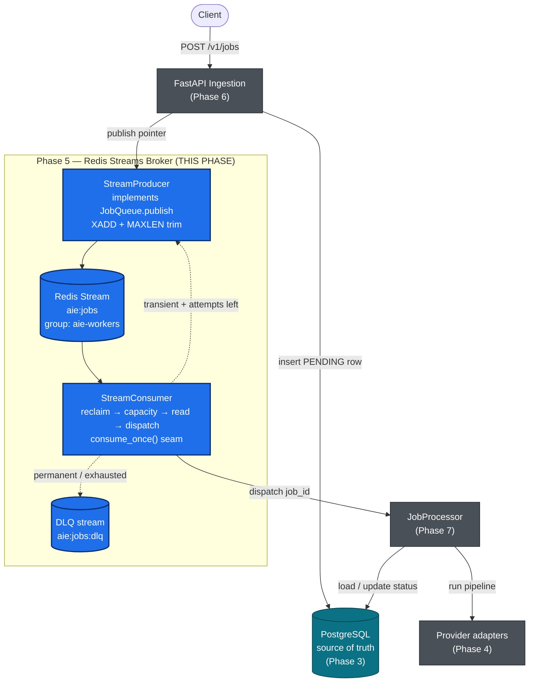
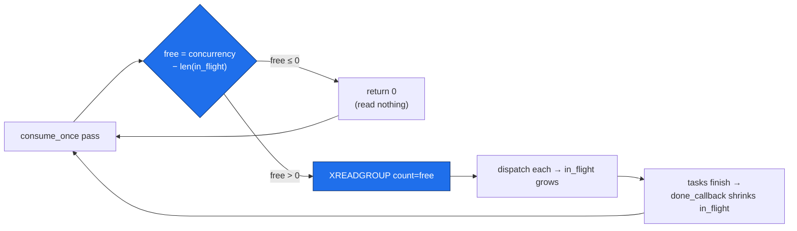
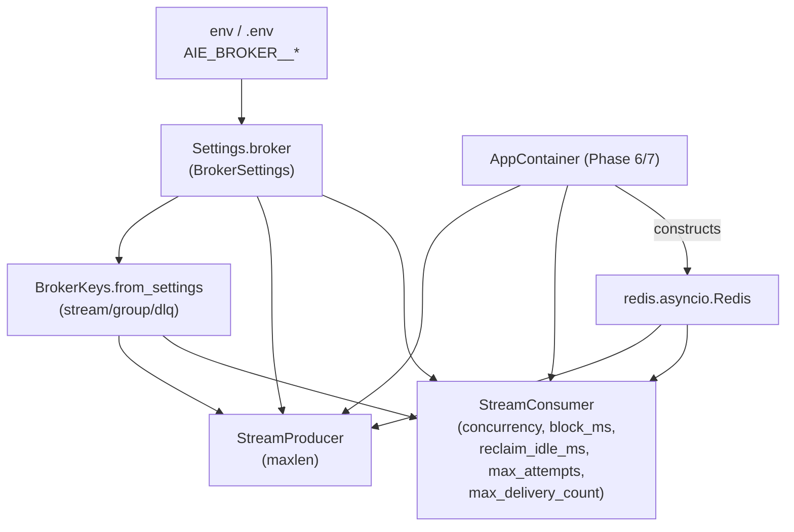

# Phase 5 — Redis Streams Broker

> **Part of:** [Asynchronous AI Serving Engine](../implementation-plan.md) · [Problem Statement](../problem-statement.md)
> **Status:** Planned (greenfield) · **Depends on:** [Phase 1](phase-1-scaffold-toolchain-domain.md), [Phase 2](phase-2-concurrency-retry-ports.md), [Phase 3](phase-3-persistence-sqlalchemy-alembic.md) · **Unlocks:** [Phase 7](phase-7-worker-pipelines.md)
> **Delivers:** A custom asyncio broker over Redis Streams — a `StreamProducer` implementing the `JobQueue` port and a `StreamConsumer` that reclaims orphans, applies semaphore-free capacity backpressure, dispatches tracked tasks, and routes each message to ACK / retry / DLQ with an idempotency guard — all driven by a deterministic `consume_once()` test seam.
> **Primary skills applied:** workflow-orchestration-patterns, async-python-patterns, distributed-tracing, software-architecture, python-pro, python-testing-patterns, docs-architect, mermaid-expert

---

## Table of Contents

1. [Overview & Objectives](#1-overview--objectives)
2. [Where This Fits](#2-where-this-fits)
3. [Prerequisites & Inputs](#3-prerequisites--inputs)
4. [Deliverables](#4-deliverables)
5. [Design Decisions & Rationale](#5-design-decisions--rationale)
6. [Detailed Implementation](#6-detailed-implementation)
7. [Flow & Sequence Diagrams](#7-flow--sequence-diagrams)
8. [Configuration & Environment](#8-configuration--environment)
9. [Testing Strategy](#9-testing-strategy)
10. [Verification & Exit-Criteria Mapping](#10-verification--exit-criteria-mapping)
11. [Windows & Cross-Platform Notes](#11-windows--cross-platform-notes)
12. [Common Pitfalls & Troubleshooting](#12-common-pitfalls--troubleshooting)
13. [Definition of Done](#13-definition-of-done)
14. [References & Further Reading](#14-references--further-reading)
15. [Navigation](#15-navigation)

---

## 1. Overview & Objectives

Phase 5 builds the **asynchronous broker layer** — the component that decouples ingestion (FastAPI returning `202 Accepted` in milliseconds) from execution (background workers running multi-step AI pipelines). It is the heart of the "Decoupled Processing Workflow" requirement in the [problem statement](../problem-statement.md) §3.III.

The locked decision (implementation plan §"Decisions confirmed" #1) is a **custom asyncio worker on Redis Streams** — *not* Celery, *not* arq, *not* RQ. We use the redis-py 5 asyncio client directly and own the consume loop, the consumer-group lifecycle, the backpressure mechanism, and the failure routing. This is deliberate: the entire portfolio thesis is "I can build a correct distributed-systems primitive from the protocol up," and a managed task framework would hide exactly the mechanics an interviewer wants to see.

After this phase the system can:

1. **Publish a job pointer** onto a Redis Stream (`StreamProducer.publish`, satisfying the `JobQueue` port from [Phase 2](phase-2-concurrency-retry-ports.md)) using `XADD` with approximate `MAXLEN` trimming so the stream is bounded.
2. **Create the consumer group idempotently** at startup (`XGROUP CREATE ... MKSTREAM`, swallowing the `BUSYGROUP` error so repeated boots and multiple workers are safe).
3. **Reclaim orphaned messages** left behind by a crashed worker via `XAUTOCLAIM` (any message idle beyond `reclaim_idle_ms`), and route messages reclaimed beyond a max delivery count to the DLQ.
4. **Apply backpressure without a semaphore** — free capacity is computed as `worker_concurrency − len(in_flight)`, and that number becomes the `COUNT` budget for `XREADGROUP`. The consumer literally never reads more than it can run.
5. **Dispatch each message as a tracked `asyncio.Task`**, tracked in a set with a done-callback (the canonical "fire-and-forget but don't lose the reference" pattern).
6. **Route every message deterministically**: success → `XACK`; transient failure with attempts remaining → `XACK` + re-`XADD` with `attempt+1` + reset the PG row to `PENDING`; permanent failure or attempts exhausted → push to DLQ + `XACK` + mark the PG row `FAILED`. An **idempotency guard** re-reads the row and ack-and-skips if it is already terminal (at-least-once delivery made safe).
7. **Shut down gracefully**: a single `asyncio.Event` stops the loop within at most `block_ms`, in-flight tasks are drained with `asyncio.gather`, and only then is the Redis connection closed — satisfying the "Zero Resource Leaking" exit criterion (§4) for the broker's slice.

> [!IMPORTANT]
> The single most important design seam in this phase is **`consume_once()`** — one full reclaim → capacity → read → dispatch pass with **no infinite loop and no `block`**. Every behavioural test calls `consume_once()` directly and asserts on observable effects (was `XACK` called? was a retry message re-added? did the row reach `FAILED`?). The production loop is a thin `while not stop.is_set(): await consume_once()` wrapper. This is how we keep the test suite **clock-free** — exit criterion §4 "Deterministic Concurrency Gates."

> [!NOTE]
> **Messages are pointers, not payloads.** Each stream entry is the tiny dict `{job_id, job_type, attempt}`. PostgreSQL (from [Phase 3](phase-3-persistence-sqlalchemy-alembic.md)) is the single source of truth for the payload, status, result reference, and error. This keeps the stream small, keeps trimming cheap, and means a redelivered message always reads *current* state — which is precisely what makes the idempotency guard correct.

---

## 2. Where This Fits

This phase implements the **Redis Task Broker** box from the [problem statement](../problem-statement.md) architecture. The producer side is called by the API ingestion layer (wired in [Phase 6](phase-6-composition-root-fastapi-api.md)); the consumer side is driven by the worker process (wired in [Phase 7](phase-7-worker-pipelines.md)).



**Connection to prior phases.** The producer *is* the concrete implementation of the `JobQueue` Protocol declared in [Phase 2](phase-2-concurrency-retry-ports.md) (`ports/queue.py`). The consumer leans on the domain entity and `JobStatus` state machine from [Phase 1](phase-1-scaffold-toolchain-domain.md) (it asks "is this job terminal?") and on the `JobRepository` port from [Phase 2](phase-2-concurrency-retry-ports.md) / the SQLAlchemy adapter from [Phase 3](phase-3-persistence-sqlalchemy-alembic.md) (to read/update rows). It uses `TransientUpstreamError` / `PermanentUpstreamError` (the exception taxonomy from Phases 1–2) to decide between retry and DLQ.

**Connection to later phases.** [Phase 6](phase-6-composition-root-fastapi-api.md) constructs the `StreamProducer` inside `AppContainer` and injects it into the ingestion service. [Phase 7](phase-7-worker-pipelines.md) constructs the `StreamConsumer`, supplies the real `JobProcessor.process` callback as the dispatch target, and runs the `while`-loop with the OS-signal-driven `stop` event. **Phase 5 deliberately leaves the processor abstract** — the consumer takes a `JobProcessor` callable parameter so it can be unit-tested with a recording fake long before the real pipelines exist.

> [!NOTE]
> **Dependency boundary respected.** Both broker files live under `src/app/adapters/broker/` and may import `redis.asyncio`. They depend only on ports and domain types — never on FastAPI, never on the concrete SQLAlchemy session. `core/` and `domain/` never import this module. This is the hexagonal rule from the locked architecture.

---

## 3. Prerequisites & Inputs

This phase is the first to require a *running* Redis for its integration tier, but **every unit test runs against `fakeredis.aioredis` with zero infrastructure**.

| Input | Produced by | Why Phase 5 needs it |
|-------|-------------|----------------------|
| `Settings` with a `BrokerSettings` group (`stream`, `group`, `dlq`, `max_attempts`, `block_ms`, `reclaim_idle_ms`, `worker_concurrency`, `max_delivery_count`, `maxlen`) | [Phase 1](phase-1-scaffold-toolchain-domain.md) `core/config.py` | All keys/identifiers and tuning knobs flow from settings — never hard-coded — so tests can set `block_ms=0` etc. |
| `JobQueue` Protocol (`async def publish(job: InferenceJob) -> None`) | [Phase 2](phase-2-concurrency-retry-ports.md) `ports/queue.py` | The producer must structurally conform to it. |
| `JobRepository` Protocol (`get`, `update`) | [Phase 2](phase-2-concurrency-retry-ports.md) `ports/repository.py` | The consumer's idempotency guard and status writes go through it. |
| `InferenceJob`, `JobStatus`, `JobType` + `is_terminal` | [Phase 1](phase-1-scaffold-toolchain-domain.md) `domain/models.py` | Pointer fields and the terminal-state check. |
| `TransientUpstreamError`, `PermanentUpstreamError` | [Phase 1](phase-1-scaffold-toolchain-domain.md) `domain/exceptions.py` | Failure classification → retry vs DLQ. |
| `redis.asyncio.Redis` client instance | constructed by `AppContainer` ([Phase 6](phase-6-composition-root-fastapi-api.md)); in tests, `fakeredis.aioredis.FakeRedis` | The transport. Phase 5 receives an already-constructed client; it does **not** own connection construction. |
| `structlog` logger | [Phase 1](phase-1-scaffold-toolchain-domain.md) `core/logging.py` | Structured, contextual logs (`job_id`, `attempt`, `message_id`). |

> [!IMPORTANT]
> Phase 5 receives the Redis client by injection; it does not create or close it. Connection construction and teardown belong to the composition root ([Phase 6](phase-6-composition-root-fastapi-api.md)) so that the "open and close cleanly" exit criterion is verified in one place. The consumer's graceful-shutdown routine stops *reading* and drains *tasks*; the container's `aclose()` is what calls `await redis.aclose()`.

Assumed redis-py minimum is **5.0**, which is where `redis.asyncio` is the first-class async client and `aclose()` is the non-deprecated close (`close()` is deprecated in 5.x). The `redis>=5` pin lives in `pyproject.toml` from [Phase 1](phase-1-scaffold-toolchain-domain.md).

---

## 4. Deliverables

| File | Type | Purpose |
|------|------|---------|
| `src/app/adapters/broker/__init__.py` | new | Package marker; re-exports `StreamProducer`, `StreamConsumer`, `JobMessage`. |
| `src/app/adapters/broker/keys.py` | new | Central, settings-derived key/identifier helpers + consumer-name factory. |
| `src/app/adapters/broker/messages.py` | new | `JobMessage` dataclass + `to_fields()` / `from_fields()` (de)serialization of the pointer. |
| `src/app/adapters/broker/producer.py` | new | `StreamProducer` implementing `JobQueue.publish` (XADD + approximate MAXLEN); group bootstrap helper. |
| `src/app/adapters/broker/consumer.py` | new | `StreamConsumer`: `consume_once()` seam, `run()` loop, reclaim, capacity backpressure, tracked dispatch, ACK/retry/DLQ routing, graceful drain. |
| `tests/unit/broker/__init__.py` | new | Test package marker. |
| `tests/unit/broker/conftest.py` | new | `fakeredis.aioredis` fixture, fake repository, recording processor, `JobMessage` factory. |
| `tests/unit/broker/test_producer.py` | new | Publish → assert one stream entry with correct pointer fields; MAXLEN trim behaviour. |
| `tests/unit/broker/test_consumer_dispatch.py` | new | `consume_once()` → processor invoked; success → `XACK`; backpressure budget math. |
| `tests/unit/broker/test_consumer_retry_dlq.py` | new | Transient → re-XADD `attempt+1` + row PENDING; permanent/exhausted → DLQ + row FAILED. |
| `tests/unit/broker/test_consumer_idempotency.py` | new | Terminal row → ack-and-skip, processor **not** invoked. |
| `tests/unit/broker/test_consumer_shutdown.py` | new | Event-gated drain: `stop.set()` ends `run()`, in-flight task completes, **no sleeps**. |
| `tests/integration/test_broker_redis.py` | new | Real-Redis end-to-end: publish → consume → ACK; reclaim via `XAUTOCLAIM` (the contingency tier). Marked `integration`. |

> [!TIP]
> Keep `keys.py` and `messages.py` as separate tiny modules. They are pure (no I/O), trivially unit-testable, and importing them from both producer and consumer guarantees the two halves agree byte-for-byte on field names and the consumer-name format. Drift between producer and consumer serialization is one of the classic broker bugs; a shared module makes it structurally impossible.

---

## 5. Design Decisions & Rationale

| Decision | Choice | Why | Rejected alternative |
|----------|--------|-----|----------------------|
| Broker substrate | **Redis Streams + consumer groups** via redis-py asyncio | Native at-least-once with a server-side Pending Entries List (PEL), `XAUTOCLAIM` crash recovery, consumer-group fan-out, ordered log — all without a framework. Demonstrates protocol-level command mastery. | **Celery/arq/RQ** (hide the mechanics; heavier deps); **Redis Lists (`BLPOP`)** (no PEL, no redelivery, no groups — message lost on crash); **Pub/Sub** (fire-and-forget, no persistence). |
| Test seam | **`consume_once()`** — single reclaim+read+dispatch pass, no loop, no block | Lets every behavioural test drive exactly one iteration and assert effects deterministically; the `run()` loop becomes a trivial wrapper. Directly serves exit criterion §4. | A test that runs the real `run()` loop and `sleep`s — flaky, clock-dependent, the exact anti-pattern the spec forbids. |
| Backpressure | **Capacity-as-budget**: `count = worker_concurrency − len(in_flight)`; if `0`, skip the read | Backpressure becomes arithmetic, not a blocking primitive. We never pull work we cannot start; in-flight count is the truth. Trivially assertable in a unit test. | **`asyncio.Semaphore`** acquired per task (works, but obscures the count, complicates the budget, and the spec explicitly frames backpressure as the capacity computation). |
| Dispatch | **Tracked `asyncio.create_task` in a `set`** + `add_done_callback(discard)` | The documented way to fire async work without losing the task to GC; the set *is* the in-flight register that feeds the budget. | **`await` each message inline** (serializes the worker — destroys concurrency); **`asyncio.gather` of a batch** (couldn't interleave new reads / reclaim while a batch runs). |
| Group creation | **`XGROUP CREATE ... MKSTREAM`, swallow `BUSYGROUP`** | Idempotent and race-safe: any worker can create it, re-creation is a no-op, `MKSTREAM` means we don't need the stream to pre-exist. | Pre-creating via a migration / separate bootstrap step (ordering fragility, extra moving part); checking `XINFO GROUPS` first (TOCTOU race between workers). |
| Delivery contract | **At-least-once + idempotency guard** | Streams are at-least-once by design (a crash after work but before `XACK` redelivers). We make duplicates *safe* by re-reading the row and ack-and-skipping if terminal — correctness over a fragile exactly-once illusion. | Attempting **exactly-once** (impossible without distributed transactions across Redis+PG; not worth the complexity). |
| Message content | **Pointer `{job_id, job_type, attempt}`; PG is source of truth** | Tiny entries → cheap trim, cheap redelivery; a redelivered pointer always resolves to *current* state, which is what makes idempotency correct. | Embedding the full payload in the stream (large entries, stale-on-redelivery payloads, trimming pain). |
| Retry routing | **`XACK` old + re-`XADD` `attempt+1`** (new entry), reset row → `PENDING` | The original delivery is acknowledged and removed from the PEL; the retry is a *fresh* entry with its own delivery lifecycle. Clean PEL, observable attempt count, and respects the domain `requeue()` transition. | **Not ACKing and relying on reclaim** for retry (conflates transient app-failure with consumer-crash; the message would sit idle and only retry after `reclaim_idle_ms` — slow and semantically muddy). |
| Poison handling | **DLQ stream `aie:jobs:dlq`** for permanent / attempts-exhausted / over-delivery-count | Keeps the main stream clean, preserves the failed pointer + reason for inspection, and is itself just another stream (uniform tooling). | Dropping the message (loses audit trail); infinite retry (poison message starves the worker forever). |
| Shutdown | **One `asyncio.Event` + `asyncio.gather(*in_flight)` drain, then container closes Redis** | Loop exits within ≤ `block_ms`; no task is abandoned mid-flight; satisfies "zero resource leaking." The Event is also a clean, sleep-free test gate. | A `cancel()`-everything shutdown (drops in-flight jobs → they redeliver, but we lose the chance to finish cheaply); a busy-poll shutdown flag (no clean wakeup from `block`). |
| MAXLEN trim | **Approximate (`MAXLEN ~ N`, `approximate=True`)** on every `XADD` | `~` lets Redis trim at radix-tree-node boundaries — dramatically cheaper than exact trimming, and an unbounded stream is a memory leak. We don't need an exact cap. | Exact `MAXLEN N` (O(n) eviction work on hot path); no trim at all (stream grows forever → the spec's "zero resource leaking" violated at the data layer). |

### 5.1 Why a custom broker is the right call here

The orchestration-patterns guidance distinguishes **orchestration** (decision/coordination logic) from **activities** (external side-effecting work that must be *idempotent* and have *clear retryable-vs-permanent error classification*). Our broker is the orchestration layer; the pipelines (Phase 7) are the activities. We deliberately import three orchestration tenets:

- **Idempotency is mandatory for at-least-once delivery.** Our guard (re-read row, ack-and-skip if terminal) is the concrete realization.
- **Errors must be classified.** `TransientUpstreamError` → retry with backoff; `PermanentUpstreamError` (and exhausted attempts) → terminal/DLQ. We never retry a validation error.
- **Bounded retries + a dead-letter destination.** `max_attempts` caps retries; the DLQ is the terminal sink. This mirrors a Temporal retry policy with a non-retryable-error set and a max-attempts cap, implemented by hand.

> [!IMPORTANT]
> We use Redis Streams' server-side **PEL** for *crash recovery* (a worker dies after reading but before ACK → `XAUTOCLAIM` rescues the message), and we use **application-level re-XADD** for *transient business retries*. These are two different failure modes and they get two different mechanisms. Conflating them (e.g., retrying by simply not ACKing) is the most common Streams design error — it makes "the worker crashed" and "the upstream API returned a 503" indistinguishable, and ties retry latency to `reclaim_idle_ms`.

---

## 6. Detailed Implementation

The implementation is five small, focused modules. Read them in order: keys → messages → producer → consumer. Everything is grounded in the **verified redis-py 5 asyncio API** (signatures confirmed against the redis-py `master` source — see [§14](#14-references--further-reading)).

### 6.1 `src/app/adapters/broker/keys.py`

**Purpose & responsibilities.** Single source of truth for stream names, the group name, the DLQ name, and the per-process consumer name. Everything is derived from `BrokerSettings` so nothing is hard-coded; the only "magic" here is the consumer-name format, which must be stable and unique.

```python
"""Broker key/identifier helpers — pure, no I/O, settings-derived."""
from __future__ import annotations

import os
import secrets
import socket
from dataclasses import dataclass

from app.core.config import BrokerSettings


@dataclass(frozen=True, slots=True)
class BrokerKeys:
    """Resolved Redis key namespace for the broker, derived from settings.

    Kept as a frozen dataclass so it is hashable, immutable, and cheap to pass
    around. Both producer and consumer take one of these so they cannot
    disagree about which stream/group they are talking to.
    """

    stream: str   # main work stream,  e.g. "aie:jobs"
    group: str    # consumer group,    e.g. "aie-workers"
    dlq: str      # dead-letter stream, e.g. "aie:jobs:dlq"

    @classmethod
    def from_settings(cls, settings: BrokerSettings) -> "BrokerKeys":
        return cls(stream=settings.stream, group=settings.group, dlq=settings.dlq)


def make_consumer_name() -> str:
    """Stable-per-process, unique-across-processes consumer name.

    Format: ``{host}-{pid}-{rand}`` (e.g. ``box01-48211-9f3a1c``).

    - ``host`` + ``pid`` make it human-debuggable in ``XINFO CONSUMERS``.
    - ``rand`` guards against PID reuse and against two workers on the same
      host/PID namespace (containers can share a PID view) colliding, which
      would make ``XAUTOCLAIM`` reclaim a *live* consumer's own messages.
    """
    host = socket.gethostname()
    pid = os.getpid()
    rand = secrets.token_hex(3)  # 6 hex chars; plenty for collision avoidance
    return f"{host}-{pid}-{rand}"
```

**Walkthrough & rationale.**

- The consumer name is computed **once per process** (the consumer stores it on `self`), never per call. A new random name on every reclaim would orphan the consumer's own PEL entries and defeat crash recovery.
- `BrokerKeys` is `frozen=True, slots=True` — immutable and allocation-cheap, matching the "no global singletons, pass dependencies explicitly" rule.

> [!WARNING]
> The random suffix is not cosmetic. In container environments two replicas can momentarily share a hostname (e.g. before a dynamic hostname is assigned) and PIDs are namespaced per container — so `host-pid` alone is **not** guaranteed unique. Without the random suffix, consumer B could create itself with the same name as consumer A and immediately steal A's in-flight PEL entries on the next `XAUTOCLAIM`. The 6 hex chars eliminate that class of bug.

### 6.2 `src/app/adapters/broker/messages.py`

**Purpose & responsibilities.** Define the on-wire message (the *pointer*) and the symmetric (de)serialization. Redis Stream fields are a flat map of field→value, and redis-py encodes/decodes scalars; we keep all three fields as strings for maximum compatibility (and so `decode_responses` on/off both behave predictably — see the decode helper).

```python
"""The on-wire job pointer and its (de)serialization.

A stream entry is intentionally tiny: just enough to locate the job in
PostgreSQL (the source of truth) and to carry the retry attempt counter.
"""
from __future__ import annotations

from dataclasses import dataclass
from typing import Mapping
from uuid import UUID

from app.domain.models import InferenceJob, JobType


def _as_str(value: object) -> str:
    """Normalize a field that may arrive as bytes (decode_responses=False)
    or str (decode_responses=True). The broker tolerates either client config."""
    if isinstance(value, bytes):
        return value.decode("utf-8")
    return str(value)


@dataclass(frozen=True, slots=True)
class JobMessage:
    """Pointer carried by a single Redis Stream entry."""

    job_id: UUID
    job_type: JobType
    attempt: int  # 1-based; first delivery is attempt 1

    # --- serialization -----------------------------------------------------
    def to_fields(self) -> dict[str, str]:
        """Flat str→str map for XADD. All-string values keep wire encoding
        unambiguous regardless of the client's ``decode_responses`` setting."""
        return {
            "job_id": str(self.job_id),
            "job_type": self.job_type.value,
            "attempt": str(self.attempt),
        }

    @classmethod
    def from_fields(cls, fields: Mapping[object, object]) -> "JobMessage":
        """Inverse of :meth:`to_fields`. Accepts bytes-or-str keys/values so
        the same code path works for fakeredis and a real client in either
        decode mode."""
        decoded = {_as_str(k): _as_str(v) for k, v in fields.items()}
        return cls(
            job_id=UUID(decoded["job_id"]),
            job_type=JobType(decoded["job_type"]),
            attempt=int(decoded["attempt"]),
        )

    # --- convenience -------------------------------------------------------
    @classmethod
    def first_delivery(cls, job: InferenceJob) -> "JobMessage":
        """Build the initial pointer for a freshly-ingested job."""
        return cls(job_id=job.id, job_type=job.job_type, attempt=1)

    def next_attempt(self) -> "JobMessage":
        """Pointer for the next retry; ``attempt`` incremented by one."""
        return JobMessage(self.job_id, self.job_type, self.attempt + 1)
```

**Walkthrough & rationale.**

- **All-string fields.** Redis Stream values are byte strings on the wire. Encoding `attempt` as `"3"` (not the int `3`) means we never depend on redis-py to coerce, and round-tripping is exact whether `decode_responses` is `True` or `False`. `from_fields` is defensive about both bytes and str keys/values for the same reason.
- `next_attempt()` keeps the increment in one place (the consumer's retry path calls it), so the attempt-counter invariant lives with the message type, not scattered across the consumer.
- `JobMessage` is immutable; the consumer builds a *new* message for the retry rather than mutating — matching the domain's value-object discipline.

> [!NOTE]
> We do **not** put the payload, status, or result here. A redelivered pointer must always resolve to the *current* row; embedding a stale payload would defeat the idempotency guard. The pointer's `attempt` is the only state the stream owns, and it exists purely so the consumer can enforce `max_attempts` without an extra round-trip.

### 6.3 `src/app/adapters/broker/producer.py`

**Purpose & responsibilities.** Implement the `JobQueue` port: serialize the pointer and `XADD` it with an approximate `MAXLEN` trim. Also own the **idempotent group-creation** helper (used at consumer startup, but kept here next to the stream it operates on).

```python
"""Producer: implements the JobQueue port over a Redis Stream."""
from __future__ import annotations

import structlog
from redis.asyncio import Redis
from redis.exceptions import ResponseError

from app.adapters.broker.keys import BrokerKeys
from app.adapters.broker.messages import JobMessage
from app.core.config import BrokerSettings
from app.domain.models import InferenceJob

log = structlog.get_logger(__name__)


async def ensure_group(redis: Redis, keys: BrokerKeys) -> None:
    """Create the consumer group idempotently.

    ``XGROUP CREATE key group $ MKSTREAM``:
      - ``id="$"``  → the group starts consuming only *new* messages added
        after creation (existing backlog is owned by no one — fine for a
        fresh deploy; reclaim handles anything already pending).
      - ``mkstream=True`` → create the stream if it does not exist yet, so we
        never need a separate "create stream" step.

    Redis raises ``BUSYGROUP Consumer Group name already exists`` if the group
    is already present. That is the normal, expected outcome on every boot
    after the first and on every worker beyond the first — so we swallow it.
    Any *other* ResponseError is a real problem and re-raised.
    """
    try:
        await redis.xgroup_create(
            name=keys.stream,
            groupname=keys.group,
            id="$",
            mkstream=True,
        )
        log.info("broker.group.created", stream=keys.stream, group=keys.group)
    except ResponseError as exc:
        if "BUSYGROUP" in str(exc):
            log.debug("broker.group.exists", stream=keys.stream, group=keys.group)
            return
        raise  # genuine error — propagate


class StreamProducer:
    """Publishes job pointers onto the work stream. Conforms structurally to
    the ``JobQueue`` Protocol (``async def publish(job) -> None``).
    """

    def __init__(
        self,
        redis: Redis,
        keys: BrokerKeys,
        settings: BrokerSettings,
    ) -> None:
        self._redis = redis
        self._keys = keys
        self._maxlen = settings.maxlen  # approximate cap, e.g. 10_000

    async def publish(self, job: InferenceJob) -> None:
        """Append the first-delivery pointer for ``job`` to the stream.

        The XADD is trimmed with an *approximate* MAXLEN (``~``) so Redis can
        evict at radix-node boundaries — O(1)-ish amortized, vs the O(n) cost
        of an exact trim on the hot ingestion path.
        """
        message = JobMessage.first_delivery(job)
        message_id = await self._redis.xadd(
            name=self._keys.stream,
            fields=message.to_fields(),
            maxlen=self._maxlen,
            approximate=True,  # the "~" modifier; cheap trimming
        )
        log.info(
            "broker.published",
            job_id=str(job.id),
            job_type=job.job_type.value,
            attempt=message.attempt,
            message_id=_decode_id(message_id),
            stream=self._keys.stream,
        )

    async def republish(self, message: JobMessage) -> str:
        """Re-add an *already-incremented* pointer (the retry path calls this).

        Returns the new stream message id so the caller can log/trace it.
        Separated from ``publish`` because the retry path already owns a
        :class:`JobMessage` with the right attempt and must NOT reset it to 1.
        """
        message_id = await self._redis.xadd(
            name=self._keys.stream,
            fields=message.to_fields(),
            maxlen=self._maxlen,
            approximate=True,
        )
        return _decode_id(message_id)

    async def dead_letter(self, message: JobMessage, reason: str) -> str:
        """Append a poison pointer to the DLQ stream, with a failure reason.

        The DLQ is just another stream, so the same XADD shape applies. We add
        a ``reason`` field for human inspection; the DLQ is also trimmed so it
        cannot grow without bound.
        """
        fields = {**message.to_fields(), "reason": reason}
        message_id = await self._redis.xadd(
            name=self._keys.dlq,
            fields=fields,
            maxlen=self._maxlen,
            approximate=True,
        )
        log.warning(
            "broker.dead_lettered",
            job_id=str(message.job_id),
            attempt=message.attempt,
            reason=reason,
            dlq=self._keys.dlq,
            message_id=message_id,
        )
        return _decode_id(message_id)


def _decode_id(message_id: object) -> str:
    """XADD returns the new id as bytes (decode_responses=False) or str."""
    return message_id.decode() if isinstance(message_id, bytes) else str(message_id)
```

**Walkthrough & rationale.**

- **`xadd(name, fields, maxlen=..., approximate=True)`** — verified signature: `xadd(name, fields, id="*", maxlen=None, approximate=True, nomkstream=False, minid=None, limit=None)`. We omit `id` so Redis auto-assigns the monotonic `*` id, and pass `maxlen` + `approximate=True` (the `~` modifier).
- **`ensure_group` lives in the producer module** because it operates on the same stream the producer writes to, and because `MKSTREAM` means the *first* `XADD` and the group creation race is harmless either way — `MKSTREAM` handles "stream doesn't exist yet at group-create time," and `BUSYGROUP` handling covers "group already exists." Together they make startup order irrelevant.
- **Three publish methods, one shape.** `publish` (fresh job, attempt=1), `republish` (retry, attempt already bumped by `JobMessage.next_attempt()`), `dead_letter` (poison → DLQ). Splitting them prevents the classic bug of accidentally resetting `attempt` to 1 on a retry.

> [!CAUTION]
> Do **not** pass `nomkstream=True` on the producer's `XADD`. `nomkstream` tells Redis "fail if the stream doesn't exist." On a cold system the API might publish before any consumer has run `ensure_group`/`MKSTREAM`; with `nomkstream=True` that first publish would raise and the job would be lost. Default (`nomkstream=False`) auto-creates the stream — exactly what we want for the ingestion path.

> [!TIP]
> `XADD` returns the assigned message id (e.g. `b"1718000000000-0"`). We log it (`message_id`) so a request trace can be followed from "API published" all the way to "worker acked" — this is the breadcrumb the [distributed-tracing](#) discipline relies on. In [Phase 9](phase-9-ci-readme-polish.md) this becomes part of the structured-logging story.

### 6.4 `src/app/adapters/broker/consumer.py`

This is the centerpiece. It is long but every method has one job. Read the class top-to-bottom: lifecycle → `consume_once` (the seam) → the four private steps (reclaim, capacity, read, dispatch) → the routing handler → drain.

**Purpose & responsibilities.**

- Own the consumer-group lifecycle (calls `ensure_group` at start).
- Provide `consume_once()`: exactly one reclaim → capacity → read → dispatch pass, **no loop, no block**.
- Provide `run(stop)`: the production loop = `while not stop.is_set(): await consume_once(block=block_ms)` + drain.
- Track in-flight tasks in a `set` (this set *is* the backpressure signal).
- Route each finished message to ACK / retry / DLQ with the idempotency guard.

```python
"""Consumer: the asyncio Redis-Streams worker loop and its deterministic seam.

Public surface:
    StreamConsumer(redis, keys, settings, repository, processor, producer)
    await consumer.start()            # idempotent group creation
    await consumer.consume_once()     # ONE reclaim+read+dispatch pass (test seam)
    await consumer.run(stop)          # production loop until stop.is_set()
"""
from __future__ import annotations

import asyncio
from typing import Any, Awaitable, Callable, Protocol

import structlog
from redis.asyncio import Redis

from app.adapters.broker.keys import BrokerKeys, make_consumer_name
from app.adapters.broker.messages import JobMessage
from app.adapters.broker.producer import StreamProducer, ensure_group
from app.core.config import BrokerSettings
from app.domain.exceptions import (
    JobNotFound,
    PermanentUpstreamError,
    TransientUpstreamError,
)
from app.ports.repository import JobRepository

log = structlog.get_logger(__name__)


class JobProcessor(Protocol):
    """The unit of work the consumer dispatches to.

    Phase 5 keeps this abstract: the consumer takes *a callable* matching this
    Protocol. Phase 7 supplies the real ``JobProcessor.process``; tests supply
    a recording fake. Structural typing (Protocol) means neither has to import
    the other — the hexagonal rule.
    """

    async def __call__(self, message: JobMessage) -> None: ...


# A delivered stream entry as redis-py returns it: (message_id, {field: value}).
DeliveredEntry = tuple[Any, dict[Any, Any]]


class StreamConsumer:
    def __init__(
        self,
        redis: Redis,
        keys: BrokerKeys,
        settings: BrokerSettings,
        repository: JobRepository,
        processor: JobProcessor,
        producer: StreamProducer,
    ) -> None:
        self._redis = redis
        self._keys = keys
        self._repo = repository
        self._process = processor
        self._producer = producer

        # Tuning (all from Settings — never hard-coded, so tests can zero them).
        self._concurrency = settings.worker_concurrency
        self._block_ms = settings.block_ms
        self._reclaim_idle_ms = settings.reclaim_idle_ms
        self._max_attempts = settings.max_attempts
        self._max_delivery_count = settings.max_delivery_count

        # Per-process identity (computed once; see keys.make_consumer_name).
        self._consumer_name = make_consumer_name()

        # The in-flight register. Its length IS the backpressure signal.
        self._in_flight: set[asyncio.Task[None]] = set()

        # Cursor for XAUTOCLAIM scanning; "0-0" = scan from the beginning.
        self._reclaim_cursor: str = "0-0"

    # ----------------------------------------------------------------- lifecycle
    async def start(self) -> None:
        """Idempotently ensure the consumer group exists. Safe to call on
        every worker and every boot (BUSYGROUP is swallowed in ensure_group)."""
        await ensure_group(self._redis, self._keys)
        log.info(
            "broker.consumer.started",
            consumer=self._consumer_name,
            group=self._keys.group,
            concurrency=self._concurrency,
        )

    @property
    def in_flight_count(self) -> int:
        """Number of currently-running dispatched tasks (test/observability)."""
        return len(self._in_flight)

    # ------------------------------------------------------------- the test seam
    async def consume_once(self, *, block_ms: int | None = None) -> int:
        """Run exactly ONE pass: reclaim orphans → compute capacity → read up
        to that budget → dispatch each. Returns the number of NEW messages
        read (excludes reclaimed) so tests/metrics can assert on it.

        ``block_ms`` defaults to 0 (non-blocking) — tests always call it that
        way so there is no waiting. ``run()`` passes the configured block.
        """
        block = self._block_ms if block_ms is None else block_ms

        # (1) Rescue messages abandoned by a crashed/slow consumer.
        await self._reclaim_orphans()

        # (2) Backpressure: only read what we have capacity to start.
        capacity = self._free_capacity()
        if capacity <= 0:
            log.debug("broker.backpressure.saturated", in_flight=self.in_flight_count)
            return 0

        # (3) Read up to `capacity` brand-new messages ('>' = never delivered).
        entries = await self._read_new(count=capacity, block=block)
        if not entries:
            return 0

        # (4) Dispatch each as a tracked task.
        for message_id, fields in entries:
            self._dispatch(message_id, fields)
        return len(entries)

    # ----------------------------------------------------------- production loop
    async def run(self, stop: asyncio.Event) -> None:
        """Loop ``consume_once`` until ``stop`` is set, then drain in-flight.

        Because each read uses ``block_ms``, an idle loop wakes at most every
        ``block_ms`` to re-check ``stop`` — so shutdown latency is bounded by
        ``block_ms`` with zero busy-spinning.
        """
        log.info("broker.consumer.loop.start", consumer=self._consumer_name)
        try:
            while not stop.is_set():
                try:
                    await self.consume_once(block_ms=self._block_ms)
                except asyncio.CancelledError:
                    raise
                except Exception:  # never let one bad pass kill the loop
                    log.exception("broker.consume_once.error")
                    # brief, bounded backoff so a hard failure (e.g. Redis
                    # down) doesn't hot-loop; uses the loop clock, not sleep
                    # in tests (run() is not unit-tested with this path).
                    await asyncio.sleep(min(self._block_ms / 1000, 1.0) or 0.1)
        finally:
            await self.drain()
            log.info("broker.consumer.loop.stop", consumer=self._consumer_name)

    # ---------------------------------------------------------------- step (1)
    async def _reclaim_orphans(self) -> None:
        """Reclaim PEL entries idle longer than ``reclaim_idle_ms`` to THIS
        consumer, then dispatch or DLQ them.

        ``XAUTOCLAIM`` returns a 3-tuple on Redis >= 7.0:
            [next_cursor, [(id, {fields}), ...], [deleted_ids]]
        We advance ``self._reclaim_cursor`` so successive passes sweep the
        whole PEL; "0-0" returned means the sweep wrapped to the start.
        """
        capacity = self._free_capacity()
        if capacity <= 0:
            return  # no room to run reclaimed work; try next pass

        result = await self._redis.xautoclaim(
            name=self._keys.stream,
            groupname=self._keys.group,
            consumername=self._consumer_name,
            min_idle_time=self._reclaim_idle_ms,
            start_id=self._reclaim_cursor,
            count=capacity,
        )
        # redis-py returns [cursor, claimed, deleted] (deleted present on 7.0+).
        next_cursor, claimed = result[0], result[1]
        self._reclaim_cursor = _decode(next_cursor)

        for message_id, fields in claimed:
            await self._handle_reclaimed(message_id, fields)

    async def _handle_reclaimed(self, message_id: Any, fields: dict[Any, Any]) -> None:
        """A reclaimed message may be a poison message that has bounced between
        consumers too many times. Check its delivery count via XPENDING; if it
        exceeds ``max_delivery_count``, DLQ it. Otherwise dispatch normally."""
        deliveries = await self._delivery_count(message_id)
        if deliveries > self._max_delivery_count:
            message = JobMessage.from_fields(fields)
            await self._route_to_dlq(
                message_id, message,
                reason=f"exceeded max delivery count ({deliveries})",
            )
            return
        log.info(
            "broker.reclaimed",
            message_id=_decode(message_id),
            deliveries=deliveries,
            consumer=self._consumer_name,
        )
        self._dispatch(message_id, fields)

    async def _delivery_count(self, message_id: Any) -> int:
        """How many times this specific entry has been delivered, via
        XPENDING range. Returns 0 if it is no longer pending."""
        pending = await self._redis.xpending_range(
            name=self._keys.stream,
            groupname=self._keys.group,
            min=_decode(message_id),
            max=_decode(message_id),
            count=1,
        )
        if not pending:
            return 0
        # redis-py shape: [{message_id, consumer, time_since_delivered, times_delivered}]
        return int(pending[0]["times_delivered"])

    # ---------------------------------------------------------------- step (2)
    def _free_capacity(self) -> int:
        """THE backpressure computation: how many more tasks we may start.

        Pure arithmetic over the in-flight set — no semaphore, no lock. A
        return of 0 means "do not read"; the loop simply tries again next pass
        (after in-flight tasks complete and shrink the set)."""
        return self._concurrency - len(self._in_flight)

    # ---------------------------------------------------------------- step (3)
    async def _read_new(self, *, count: int, block: int) -> list[DeliveredEntry]:
        """XREADGROUP with the special id '>' (only messages never delivered
        to any consumer in the group). Returns a flat list of (id, fields).

        redis-py (legacy/default response shape) returns:
            [[stream_name, [(id, {fields}), ...]], ...]
        or ``[]``/``None`` on block-timeout. We requested a single stream, so
        we index [0][1] defensively.
        """
        response = await self._redis.xreadgroup(
            groupname=self._keys.group,
            consumername=self._consumer_name,
            streams={self._keys.stream: ">"},
            count=count,
            block=block or None,  # block=0 -> pass None (non-blocking read)
            noack=False,          # we DO want PEL tracking → at-least-once
        )
        if not response:
            return []
        # response[0] == [stream_name, entries]; entries == [(id, {fields}), ...]
        _stream_name, entries = response[0]
        return list(entries)

    # ---------------------------------------------------------------- step (4)
    def _dispatch(self, message_id: Any, fields: dict[Any, Any]) -> None:
        """Spawn a tracked task to process one message. The task is added to
        the in-flight set and removed on completion via a done-callback — the
        canonical 'fire-and-forget without losing the reference' pattern.
        Synchronous (no await): scheduling a task must not yield, or the
        capacity math in the same pass could race itself."""
        task = asyncio.create_task(self._process_and_route(message_id, fields))
        self._in_flight.add(task)
        task.add_done_callback(self._in_flight.discard)

    async def _process_and_route(self, message_id: Any, fields: dict[Any, Any]) -> None:
        """Run the processor for one message and route the outcome.

        Outcomes:
          * success                       → XACK
          * TransientUpstreamError + room → XACK + re-XADD(attempt+1) + row→PENDING
          * Transient but attempts gone   → DLQ + XACK + row→FAILED
          * PermanentUpstreamError        → DLQ + XACK + row→FAILED
          * idempotent (row terminal)     → handled INSIDE processor guard; here we ACK
        """
        message = JobMessage.from_fields(fields)
        bound = log.bind(
            job_id=str(message.job_id),
            attempt=message.attempt,
            message_id=_decode(message_id),
        )
        # ---- Idempotency guard (at-least-once made safe) -------------------
        if await self._already_terminal(message):
            bound.info("broker.idempotent.skip")
            await self._ack(message_id)
            return

        try:
            await self._process(message)             # the actual pipeline work
        except TransientUpstreamError as exc:
            await self._on_transient(message_id, message, exc, bound)
        except PermanentUpstreamError as exc:
            await self._route_to_dlq(message_id, message, reason=f"permanent: {exc}")
            await self._mark_failed(message, str(exc))
            bound.warning("broker.permanent_failure")
        except Exception as exc:  # unexpected → treat as permanent, never silent
            await self._route_to_dlq(message_id, message, reason=f"unexpected: {exc!r}")
            await self._mark_failed(message, repr(exc))
            bound.exception("broker.unexpected_failure")
        else:
            await self._ack(message_id)              # clean success → leave PEL
            bound.info("broker.acked")

    async def _on_transient(
        self,
        message_id: Any,
        message: JobMessage,
        exc: TransientUpstreamError,
        bound: Any,
    ) -> None:
        """Transient failure: retry if attempts remain, else DLQ."""
        if message.attempt >= self._max_attempts:
            await self._route_to_dlq(
                message_id, message,
                reason=f"transient, attempts exhausted ({message.attempt}): {exc}",
            )
            await self._mark_failed(message, f"exhausted after {message.attempt}: {exc}")
            bound.warning("broker.retries_exhausted")
            return

        # ACK the current delivery (remove from PEL), reset the row to PENDING,
        # and re-publish a FRESH entry with attempt+1 (its own delivery cycle).
        await self._ack(message_id)
        await self._requeue_row(message)
        retry_id = await self._producer.republish(message.next_attempt())
        bound.info("broker.retry.scheduled", next_attempt=message.attempt + 1,
                   retry_message_id=retry_id)

    # ------------------------------------------------------------ PG helpers
    async def _already_terminal(self, message: JobMessage) -> bool:
        """Idempotency guard: re-read the row; if already SUCCESS/FAILED, a
        duplicate delivery must be ack-and-skipped (not reprocessed)."""
        try:
            job = await self._repo.get(message.job_id)
        except JobNotFound:
            # Row vanished (shouldn't happen — PG is SoT). Treat as terminal so
            # we don't reprocess a ghost; ACK and move on.
            return True
        return job.is_terminal

    async def _requeue_row(self, message: JobMessage) -> None:
        """Reset the job row to PENDING for the upcoming retry delivery."""
        try:
            job = await self._repo.get(message.job_id)
        except JobNotFound:
            return
        job.requeue()                 # domain transition RUNNING → PENDING
        await self._repo.update(job)

    async def _mark_failed(self, message: JobMessage, error: str) -> None:
        """Terminally fail the job row (DLQ path)."""
        try:
            job = await self._repo.get(message.job_id)
        except JobNotFound:
            return
        job.mark_failed(error)        # domain transition → FAILED
        await self._repo.update(job)

    # --------------------------------------------------------- redis helpers
    async def _ack(self, message_id: Any) -> int:
        """XACK one message: remove it from the group's PEL."""
        return await self._redis.xack(self._keys.stream, self._keys.group, message_id)

    async def _route_to_dlq(self, message_id: Any, message: JobMessage, *, reason: str) -> None:
        """Push to DLQ then ACK the original (so it leaves the main PEL)."""
        await self._producer.dead_letter(message, reason)
        await self._ack(message_id)

    # -------------------------------------------------------------- shutdown
    async def drain(self) -> None:
        """Await all in-flight tasks so no job is abandoned mid-flight.

        ``gather(..., return_exceptions=True)`` ensures one failing task does
        not prevent the others from being awaited; each task already routed its
        own outcome inside ``_process_and_route`` so exceptions here are only
        the ones that escaped (there should be none — but we never raise out of
        drain)."""
        if not self._in_flight:
            return
        log.info("broker.drain.start", in_flight=len(self._in_flight))
        await asyncio.gather(*tuple(self._in_flight), return_exceptions=True)
        log.info("broker.drain.complete")


def _decode(value: object) -> str:
    return value.decode() if isinstance(value, bytes) else str(value)
```

**Walkthrough of the non-obvious parts.**

1. **`consume_once()` returns the count of *new* messages.** Tests assert `await consume_once() == 1` after one publish, and `== 0` when the stream is empty or capacity is exhausted. Reclaimed messages are dispatched but not counted as "new," which keeps the seam's contract crisp.

2. **`_free_capacity()` is called twice per pass** — once before reclaim (don't reclaim work we can't run) and once before reading (don't read past capacity). Because `_dispatch` is *synchronous* (it schedules a task but does not `await`), the in-flight set grows immediately and the second capacity read sees it. This is why dispatch must not be a coroutine that awaits — yielding between "create task" and "add to set" would open a window where the budget is wrong.

3. **`_read_new` uses `'>'`.** This is the Streams idiom for "give me only entries never delivered to any consumer in this group." Pending (already-delivered-but-unacked) entries are *not* returned by `'>'` — those are recovered by `_reclaim_orphans` via `XAUTOCLAIM`. Two ids, two mechanisms, no overlap.

4. **`block or None`.** redis-py treats `block=0` as "block forever," which is the *opposite* of what we want in `consume_once`'s default (non-blocking) call. Passing `None` means "don't block at all." In `run()` we pass the real `block_ms` so an idle loop parks efficiently instead of hot-spinning.

5. **The idempotency guard runs *before* the processor**, inside the dispatched task. A duplicate delivery (the at-least-once tax) finds the row already `SUCCESS`/`FAILED`, logs `broker.idempotent.skip`, ACKs, and returns — the pipeline never runs twice. This is the workflow-orchestration "activities must be idempotent" tenet realized at the broker layer.

6. **Retry ACKs the old entry and re-XADDs a new one.** We do *not* leave the message in the PEL for reclaim — that would conflate transient business failure with consumer crash. The new entry starts a clean delivery lifecycle with `attempt+1`; the PEL stays tidy; the attempt counter is visible in the stream.

7. **`_handle_reclaimed` checks delivery count.** A message reclaimed many times (`XPENDING` `times_delivered > max_delivery_count`) is a poison message that keeps killing consumers *before* they can classify it (e.g. a crash, not a clean `TransientUpstreamError`). That can't be caught by the try/except, so the delivery-count ceiling is the backstop that routes it to the DLQ.

8. **`run()` swallows per-pass exceptions** (logs and backs off) so a transient Redis blip doesn't kill the worker, but it **re-raises `CancelledError`** so task cancellation still works. The `finally: await self.drain()` guarantees drain on every exit path — normal `stop`, exception, or cancellation.

> [!IMPORTANT]
> **`xreadgroup` return shape is version-sensitive.** The redis-py *default* (legacy) response for a standard client is `[[stream_name, [(id, {fields}), ...]]]` (confirmed against redis-py `master`: the default callback is `parse_xread`, and `get_response_callbacks` defaults `legacy_responses=True`). A client constructed with `protocol=3` *and* the new unified callbacks would instead return a `dict[stream_name, entries]`. Our `_read_new` indexes `response[0]` (legacy list shape). If you ever opt into RESP3 unified responses, change `_read_new` to `next(iter(response.values()))`. We pin the legacy shape because it is the default and is what `fakeredis.aioredis` emulates.

> [!WARNING]
> **`XAUTOCLAIM` arity differs by Redis version.** On Redis **7.0+** it returns a **3-element** reply `[cursor, claimed, deleted_ids]`; on 6.2 it returned a 2-element reply `[cursor, claimed]`. Our `_reclaim_orphans` reads `result[0]` and `result[1]` only — which is correct for both. Don't blindly unpack `cursor, claimed, deleted = result`; that raises `ValueError` on 6.2. We target Redis 7-alpine (Phase 3 compose), so 3 elements is the norm, but index-access keeps us robust.

**Design rationale & how it honors the locked architecture.**

- **No global singletons.** The consumer receives `redis`, `repository`, `processor`, `producer`, and `settings` by constructor injection. Nothing is module-level. The composition root ([Phase 6](phase-6-composition-root-fastapi-api.md)/[Phase 7](phase-7-worker-pipelines.md)) wires it.
- **Ports & adapters.** `repository: JobRepository` and `processor: JobProcessor` are `Protocol`s — the consumer never imports SQLAlchemy or the concrete pipelines. `fakeredis.aioredis.FakeRedis` is structurally a `Redis` for our purposes, so tests need no special-casing.
- **PG is the source of truth.** Every status decision (`is_terminal`, `requeue`, `mark_failed`) goes through the domain entity loaded from the repository — the stream only carries the pointer + attempt.
- **Deterministic seam.** `consume_once()` exists *solely* so tests never touch the `while` loop or `block`. This is the spec's "deterministic concurrency gates" criterion, designed in rather than bolted on.

### 6.5 `src/app/adapters/broker/__init__.py`

```python
"""Redis Streams broker adapter: producer + consumer over redis-py asyncio."""
from app.adapters.broker.consumer import JobProcessor, StreamConsumer
from app.adapters.broker.keys import BrokerKeys, make_consumer_name
from app.adapters.broker.messages import JobMessage
from app.adapters.broker.producer import StreamProducer, ensure_group

__all__ = [
    "BrokerKeys",
    "JobMessage",
    "JobProcessor",
    "StreamConsumer",
    "StreamProducer",
    "ensure_group",
    "make_consumer_name",
]
```

---

## 7. Flow & Sequence Diagrams

### 7.1 The consume → dispatch → ack/retry/DLQ path

```mermaid
sequenceDiagram
    autonumber
    participant Loop as run() loop
    participant C as StreamConsumer
    participant R as Redis (Streams)
    participant T as Dispatched Task
    participant P as JobProcessor (Phase 7)
    participant DB as PostgreSQL
    participant PR as StreamProducer

    Loop->>C: consume_once(block_ms)
    C->>R: XAUTOCLAIM stream group consumer<br/>min_idle=reclaim_idle_ms start=cursor count=cap
    R-->>C: [next_cursor, claimed[], deleted[]]
    loop each reclaimed
        C->>R: XPENDING range (times_delivered?)
        alt times_delivered > max_delivery_count
            C->>PR: XADD DLQ (reason="over delivery count")
            C->>R: XACK
        else within limit
            C->>T: create_task(process_and_route)
        end
    end

    C->>C: capacity = concurrency - len(in_flight)
    alt capacity > 0
        C->>R: XREADGROUP GROUP g consumer '>' count=capacity block
        R-->>C: [[stream, [(id, fields)...]]]
        loop each new entry
            C->>T: create_task(process_and_route)  %% tracked in set
        end
    else capacity == 0
        C-->>Loop: return 0 (backpressure)
    end

    Note over T,DB: each task runs independently/concurrently
    T->>DB: repo.get(job_id)  (idempotency guard)
    alt row already terminal
        T->>R: XACK (skip — duplicate delivery)
    else not terminal
        T->>P: process(message)
        alt success
            P-->>T: ok
            T->>R: XACK
        else TransientUpstreamError & attempts left
            T->>R: XACK (old entry)
            T->>DB: requeue() → PENDING
            T->>PR: XADD (attempt+1)  %% fresh delivery
        else Transient exhausted OR Permanent
            T->>PR: XADD DLQ (reason)
            T->>R: XACK
            T->>DB: mark_failed(error) → FAILED
        end
    end
```

### 7.2 A single message's delivery lifecycle

```mermaid
stateDiagram-v2
    [*] --> Added: producer XADD (attempt=1)
    Added --> Delivered: XREADGROUP '>' (enters group PEL)

    Delivered --> Acked: success → XACK
    Delivered --> Acked: row already terminal → idempotent XACK
    Delivered --> Retried: TransientUpstreamError & attempt < max
    Delivered --> DeadLettered: PermanentUpstreamError
    Delivered --> DeadLettered: Transient & attempt == max

    Delivered --> PendingIdle: worker crashed before XACK
    PendingIdle --> Reclaimed: XAUTOCLAIM (idle > reclaim_idle_ms)
    Reclaimed --> Delivered: re-dispatched to this consumer
    Reclaimed --> DeadLettered: times_delivered > max_delivery_count

    Retried --> [*]: old entry Acked;\nNEW entry (attempt+1) starts its own lifecycle
    Acked --> [*]: removed from PEL
    DeadLettered --> [*]: on DLQ; original Acked

    note right of PendingIdle
        The Pending Entries List (PEL) is the
        server-side at-least-once safety net:
        delivered-but-unacked messages survive
        a consumer crash and become reclaimable.
    end note
```



### 7.3 Backpressure as arithmetic (not a semaphore)



> [!NOTE]
> The feedback loop in 7.3 is the whole backpressure story: the in-flight set grows on dispatch and shrinks via the per-task done-callback. The next pass reads exactly the freed capacity. There is no separate limiter to get out of sync with reality — the set *is* the limiter.

---

## 8. Configuration & Environment

All broker tuning lives in the `BrokerSettings` group defined in [Phase 1](phase-1-scaffold-toolchain-domain.md) (`core/config.py`), under the global `AIE_` prefix. Phase 5 *consumes* these; it adds no new settings file. All keys below — including `max_delivery_count` and `maxlen` — are defined in Phase 1's `BrokerSettings`.

| Env var | Default | Used by | Notes |
|---------|---------|---------|-------|
| `AIE_BROKER__STREAM` | `aie:jobs` | producer, consumer | Main work stream key. Colon-namespaced. |
| `AIE_BROKER__GROUP` | `aie-workers` | consumer (`XGROUP`/`XREADGROUP`/`XACK`/`XAUTOCLAIM`) | One consumer group; all worker replicas join it (competing consumers). |
| `AIE_BROKER__DLQ` | `aie:jobs:dlq` | producer `dead_letter` | Poison-message sink; also a stream, also trimmed. |
| `AIE_BROKER__MAX_ATTEMPTS` | `3` | consumer retry path | Inclusive cap; `attempt >= max_attempts` on a transient error → DLQ instead of retry. |
| `AIE_BROKER__BLOCK_MS` | `5000` | consumer `XREADGROUP` (in `run()` only) | Idle parking time; also the upper bound on shutdown latency. Tests pass `0`/`None`. |
| `AIE_BROKER__RECLAIM_IDLE_MS` | `60000` | consumer `XAUTOCLAIM` `min_idle_time` | A message must be unacked this long before it's considered orphaned. Set comfortably above the longest expected pipeline. |
| `AIE_BROKER__WORKER_CONCURRENCY` | `8` | consumer `_free_capacity` | Max concurrent in-flight tasks per worker — the backpressure ceiling and the `XREADGROUP` `COUNT` budget. |
| `AIE_BROKER__MAX_DELIVERY_COUNT` | `5` | consumer `_handle_reclaimed` | Reclaim-bounce ceiling: `XPENDING times_delivered` above this → DLQ. Backstop for crash-loop poison messages. |
| `AIE_BROKER__MAXLEN` | `10000` | producer `XADD maxlen` | Approximate cap (`~`) on stream + DLQ length. Prevents unbounded growth. Tune to retention need. |
| `AIE_REDIS_URL` | `redis://localhost:6379/0` | container (constructs `Redis`) | Flat top-level `redis_url` setting (no `__` nesting); Phase 5 receives the constructed client, not this. |

> [!IMPORTANT]
> **`reclaim_idle_ms` must exceed your worst-case pipeline runtime**, including its own retries and offloaded SDK latency. If a healthy worker takes 40 s to finish a RAG pipeline but `reclaim_idle_ms` is `30000`, a *second* worker will `XAUTOCLAIM` the still-in-progress message and run it concurrently — double execution. The idempotency guard prevents a *double-terminal-write*, but you still waste an entire pipeline run. Rule of thumb: `reclaim_idle_ms ≥ 2 × p99(pipeline_runtime)`.

> [!TIP]
> For tests, the relevant overrides are `block_ms=0` (never wait), `worker_concurrency` set to whatever the test needs (e.g. `1` to force backpressure, `8` to allow fan-out), `max_attempts` small (e.g. `2`) to reach the exhausted-DLQ branch in one retry, and `reclaim_idle_ms=0` so a freshly-pending message is *immediately* reclaimable. These knobs are exactly why every value comes from `Settings` and nothing is a literal in the code.

### 8.1 How settings flow into the components



---

## 9. Testing Strategy

The testing philosophy is the spec's exit criterion §4 made concrete: **deterministic, clock-free, DI-driven.** Every unit test runs on `fakeredis.aioredis` (no Docker), drives the `consume_once()` seam (no loops, no `block`), and asserts on *observable effects* — was `XACK` called, was a retry entry added, did the row reach `FAILED`, was the processor invoked or skipped. We never `sleep` and never assert on elapsed time.

### 9.1 Test scaffolding (`tests/unit/broker/conftest.py`)

```python
"""Deterministic broker test fixtures — fakeredis + in-memory fakes only."""
from __future__ import annotations

import asyncio
from uuid import UUID

import pytest
from fakeredis.aioredis import FakeRedis  # async fakeredis client

from app.adapters.broker.keys import BrokerKeys
from app.adapters.broker.messages import JobMessage
from app.adapters.broker.producer import StreamProducer, ensure_group
from app.adapters.broker.consumer import StreamConsumer
from app.core.config import BrokerSettings
from app.domain.exceptions import JobNotFound
from app.domain.models import InferenceJob, JobStatus, JobType


@pytest.fixture
def keys() -> BrokerKeys:
    return BrokerKeys(stream="aie:jobs", group="aie-workers", dlq="aie:jobs:dlq")


@pytest.fixture
def broker_settings() -> BrokerSettings:
    # Clock-free knobs: never block, immediately reclaimable, small attempt cap.
    return BrokerSettings(
        stream="aie:jobs",
        group="aie-workers",
        dlq="aie:jobs:dlq",
        max_attempts=2,
        block_ms=0,
        reclaim_idle_ms=0,
        worker_concurrency=8,
        max_delivery_count=3,
        maxlen=1000,
    )


@pytest.fixture
async def redis() -> FakeRedis:
    """A fresh in-memory async Redis per test. decode_responses=False mirrors
    the production default; our (de)serialization tolerates bytes either way."""
    client = FakeRedis()
    try:
        yield client
    finally:
        await client.flushall()
        await client.aclose()


class FakeRepository:
    """In-memory JobRepository conforming to the port — deterministic, no DB."""

    def __init__(self) -> None:
        self._rows: dict[UUID, InferenceJob] = {}

    def seed(self, job: InferenceJob) -> InferenceJob:
        self._rows[job.id] = job
        return job

    async def get(self, job_id: UUID) -> InferenceJob:
        try:
            return self._rows[job_id]      # raises JobNotFound, mirroring the real repo
        except KeyError:
            raise JobNotFound(job_id) from None

    async def update(self, job: InferenceJob) -> None:
        self._rows[job.id] = job


class RecordingProcessor:
    """Records every dispatched message and lets a test choose the outcome.

    ``behavior`` maps job_id → a callable(message) that may raise the exception
    the test wants (Transient/Permanent) or return None for success. Default:
    success. This is how we drive each routing branch without any real work."""

    def __init__(self) -> None:
        self.calls: list[JobMessage] = []
        self.behavior: dict[UUID, object] = {}
        # An Event the test can await to know a specific job finished — used by
        # the shutdown test to gate the drain WITHOUT sleeping.
        self.processed = asyncio.Event()

    async def __call__(self, message: JobMessage) -> None:
        self.calls.append(message)
        action = self.behavior.get(message.job_id)
        try:
            if callable(action):
                result = action(message)
                if asyncio.iscoroutine(result):
                    await result
        finally:
            self.processed.set()


@pytest.fixture
def repository() -> FakeRepository:
    return FakeRepository()


@pytest.fixture
def processor() -> RecordingProcessor:
    return RecordingProcessor()


@pytest.fixture
async def producer(redis, keys, broker_settings) -> StreamProducer:
    await ensure_group(redis, keys)  # create the group up front
    return StreamProducer(redis, keys, broker_settings)


@pytest.fixture
async def consumer(redis, keys, broker_settings, repository, processor, producer):
    c = StreamConsumer(
        redis=redis,
        keys=keys,
        settings=broker_settings,
        repository=repository,
        processor=processor,
        producer=producer,
    )
    await c.start()
    return c


def make_job(job_type: JobType = JobType.RAG_QUERY) -> InferenceJob:
    """A PENDING job seeded into the repo by tests (fresh UUID via the factory)."""
    return InferenceJob.new(job_type=job_type, payload={"q": "hi"})
```

> [!NOTE]
> `FakeRepository` and `RecordingProcessor` *structurally* satisfy the `JobRepository` and `JobProcessor` Protocols — no inheritance, no registration. This is the payoff of `typing.Protocol` ports from [Phase 2](phase-2-concurrency-retry-ports.md): test doubles slot in with zero ceremony, and `mypy --strict` still checks the injection sites.

### 9.2 Producer test (`tests/unit/broker/test_producer.py`)

```python
import pytest
from app.adapters.broker.messages import JobMessage
from tests.unit.broker.conftest import make_job


async def test_publish_writes_one_pointer_entry(redis, keys, producer):
    job = make_job()
    await producer.publish(job)

    # Exactly one entry on the stream...
    assert await redis.xlen(keys.stream) == 1

    # ...and it decodes back to the expected pointer (attempt starts at 1).
    entries = await redis.xrange(keys.stream)          # [(id, {fields})]
    _id, fields = entries[0]
    msg = JobMessage.from_fields(fields)
    assert msg.job_id == job.id
    assert msg.job_type == job.job_type
    assert msg.attempt == 1


async def test_publish_trims_to_approximate_maxlen(redis, keys, broker_settings):
    """With a tiny maxlen, the stream length stays bounded. Approximate trim
    means we assert an upper bound, not an exact count (Redis may keep a few
    extra at radix-node boundaries)."""
    from app.adapters.broker.producer import StreamProducer
    small = broker_settings.model_copy(update={"maxlen": 5})
    p = StreamProducer(redis, keys, small)
    for _ in range(50):
        await p.publish(make_job())
    length = await redis.xlen(keys.stream)
    assert length <= 50          # trimmed (would be 50 untrimmed)
    # On a real server `length` hovers near 5; fakeredis trims exactly. We
    # assert the weak invariant so the test passes on both.


async def test_republish_preserves_incremented_attempt(redis, keys, producer):
    job = make_job()
    msg = JobMessage.first_delivery(job).next_attempt()   # attempt=2
    await producer.republish(msg)
    _id, fields = (await redis.xrange(keys.stream))[0]
    assert JobMessage.from_fields(fields).attempt == 2
```

### 9.3 Dispatch & backpressure (`tests/unit/broker/test_consumer_dispatch.py`)

```python
import asyncio
import pytest
from tests.unit.broker.conftest import make_job


async def test_consume_once_dispatches_and_acks_on_success(
    redis, keys, consumer, producer, repository, processor
):
    job = make_job()
    repository.seed(job)               # PENDING row exists (idempotency guard)
    await producer.publish(job)

    n = await consumer.consume_once()  # one pass; default block_ms=0 (no wait)
    assert n == 1                      # one NEW message read

    # Dispatch is a tracked task; let it run to completion deterministically.
    await asyncio.gather(*tuple(consumer._in_flight))

    # Processor saw exactly this job...
    assert [m.job_id for m in processor.calls] == [job.id]
    # ...and a successful run ACKed it → PEL empty → nothing pending.
    pending = await redis.xpending(keys.stream, keys.group)
    assert pending["pending"] == 0


async def test_consume_once_empty_stream_returns_zero(consumer):
    assert await consumer.consume_once() == 0


async def test_backpressure_limits_reads_to_capacity(
    redis, keys, broker_settings, repository, processor, producer
):
    """worker_concurrency=1 → at most 1 in-flight → consume_once reads 1 even
    when 3 are queued. Pure capacity arithmetic, no timing."""
    from app.adapters.broker.consumer import StreamConsumer
    settings = broker_settings.model_copy(update={"worker_concurrency": 1})

    # A processor that blocks until released, so the in-flight slot stays taken.
    release = asyncio.Event()

    async def block_until_released(_msg):
        await release.wait()

    for _ in range(3):
        j = make_job(); repository.seed(j); await producer.publish(j)

    c = StreamConsumer(redis, keys, settings, repository, block_until_released, producer)
    await c.start()

    first = await c.consume_once()     # reads 1 (capacity=1), dispatches it
    assert first == 1
    assert c.in_flight_count == 1

    second = await c.consume_once()    # capacity now 0 → reads nothing
    assert second == 0
    assert c.in_flight_count == 1      # still just the one

    release.set()                      # let the in-flight task finish
    await asyncio.gather(*tuple(c._in_flight))
    assert c.in_flight_count == 0
```

> [!IMPORTANT]
> `test_backpressure_limits_reads_to_capacity` uses an `asyncio.Event` (`release`) to hold a task in-flight — **not** a `sleep`. The test deterministically observes `in_flight_count == 1` and `second == 0`, proving the capacity-budget math, then sets the event to drain. This is the canonical clock-free concurrency test the spec demands.

### 9.4 Retry & DLQ routing (`tests/unit/broker/test_consumer_retry_dlq.py`)

```python
import asyncio
import pytest
from app.adapters.broker.messages import JobMessage
from app.domain.exceptions import PermanentUpstreamError, TransientUpstreamError
from app.domain.models import JobStatus
from tests.unit.broker.conftest import make_job


async def _run_one(consumer):
    await consumer.consume_once()
    await asyncio.gather(*tuple(consumer._in_flight))


async def test_transient_with_attempts_left_requeues(
    redis, keys, consumer, producer, repository, processor
):
    job = make_job()
    job.mark_running()                 # simulate it had started
    repository.seed(job)
    await producer.publish(job)        # attempt=1

    def transient(_m):
        raise TransientUpstreamError("503 from upstream")
    processor.behavior[job.id] = transient

    await _run_one(consumer)

    # Old delivery ACKed (PEL empty for the original)...
    # ...a FRESH entry with attempt=2 is on the stream...
    entries = await redis.xrange(keys.stream)
    attempts = sorted(JobMessage.from_fields(f).attempt for _i, f in entries)
    assert 2 in attempts               # retry entry present
    # ...and the row was reset to PENDING for the retry.
    assert (await repository.get(job.id)).status == JobStatus.PENDING


async def test_transient_attempts_exhausted_goes_to_dlq(
    redis, keys, broker_settings, repository, processor, producer
):
    """max_attempts=2 and the message is already attempt=2 → transient failure
    routes to DLQ + FAILED, NOT another retry."""
    from app.adapters.broker.consumer import StreamConsumer
    job = make_job(); job.mark_running(); repository.seed(job)
    # publish directly at attempt=2 (the last allowed attempt)
    await producer.republish(JobMessage(job.id, job.job_type, attempt=2))

    def transient(_m):
        raise TransientUpstreamError("still failing")
    processor.behavior[job.id] = transient

    c = StreamConsumer(redis, keys, broker_settings, repository, processor, producer)
    await c.start()
    await c.consume_once()
    await asyncio.gather(*tuple(c._in_flight))

    # No new retry on the main stream beyond what we put there...
    assert await redis.xlen(keys.dlq) == 1            # exactly one DLQ entry
    dlq_entries = await redis.xrange(keys.dlq)
    _id, fields = dlq_entries[0]
    assert JobMessage.from_fields(fields).job_id == job.id
    assert "reason" in {k.decode() if isinstance(k, bytes) else k for k in fields}
    # ...and the row is terminally FAILED.
    assert (await repository.get(job.id)).status == JobStatus.FAILED


async def test_permanent_failure_goes_straight_to_dlq(
    redis, keys, consumer, producer, repository, processor
):
    job = make_job(); job.mark_running(); repository.seed(job)
    await producer.publish(job)        # attempt=1, but permanent → no retry

    def permanent(_m):
        raise PermanentUpstreamError("400 invalid input")
    processor.behavior[job.id] = permanent

    await _run_one(consumer)

    assert await redis.xlen(keys.dlq) == 1
    assert (await repository.get(job.id)).status == JobStatus.FAILED
    # main stream PEL is clear (original was ACKed during DLQ routing)
    assert (await redis.xpending(keys.stream, keys.group))["pending"] == 0
```

### 9.5 Idempotency guard (`tests/unit/broker/test_consumer_idempotency.py`)

```python
import asyncio
import pytest
from tests.unit.broker.conftest import make_job


async def test_terminal_row_is_acked_and_skipped(
    redis, keys, consumer, producer, repository, processor
):
    """A duplicate delivery whose row is already SUCCESS must NOT reprocess.
    This is the at-least-once safety guarantee."""
    job = make_job()
    job.mark_running()
    job.mark_success(result_ref="s3://bucket/result.json", duration_ms=5)  # terminal
    repository.seed(job)
    await producer.publish(job)        # simulate a redelivered pointer

    await consumer.consume_once()
    await asyncio.gather(*tuple(consumer._in_flight))

    # Processor never ran (guard short-circuited)...
    assert processor.calls == []
    # ...but the message was still ACKed (removed from PEL) so it won't loop.
    assert (await redis.xpending(keys.stream, keys.group))["pending"] == 0
```

### 9.6 Event-gated graceful shutdown (`tests/unit/broker/test_consumer_shutdown.py`)

```python
import asyncio
import pytest
from tests.unit.broker.conftest import make_job


async def test_rundrains_in_flight_on_stop_without_sleeping(
    redis, keys, consumer, producer, repository, processor
):
    """run() must: exit when stop is set, AND await the in-flight task before
    returning. Gated entirely by asyncio.Events — zero sleeps, zero clocks."""
    job = make_job(); repository.seed(job)
    await producer.publish(job)

    started = asyncio.Event()
    allow_finish = asyncio.Event()

    async def gated(_msg):
        started.set()              # signal: task is running
        await allow_finish.wait()  # park until the test releases it

    processor.behavior[job.id] = gated

    stop = asyncio.Event()
    loop_task = asyncio.create_task(consumer.run(stop))

    # Wait until the dispatched task is provably in-flight (Event, not sleep).
    await asyncio.wait_for(started.wait(), timeout=1.0)
    assert consumer.in_flight_count == 1

    # Ask the loop to stop. It must NOT return until the in-flight task drains.
    stop.set()
    await asyncio.sleep(0)         # yield once so the loop notices stop
    assert not loop_task.done()    # still draining — task hasn't been released

    allow_finish.set()             # release the in-flight work
    await asyncio.wait_for(loop_task, timeout=1.0)   # run() returns after drain
    assert loop_task.done()
    assert consumer.in_flight_count == 0
```

> [!IMPORTANT]
> The single `await asyncio.sleep(0)` here is **not** a timing delay — it is a *cooperative yield* that lets the event loop advance one step so the `while not stop.is_set()` check runs after `stop.set()`. It introduces no wall-clock dependency (it returns on the very next loop tick) and no flakiness. The actual synchronization is done by `started`/`allow_finish` Events and `asyncio.wait_for` with a generous timeout that only ever fires on a genuine hang. This is the difference between *yielding* and *sleeping for time*.

### 9.7 Integration tier (`tests/integration/test_broker_redis.py`)

```python
"""Real-Redis broker tests. Marked `integration`; skipped in the default run.
Run with: `uv run poe test-int` (compose Redis must be up)."""
import asyncio
import pytest
from redis.asyncio import Redis

from app.adapters.broker.keys import BrokerKeys, make_consumer_name
from app.adapters.broker.messages import JobMessage
from app.adapters.broker.producer import StreamProducer, ensure_group
from app.adapters.broker.consumer import StreamConsumer

pytestmark = pytest.mark.integration


@pytest.fixture
async def real_redis():
    client = Redis.from_url("redis://localhost:6379/15")  # db 15 = test scratch
    await client.flushdb()
    try:
        yield client
    finally:
        await client.flushdb()
        await client.aclose()


async def test_publish_consume_ack_round_trip(real_redis, broker_settings, repository, processor):
    keys = BrokerKeys.from_settings(broker_settings)
    await ensure_group(real_redis, keys)
    producer = StreamProducer(real_redis, keys, broker_settings)
    consumer = StreamConsumer(real_redis, keys, broker_settings, repository, processor, producer)
    await consumer.start()

    from tests.unit.broker.conftest import make_job
    job = make_job(); repository.seed(job)
    await producer.publish(job)

    await consumer.consume_once()
    await asyncio.gather(*tuple(consumer._in_flight))

    assert [m.job_id for m in processor.calls] == [job.id]
    assert (await real_redis.xpending(keys.stream, keys.group))["pending"] == 0


async def test_xautoclaim_reclaims_orphan_on_real_redis(real_redis, broker_settings, repository, processor):
    """RECLAIM CONTINGENCY TIER. Real Redis guarantees XAUTOCLAIM idle-time
    semantics. We deliver a message under consumer 'ghost', never ACK it,
    then a SECOND consumer reclaims it after the idle threshold."""
    keys = BrokerKeys.from_settings(broker_settings)
    # reclaim_idle_ms must be > 0 here so the entry is genuinely "idle".
    settings = broker_settings.model_copy(update={"reclaim_idle_ms": 50})
    await ensure_group(real_redis, keys)
    producer = StreamProducer(real_redis, keys, settings)

    from tests.unit.broker.conftest import make_job
    job = make_job(); repository.seed(job)
    await producer.publish(job)

    # Consumer A reads it (enters A's PEL) but "crashes" without ACK.
    await real_redis.xreadgroup(
        groupname=keys.group, consumername="ghost",
        streams={keys.stream: ">"}, count=10,
    )
    # Let it idle past the threshold (integration tier MAY use real time).
    await asyncio.sleep(0.1)

    # Consumer B reclaims and processes.
    consumer = StreamConsumer(real_redis, keys, settings, repository, processor, producer)
    await consumer.start()
    await consumer.consume_once()
    await asyncio.gather(*tuple(consumer._in_flight))

    assert [m.job_id for m in processor.calls] == [job.id]
```

> [!WARNING]
> **Known risk (per implementation plan §Phase 5 / Windows gotcha #6): `fakeredis` `XAUTOCLAIM` fidelity.** Current `fakeredis` advertises full stream support (25/25 commands, including `XAUTOCLAIM` and `XPENDING`), so the *happy-path* reclaim **can** be unit-tested on fakeredis. **However**, fakeredis emulates idle-time and `times_delivered` accounting in-process, and historically its idle-time tracking has not always matched a real server tick-for-tick. **Contingency:** the *idle-threshold-dependent* reclaim assertion (`min_idle_time` actually gating reclaim) and the `times_delivered`-based over-delivery DLQ routing live in the **integration tier** (`test_broker_redis.py`, real Redis) where the semantics are authoritative. The unit tier asserts the *dispatch/route* logic of `_handle_reclaimed` by injecting a fake `XAUTOCLAIM`/`XPENDING` response (monkeypatching the consumer's `_redis`), decoupling our routing logic from fakeredis' idle-clock fidelity. If a future fakeredis release regresses on stream idle semantics, **no unit test breaks** — only the integration tier exercises real idle timing.

### 9.8 Unit-testing reclaim routing without depending on fakeredis idle fidelity

```python
"""Test _handle_reclaimed routing by stubbing the redis calls it makes — so
the over-delivery → DLQ decision is verified deterministically regardless of
fakeredis' XAUTOCLAIM idle accounting."""
import asyncio
import pytest
from app.adapters.broker.messages import JobMessage
from tests.unit.broker.conftest import make_job


async def test_overdelivered_reclaim_routes_to_dlq(consumer, producer, repository, keys, redis, monkeypatch):
    job = make_job(); repository.seed(job)
    msg = JobMessage.first_delivery(job)
    fake_id = "1718000000000-0"

    # Force XPENDING to report a delivery count beyond max_delivery_count (3).
    async def fake_pending_range(**_kwargs):
        return [{"message_id": fake_id, "consumer": "ghost",
                 "time_since_delivered": 99999, "times_delivered": 9}]
    monkeypatch.setattr(consumer._redis, "xpending_range", fake_pending_range)

    # Spy on ACK so we can prove the original was acknowledged after DLQ.
    acked: list = []
    real_xack = consumer._redis.xack
    async def spy_xack(stream, group, mid):
        acked.append(mid)
        return await real_xack(stream, group, mid)
    monkeypatch.setattr(consumer._redis, "xack", spy_xack)

    await consumer._handle_reclaimed(fake_id, msg.to_fields())

    assert await redis.xlen(keys.dlq) == 1     # routed to DLQ
    assert fake_id in acked                      # original acked
    # processor never ran for an over-delivered poison message
    # (consumer._process is the RecordingProcessor; no call recorded)
```

> [!TIP]
> `monkeypatch.setattr(consumer._redis, "xpending_range", ...)` is the deterministic way to exercise the over-delivery branch: we *assert our routing decision* given a delivery count, without needing to actually redeliver a message nine times against a clock. This is the python-testing-patterns principle "test your logic, mock the boundary you don't own."

### 9.9 Test matrix

| Test | Tier | What it proves | Clock-free technique |
|------|------|----------------|----------------------|
| `test_publish_writes_one_pointer_entry` | unit (fakeredis) | XADD writes correct pointer fields | direct `xrange` assertion |
| `test_publish_trims_to_approximate_maxlen` | unit | MAXLEN trim bounds the stream | length upper-bound assertion |
| `test_consume_once_dispatches_and_acks_on_success` | unit | seam dispatches + ACKs on success | `gather(in_flight)` not sleep |
| `test_consume_once_empty_stream_returns_zero` | unit | empty read is a clean no-op | non-blocking read |
| `test_backpressure_limits_reads_to_capacity` | unit | capacity = concurrency − in_flight | `Event` holds a slot, no sleep |
| `test_transient_with_attempts_left_requeues` | unit | retry = ACK + re-XADD(attempt+1) + PENDING | injected exception |
| `test_transient_attempts_exhausted_goes_to_dlq` | unit | exhausted transient → DLQ + FAILED | `max_attempts=2` knob |
| `test_permanent_failure_goes_straight_to_dlq` | unit | permanent → DLQ + FAILED (no retry) | injected exception |
| `test_terminal_row_is_acked_and_skipped` | unit | idempotency guard skips + ACKs | terminal seeded row |
| `test_rundrains_in_flight_on_stop_without_sleeping` | unit | graceful drain on `stop` | `Event` gating + `wait_for` |
| `test_overdelivered_reclaim_routes_to_dlq` | unit | over-delivery → DLQ routing | monkeypatched `xpending_range` |
| `test_publish_consume_ack_round_trip` | integration | end-to-end on real Redis | real server |
| `test_xautoclaim_reclaims_orphan_on_real_redis` | integration | real idle-time reclaim | real server (contingency tier) |

---

## 10. Verification & Exit-Criteria Mapping

Run the deterministic suite (no Docker needed):

```bash
uv run poe test            # ruff/mypy already gated by `poe check`; this is pytest -m "not integration"
# or narrowly:
uv run pytest tests/unit/broker -q
```

Run the integration tier (requires compose Redis from [Phase 3](phase-3-persistence-sqlalchemy-alembic.md) up):

```bash
uv run poe up             # bring up postgres/redis/minio
uv run poe test-int       # pytest -m integration
```

Type-check and lint (the broker must pass `mypy --strict`):

```bash
uv run poe typecheck      # mypy --strict src/app/adapters/broker
uv run poe lint           # ruff check
```

| Spec exit criterion | How this phase proves it | Command / test file |
|---------------------|--------------------------|---------------------|
| **Deterministic Concurrency Gates** (no clock-dependent async tests) | `consume_once()` seam drives every behavioural test; backpressure proven by `Event`-held slot + count assertion; shutdown proven by `Event`-gated drain; **zero `sleep`-for-time** anywhere in unit tier | `tests/unit/broker/test_consumer_dispatch.py`, `test_consumer_shutdown.py` |
| **Zero Resource Leaking** (clients/tasks close cleanly) | `run()`'s `finally: await self.drain()` awaits all in-flight tasks before returning; the drain test asserts `in_flight_count == 0` after `stop`; Redis connection is closed by the container's `aclose()` ([Phase 6](phase-6-composition-root-fastapi-api.md)), verified in the leak test there | `tests/unit/broker/test_consumer_shutdown.py` + Phase 6 leak test |
| **Decoupled Processing Workflow** (ingest → broker → execute) | Producer turns ingestion into one `XADD`; consumer pulls and dispatches independently; the two halves are tested in isolation and round-tripped on real Redis | `test_producer.py`, `test_broker_redis.py` |
| **At-least-once made safe** (idempotency) | Terminal-row redelivery is ACKed-and-skipped; processor not re-invoked | `test_consumer_idempotency.py` |
| **Bounded retries + dead-letter** (poison handling) | `max_attempts` cap → DLQ; over-delivery count → DLQ; permanent → DLQ | `test_consumer_retry_dlq.py`, `test_overdelivered_reclaim_routes_to_dlq` |
| **to_thread + backoff at every boundary** | N/A directly to the broker transport (Redis calls are natively async via redis-py asyncio — no `to_thread` needed); the *pipeline* work the consumer dispatches honors this via Phase 4 adapters | — (boundary lives in Phase 4/7) |

> [!NOTE]
> The broker's Redis I/O is *natively async* (`redis.asyncio`), so it does **not** route through the `SyncOffloader` — that port is for blocking *SDK* calls (boto3/HF/pinecone in [Phase 4](phase-4-object-store-providers.md)). The consumer dispatches to a `JobProcessor` whose pipeline steps each go through `retrying → offloader.run`; the offloading invariant is therefore proven in Phase 4 and the pipeline tests of Phase 7, not here. This separation is intentional and worth stating in an interview: *use the right concurrency primitive for each boundary — async client for Redis, thread-offload for blocking SDKs.*

---

## 11. Windows & Cross-Platform Notes

| Concern | Detail | Handling |
|---------|--------|----------|
| **ProactorEventLoop** | Local dev on Windows uses the default `ProactorEventLoop`. redis-py asyncio works on it (this is a stated reason the plan chose asyncpg + redis-py over alternatives). | No change needed; broker code is loop-agnostic. The signal-driven `stop` is owned by the worker ([Phase 7](phase-7-worker-pipelines.md)), which has the `add_signal_handler` → `signal.signal` fallback for Windows. |
| **No `uvloop`** | `uvloop` is unavailable on Windows; `uvicorn[standard]` skips it locally and enables it inside the Linux container automatically. | Irrelevant to broker correctness — only affects throughput. Tests run identically. |
| **CRLF** | Repo enforces `* text=auto eol=lf` (`.gitattributes`) and ruff `line-ending = "lf"`. | The all-string `JobMessage` fields contain no newlines; nothing in the broker is line-ending sensitive. |
| **Path with space** (`D:\Study supply\...`) | The repo path contains a space. | The broker touches no filesystem paths; the only paths involved are Redis keys (colon-namespaced strings) and `s3://` result refs (handled in Phase 4/7). No quoting concerns here. |
| **fakeredis on Windows** | `fakeredis.aioredis.FakeRedis` is pure-Python and runs identically on Windows; the entire unit tier needs no Docker. | This is the reason the unit tier is the *primary* tier — a contributor on Windows with no Docker can still run and pass all broker unit tests. |
| **Integration Redis** | The integration tier needs the compose `redis:7-alpine`. | On Windows, run via Docker Desktop; `uv run poe up` brings it up. Named volumes (not bind mounts) avoid Windows path issues — see [Phase 3](phase-3-persistence-sqlalchemy-alembic.md). |

> [!TIP]
> Because the consumer takes `stop: asyncio.Event` as a *parameter* to `run()` (rather than installing its own signal handler), the broker module is completely decoupled from the platform's signal model. [Phase 7](phase-7-worker-pipelines.md) owns the OS-signal → `stop.set()` translation and its Windows fallback. This keeps Phase 5 portable and its tests pure.

---

## 12. Common Pitfalls & Troubleshooting

| Symptom | Likely cause | Fix |
|---------|--------------|-----|
| `BUSYGROUP Consumer Group name already exists` crashes startup | Not catching the expected error on re-create | `ensure_group` swallows `ResponseError` whose message contains `BUSYGROUP`; re-raises anything else. This is normal on the 2nd+ boot. |
| `XREADGROUP` blocks forever in `consume_once` | Passed `block=0`, which redis-py interprets as "block forever" | `_read_new` does `block=block or None`; a falsy block becomes `None` (non-blocking). Never pass literal `0` expecting non-blocking. |
| `ValueError: not enough values to unpack` from `XAUTOCLAIM` | Unpacking `cursor, claimed, deleted = result` on Redis 6.2 (2-element reply) | Index access (`result[0]`, `result[1]`) — works on both 6.2 (2-tuple) and 7.0+ (3-tuple). We never read element `[2]`. |
| Tasks silently vanish / jobs never processed | `asyncio.create_task` result not referenced → garbage-collected mid-flight | Track every task in `self._in_flight` and remove via `add_done_callback(set.discard)`. Never call `create_task` without keeping the reference. |
| Same job processed twice (double pipeline run) | Two workers ran the same reclaimed message because `reclaim_idle_ms` < pipeline runtime | Raise `reclaim_idle_ms` above `2 × p99(runtime)`. The idempotency guard still prevents a double *terminal write*, but you waste a run. |
| Job stuck in `RUNNING` forever, never retried | Worker crashed mid-pipeline; message sits in PEL but `reclaim_idle_ms` never reached, or no other worker is running | Ensure at least one worker is alive; `XAUTOCLAIM` only reclaims when *some* consumer runs a pass. Lower `reclaim_idle_ms` if recovery latency is too high. |
| Retry storms / unbounded retries | `max_attempts` not enforced, or the exception isn't classified as transient/permanent | Adapters must translate raw SDK errors to `TransientUpstreamError`/`PermanentUpstreamError` ([Phase 4](phase-4-object-store-providers.md)); the consumer DLQs once `attempt >= max_attempts`. |
| Poison message bounces between consumers forever | A crash (not a clean exception) keeps redelivering; the try/except never fires | `_handle_reclaimed` checks `XPENDING times_delivered`; over `max_delivery_count` → DLQ. This is the crash-loop backstop. |
| `xpending["pending"]` non-zero after a "successful" run | The dispatched task hadn't completed when you asserted | In tests, `await asyncio.gather(*tuple(consumer._in_flight))` before asserting on PEL/row state. `consume_once()` only *schedules* tasks. |
| `AttributeError: 'Redis' object has no attribute 'aclose'` | redis-py < 5.0 | Pin `redis>=5`. `aclose()` is the non-deprecated async close in 5.x. |
| DLQ grows unbounded | `dead_letter` didn't trim | `dead_letter` passes the same approximate `maxlen` to its `XADD`; the DLQ is bounded like the main stream. |
| `mypy --strict` complains the fake doesn't match the port | Fake's method signature drifted from the `Protocol` | Align the fake's `get`/`update`/`__call__` signatures with the port exactly; `Protocol` conformance is checked at the injection site, so a mismatch surfaces there. |

> [!CAUTION]
> **Never use `noack=True` on `XREADGROUP` for this workload.** `NOACK` tells Redis to skip the PEL entirely — the message is delivered once and is *never recoverable* if the worker crashes before finishing. That throws away the entire at-least-once guarantee and the crash-recovery story. We always read with `noack=False` and explicitly `XACK` on terminal outcome. `NOACK` is only appropriate for truly fire-and-forget telemetry, which this is not.

> [!WARNING]
> **Don't ACK before the work is done.** ACK is the *commit* of "this message is fully handled." If you `XACK` first and then crash mid-pipeline, the message is gone from the PEL and will never be reclaimed — the job is lost (row stuck `RUNNING`). The consumer ACKs only on a terminal outcome (success, retry-scheduled, or DLQ-routed). The one subtlety: on a *retry* we ACK the old entry *and* re-XADD a new one in the same handler, so there's no window where the job is untracked — it's either in-flight, in the PEL, on the stream as a fresh entry, or terminal.

---

## 13. Definition of Done

- [ ] `src/app/adapters/broker/{__init__,keys,messages,producer,consumer}.py` implemented and importable.
- [ ] `StreamProducer.publish` structurally satisfies the `JobQueue` Protocol (verified by a `mypy --strict` injection-site check and an explicit `assert isinstance`-free conformance test).
- [ ] `ensure_group` is idempotent: second call is a no-op (`BUSYGROUP` swallowed); a non-`BUSYGROUP` `ResponseError` propagates.
- [ ] Producer `XADD` uses approximate `MAXLEN` trimming (`approximate=True`); DLQ writes are likewise trimmed.
- [ ] `consume_once()` performs exactly one reclaim → capacity → read → dispatch pass with **no loop and no implicit block** (default `block_ms=0` → non-blocking read).
- [ ] Backpressure: `_free_capacity()` = `worker_concurrency − len(in_flight)`; a saturated consumer reads nothing (proven by `test_backpressure_limits_reads_to_capacity`).
- [ ] Dispatch tracks every task in `self._in_flight` with an `add_done_callback(discard)`; no orphaned tasks.
- [ ] Routing is exhaustive and correct: success → `XACK`; transient + attempts left → `XACK` + re-`XADD(attempt+1)` + row `PENDING`; permanent or exhausted → DLQ + `XACK` + row `FAILED`.
- [ ] Reclaim routes over-delivered messages (`XPENDING times_delivered > max_delivery_count`) to the DLQ.
- [ ] Idempotency guard: a terminal row causes ack-and-skip; the processor is **not** invoked (proven by `test_terminal_row_is_acked_and_skipped`).
- [ ] Graceful shutdown: `run(stop)` exits within ≤ `block_ms` of `stop.set()`, drains in-flight via `asyncio.gather` in a `finally`, leaves `in_flight_count == 0`; the connection is closed by the container, not the consumer.
- [ ] Every unit test runs on `fakeredis.aioredis` with **no Docker** and **no `sleep`-for-time** (only cooperative `await asyncio.sleep(0)` yields and `Event`/`wait_for` gating are permitted).
- [ ] Integration tier (`tests/integration/test_broker_redis.py`, marked `integration`) covers the real-Redis round-trip and the idle-time `XAUTOCLAIM` reclaim (the documented fakeredis contingency).
- [ ] `uv run poe check` is green: `ruff check` + `ruff format --check` + `mypy --strict` + `pytest -m "not integration"`.
- [ ] No module-level singletons; all dependencies injected via the constructor; `core/` and `domain/` do not import the broker.

---

## 14. References & Further Reading

**Redis Streams — protocol & semantics**
- Redis Streams introduction (consumer groups, PEL, at-least-once): <https://redis.io/docs/latest/develop/data-types/streams/>
- `XADD` (append + `MAXLEN`/`~` trimming): <https://redis.io/docs/latest/commands/xadd/>
- `XREADGROUP` (consumer-group read, `>` id, `BLOCK`, `NOACK`): <https://redis.io/docs/latest/commands/xreadgroup/>
- `XACK` (acknowledge / remove from PEL): <https://redis.io/docs/latest/commands/xack/>
- `XAUTOCLAIM` (reclaim idle pending, cursor + 3-element reply): <https://redis.io/docs/latest/commands/xautoclaim/>
- `XCLAIM` (explicit claim): <https://redis.io/docs/latest/commands/xclaim/>
- `XGROUP CREATE` (`MKSTREAM`, `BUSYGROUP`): <https://redis.io/docs/latest/commands/xgroup-create/>
- `XPENDING` (delivery counts, `times_delivered`): <https://redis.io/docs/latest/commands/xpending/>
- `XLEN` / `XRANGE`: <https://redis.io/docs/latest/commands/xlen/> · <https://redis.io/docs/latest/commands/xrange/>

**redis-py (asyncio client) — verified signatures**
- redis-py docs home: <https://redis.readthedocs.io/en/stable/>
- Async client (`redis.asyncio`): <https://redis.readthedocs.io/en/stable/connections.html#async-client>
- Stream command source (`StreamCommands` in `redis/commands/core.py`): <https://github.com/redis/redis-py/blob/master/redis/commands/core.py>
- Response parsers (`parse_xread`, `parse_xautoclaim`, `parse_stream_list`, `parse_xpending`): <https://github.com/redis/redis-py/blob/master/redis/_parsers/helpers.py>

**fakeredis (test double)**
- fakeredis docs: <https://fakeredis.readthedocs.io/>
- Supported stream commands (25/25, incl. `XAUTOCLAIM`): <https://fakeredis.readthedocs.io/en/latest/supported-commands/Redis/STREAM/>
- async usage (`fakeredis.aioredis`): <https://fakeredis.readthedocs.io/en/latest/#async-usage>

**asyncio — concurrency primitives used here**
- `asyncio.create_task` + the "keep a reference" rule: <https://docs.python.org/3/library/asyncio-task.html#asyncio.create_task>
- `asyncio.gather`: <https://docs.python.org/3/library/asyncio-task.html#asyncio.gather>
- `asyncio.Event`: <https://docs.python.org/3/library/asyncio-sync.html#asyncio.Event>
- `asyncio.wait_for`: <https://docs.python.org/3/library/asyncio-task.html#asyncio.wait_for>

**Testing**
- pytest-asyncio (`asyncio_mode="auto"`): <https://pytest-asyncio.readthedocs.io/>
- pytest `monkeypatch`: <https://docs.pytest.org/en/stable/how-to/monkeypatch.html>

**Patterns & background**
- Martin Fowler — Dead Letter Channel / messaging patterns: <https://www.enterpriseintegrationpatterns.com/patterns/messaging/DeadLetterChannel.html>
- At-least-once vs exactly-once delivery (background): <https://redis.io/docs/latest/develop/data-types/streams/#consumer-groups>

> [!NOTE]
> All redis-py signatures and return shapes cited in this document were verified against the redis-py `master` source (`redis/commands/core.py`, `redis/_parsers/helpers.py`, `redis/_parsers/response_callbacks.py`) at authoring time, and the canonical command semantics against the official Redis command reference. The key facts verified: `xadd(name, fields, id="*", maxlen=None, approximate=True, nomkstream=False, ...)`; `xreadgroup(...) → [[stream, [(id, {fields})...]]]` (legacy default callback, `legacy_responses=True` by default); `xautoclaim(...) → [next_cursor, claimed, deleted_ids]` (3-element on Redis 7.0+); `xpending_range(...) → [{message_id, consumer, time_since_delivered, times_delivered}]`; fakeredis reports 25/25 stream commands implemented.

---

## 15. Navigation

| ← Previous | Index | Next → |
|-----------|-------|--------|
| [Phase 4 — Object Store & Provider Adapters](phase-4-object-store-providers.md) | [All phases](README.md) | [Phase 6 — Composition Root & FastAPI Ingestion API](phase-6-composition-root-fastapi-api.md) |
