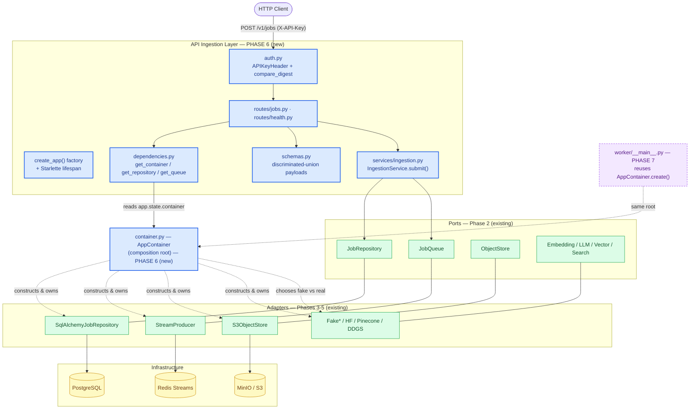
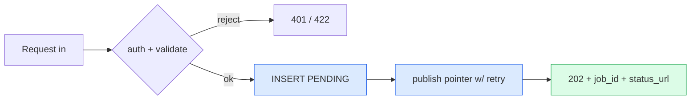
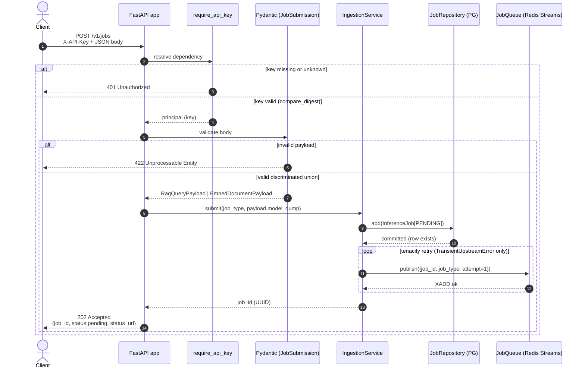
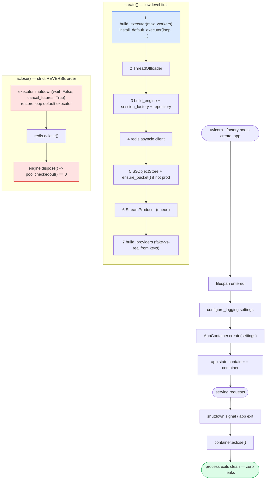
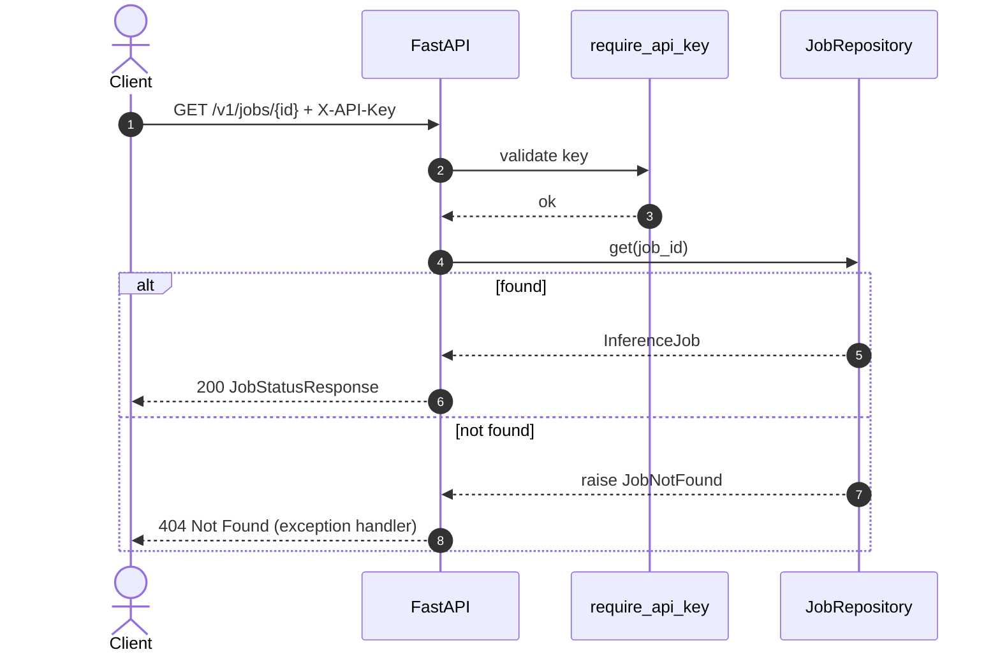
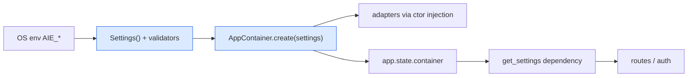
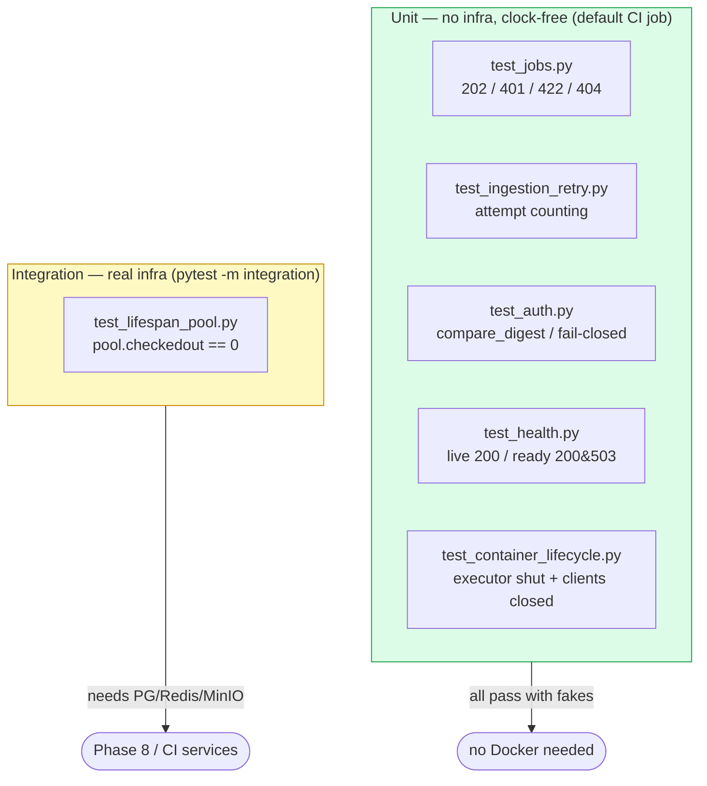

# Phase 6 — Composition Root & FastAPI Ingestion API

> **Part of:** [Asynchronous AI Serving Engine](../implementation-plan.md) · [Problem Statement](../problem-statement.md)
> **Status:** Planned (greenfield) · **Depends on:** [Phase 1](phase-1-scaffold-toolchain-domain.md), [Phase 2](phase-2-concurrency-retry-ports.md), [Phase 3](phase-3-persistence-sqlalchemy-alembic.md), [Phase 4](phase-4-object-store-providers.md), [Phase 5](phase-5-redis-streams-broker.md) · **Unlocks:** [Phase 7](phase-7-worker-pipelines.md), [Phase 8](phase-8-containerization-compose.md)
> **Delivers:** A single composition root (`AppContainer`) that wires every port to a fake-or-real adapter and tears them down in reverse; a `create_app()` FastAPI factory whose lifespan owns that container on `app.state`; an authenticated, validated, millisecond-fast `POST /v1/jobs` ingestion endpoint that persists a `PENDING` row and publishes a pointer to Redis; status and health endpoints; and the deterministic leak/auth/validation test suite.
> **Primary skills applied:** backend-architect, fastapi-pro, fastapi-router-py, python-fastapi-development, pydantic-models-py, auth-implementation-patterns, backend-security-coder, api-security-best-practices, openapi-spec-generation, docs-architect, mermaid-expert

---

## Table of Contents

1. [Overview & Objectives](#1-overview--objectives)
2. [Where This Fits](#2-where-this-fits)
3. [Prerequisites & Inputs](#3-prerequisites--inputs)
4. [Deliverables](#4-deliverables)
5. [Design Decisions & Rationale](#5-design-decisions--rationale)
6. [Detailed Implementation](#6-detailed-implementation)
7. [Flow & Sequence Diagrams](#7-flow--sequence-diagrams)
8. [Configuration & Environment](#8-configuration--environment)
9. [Testing Strategy](#9-testing-strategy)
10. [Verification & Exit-Criteria Mapping](#10-verification--exit-criteria-mapping)
11. [Windows & Cross-Platform Notes](#11-windows--cross-platform-notes)
12. [Common Pitfalls & Troubleshooting](#12-common-pitfalls--troubleshooting)
13. [Definition of Done](#13-definition-of-done)
14. [References & Further Reading](#14-references--further-reading)
15. [Navigation](#15-navigation)

---

## 1. Overview & Objectives

Phases 1–5 produced the *parts*: a domain model with a state machine, a `SyncOffloader` boundary, a `tenacity` retry policy, all seven `Protocol` ports, an async SQLAlchemy repository, an S3/MinIO object store, fake-and-real provider adapters, and a Redis Streams producer/consumer. Each part was built and unit-tested in isolation. **None of them are connected to each other yet, and nothing yet speaks HTTP.**

Phase 6 is where the system becomes a *running application* for the first time. It does two distinct jobs that together satisfy spec functional requirements **II (Framework-Agnostic Dependency Injection)** and **III, Phase 1 (Ingestion)**:

1. **The composition root.** A single `AppContainer` dataclass instantiates every concrete adapter, decides *fake-vs-real* per provider based on whether keys are configured, installs the sized `ThreadPoolExecutor` as the event loop's default executor, ensures the dev bucket exists, and exposes one `aclose()` that disposes everything in strict reverse order. This is the *only* place in the codebase where concrete classes are constructed. Both the API (this phase) and the worker ([Phase 7](phase-7-worker-pipelines.md)) consume the *same* `AppContainer.create()` — composition-root reuse is the architectural payoff of Ports & Adapters.

2. **The ingestion API.** A `create_app()` factory builds a FastAPI app whose **lifespan** owns the container on `app.state`. `POST /v1/jobs` authenticates an `X-API-Key`, validates a discriminated-union payload, inserts a `PENDING` `InferenceJob` via the repository, publishes a `{job_id, job_type, attempt}` pointer to the queue (wrapped in retry), and returns `202 Accepted` with a tracking ID and `status_url` — **within milliseconds, with zero pipeline work inline**. `GET /v1/jobs/{id}` returns current status; `GET /health` and `GET /health/ready` provide liveness and readiness.

### Concrete objectives

- [ ] **O1 — One composition root, no globals.** `AppContainer` is a `@dataclass` with `@classmethod async def create(cls, settings) -> AppContainer` and `async def aclose(self)`. No module-level singletons anywhere; the only shared state lives on `app.state.container` (API) or a local variable in `worker/__main__.py` ([Phase 7](phase-7-worker-pipelines.md)).
- [ ] **O2 — Reverse-order teardown, provably leak-free.** `aclose()` shuts the executor, closes Redis, and disposes the engine in the exact reverse of construction. A unit leak test asserts every stub client's `closed` flag flips and the executor is shut down; an integration variant asserts `engine.pool.checkedout() == 0` after lifespan exit (spec **Exit Criterion 3 — Zero Resource Leaking**).
- [ ] **O3 — Fake-vs-real chosen at the root.** The provider bundle (embedding / LLM / vector / search) and the object-store client are selected by inspecting configured keys/endpoints in `Settings`. Zero keys ⇒ all fakes ⇒ zero cloud, zero cost (spec **Exit Criterion 2 — Zero-Cloud Isolation**, in concert with the Phase-1 redirect validator).
- [ ] **O4 — `--factory`-compatible app.** `uvicorn app.api.app:create_app --factory` boots the app; `create_app()` is importable and side-effect-free until called.
- [ ] **O5 — Authenticated, validated, fast ingestion.** `POST /v1/jobs` enforces `X-API-Key` via `secrets.compare_digest`, validates the payload via a pydantic v2 discriminated union, and does **only** an INSERT + a publish before returning `202` (spec **III, Phase 1**).
- [ ] **O6 — Deterministic API tests.** httpx `ASGITransport` + `asgi-lifespan` `LifespanManager` + `app.dependency_overrides` exercise the `202` happy path, `401` (bad/missing key), and `422` (bad payload) — **no real network, no clocks, no sleeps**.

> [!IMPORTANT]
> The hard constraint of this phase — repeated because reviewers look for it — is that **the route must not do pipeline work**. The endpoint persists state and enqueues a pointer; the actual search/embed/LLM/vector work happens later in the [worker](phase-7-worker-pipelines.md). If a code reviewer sees an `await provider.embed(...)` inside a route handler, the ingestion contract is broken.

---

## 2. Where This Fits

Phase 6 lights up the **API Ingestion Layer** and threads the *composition root* through every layer below it. The diagram highlights the surfaces this phase creates (bold) against the parts delivered earlier.



**Looking back.** Phase 6 *consumes* everything below it through ports only. It never imports `asyncpg`, `redis`, `boto3`, or any provider SDK directly — those are reached exclusively through the adapters constructed inside `AppContainer.create()`. The repository's `add/get/update` ([Phase 3](phase-3-persistence-sqlalchemy-alembic.md)), the queue's `publish` ([Phase 5](phase-5-redis-streams-broker.md)), and the providers' methods ([Phase 4](phase-4-object-store-providers.md)) are the only surfaces the API touches.

**Looking forward.** The `AppContainer` built here is the literal object [Phase 7](phase-7-worker-pipelines.md)'s `worker/runner.py` will instantiate via the same `create()` classmethod — proving the composition root is genuinely framework-agnostic (one root, two entrypoints). [Phase 8](phase-8-containerization-compose.md) runs `create_app` under `uvicorn --factory` inside the `api` container and gates it on the `migrate` job. The leak guarantees proven here are what let Phase 8's `docker compose down` "leave nothing dangling."

> [!NOTE]
> **`core/` never imports FastAPI** is enforced structurally: `AppContainer` lives in `src/app/container.py` (not under `api/`) and imports only `app.core`, `app.adapters`, `app.ports`, and stdlib. FastAPI is imported only inside `src/app/api/**`. A `ruff` import-linter rule (configured in [Phase 1](phase-1-scaffold-toolchain-domain.md)) can enforce this boundary; see [§5](#5-design-decisions--rationale).

---

## 3. Prerequisites & Inputs

This phase assembles existing parts; it introduces almost no new low-level primitives. Everything below must already exist and be green.

| Input | Produced by | Used here as |
|-------|-------------|--------------|
| `Settings` (`AIE_` prefix, nested groups, `api_keys`, provider `SecretStr` fields, zero-cloud redirect validator) | [Phase 1](phase-1-scaffold-toolchain-domain.md) | The single argument to `AppContainer.create(settings)`; drives fake-vs-real and auth. |
| `InferenceJob`, `JobStatus`, `JobType` (`@dataclass(slots=True)` + state machine) | [Phase 1](phase-1-scaffold-toolchain-domain.md) | The entity the ingestion service inserts as `PENDING`. |
| `TransientUpstreamError` / `PermanentUpstreamError`, `InvalidTransition` | [Phase 1](phase-1-scaffold-toolchain-domain.md) | Mapped to HTTP responses; `TransientUpstreamError` is what publish-retry retries on. |
| `SyncOffloader` Protocol + `ThreadOffloader` | [Phase 2](phase-2-concurrency-retry-ports.md) | Injected into every adapter the container builds. |
| `retrying(settings) -> AsyncRetrying` | [Phase 2](phase-2-concurrency-retry-ports.md) | Wraps `queue.publish` inside `IngestionService.submit`. |
| All seven ports: `JobRepository`, `JobQueue`, `ObjectStore`, `EmbeddingProvider`, `LLMProvider`, `VectorStore`, `SearchProvider` | [Phase 2](phase-2-concurrency-retry-ports.md) | The container's field types; the API depends on these, never on adapters. |
| `RecordingOffloader`, fake providers, `FakeObjectStore` (test/dev) | [Phase 2](phase-2-concurrency-retry-ports.md) / [Phase 4](phase-4-object-store-providers.md) | Default bundle when no keys are set; building blocks of the all-fakes test container. |
| `create_async_engine` + `async_sessionmaker` + `SqlAlchemyJobRepository` | [Phase 3](phase-3-persistence-sqlalchemy-alembic.md) | The container builds the engine/session factory and binds the repository to a session. |
| `S3ObjectStore(client, bucket, offloader, retry)` + `ensure_bucket()` / `bucket_exists()` + `build_providers` + `ProviderBundle` | [Phase 4](phase-4-object-store-providers.md) | Object-store field (`ensure_bucket()` in dev, `bucket_exists()` for readiness); `build_providers(settings, offloader)` resolves the bundle. |
| `StreamProducer(redis, keys, settings.broker)` (`publish(job)`) + `BrokerKeys.from_settings` | [Phase 5](phase-5-redis-streams-broker.md) | The `queue` field; consumed by `IngestionService`. |

> [!TIP]
> If you are implementing phases in order, the cleanest signal that you are *ready* for Phase 6 is: `uv run poe check` is green through Phase 5, and you can construct each adapter by hand in a Python REPL given a `Settings()` instance. Phase 6 simply mechanizes that hand-construction and gives it a teardown.

> [!WARNING]
> Do **not** start Phase 6 until the Phase-5 `StreamProducer` constructor/`publish(job)` signature and the Phase-3 `SqlAlchemyJobRepository(session_factory)` constructor are final. The container imports both by name; churn there forces edits to `container.py`, `dependencies.py`, and every test fixture. Lock the port signatures first.

---

## 4. Deliverables

| File | Type | Purpose |
|------|------|---------|
| `src/app/container.py` | new | `AppContainer` dataclass; `create()` wiring + fake-vs-real selection + executor install + dev bucket; `aclose()` reverse teardown. |
| `src/app/services/ingestion.py` | new | `IngestionService.submit(payload)` — INSERT `PENDING` → retried `queue.publish` → return job id. No pipeline work. |
| `src/app/api/__init__.py` | new | Package marker (empty). |
| `src/app/api/app.py` | new | `create_app()` factory + Starlette `lifespan` that owns the container on `app.state`. |
| `src/app/api/dependencies.py` | new | `get_container(request)` (reads `request.app.state.container`) + typed sub-dependencies (`get_settings`, `get_repository`, `get_queue`, `get_ingestion_service`). |
| `src/app/api/auth.py` | new | `APIKeyHeader("X-API-Key")` dependency + `secrets.compare_digest` against `Settings.api_keys` → `401`. |
| `src/app/api/schemas.py` | new | Pydantic v2 request/response models: discriminated `JobPayload` union (`RagQueryPayload \| EmbedDocumentPayload`), `JobAccepted`, `JobStatusResponse`, `HealthStatus`, `ReadinessStatus`, `ErrorResponse`. |
| `src/app/api/routes/__init__.py` | new | Package marker (empty). |
| `src/app/api/routes/jobs.py` | new | `POST /v1/jobs` (202) + `GET /v1/jobs/{id}` (200/404). |
| `src/app/api/routes/health.py` | new | `GET /health` (liveness) + `GET /health/ready` (SELECT 1, Redis PING, head_bucket). |
| `tests/support/container.py` | changed/new | `build_fake_container(...)` helper assembling an all-fakes `AppContainer` for tests; stub clients exposing `closed` flags. |
| `tests/unit/test_container_lifecycle.py` | new | Wiring-order + reverse-teardown + leak assertions (no infra). |
| `tests/unit/api/test_jobs.py` | new | `202` happy path, `401`, `422` via `ASGITransport` + `dependency_overrides`. |
| `tests/unit/api/test_health.py` | new | Liveness always-200; readiness 200/503 via stubbed probes. |
| `tests/unit/api/test_auth.py` | new | `secrets.compare_digest` acceptance/rejection, missing-header → 401. |
| `tests/integration/test_lifespan_pool.py` | new (`integration` marker) | Real engine: after `LifespanManager` exit, `engine.pool.checkedout() == 0`. |

> [!NOTE]
> `tests/support/container.py` may already contain offloader/provider fakes from Phases 2/4. This phase *adds* a container-assembly helper and the `closed`-flag stub clients; it does not rewrite the existing fakes.

---

## 5. Design Decisions & Rationale

| Decision | Choice | Why | Rejected alternative |
|----------|--------|-----|----------------------|
| Composition root shape | Plain `@dataclass AppContainer` with `async create` / `aclose` | Trivially typed, no DI-framework magic, identical for API + worker; mypy sees every field | A DI library (`dependency-injector`, `punq`) — adds a dependency and indirection for a project whose whole point is explicit wiring |
| App construction | `create_app()` **factory** | `uvicorn --factory`, clean test isolation (fresh app per test), no import-time side effects | Module-level `app = FastAPI()` — boots on import, leaks state across tests, can't parametrize settings |
| Container ownership | `app.state.container` set in lifespan | Starlette's blessed request-scoped state; no module globals; reachable via `request.app.state` | A module-global `container` variable — exactly the "global singleton" the spec forbids |
| Startup/shutdown hook | `@asynccontextmanager` **lifespan** | Single function owns *both* startup and teardown symmetrically; `yield`-based; current FastAPI guidance (`@app.on_event` is deprecated) | `@app.on_event("startup"/"shutdown")` — deprecated, split across two functions, easy to desync |
| Fake-vs-real selection | Decided **inside** `create()` by inspecting `Settings` keys | One place to reason about "is this run cloud-touching?"; routes/services never branch | Branching in adapters or per-request — scatters the decision, breaks zero-cloud guarantee |
| Auth transport | `APIKeyHeader(name="X-API-Key", auto_error=False)` + manual `401` | `auto_error=False` lets us return **401** for *both* missing and wrong keys (default `auto_error=True` returns **403** on a missing header); constant-time compare | Custom middleware reading raw headers — loses OpenAPI security scheme + reuse via `Depends` |
| Key comparison | `secrets.compare_digest` | Constant-time; resists timing side-channels on the key | `==` — leaks key length/prefix via timing |
| Payload validation | Pydantic v2 **discriminated union** on `job_type` via `Field(discriminator=...)` | One request model, precise per-type errors, clean OpenAPI `oneOf`, fast dispatch | A single flat model with optional fields — ambiguous, weak validation, ugly schema |
| Enqueue durability | `queue.publish` wrapped in `retrying(settings)` inside the service | A transient Redis blip on publish shouldn't 500 the client; retry is bounded and clock-free in tests | No retry — flaky 5xx under load; or retry in the route — mixes transport with orchestration |
| Source of truth | PostgreSQL row written **before** publish | Row exists even if publish ultimately fails; status endpoint can report `PENDING`; matches "messages are pointers" | Publish first — a crash between publish and insert orphans a queue pointer with no row |
| Health split | `/health` (process up) vs `/health/ready` (deps reachable) | K8s/compose distinguish liveness from readiness; readiness can fail without killing the pod | Single `/health` doing dependency checks — a slow DB makes the liveness probe kill a healthy process |

### 5.1 Why the route is *thin* (the ingestion contract)

Spec **III, Phase 1** is explicit: *"returns a `202 Accepted` status with an execution ID within milliseconds."* The only work on the request path is:

1. Validate + authenticate (CPU-bound, microseconds).
2. One `INSERT` (single round-trip to PG).
3. One `XADD` of a tiny pointer (single round-trip to Redis), wrapped in bounded retry.

No embedding, no LLM call, no vector query — those are *seconds* of latency and belong to the worker. The discipline is encoded in `IngestionService.submit`: it takes a *validated payload* and touches *only* the repository and the queue. There is no provider in its constructor, which makes "doing pipeline work inline" structurally impossible.



> [!CAUTION]
> A subtle ordering bug: if you `publish` *before* the `INSERT` commits, a worker can `XREADGROUP` the pointer and `SELECT` the row **before it exists**, treating it as "missing" and DLQ-ing a valid job. Always **commit the row, then publish**. The service enforces this ordering and the worker's idempotency guard ([Phase 5](phase-5-redis-streams-broker.md)) is the backstop, not the primary mechanism.

### 5.2 Why teardown is strictly reverse-order

Resources have dependencies: the executor backs `to_thread` calls that adapters may still be running; Redis connections may be mid-flight; the engine's pool holds sockets. Closing in *construction* order risks closing a dependency out from under an in-flight user. Reverse order — **executor → redis → engine** — drains the highest-level consumer first. `aclose()` is also written to be *idempotent and best-effort*: each teardown step is guarded so one failure doesn't strand the rest (a leaked socket is worse than a logged warning).

> [!IMPORTANT]
> `loop.set_default_executor()` changes a **loop-global**. The container records the fact that *it* installed one (`_installed_executor`). It does **not** try to reset the loop default on teardown — asyncio has no public way to clear it (`set_default_executor(None)` raises `TypeError` on 3.11+), and a failed reset must never strand the redis/engine steps. This is safe to create/destroy repeatedly inside one test session because the next `create()`'s `install_default_executor()` overwrites the default; the unit leak test drives the `_installed_executor=True` path to prove teardown completes regardless.

### 5.3 Boundary enforcement: `core/` and `container.py` never import FastAPI

`AppContainer` is deliberately in `src/app/container.py`, *outside* `api/`. It imports `app.core`, `app.adapters.*`, `app.ports.*`, and stdlib only. This is what lets [Phase 7](phase-7-worker-pipelines.md)'s worker `import` the same container without dragging in Starlette. An import-linter contract (run under `ruff`/`mypy` in CI, [Phase 9](phase-9-ci-readme-polish.md)) can assert: *no module under `app.core` or `app.container` may import `fastapi` or `starlette`.*

---

## 6. Detailed Implementation

Files are presented in dependency order: schemas → container → service → auth → dependencies → app factory → routes. Each block is complete and runnable given the prior phases.

### 6.1 `src/app/api/schemas.py`

**Purpose & responsibilities.** Define the API's wire contract: the discriminated-union request payload, the `202` acceptance body, the status response, health/readiness bodies, and a uniform error envelope. These pydantic v2 models are the *only* place request shapes are defined; routes annotate against them and FastAPI derives OpenAPI from them automatically.

```python
# src/app/api/schemas.py
"""Pydantic v2 wire models for the ingestion API.

These models define the *external contract*. They are intentionally separate
from the domain entity (`app.domain.models.InferenceJob`): the domain is a
slotted dataclass with a state machine; these are validation/serialization
models. The translation between the two happens in the route/service layer.
"""
from __future__ import annotations

import uuid
from datetime import datetime
from typing import Annotated, Literal, Union

from pydantic import BaseModel, ConfigDict, Field

from app.domain.models import JobStatus, JobType


# --------------------------------------------------------------------------- #
# Request payloads — a discriminated union keyed on `job_type`.
# Each member carries a Literal[...] tag equal to the corresponding JobType
# value, so pydantic dispatches in O(1) and emits a precise per-member error.
# --------------------------------------------------------------------------- #
class _PayloadBase(BaseModel):
    # forbid unknown keys so typos like "quer" become 422s, not silent drops.
    model_config = ConfigDict(extra="forbid")


class RagQueryPayload(_PayloadBase):
    """Submit a retrieval-augmented-generation query."""

    job_type: Literal[JobType.RAG_QUERY] = JobType.RAG_QUERY
    query: str = Field(min_length=1, max_length=4_000)
    top_k: int = Field(default=5, ge=1, le=50)


class EmbedDocumentPayload(_PayloadBase):
    """Submit a document to be chunked, embedded, and upserted."""

    job_type: Literal[JobType.EMBED_DOCUMENT] = JobType.EMBED_DOCUMENT
    document_id: str = Field(min_length=1, max_length=256)
    text: str = Field(min_length=1, max_length=200_000)


# The discriminated union. `discriminator="job_type"` tells pydantic to read
# the `job_type` tag first and validate against exactly one member.
JobPayload = Annotated[
    Union[RagQueryPayload, EmbedDocumentPayload],
    Field(discriminator="job_type"),
]


class JobSubmission(BaseModel):
    """Top-level request body for POST /v1/jobs.

    Wrapping the union in a field (rather than using a bare-union body) gives a
    stable JSON shape `{"payload": {...}}` and a clean place to add request-level
    metadata later (e.g. an idempotency key) without breaking the contract.
    """

    model_config = ConfigDict(extra="forbid")
    payload: JobPayload


# --------------------------------------------------------------------------- #
# Responses
# --------------------------------------------------------------------------- #
class JobAccepted(BaseModel):
    """202 body: the client polls `status_url` for terminal state."""

    job_id: uuid.UUID
    status: JobStatus  # always PENDING at acceptance time
    status_url: str = Field(
        description="Relative URL to poll for status, e.g. /v1/jobs/{id}.",
    )


class JobStatusResponse(BaseModel):
    """200 body for GET /v1/jobs/{id}: the full audit view of one job."""

    # `from_attributes` lets us validate straight off the domain dataclass.
    model_config = ConfigDict(from_attributes=True)

    job_id: uuid.UUID = Field(validation_alias="id")
    job_type: JobType
    status: JobStatus
    attempts: int
    result_ref: str | None = Field(
        default=None,
        description="s3://… pointer to the result artifact once SUCCESS.",
    )
    error: str | None = None
    created_at: datetime
    updated_at: datetime
    duration_ms: int | None = None


class HealthStatus(BaseModel):
    """200 body for GET /health (liveness)."""

    status: Literal["ok"] = "ok"


class _ProbeResult(BaseModel):
    name: str
    ok: bool
    detail: str | None = None


class ReadinessStatus(BaseModel):
    """Body for GET /health/ready; HTTP code conveys overall readiness."""

    status: Literal["ready", "not_ready"]
    checks: list[_ProbeResult]


class ErrorResponse(BaseModel):
    """Uniform error envelope used by custom exception handlers."""

    detail: str
```

**Walkthrough of the non-obvious parts.**

- `job_type: Literal[JobType.RAG_QUERY]` uses the *enum member* as the literal value. Because `JobType` is a `StrEnum` ([Phase 1](phase-1-scaffold-toolchain-domain.md)), the wire value is the plain string `"rag_query"`, and the discriminator matches on it. This keeps one source of truth for the type tags.
- `extra="forbid"` turns unexpected fields into `422` errors. For an ingestion API this is correct: a misspelled field is a client bug, and silently ignoring it produces a "successful" job that does the wrong thing.
- `JobStatusResponse` uses `from_attributes=True` and `validation_alias="id"` so we can do `JobStatusResponse.model_validate(job)` directly off the `InferenceJob` dataclass (whose primary key field is `id`, surfaced to clients as `job_id`).
- `JobSubmission` wraps the union in a `payload` field. A *bare* union body is legal, but wrapping leaves room for top-level metadata and yields a self-describing `{"payload": …}` JSON shape.

> [!TIP]
> Validating the discriminated union outside a request is one line for tests:
> ```python
> from pydantic import TypeAdapter
> from app.api.schemas import JobPayload
> p = TypeAdapter(JobPayload).validate_python({"job_type": "rag_query", "query": "hi"})
> ```
> `TypeAdapter` is the pydantic v2 way to validate a bare annotated union without a parent model.

> [!WARNING]
> Don't reuse these pydantic models *as* the domain entity. The domain `InferenceJob` is a `@dataclass(slots=True)` with a state machine and **no pydantic** (locked decision, [Phase 1](phase-1-scaffold-toolchain-domain.md)). Mixing the two reintroduces framework coupling into the domain. Translate at the edges.

---

### 6.2 `src/app/container.py`

**Purpose & responsibilities.** The composition root. It is the single place that (a) constructs every concrete adapter, (b) decides fake-vs-real per provider from `Settings`, (c) installs the sized `ThreadPoolExecutor` as the loop default executor, (d) ensures the dev bucket exists, and (e) tears everything down in reverse via `aclose()`.

```python
# src/app/container.py
"""AppContainer — the one composition root, shared by API and worker.

NOTHING here imports FastAPI/Starlette. The API holds an instance on
`app.state.container`; the worker (Phase 7) constructs one in `__main__`.
"""
from __future__ import annotations

import asyncio
import logging
from concurrent.futures import ThreadPoolExecutor
from dataclasses import dataclass, field
from typing import TYPE_CHECKING

import boto3
import redis.asyncio as aioredis
from botocore.config import Config
from sqlalchemy.ext.asyncio import AsyncEngine, AsyncSession, async_sessionmaker

from app.adapters.broker.keys import BrokerKeys
from app.adapters.broker.producer import StreamProducer
from app.adapters.object_store.s3 import S3ObjectStore
from app.adapters.persistence.engine import (
    build_engine,
    build_session_factory,
    dispose as dispose_engine,
)
from app.adapters.persistence.repository import SqlAlchemyJobRepository
from app.adapters.providers.bundle import ProviderBundle, build_providers
from app.core.concurrency import (
    ThreadOffloader,
    build_executor,
    install_default_executor,
)
from app.core.config import ObjectStoreSettings, Settings
from app.ports.object_store import ObjectStore
from app.ports.offloader import SyncOffloader
from app.ports.queue import JobQueue
from app.ports.repository import JobRepository

if TYPE_CHECKING:
    from mypy_boto3_s3.client import S3Client

logger = logging.getLogger(__name__)


@dataclass(slots=True)
class AppContainer:
    """Owns every long-lived resource for one process (API or worker).

    Construct via `await AppContainer.create(settings)`; destroy via
    `await container.aclose()`. Fields are concrete *adapters* typed as ports,
    so consumers depend only on the Protocols.
    """

    settings: Settings
    engine: AsyncEngine
    session_factory: async_sessionmaker[AsyncSession]
    repository: JobRepository
    redis: aioredis.Redis
    offloader: SyncOffloader
    executor: ThreadPoolExecutor
    object_store: ObjectStore
    queue: JobQueue
    providers: ProviderBundle
    # Bookkeeping: whether create() installed our executor as the loop default.
    _installed_executor: bool = field(default=False, repr=False)

    # ------------------------------------------------------------------ #
    # Construction
    # ------------------------------------------------------------------ #
    @classmethod
    async def create(cls, settings: Settings) -> "AppContainer":
        """Wire all resources. Order matters; aclose() reverses it.

        Wiring order (low-level first):
          1. executor  -> install as loop default (powers asyncio.to_thread)
          2. offloader -> ThreadOffloader dispatches into that executor
          3. engine + session_factory (SQLAlchemy async)
          4. redis client
          5. object_store (S3/MinIO) via offloader+retry; ensure_bucket() in dev
          6. queue (Redis Streams producer)
          7. providers (fake vs real, chosen from Settings)
        """
        # 1) Sized thread pool -> install as the loop's default executor so that
        #    every bare `asyncio.to_thread(...)` lands in *this* bounded pool.
        loop = asyncio.get_running_loop()
        executor = build_executor(settings.offload_max_workers)  # Phase 2 helper
        install_default_executor(loop, executor)
        installed_executor = True

        # 2) Offloader port. ThreadOffloader is a thin `to_thread` passthrough
        #    (Phase 2); the default-executor install above bounds it.
        offloader: SyncOffloader = ThreadOffloader()

        # 3) Async SQLAlchemy engine + session factory + repository.
        #    Phase 3 builders own the (fixed) pool tuning; the repository is
        #    session-per-operation, so ONE instance is shared process-wide.
        engine = build_engine(settings)
        session_factory = build_session_factory(engine)
        repository: JobRepository = SqlAlchemyJobRepository(session_factory)

        # 4) Redis client (decode_responses=False: we control encoding).
        redis = aioredis.Redis.from_url(
            settings.redis_url,
            encoding="utf-8",
            decode_responses=False,
        )

        # 5) Object store. Build the boto3 client, wrap it in the offloader+retry
        #    adapter; create the bucket in non-prod so demos "just work".
        s3_client = _build_s3_client(settings.object_store)
        object_store: ObjectStore = S3ObjectStore(
            s3_client, settings.object_store.bucket, offloader, settings.retry
        )
        if not settings.is_prod:
            await object_store.ensure_bucket()  # dev/test convenience only

        # 6) Queue producer (Redis Streams). Pointers only; PG is source of truth.
        keys = BrokerKeys.from_settings(settings.broker)
        queue: JobQueue = StreamProducer(redis, keys, settings.broker)

        # 7) Providers: fake-vs-real decided HERE, once (Phase 4's build_providers;
        #    HF/Pinecone SDK clients are constructed lazily inside it).
        providers = build_providers(settings, offloader)

        container = cls(
            settings=settings,
            engine=engine,
            session_factory=session_factory,
            repository=repository,
            redis=redis,
            offloader=offloader,
            executor=executor,
            object_store=object_store,
            queue=queue,
            providers=providers,
            _installed_executor=installed_executor,
        )
        logger.info(
            "AppContainer created",
            extra={
                "environment": settings.env,
                "providers_real": cls._provider_modes(settings),
            },
        )
        return container

    # ------------------------------------------------------------------ #
    # Fake-vs-real provider selection (the actual wiring lives in Phase 4's
    # build_providers; this is only a diagnostic summary for logging/tests).
    # ------------------------------------------------------------------ #
    @staticmethod
    def _provider_modes(settings: Settings) -> dict[str, str]:
        """Diagnostic: which providers are 'real' vs 'fake' for this run."""
        hf = "real" if settings.huggingface_token else "fake"
        pc = "real" if settings.pinecone_api_key else "fake"
        return {
            "embedding": hf,
            "llm": hf,
            "vector": pc,
            # ddgs needs no key; default to fake unless explicitly enabled.
            "search": "real" if settings.providers.enable_web_search else "fake",
        }

    # ------------------------------------------------------------------ #
    # Teardown — strict REVERSE order, best-effort, idempotent.
    # ------------------------------------------------------------------ #
    async def aclose(self) -> None:
        """Release every resource in reverse construction order.

        Providers/queue/object_store hold no OS resources of their own beyond
        the shared redis client + executor, so the teardown set is:
            executor (shutdown, no-wait) -> redis (close) -> engine (dispose).
        Each step is guarded so one failure cannot strand the others.
        """
        # 1) Executor first: stop accepting new offloaded work. cancel_futures
        #    drops queued-but-not-started tasks; in-flight threads finish.
        try:
            self.executor.shutdown(wait=False, cancel_futures=True)
        except Exception:  # pragma: no cover - defensive
            logger.exception("executor shutdown failed")
        finally:
            # We installed this executor as the loop's default in create().
            # asyncio offers NO public way to *clear* a default executor:
            # set_default_executor(None) raises TypeError on 3.11+ (and Phase 2
            # forbids that call). We do NOT attempt it — aclose() is terminal in
            # the API/worker (the loop closes next), and a re-created container's
            # install_default_executor() overwrites the default. Clearing the
            # flag keeps aclose() idempotent and lets the redis + engine steps
            # below ALWAYS run (a failed reset must never strand teardown).
            self._installed_executor = False

        # 2) Redis connection pool.
        try:
            await self.redis.aclose()  # redis>=5 async client close
        except Exception:
            logger.exception("redis close failed")

        # 3) Database engine: returns + closes all pooled connections.
        try:
            await self.engine.dispose()
        except Exception:
            logger.exception("engine dispose failed")

        logger.info("AppContainer closed")


def _build_s3_client(s: ObjectStoreSettings) -> "S3Client":
    """Construct the boto3 S3 client the object-store adapter wraps.

    Path-style addressing for MinIO; boto3's own retries disabled because
    tenacity owns retries at the adapter boundary (Phase 4). The endpoint is
    already forced to MinIO in non-prod by the Phase-1 redirect validator.
    """
    return boto3.client(
        "s3",
        endpoint_url=s.endpoint_url,
        aws_access_key_id=s.access_key_id.get_secret_value() if s.access_key_id else None,
        aws_secret_access_key=(
            s.secret_access_key.get_secret_value() if s.secret_access_key else None
        ),
        region_name=s.region,
        config=Config(
            signature_version="s3v4",
            s3={"addressing_style": "path" if s.force_path_style else "auto"},
            retries={"max_attempts": 0},  # WE own retries (tenacity); disable boto3's
        ),
    )
```

**Walkthrough of the non-obvious parts.**

- **Executor install (step 1).** `loop.set_default_executor(executor)` is the single line that satisfies the spec's *"optimized thread pool executor"* requirement. Because `asyncio.to_thread` dispatches to the loop's default executor, *every* offloaded sync SDK call across every adapter lands in this one *bounded* pool — without any adapter needing a reference to it. The pool size comes from `Settings.offload_max_workers` (default 32, [Phase 1](phase-1-scaffold-toolchain-domain.md)).
- **`ThreadOffloader()` (step 2)** is the literal `asyncio.to_thread` passthrough from [Phase 2](phase-2-concurrency-retry-ports.md). It does *not* hold the executor; it relies on the default-executor install above. This is why the offloader is stateless and trivially swappable for the `RecordingOffloader` in tests.
- **`pool_pre_ping=True` (step 3)** issues a cheap liveness check before handing out a pooled connection, so a connection severed by an idle-timeout (common with PgBouncer/cloud PG) is transparently recycled instead of raising on first use.
- **Deferred SDK imports (in Phase 4's `build_providers`).** The `from huggingface_hub import …` / `from pinecone import …` live *inside* the `if`-branches of `build_providers` (Phase 4 `bundle.py`). A fakes-only run (the default) never imports `huggingface_hub` or `pinecone`, keeping cold start fast and CI hermetic — zero accidental network at import time. The container simply calls `build_providers(settings, offloader)`.
- **`ensure_bucket()` only when `not settings.is_prod`.** Auto-creating buckets in production is a footgun (it can mask a misconfigured bucket name). In dev/test it's pure convenience so the demo works on a fresh MinIO.
- **`aclose()` ordering & guarding.** Reverse order (executor → redis → engine). Each step is wrapped so a failure is *logged* and the next step still runs — a single stuck Redis socket must not prevent `engine.dispose()`. `cancel_futures=True` discards queued offload tasks that never started; threads already running are allowed to finish (Python doesn't force-kill threads).
- **No `set_default_executor(None)` reset.** asyncio has no public way to *clear* a loop's default executor: `set_default_executor(None)` raises `TypeError` on Python 3.11+ (it demands a `ThreadPoolExecutor`), and a naïve `except RuntimeError` would let that `TypeError` escape the `finally` and **skip the redis/engine teardown — leaking both**. So `aclose()` does not attempt the reset. This is safe because `aclose()` is terminal in the API/worker (the loop is closed next), and a re-created container's `install_default_executor()` overwrites the default. We only clear the `_installed_executor` flag (idempotency). The unit leak test exercises the `_installed_executor=True` path to prove teardown still completes.

> [!IMPORTANT]
> `ThreadPoolExecutor.shutdown(cancel_futures=...)` requires **Python 3.9+**; the project targets 3.12+, so it's safe. The `wait=False` is deliberate: `aclose()` runs on the event loop and must not *block the loop thread* waiting on worker threads. Queued tasks are cancelled; in-flight tasks drain in the background and the GC reclaims the pool once they finish.

> [!WARNING]
> Do **not** call `loop.set_default_executor()` at *import time* or in a module global — there may be no running loop yet, and you'd be mutating loop-global state as a side effect of `import`. It belongs inside `create()`, which is always called from within a running loop (the lifespan, or `asyncio.run` in the worker).

> [!NOTE]
> The S3 boto3 client is built by `_build_s3_client` (above) from `ObjectStoreSettings`; the provider SDK clients (HuggingFace `InferenceClient`, Pinecone `Index`) are built *inside* Phase 4's `build_providers`. The container constructs no SDK client beyond S3 — it delegates provider selection to `build_providers` and engine construction to Phase 3's `build_engine`.

---

### 6.3 `src/app/services/ingestion.py`

**Purpose & responsibilities.** Orchestrate ingestion: turn a *validated* payload into a persisted `PENDING` job and a published pointer, returning the new job id. It depends on exactly two ports — `JobRepository` and `JobQueue` — and on the retry policy. It contains **no provider** and therefore can do no pipeline work.

```python
# src/app/services/ingestion.py
"""IngestionService — the thin write-path behind POST /v1/jobs.

Contract: persist a PENDING InferenceJob, then publish a {job_id, job_type,
attempt} pointer (with bounded retry). Returns the new job id. Touches ONLY the
repository and the queue — no providers, so no pipeline work can leak in.
"""
from __future__ import annotations

import logging
import uuid

from app.core.retry import retrying
from app.core.config import RetrySettings
from app.domain.models import InferenceJob, JobStatus, JobType
from app.ports.queue import JobQueue
from app.ports.repository import JobRepository

logger = logging.getLogger(__name__)


class IngestionService:
    """Stateless orchestrator; one instance per request (cheap to build)."""

    def __init__(
        self,
        repository: JobRepository,
        queue: JobQueue,
        retry_settings: RetrySettings,
    ) -> None:
        self._repository = repository
        self._queue = queue
        self._retry = retry_settings

    async def submit(self, job_type: JobType, payload: dict[str, object]) -> uuid.UUID:
        """Insert PENDING -> publish pointer (retried) -> return id.

        Args:
            job_type: discriminator already validated by the schema layer.
            payload: the model-dumped payload dict (stored verbatim as JSONB).

        Returns:
            The new job's UUID, surfaced to the client as `job_id`.
        """
        job = InferenceJob.new(job_type=job_type, payload=payload)
        # 1) Persist FIRST so the row exists before any worker can read it.
        await self._repository.add(job)

        # 2) Publish a pointer, NOT the payload. PG is the source of truth.
        #    Wrap in retry: a transient Redis blip must not 500 the client.
        async for attempt in retrying(self._retry):
            with attempt:
                await self._queue.publish(job)

        logger.info(
            "job accepted",
            extra={"job_id": str(job.id), "job_type": job.job_type},
        )
        return job.id
```

**Walkthrough of the non-obvious parts.**

- **`InferenceJob.new(...)`** is the domain factory ([Phase 1](phase-1-scaffold-toolchain-domain.md)) that mints a fresh UUID, sets `status=PENDING`, `attempts=0`, and timestamps. The service never sets internal fields by hand — it goes through the entity's API so the invariants hold.
- **Persist before publish.** `repository.add(job)` commits (or flushes-then-commits inside the repository's `async with session.begin()` — [Phase 3](phase-3-persistence-sqlalchemy-alembic.md)) *before* the publish. This guarantees the row exists when a worker dereferences the pointer (see [§5.1 caution](#51-why-the-route-is-thin-the-ingestion-contract)).
- **Pointer payload.** `publish(job)` hands the queue the entity; the producer extracts only the pointer fields (`job.id`, `job.job_type`, `attempt=1`) — never the user's `text`/`query`. The worker re-reads the row from PG. This keeps stream entries tiny and PG authoritative ([Phase 5](phase-5-redis-streams-broker.md)).
- **`retrying(self._retry)` loop.** `retrying` returns a `tenacity.AsyncRetrying` ([Phase 2](phase-2-concurrency-retry-ports.md)) configured to retry only on `TransientUpstreamError`, with `wait_exponential_jitter` and `stop_after_attempt`. In tests, `RetrySettings(base_delay_s=0, max_attempts=N)` makes this loop **count attempts with zero wall-clock delay** — no `time.sleep`, no flakiness. The `with attempt:` block is tenacity's per-attempt context.

> [!TIP]
> Because `submit` takes a plain `payload: dict`, the route is responsible for `payload_model.model_dump(mode="json")`. Passing a JSON-mode dump (not the pydantic object) means the repository stores exactly what will round-trip through JSONB, and the service stays free of pydantic — keeping the service-layer testable with hand-built dicts.

> [!WARNING]
> Resist the temptation to "optimize" by publishing inside the same DB transaction via an outbox in this phase — that's a larger pattern. For this project, *commit-then-publish* with the worker's idempotency guard as backstop is the locked design. Adding an outbox here would balloon scope and contradict [Phase 5](phase-5-redis-streams-broker.md).

---

### 6.4 `src/app/api/auth.py`

**Purpose & responsibilities.** Provide an `X-API-Key` dependency that validates the presented key against `Settings.api_keys` using a constant-time comparison and raises `401` on any failure (missing *or* wrong). Exposes the key/identity for downstream handlers and registers an OpenAPI security scheme.

```python
# src/app/api/auth.py
"""API-key authentication for the ingestion API.

`APIKeyHeader(..., auto_error=False)` is deliberate: with the default
auto_error=True, a *missing* header yields 403, while a *present-but-wrong* key
would 401 in our manual check — two codes for one failure class. We want a
single, uniform 401 for both, and we want the comparison to be constant-time.
"""
from __future__ import annotations

import secrets
from typing import Annotated

from fastapi import Depends, HTTPException, status
from fastapi.security import APIKeyHeader

from app.api.dependencies import SettingsDep

_API_KEY_HEADER = "X-API-Key"

# auto_error=False -> dependency yields `None` when the header is absent, so we
# control the 401 (and its message) ourselves below.
api_key_scheme = APIKeyHeader(name=_API_KEY_HEADER, auto_error=False)

_UNAUTHORIZED = HTTPException(
    status_code=status.HTTP_401_UNAUTHORIZED,
    detail="Invalid or missing API key.",
    headers={"WWW-Authenticate": _API_KEY_HEADER},
)


def _is_known_key(presented: str, configured: frozenset[str]) -> bool:
    """Constant-time membership test.

    `secrets.compare_digest` is constant-time *per comparison*. We OR across all
    configured keys; the boolean accumulation stays branch-free w.r.t. the key
    bytes, so we don't leak which prefix matched. (The set size is tiny and not
    secret, so iterating it is fine.)
    """
    ok = False
    for candidate in configured:
        # bitwise-or avoids short-circuit so every candidate is compared.
        ok |= secrets.compare_digest(presented, candidate)
    return ok


async def require_api_key(
    settings: SettingsDep,
    presented: Annotated[str | None, Depends(api_key_scheme)],
) -> str:
    """FastAPI dependency: returns the validated key or raises 401.

    The returned value is the authenticated principal for this request; routes
    that need the caller's identity can `Depends(require_api_key)`.
    """
    configured = settings.api_keys  # frozenset[str], from Settings (Phase 1)
    if not configured:
        # Misconfiguration: no keys set. Fail closed, never open.
        raise _UNAUTHORIZED
    if presented is None or not _is_known_key(presented, configured):
        raise _UNAUTHORIZED
    return presented


ApiKeyDep = Annotated[str, Depends(require_api_key)]
```

**Walkthrough of the non-obvious parts.**

- **`auto_error=False`.** FastAPI's `APIKeyHeader` with the default `auto_error=True` raises **403** when the header is *missing*. The spec wants **401** for *both* missing and wrong keys. Setting `auto_error=False` makes the dependency yield `None` on a missing header, and we raise our own uniform `401` — including a `WWW-Authenticate` hint.
- **`secrets.compare_digest`.** Constant-time comparison defeats timing attacks that could otherwise recover a valid key byte-by-byte. The `ok |= …` accumulation (instead of `if compare_digest(...): return True`) avoids leaking *which* configured key matched via early return timing — defense-in-depth even though the configured set itself isn't secret.
- **Fail-closed on empty `api_keys`.** If someone deploys with no keys configured, we reject *all* requests rather than accepting everything. Failing open here would be a critical auth bypass.
- **`ApiKeyDep` alias.** The `Annotated[str, Depends(require_api_key)]` alias lets routes write `_: ApiKeyDep` to *require* auth without naming the dependency inline — clean and reusable. The leading underscore convention signals "presence enforced, value unused."

> [!CAUTION]
> Never log the presented or configured API keys, even at `DEBUG`. The structured logger ([Phase 1](phase-1-scaffold-toolchain-domain.md)) should treat `X-API-Key` as a redacted header. Logging a rejected key "for debugging" is how secrets end up in log aggregators.

> [!NOTE]
> `Settings.api_keys` is a `frozenset[str]` (parsed from a comma-separated `AIE_API_KEYS` env var in [Phase 1](phase-1-scaffold-toolchain-domain.md)). A frozenset gives O(1) membership *conceptually*, but we intentionally iterate-and-`compare_digest` rather than use `in`, because Python's `in` on a set uses hashing/`==` (not constant-time). Correctness of the *security property* beats the micro-optimization for a handful of keys.

---

### 6.5 `src/app/api/dependencies.py`

**Purpose & responsibilities.** Bridge FastAPI's DI system to the `AppContainer` on `app.state`, with **no module globals**. Provides `get_container` plus typed sub-dependencies that hand routes exactly the port they need. Includes the request-scoped repository (bound to a fresh session per request).

```python
# src/app/api/dependencies.py
"""FastAPI dependency providers — the only bridge from Starlette to the root.

Every provider reaches the container via `request.app.state.container`. There
are NO module-level container/engine/redis globals; that is the spec's
"reject global module singletons" requirement, enforced structurally.
"""
from __future__ import annotations

from typing import Annotated

from fastapi import Depends, Request

from app.container import AppContainer
from app.core.config import Settings
from app.ports.object_store import ObjectStore
from app.ports.queue import JobQueue
from app.ports.repository import JobRepository
from app.services.ingestion import IngestionService


def get_container(request: Request) -> AppContainer:
    """Return the process-wide container stored by the lifespan on startup.

    Reads `request.app.state.container`. No globals; the app instance carries
    the state, so test apps get their own container without monkeypatching.
    """
    container: AppContainer = request.app.state.container
    return container


ContainerDep = Annotated[AppContainer, Depends(get_container)]


def get_settings(container: ContainerDep) -> Settings:
    return container.settings


SettingsDep = Annotated[Settings, Depends(get_settings)]


def get_queue(container: ContainerDep) -> JobQueue:
    return container.queue


QueueDep = Annotated[JobQueue, Depends(get_queue)]


def get_object_store(container: ContainerDep) -> ObjectStore:
    return container.object_store


ObjectStoreDep = Annotated[ObjectStore, Depends(get_object_store)]


def get_repository(container: ContainerDep) -> JobRepository:
    """Return the process-wide repository (session-per-operation, Phase 3).

    The repository holds the session *factory* and opens/closes a short-lived
    session inside each add/get/update call, so there is no request-scoped
    session to manage and the pool returns to zero after each operation.
    """
    return container.repository


RepositoryDep = Annotated[JobRepository, Depends(get_repository)]


def get_ingestion_service(
    repository: RepositoryDep,
    queue: QueueDep,
    settings: SettingsDep,
) -> IngestionService:
    """Assemble the write-path service from request-scoped ports."""
    return IngestionService(
        repository=repository, queue=queue, retry_settings=settings.retry
    )


IngestionServiceDep = Annotated[IngestionService, Depends(get_ingestion_service)]
```

**Walkthrough of the non-obvious parts.**

- **`get_container(request)`** is the *entire* coupling between Starlette and the application. It reads `request.app.state.container`. Because `request.app` is the live app instance, a **test app** (built by `create_app()` with overrides) gets its *own* container — no monkeypatching of module globals needed.
- **Process-wide repository (session-per-operation).** `get_repository` returns the single `container.repository` — Phase 3's `SqlAlchemyJobRepository`, constructed with the session *factory*. Each `add`/`get`/`update` opens its own short-lived `async with session_factory()` internally and returns the connection to the pool when it finishes — **this is the mechanism behind `pool.checkedout() == 0`** between operations. No request-scoped session is threaded through dependencies.
- **`Annotated[...]` aliases.** Each `XDep` alias is the FastAPI 0.100+ idiom: routes write `repo: RepositoryDep` instead of `repo: JobRepository = Depends(get_repository)`. Cleaner signatures, and the dependency is reusable and overridable by key in tests.
- **Sub-dependencies chain off the container.** `get_settings`, `get_queue`, `get_object_store` all take `ContainerDep`, so overriding `get_container` in a test (or letting the lifespan set it) transparently swaps everything downstream.

> [!IMPORTANT]
> In tests we override the *leaf* dependencies (`get_repository`, `get_queue`, etc.) **or** set `app.state.container` to an all-fakes container — usually the latter, because it exercises the real `get_container → get_session → get_repository` wiring while keeping the I/O fake. Both approaches are shown in [§9](#9-testing-strategy).

> [!NOTE]
> The engine and its pool are process-wide (owned by the container). Sessions are the cheap, short-lived unit the repository checks out of that pool *per operation* and returns immediately — no session outlives a single `add`/`get`/`update`. The readiness probe ([§6.8](#68-srcappapirouteshealthpy)) opens its own one-off `session_factory()` for `SELECT 1`.

---

### 6.6 `src/app/api/app.py`

**Purpose & responsibilities.** The application factory and its lifespan. `create_app()` builds a `FastAPI` instance, attaches the lifespan that creates/owns/destroys the `AppContainer`, registers routers, exception handlers, and (optionally) accepts a pre-built container for tests.

```python
# src/app/api/app.py
"""FastAPI application factory + lifespan-owned composition root.

Boot in production with:  uvicorn app.api.app:create_app --factory
`create_app()` has no import-time side effects; all resource acquisition happens
inside the lifespan, on startup, within the running event loop.
"""
from __future__ import annotations

import logging
from collections.abc import AsyncIterator
from contextlib import asynccontextmanager

from fastapi import FastAPI, Request, status
from fastapi.exceptions import RequestValidationError
from fastapi.responses import JSONResponse

from app.api.routes import health, jobs
from app.api.schemas import ErrorResponse
from app.container import AppContainer
from app.core.config import Settings
from app.core.logging import configure_logging
from app.domain.exceptions import (
    InvalidTransition,
    JobNotFound,
    PermanentUpstreamError,
)

logger = logging.getLogger(__name__)


def _make_lifespan(
    settings: Settings | None,
    container: AppContainer | None,
):
    """Build the lifespan context manager.

    - Normal boot: `settings` provided, `container` None -> we create+own it.
    - Tests: a pre-built (all-fakes) `container` is injected -> we DO NOT create
      or close it here; the test's LifespanManager/fixture owns its lifecycle.
    """

    @asynccontextmanager
    async def lifespan(app: FastAPI) -> AsyncIterator[None]:
        owns_container = container is None
        if owns_container:
            assert settings is not None  # guaranteed by create_app()
            configure_logging(settings)  # structlog setup (Phase 1)
            created = await AppContainer.create(settings)
            app.state.container = created
            logger.info("API lifespan startup complete")
        else:
            app.state.container = container  # injected for tests
        try:
            yield
        finally:
            if owns_container:
                await app.state.container.aclose()
                logger.info("API lifespan shutdown complete")

    return lifespan


def create_app(
    settings: Settings | None = None,
    *,
    container: AppContainer | None = None,
) -> FastAPI:
    """Construct the FastAPI app.

    Args:
        settings: app settings. Defaults to `Settings()` (env-driven). Ignored
            when `container` is supplied.
        container: a pre-built container (tests). When given, the lifespan does
            not create/destroy it — the caller owns it.

    Returns:
        A configured FastAPI instance ready for ASGI serving or ASGITransport.
    """
    if container is None and settings is None:
        settings = Settings()  # read env (AIE_*), apply zero-cloud redirect

    app = FastAPI(
        title="Asynchronous AI Serving Engine",
        version="1.0.0",
        summary="Decoupled, non-blocking ingestion for AI inference workloads.",
        lifespan=_make_lifespan(settings, container),
    )

    # Routers. Health is unauthenticated; jobs requires X-API-Key per-route.
    app.include_router(health.router)
    app.include_router(jobs.router)

    _register_exception_handlers(app)
    return app


def _register_exception_handlers(app: FastAPI) -> None:
    """Map domain/validation errors to clean, uniform JSON responses."""

    @app.exception_handler(RequestValidationError)
    async def _on_validation_error(
        request: Request, exc: RequestValidationError
    ) -> JSONResponse:
        # FastAPI's default already returns 422; we keep the structured errors
        # but wrap a top-level `detail` string for client uniformity.
        return JSONResponse(
            status_code=status.HTTP_422_UNPROCESSABLE_ENTITY,
            content={"detail": "Request validation failed.", "errors": exc.errors()},
        )

    @app.exception_handler(JobNotFound)
    async def _on_job_not_found(
        request: Request, exc: JobNotFound
    ) -> JSONResponse:
        # Unknown job id (e.g. GET /v1/jobs/{id}) -> 404 Not Found.
        return JSONResponse(
            status_code=status.HTTP_404_NOT_FOUND,
            content=ErrorResponse(detail=str(exc)).model_dump(),
        )

    @app.exception_handler(InvalidTransition)
    async def _on_invalid_transition(
        request: Request, exc: InvalidTransition
    ) -> JSONResponse:
        # Illegal state move (should be rare on the write path) -> 409 Conflict.
        return JSONResponse(
            status_code=status.HTTP_409_CONFLICT,
            content=ErrorResponse(detail=str(exc)).model_dump(),
        )

    @app.exception_handler(PermanentUpstreamError)
    async def _on_permanent_upstream(
        request: Request, exc: PermanentUpstreamError
    ) -> JSONResponse:
        # A non-retryable upstream failure surfaced on the request path -> 502.
        return JSONResponse(
            status_code=status.HTTP_502_BAD_GATEWAY,
            content=ErrorResponse(detail="Upstream dependency failed.").model_dump(),
        )
```

**Walkthrough of the non-obvious parts.**

- **`_make_lifespan(settings, container)` — the test seam.** This is the crux that makes the API testable *and* `--factory`-bootable from one factory. In production, `container is None`, so the lifespan **creates and owns** the container (and calls `aclose()` on shutdown). In tests, a pre-built all-fakes container is injected; the lifespan just *stores* it and does **not** close it, because the test fixture (or `LifespanManager`) governs its lifecycle. This avoids double-close and lets tests inspect the container after teardown.
- **`@asynccontextmanager async def lifespan(app)`** is the exact FastAPI/Starlette lifespan signature: startup code runs before `yield`, shutdown after. `app.state.container = …` is the blessed way to attach process-wide state. The `try/finally` guarantees `aclose()` runs even if the app raises during serving.
- **`create_app()` is side-effect-free until called.** No `app = FastAPI()` at module scope. Importing this module does nothing; `uvicorn --factory` and tests both *call* the factory, getting independent instances.
- **`Settings()` default + zero-cloud redirect.** When neither `settings` nor `container` is supplied, `create_app()` constructs `Settings()`, which (in dev/test) triggers the Phase-1 `model_validator` that forces MinIO. So a plain `uvicorn … --factory` in dev is automatically zero-cloud.
- **Exception handlers.** `RequestValidationError → 422` keeps the structured field errors but adds a uniform `detail`. `InvalidTransition → 409` and `PermanentUpstreamError → 502` translate domain errors to sane HTTP codes. (The retried `TransientUpstreamError` is exhausted-or-succeeded inside the service; if it ever escapes, FastAPI's default 500 is the correct "we genuinely failed" signal.)

> [!TIP]
> Keeping `configure_logging(settings)` inside the *owns-container* branch means tests (which inject a container) don't reconfigure global logging — avoiding cross-test logging interference. The worker ([Phase 7](phase-7-worker-pipelines.md)) calls `configure_logging` itself before building its container.

> [!WARNING]
> A classic mistake is `FastAPI(lifespan=lifespan())` — *calling* the context manager. It must be passed **uncalled**: `FastAPI(lifespan=lifespan)` (a callable that FastAPI enters per app run). `_make_lifespan(...)` returns the *function* `lifespan`, and we pass that function object. Calling it yourself yields a context manager that FastAPI can't re-enter.

---

### 6.7 `src/app/api/routes/jobs.py`

**Purpose & responsibilities.** The two job endpoints. `POST /v1/jobs` is the authenticated, validated, millisecond-fast ingestion path. `GET /v1/jobs/{id}` returns current status or `404`.

```python
# src/app/api/routes/jobs.py
"""Job ingestion + status routes (/v1/jobs)."""
from __future__ import annotations

import uuid

from fastapi import APIRouter, status

from app.api.auth import ApiKeyDep
from app.api.dependencies import IngestionServiceDep, RepositoryDep
from app.api.schemas import JobAccepted, JobStatusResponse, JobSubmission

router = APIRouter(prefix="/v1/jobs", tags=["jobs"])


@router.post(
    "",
    response_model=JobAccepted,
    status_code=status.HTTP_202_ACCEPTED,
    summary="Submit an inference job (returns immediately).",
    responses={
        401: {"description": "Missing or invalid API key."},
        422: {"description": "Payload failed validation."},
    },
)
async def submit_job(
    body: JobSubmission,
    service: IngestionServiceDep,
    _: ApiKeyDep,  # presence enforces auth; value unused here.
) -> JobAccepted:
    """Persist a PENDING job and enqueue a pointer; return 202 + tracking id.

    The body is already a validated discriminated union (`body.payload` is a
    concrete RagQueryPayload | EmbedDocumentPayload). We dump it to a JSON-mode
    dict for storage and hand it to the service. NO pipeline work happens here.
    """
    payload = body.payload
    job_id = await service.submit(
        job_type=payload.job_type,
        payload=payload.model_dump(mode="json"),
    )
    return JobAccepted(
        job_id=job_id,
        status="pending",  # coerced to JobStatus.PENDING by the response model
        status_url=f"/v1/jobs/{job_id}",
    )


@router.get(
    "/{job_id}",
    response_model=JobStatusResponse,
    summary="Fetch the current status of a job.",
    responses={404: {"description": "No job with that id."}},
)
async def get_job(
    job_id: uuid.UUID,
    repository: RepositoryDep,
    _: ApiKeyDep,
) -> JobStatusResponse:
    """Read-through to the repository; 404 if unknown.

    `from_attributes=True` on JobStatusResponse lets us validate straight off
    the domain InferenceJob dataclass returned by the repository.
    """
    # repository.get raises JobNotFound for an unknown id; the app-level
    # exception handler (app.py) maps that domain error to a 404.
    job = await repository.get(job_id)
    return JobStatusResponse.model_validate(job)
```

**Walkthrough of the non-obvious parts.**

- **`body: JobSubmission`** triggers pydantic's discriminated-union validation *before the handler runs*. By the time the body is bound, `body.payload` is a concrete `RagQueryPayload` or `EmbedDocumentPayload`. An unknown `job_type`, a missing required field, or an extra field all produce `422` automatically (via the validation exception handler in [§6.6](#66-srcappapiapppy)).
- **`_: ApiKeyDep`** — declaring the auth dependency as a parameter is what *runs* it. FastAPI evaluates dependencies before the handler body; if `require_api_key` raises `401`, the handler never executes. We bind it to `_` because the route doesn't need the key value, only the guarantee that it was valid.
- **`payload.model_dump(mode="json")`** serializes the pydantic payload to JSON-compatible primitives (e.g., enums → their string values) so it round-trips cleanly through the repository's JSONB column ([Phase 3](phase-3-persistence-sqlalchemy-alembic.md)). Passing the pydantic object itself would leak pydantic into the persistence layer.
- **`status="pending"`** is a plain string that the `JobAccepted` response model coerces to `JobStatus.PENDING`. Acceptance always means `PENDING` — the job hasn't run yet.
- **`GET` returns `404` for unknown ids**, and `model_validate(job)` builds the response straight off the `InferenceJob` dataclass thanks to `from_attributes=True` and the `validation_alias="id"` on `job_id`.

> [!IMPORTANT]
> Notice `submit_job`'s only awaits are inside `service.submit` (one INSERT + one publish). There is no provider dependency in scope — the route *cannot* call an embedding/LLM/vector API. This is the structural guarantee that the `202` is fast. A reviewer can confirm the ingestion contract just by reading this signature.

> [!NOTE]
> `prefix="/v1/jobs"` on the router means the POST path is the empty string `""` (i.e., `/v1/jobs`) and the GET is `/{job_id}` (i.e., `/v1/jobs/{job_id}`). Versioning in the path (`/v1`) lets a future `/v2` coexist without breaking clients.

---

### 6.8 `src/app/api/routes/health.py`

**Purpose & responsibilities.** Liveness vs readiness. `/health` returns `200` if the process can serve a request at all (no dependency checks). `/health/ready` actively probes PostgreSQL (`SELECT 1`), Redis (`PING`), and the object store (`head_bucket`), returning `200` only if all pass, else `503`.

```python
# src/app/api/routes/health.py
"""Liveness (/health) and readiness (/health/ready) endpoints."""
from __future__ import annotations

from fastapi import APIRouter, Response, status
from sqlalchemy import text

from app.api.dependencies import ContainerDep
from app.api.schemas import HealthStatus, ReadinessStatus

router = APIRouter(tags=["health"])


@router.get("/health", response_model=HealthStatus, summary="Liveness probe.")
async def health() -> HealthStatus:
    """Always 200 if the process is up. NO dependency checks here.

    A liveness probe must not fail just because Postgres is briefly slow — that
    would make the orchestrator kill an otherwise-healthy process.
    """
    return HealthStatus()


@router.get(
    "/health/ready",
    response_model=ReadinessStatus,
    summary="Readiness probe (checks DB, Redis, object store).",
    responses={503: {"model": ReadinessStatus, "description": "A dependency is down."}},
)
async def readiness(container: ContainerDep, response: Response) -> ReadinessStatus:
    """Probe each dependency; 200 only if all are reachable, else 503.

    Each probe is independent and failure-isolated so the response enumerates
    exactly which dependency is unhealthy — invaluable during an incident.
    """
    checks: list[dict[str, object]] = []

    # 1) PostgreSQL: a trivial round-trip proves the pool can hand out a live
    #    connection and the DB answers.
    try:
        async with container.session_factory() as session:
            await session.execute(text("SELECT 1"))
        checks.append({"name": "postgres", "ok": True, "detail": None})
    except Exception as exc:  # noqa: BLE001 - probe must capture any failure
        checks.append({"name": "postgres", "ok": False, "detail": type(exc).__name__})

    # 2) Redis: PING.
    try:
        await container.redis.ping()
        checks.append({"name": "redis", "ok": True, "detail": None})
    except Exception as exc:  # noqa: BLE001
        checks.append({"name": "redis", "ok": False, "detail": type(exc).__name__})

    # 3) Object store: head_bucket via the port (offloaded boto3 under the hood).
    try:
        await container.object_store.bucket_exists()
        checks.append({"name": "object_store", "ok": True, "detail": None})
    except Exception as exc:  # noqa: BLE001
        checks.append({"name": "object_store", "ok": False, "detail": type(exc).__name__})

    all_ok = all(c["ok"] for c in checks)
    if not all_ok:
        response.status_code = status.HTTP_503_SERVICE_UNAVAILABLE
    return ReadinessStatus(
        status="ready" if all_ok else "not_ready",
        checks=checks,  # validated into _ProbeResult by the response model
    )
```

**Walkthrough of the non-obvious parts.**

- **Liveness ≠ readiness.** `/health` does *zero* I/O. If the Python process is running and the event loop is responsive, it's "alive." Orchestrators use liveness to decide whether to *restart* a container; making it depend on Postgres would cause restart storms during a transient DB hiccup. `/health/ready` is what a load balancer uses to decide whether to *route traffic*.
- **Failure-isolated probes.** Each dependency is checked in its own `try/except` so the response lists *every* failure, not just the first. `detail` is the exception *class name* (e.g., `"OperationalError"`) — enough to triage without leaking connection strings or secrets.
- **`SELECT 1`** is the canonical cheap DB liveness query; it also forces a real pool checkout, proving the pool can vend a working connection.
- **`container.object_store.bucket_exists()`** is the port method backing `head_bucket` ([Phase 4](phase-4-object-store-providers.md)); the boto3 call inside is offloaded + retried like every other S3 call. The `FakeObjectStore` returns `True`, so readiness is `200` in the all-fakes dev/test setup.
- **`response.status_code = 503`** sets the code while still returning a *body* (the per-check breakdown). Returning a populated body with a 503 is more useful to operators than a bare status line.

> [!TIP]
> Compose/K8s wiring ([Phase 8](phase-8-containerization-compose.md)) points the **liveness** probe at `/health` and the **readiness** probe at `/health/ready`. The `api` service should also gate on the `migrate` job; readiness then turns green once migrations are applied and infra is reachable.

> [!CAUTION]
> Don't add authentication to `/health*`. Orchestrator probes can't present an API key, and a 401 on the liveness probe would make the orchestrator kill the container in a loop. Health endpoints are intentionally unauthenticated and must reveal *no* sensitive detail (hence class-name-only error details).

---

## 7. Flow & Sequence Diagrams

### 7.1 `POST /v1/jobs` — the ingestion happy path



The diagram makes the contract auditable: between a valid request and the `202` there are exactly two I/O operations — one DB write and one stream publish (the latter retried). No provider participates. The publish-retry loop is bounded by `RetrySettings.max_attempts` and is **clock-free in tests** (`base_delay_s=0`).

### 7.2 Lifespan create / teardown ordering



> [!NOTE]
> The two subgraphs are deliberate mirror images. Construction goes executor → … → providers; teardown goes the reverse for the resources that hold OS handles (executor → redis → engine). Providers, queue, and object store don't own handles beyond the shared redis/executor, so they need no explicit close — but the *ordering principle* (highest-level consumer first) is what the leak tests assert.

### 7.3 `GET /v1/jobs/{id}` — status read



---

## 8. Configuration & Environment

Phase 6 introduces no new infrastructure but *consumes* settings finalized in [Phase 1](phase-1-scaffold-toolchain-domain.md). The table lists the env vars (all `AIE_`-prefixed, nested groups use `__`) that materially affect this phase.

| Env var | Default | Used by | Notes |
|---------|---------|---------|-------|
| `AIE_ENV` | `dev` | `container.create` (bucket + redirect) | `dev`/`test`/`prod`; non-prod ⇒ `ensure_bucket()` runs and the Phase-1 redirect forces MinIO. |
| `AIE_API_KEYS` | *(empty)* | `auth.require_api_key` | Comma-separated list parsed into `frozenset[str]`. **Empty ⇒ all requests 401** (fail-closed). |
| `AIE_OFFLOAD_MAX_WORKERS` | `32` | `container.create` (executor) | Size of the `ThreadPoolExecutor` installed as loop default executor. |
| `AIE_DATABASE_URL` | `postgresql+asyncpg://…@localhost:5432/aie` | `build_engine` | Flat `str` DSN; async driver (`asyncpg`) required. Pool params are fixed in `build_engine` (no env knobs). |
| `AIE_REDIS_URL` | `redis://localhost:6379/0` | redis client | Flat `str`; the producer receives the constructed client. |
| `AIE_BROKER__STREAM` | `aie:jobs` | `StreamProducer` | Stream key the producer `XADD`s to. |
| `AIE_BROKER__MAXLEN` | `10000` | producer | Approximate trim (`MAXLEN ~`). |
| `AIE_OBJECT_STORE__BUCKET` | `aie-artifacts` | `S3ObjectStore` | Bucket ensured in dev, probed by readiness. |
| `AIE_OBJECT_STORE__ENDPOINT_URL` | `http://localhost:9000` *(forced in non-prod)* | `_build_s3_client` | Phase-1 validator forces MinIO when unset + non-prod. |
| `AIE_RETRY__MAX_ATTEMPTS` | `3` | publish retry | Tests set with `base_delay_s=0` to count attempts. |
| `AIE_RETRY__BASE_DELAY_S` | `0.2` | publish retry | **Set to `0` in tests** for clock-free retries. |
| `AIE_HUGGINGFACE_TOKEN` | *(unset)* | `build_providers` | Set ⇒ real HF embedding+LLM; unset ⇒ fakes. `SecretStr`. |
| `AIE_PINECONE_API_KEY` | *(unset)* | `build_providers` | Set ⇒ real Pinecone vector store; unset ⇒ fake. `SecretStr`. |
| `AIE_PROVIDERS__PINECONE_INDEX` | `aie-index` | `build_providers` | Only used when a Pinecone key is set. |
| `AIE_PROVIDERS__ENABLE_WEB_SEARCH` | `false` | `build_providers` | Gate real DDGS search (no key needed) to keep CI hermetic. |
| `AIE_PROVIDERS__EMBEDDING_DIM` | `384` | fakes | Dimension for `FakeEmbedding`. |

**How settings flow.** `create_app()` → `Settings()` (env-parsed, redirect-validated) → `AppContainer.create(settings)`. From there, settings reach adapters by constructor injection only. Routes read settings via `SettingsDep → get_settings(container) → container.settings`. There is no `os.getenv` anywhere outside `Settings`.



> [!TIP]
> `.env.example` ([Phase 3](phase-3-persistence-sqlalchemy-alembic.md)/[Phase 8](phase-8-containerization-compose.md)) ships with `AIE_API_KEYS=dev-local-key` and **no** provider keys, so a clone-and-run is authenticated-but-fake-and-zero-cloud out of the box. Copy it to `.env`; pydantic-settings reads it automatically.

> [!WARNING]
> Pydantic-settings nested groups use a **double underscore** delimiter (e.g. `AIE_BROKER__WORKER_CONCURRENCY`, `AIE_OBJECT_STORE__BUCKET`, `AIE_PROVIDERS__EMBEDDING_DIM`), not a single one. Flat top-level settings (`AIE_DATABASE_URL`, `AIE_REDIS_URL`, `AIE_API_KEYS`, `AIE_HUGGINGFACE_TOKEN`, `AIE_PINECONE_API_KEY`) have **no** nesting. Confirm `model_config = SettingsConfigDict(env_nested_delimiter="__")` from Phase 1.

---

## 9. Testing Strategy

The testing philosophy is the spec's first exit criterion: **deterministic, clock-free, no flaky time-based async tests.** Every test here either uses fakes, overrides dependencies, or gates on an explicit signal — never `sleep`. We add four unit modules (no infra) and one integration module (real engine, `integration` marker).

### 9.1 Shared fixtures — `tests/support/container.py`

```python
# tests/support/container.py
"""Helpers to assemble an all-fakes AppContainer and stub clients for tests."""
from __future__ import annotations

from concurrent.futures import ThreadPoolExecutor
from dataclasses import dataclass, field

from app.container import AppContainer, ProviderBundle
from app.core.config import Settings
from app.adapters.providers.fake import (
    FakeEmbedding,
    FakeLLM,
    FakeSearch,
    FakeVectorStore,
)
from tests.support.fakes import FakeQueue, InMemoryRepository
from tests.support.offloader import RecordingOffloader  # Phase 2 spy


@dataclass
class StubRedis:
    """Minimal redis stub exposing a `closed` flag and the calls we probe."""

    closed: bool = False
    pinged: bool = False

    async def ping(self) -> bool:
        self.pinged = True
        return True

    async def aclose(self) -> None:
        self.closed = True


@dataclass
class StubEngine:
    """Stand-in for AsyncEngine; records dispose()."""

    disposed: bool = False

    async def dispose(self) -> None:
        self.disposed = True


@dataclass
class FakeObjectStore:
    """In-memory object store fake (subset used by API tests)."""

    closed: bool = False
    _data: dict[str, bytes] = field(default_factory=dict)

    async def ensure_bucket(self) -> None:  # no-op for fakes
        return None

    async def bucket_exists(self) -> bool:
        return True

    async def put_bytes(self, key: str, data: bytes) -> str:
        self._data[key] = data
        return f"s3://fake/{key}"

    async def get_bytes(self, key: str) -> bytes:
        return self._data[key]


def build_fake_container(settings: Settings) -> AppContainer:
    """Assemble an AppContainer wired entirely to fakes/stubs.

    We construct the dataclass directly (bypassing create()) so the test owns
    every field and can assert on the stubs. The executor is real (cheap) so we
    can prove it is shut down by aclose().
    """
    offloader = RecordingOffloader()
    return AppContainer(
        settings=settings,
        engine=StubEngine(),            # type: ignore[arg-type]
        session_factory=_FakeSessionFactory(),   # type: ignore[arg-type] (see §9.6 NOTE)
        repository=InMemoryRepository(),          # type: ignore[arg-type]
        redis=StubRedis(),              # type: ignore[arg-type]
        offloader=offloader,
        executor=ThreadPoolExecutor(max_workers=2, thread_name_prefix="test"),
        object_store=FakeObjectStore(),
        queue=FakeQueue(),
        providers=ProviderBundle(
            embedding=FakeEmbedding(dim=settings.providers.embedding_dim),
            llm=FakeLLM(),
            vector_store=FakeVectorStore(),
            search=FakeSearch(),
        ),
        _installed_executor=False,  # we didn't touch the loop default here
    )
```

> [!NOTE]
> The stubs are typed as the real classes via `# type: ignore[arg-type]` only at the construction site. That's an acceptable, localized escape hatch: mypy still type-checks every *consumer* against the real port/adapter types; only the test's hand-assembly is annotated loose. The production `create()` path is fully strict.

### 9.2 `FakeQueue` + in-memory session/repository

```python
# tests/support/fakes.py  (additions for Phase 6)
from __future__ import annotations

import uuid
from collections.abc import AsyncIterator

from app.domain.exceptions import JobNotFound, TransientUpstreamError
from app.domain.models import InferenceJob


class FakeQueue:
    """Records published jobs; can be told to fail transiently N times."""

    def __init__(self, fail_times: int = 0) -> None:
        self.published: list[InferenceJob] = []
        self._fail_times = fail_times

    async def publish(self, job: InferenceJob) -> None:
        if self._fail_times > 0:
            self._fail_times -= 1
            raise TransientUpstreamError("simulated transient publish failure")
        self.published.append(job)


class InMemoryRepository:
    """Dict-backed JobRepository conforming to the port (get raises JobNotFound)."""

    def __init__(self) -> None:
        self.store: dict[uuid.UUID, InferenceJob] = {}

    async def add(self, job: InferenceJob) -> None:
        self.store[job.id] = job

    async def get(self, job_id: uuid.UUID) -> InferenceJob:
        try:
            return self.store[job_id]
        except KeyError:
            raise JobNotFound(job_id) from None

    async def update(self, job: InferenceJob) -> None:
        self.store[job.id] = job
```

### 9.3 API tests — `tests/unit/api/test_jobs.py`

The canonical pattern: build the app with a fakes container, drive lifespan with `LifespanManager`, call via `ASGITransport`.

```python
# tests/unit/api/test_jobs.py
from __future__ import annotations

import httpx
import pytest
from asgi_lifespan import LifespanManager

from app.api.app import create_app
from app.api.dependencies import get_ingestion_service, get_repository
from app.core.config import Settings
from app.services.ingestion import IngestionService
from tests.support.fakes import FakeQueue, InMemoryRepository

API_KEY = "test-key-123"


def _settings() -> Settings:
    # base_delay_s=0 -> retries are instantaneous; max_attempts counted, not timed.
    return Settings(
        env="test",
        api_keys="test-key-123,second-key",
        retry={"max_attempts": 3, "base_delay_s": 0},
    )


@pytest.fixture
async def client_and_fakes():
    """An ASGITransport client over an app whose I/O ports are fakes.

    We override the leaf dependencies (repository + service) so the real
    get_container/get_session wiring is exercised but no DB/Redis is touched.
    """
    settings = _settings()
    repo = InMemoryRepository()
    queue = FakeQueue()

    # A container is still needed for app.state (health/get_settings paths).
    from tests.support.container import build_fake_container
    container = build_fake_container(settings)
    app = create_app(container=container)

    # Override the write-path deps with the shared in-memory instances so the
    # test can assert on what was persisted/published.
    app.dependency_overrides[get_repository] = lambda: repo
    app.dependency_overrides[get_ingestion_service] = lambda: IngestionService(
        repository=repo, queue=queue, retry_settings=settings.retry
    )

    async with LifespanManager(app):  # triggers lifespan startup/shutdown
        transport = httpx.ASGITransport(app=app)
        async with httpx.AsyncClient(
            transport=transport, base_url="http://testserver"
        ) as client:
            yield client, repo, queue


async def test_submit_rag_query_returns_202(client_and_fakes):
    client, repo, queue = client_and_fakes
    resp = await client.post(
        "/v1/jobs",
        headers={"X-API-Key": API_KEY},
        json={"payload": {"job_type": "rag_query", "query": "what is hexagonal?"}},
    )
    assert resp.status_code == 202
    body = resp.json()
    job_id = body["job_id"]
    assert body["status"] == "pending"
    assert body["status_url"] == f"/v1/jobs/{job_id}"
    # The row was persisted PENDING and exactly one pointer was published.
    assert len(repo.store) == 1
    assert len(queue.published) == 1
    assert str(queue.published[0].id) == job_id
    assert queue.published[0].job_type.value == "rag_query"


async def test_submit_embed_document_returns_202(client_and_fakes):
    client, repo, _ = client_and_fakes
    resp = await client.post(
        "/v1/jobs",
        headers={"X-API-Key": API_KEY},
        json={
            "payload": {
                "job_type": "embed_document",
                "document_id": "doc-1",
                "text": "hello world",
            }
        },
    )
    assert resp.status_code == 202
    assert len(repo.store) == 1


async def test_missing_api_key_is_401(client_and_fakes):
    client, *_ = client_and_fakes
    resp = await client.post(
        "/v1/jobs",
        json={"payload": {"job_type": "rag_query", "query": "x"}},
    )
    assert resp.status_code == 401


async def test_wrong_api_key_is_401(client_and_fakes):
    client, *_ = client_and_fakes
    resp = await client.post(
        "/v1/jobs",
        headers={"X-API-Key": "definitely-wrong"},
        json={"payload": {"job_type": "rag_query", "query": "x"}},
    )
    assert resp.status_code == 401


async def test_unknown_job_type_is_422(client_and_fakes):
    client, *_ = client_and_fakes
    resp = await client.post(
        "/v1/jobs",
        headers={"X-API-Key": API_KEY},
        json={"payload": {"job_type": "not_a_real_type", "query": "x"}},
    )
    assert resp.status_code == 422


async def test_missing_required_field_is_422(client_and_fakes):
    client, *_ = client_and_fakes
    # rag_query requires `query`; omit it.
    resp = await client.post(
        "/v1/jobs",
        headers={"X-API-Key": API_KEY},
        json={"payload": {"job_type": "rag_query"}},
    )
    assert resp.status_code == 422


async def test_extra_field_is_rejected_422(client_and_fakes):
    client, *_ = client_and_fakes
    resp = await client.post(
        "/v1/jobs",
        headers={"X-API-Key": API_KEY},
        json={"payload": {"job_type": "rag_query", "query": "x", "bogus": 1}},
    )
    assert resp.status_code == 422  # extra="forbid"


async def test_get_unknown_job_is_404(client_and_fakes):
    client, *_ = client_and_fakes
    resp = await client.get(
        "/v1/jobs/00000000-0000-0000-0000-000000000000",
        headers={"X-API-Key": API_KEY},
    )
    assert resp.status_code == 404


async def test_submit_then_get_roundtrip(client_and_fakes):
    client, repo, _ = client_and_fakes
    post = await client.post(
        "/v1/jobs",
        headers={"X-API-Key": API_KEY},
        json={"payload": {"job_type": "rag_query", "query": "roundtrip"}},
    )
    job_id = post.json()["job_id"]
    got = await client.get(f"/v1/jobs/{job_id}", headers={"X-API-Key": API_KEY})
    assert got.status_code == 200
    assert got.json()["status"] == "pending"
    assert got.json()["job_type"] == "rag_query"
```

**Why this is deterministic.** No `sleep`, no wall-clock assertions, no real sockets. `LifespanManager` triggers startup/shutdown synchronously around the `async with`. `ASGITransport` calls the app in-process. `retry.base_delay_s=0` makes the publish retry instantaneous. Every assertion is on *recorded state* (rows in `repo.store`, entries in `queue.published`) or *status codes*.

> [!IMPORTANT]
> The `asgi_lifespan.LifespanManager(app)` wrapper is required because **httpx's `ASGITransport` does not trigger ASGI lifespan events** (httpx docs are explicit about this). Without it, `app.state.container` is never set and `get_container` raises `AttributeError`. This is the single most common "why is my FastAPI test 500-ing" trap.

### 9.4 Retry-counting test (clock-free) — publish flakiness

```python
# tests/unit/api/test_ingestion_retry.py
import pytest

from app.core.config import Settings
from app.domain.models import JobType
from app.services.ingestion import IngestionService
from app.domain.exceptions import TransientUpstreamError
from tests.support.fakes import FakeQueue, InMemoryRepository


async def test_publish_retries_then_succeeds_without_sleeping():
    settings = Settings(
        env="test", api_keys="k", retry={"max_attempts": 3, "base_delay_s": 0}
    )
    repo = InMemoryRepository()
    queue = FakeQueue(fail_times=2)  # fail twice, succeed on the 3rd attempt
    svc = IngestionService(repo, queue, settings.retry)

    job_id = await svc.submit(JobType.RAG_QUERY, {"job_type": "rag_query", "query": "x"})

    # Row persisted once; publish ultimately succeeded after 2 transient fails.
    assert job_id in repo.store
    assert len(queue.published) == 1


async def test_publish_exhausts_attempts_and_reraises():
    settings = Settings(
        env="test", api_keys="k", retry={"max_attempts": 2, "base_delay_s": 0}
    )
    repo = InMemoryRepository()
    queue = FakeQueue(fail_times=99)  # always fails
    svc = IngestionService(repo, queue, settings.retry)

    with pytest.raises(TransientUpstreamError):
        await svc.submit(JobType.RAG_QUERY, {"job_type": "rag_query", "query": "x"})
    # The row was still written PENDING before publish failed (source of truth).
    assert len(repo.store) == 1
    assert len(queue.published) == 0
```

This proves the retry **counts attempts** (`fail_times` drives the count) and **reraises on exhaustion** with `base_delay_s=0` — zero wall-clock time, exactly per the locked decision.

### 9.5 Auth unit test — `tests/unit/api/test_auth.py`

```python
# tests/unit/api/test_auth.py
import pytest
from fastapi import HTTPException

from app.api.auth import _is_known_key, require_api_key
from app.core.config import Settings


def test_known_key_accepted():
    keys = frozenset({"alpha", "beta"})
    assert _is_known_key("beta", keys) is True


def test_unknown_key_rejected():
    keys = frozenset({"alpha", "beta"})
    assert _is_known_key("gamma", keys) is False


async def test_require_api_key_missing_is_401():
    settings = Settings(env="test", api_keys="alpha")
    with pytest.raises(HTTPException) as ei:
        await require_api_key(settings=settings, presented=None)
    assert ei.value.status_code == 401


async def test_require_api_key_empty_config_fails_closed():
    settings = Settings(env="test", api_keys="")  # no keys configured
    with pytest.raises(HTTPException) as ei:
        await require_api_key(settings=settings, presented="anything")
    assert ei.value.status_code == 401  # fail-closed, not open
```

### 9.6 Health tests — `tests/unit/api/test_health.py`

```python
# tests/unit/api/test_health.py
import httpx
from asgi_lifespan import LifespanManager

from app.api.app import create_app
from app.core.config import Settings
from tests.support.container import build_fake_container


async def test_liveness_always_ok():
    app = create_app(container=build_fake_container(Settings(env="test", api_keys="k")))
    async with LifespanManager(app):
        async with httpx.AsyncClient(
            transport=httpx.ASGITransport(app=app), base_url="http://t"
        ) as c:
            resp = await c.get("/health")
    assert resp.status_code == 200
    assert resp.json() == {"status": "ok"}


async def test_readiness_ok_with_fakes():
    # StubRedis.ping, FakeObjectStore.bucket_exists, and the fake session all pass.
    app = create_app(container=build_fake_container(Settings(env="test", api_keys="k")))
    async with LifespanManager(app):
        async with httpx.AsyncClient(
            transport=httpx.ASGITransport(app=app), base_url="http://t"
        ) as c:
            resp = await c.get("/health/ready")
    assert resp.status_code == 200
    body = resp.json()
    assert body["status"] == "ready"
    assert {ch["name"] for ch in body["checks"]} == {"postgres", "redis", "object_store"}
```

> [!NOTE]
> For `test_readiness_ok_with_fakes` to pass, `build_fake_container`'s `session_factory` must return an object whose `session.execute(text("SELECT 1"))` is awaitable and harmless. The simplest implementation is a tiny `_FakeSessionFactory` whose context manager yields a `_FakeSession` with an async `execute` that returns `None`. A failure-injecting variant (raising on `execute`) is used to assert the `503` path.

### 9.7 Container lifecycle + leak test — `tests/unit/test_container_lifecycle.py`

This is the unit half of spec **Exit Criterion 3**.

```python
# tests/unit/test_container_lifecycle.py
from __future__ import annotations

from app.core.config import Settings
from tests.support.container import build_fake_container


async def test_aclose_shuts_executor_and_closes_clients():
    container = build_fake_container(Settings(env="test", api_keys="k"))
    executor = container.executor
    redis = container.redis      # StubRedis
    engine = container.engine    # StubEngine

    await container.aclose()

    # Executor: no longer accepting work (shutdown). _shutdown is the CPython flag.
    assert executor._shutdown is True
    # Stub clients flipped their `closed` flags via aclose()/dispose().
    assert redis.closed is True       # type: ignore[attr-defined]
    assert engine.disposed is True    # type: ignore[attr-defined]


async def test_aclose_is_idempotent_and_best_effort():
    container = build_fake_container(Settings(env="test", api_keys="k"))
    await container.aclose()
    # Second close must not raise (defensive guards in aclose()).
    await container.aclose()


async def test_provider_modes_are_all_fake_without_keys():
    from app.container import AppContainer
    settings = Settings(env="test", api_keys="k")  # no provider keys
    modes = AppContainer._provider_modes(settings)
    assert modes == {
        "embedding": "fake",
        "llm": "fake",
        "vector": "fake",
        "search": "fake",
    }
```

> [!TIP]
> `executor._shutdown` is a CPython implementation detail, but it is the most direct deterministic signal that `shutdown()` ran. A cleaner public-API alternative: after `aclose()`, submitting to the executor raises `RuntimeError("cannot schedule new futures after shutdown")` — assert that with `pytest.raises`. Either is clock-free; prefer the public-API assertion if you want to avoid touching a private attr.

### 9.8 Integration: real pool returns to zero — `tests/integration/test_lifespan_pool.py`

This is the *integration* half of Exit Criterion 3, and the one that proves no DB connection leaks. Marked `integration` so it only runs when Postgres is available.

```python
# tests/integration/test_lifespan_pool.py
import httpx
import pytest
from asgi_lifespan import LifespanManager

from app.api.app import create_app
from app.core.config import Settings

pytestmark = pytest.mark.integration  # needs a real Postgres + Redis + MinIO


async def test_pool_checkedout_is_zero_after_lifespan():
    """After the lifespan exits, the engine's pool has no checked-out conns."""
    settings = Settings()  # reads AIE_* from the CI/integration env

    app = create_app(settings)  # real container created by the lifespan
    async with LifespanManager(app):
        engine = app.state.container.engine
        transport = httpx.ASGITransport(app=app)
        async with httpx.AsyncClient(
            transport=transport, base_url="http://testserver"
        ) as client:
            # Exercise a path that checks out a connection (readiness SELECT 1).
            r = await client.get("/health/ready")
            assert r.status_code == 200
        # While serving finished, but lifespan (and dispose) not yet run:
        # connections must have been returned to the pool by get_session's
        # `async with`. We assert the live pool is fully checked in.
        assert engine.pool.checkedout() == 0

    # After LifespanManager exit, aclose() ran -> engine disposed. A disposed
    # engine lazily builds a fresh pool on next use; checkedout stays 0.
    assert engine.pool.checkedout() == 0
```

> [!IMPORTANT]
> `engine.pool.checkedout()` is the SQLAlchemy `QueuePool` introspection method returning the count of connections currently handed out. The assertion **== 0** proves every `get_session` dependency returned its connection (the `async with` closed it) — i.e., **zero descriptor leaks** under load. For the *async* engine, `engine.pool` exposes the underlying pool; `engine.sync_engine.pool` is the equivalent explicit accessor if your SQLAlchemy version prefers it.

> [!NOTE]
> If your CI integration env uses `NullPool` (no pooling) instead of the default `AsyncAdaptedQueuePool`, `checkedout()` semantics differ (a NullPool has nothing to check out). Keep the integration engine on the default pooled implementation for this assertion to be meaningful; the unit leak test (`test_aclose_*`) covers the dispose/close behavior independent of pool type.

### 9.9 Test taxonomy



---

## 10. Verification & Exit-Criteria Mapping

| Spec exit criterion | How this phase proves it | Command / test file |
|---------------------|--------------------------|---------------------|
| **Deterministic concurrency gates** (no flaky clock-time tests) | Publish retry uses `base_delay_s=0` and is asserted by *attempt count*, not time; all API tests use `ASGITransport` + `LifespanManager` (no sockets, no sleep) | `tests/unit/api/test_ingestion_retry.py`, `tests/unit/api/test_jobs.py` |
| **Zero-Cloud Isolation** (dev redirects to MinIO; zero keys) | `_provider_modes` returns all-`fake` with no keys; `create_app()` + `Settings()` in non-prod forces MinIO endpoint (Phase-1 validator); demo runs with zero keys | `tests/unit/test_container_lifecycle.py::test_provider_modes_are_all_fake_without_keys` |
| **Zero Resource Leaking** (pools/clients/FDs open & close cleanly) | Unit: stub `closed` flags flip + executor shut down after `aclose()`. Integration: `engine.pool.checkedout() == 0` after lifespan exit | `tests/unit/test_container_lifecycle.py`, `tests/integration/test_lifespan_pool.py` |
| **202 ingestion in ms** (insert + publish only, no pipeline inline) | `submit_job` has no provider in scope; `IngestionService.submit` touches only repo + queue; test asserts exactly one row + one pointer | `tests/unit/api/test_jobs.py::test_submit_rag_query_returns_202` |
| **Framework-agnostic DI** (no globals; lifespan-injected) | `get_container` reads `request.app.state.container`; no module-level container; same `AppContainer.create` reused by worker (Phase 7) | `tests/unit/api/*` (overrides + injected container) |
| **Auth correctness** (constant-time, fail-closed) | `secrets.compare_digest`; missing/wrong → 401; empty config → 401 | `tests/unit/api/test_auth.py` |

### Verify commands

```bash
# Fast inner loop — unit only, no Docker, fully deterministic:
uv run poe test            # == pytest -m "not integration"

# Full quality gate (ruff + mypy --strict + unit tests):
uv run poe check

# Boot the API by factory (dev: fakes + MinIO redirect, needs infra up for ready):
uv run poe api             # == uvicorn app.api.app:create_app --factory --reload

# Integration (requires `docker compose up -d` infra from Phase 3/8):
uv run poe test-int        # == pytest -m integration
```

> [!TIP]
> A quick manual smoke once infra is up:
> ```bash
> curl -i -X POST localhost:8000/v1/jobs \
>   -H "X-API-Key: dev-local-key" -H "Content-Type: application/json" \
>   -d '{"payload":{"job_type":"rag_query","query":"hello"}}'
> # -> HTTP/1.1 202 Accepted  {"job_id":"…","status":"pending","status_url":"/v1/jobs/…"}
> curl -s localhost:8000/v1/jobs/<id> -H "X-API-Key: dev-local-key"  # -> pending
> ```
> The job stays `pending` until the [Phase 7](phase-7-worker-pipelines.md) worker is running — that's correct: ingestion and execution are decoupled.

---

## 11. Windows & Cross-Platform Notes

The composition root runs on the developer's machine (Windows, per this repo) *and* inside Linux containers ([Phase 8](phase-8-containerization-compose.md)). The API half of Phase 6 is largely OS-agnostic, but a few items matter.

| Concern | Windows behavior | Handling in Phase 6 |
|---------|------------------|---------------------|
| Event loop | Default **ProactorEventLoop** on Windows | `create()` calls `asyncio.get_running_loop()` and `set_default_executor()` — both are loop-agnostic; asyncpg + redis-py asyncio both work on Proactor (the reason asyncpg was chosen over psycopg-async). |
| uvloop | Unavailable on Windows | `uvicorn[standard]`'s uvloop is skipped locally and auto-activates only inside Linux containers; nothing in `create_app()` references uvloop. |
| Signals | `loop.add_signal_handler` raises `NotImplementedError` on Proactor | **Not relevant to the API** — uvicorn handles its own shutdown signaling and drives the lifespan. The signal fallback is the *worker's* problem ([Phase 7](phase-7-worker-pipelines.md)). |
| ThreadPoolExecutor | Fully supported | The sized pool works identically; `thread_name_prefix` aids debugging in both OSes. |
| Path with space (`Study supply`) | Affects scripts/compose, not Python imports | No file paths are constructed in this phase; `object_store` keys are `s3://` refs, not OS paths. |
| Line endings | CRLF risk | `.gitattributes eol=lf` + ruff `line-ending="lf"` (Phase 1) keep these source files LF; no code here writes files. |

> [!NOTE]
> When you run `uv run poe api` on Windows for a manual demo, uvicorn drives the lifespan and `Ctrl+C` triggers a clean shutdown → `container.aclose()`. You do *not* need the worker's `signal.signal` fallback for the API process; that fallback exists because the worker uses raw `asyncio.run` + custom signal handling rather than uvicorn's machinery.

> [!WARNING]
> If you see `RuntimeError: There is no current event loop` from `create()`, you called `AppContainer.create()` outside a running loop (e.g., at import time or in a sync test). It must be awaited from within a running loop — the lifespan, `asyncio.run`, or an `async` test (pytest-asyncio `asyncio_mode="auto"` makes plain `async def test_*` run in a loop).

---

## 12. Common Pitfalls & Troubleshooting

| Symptom | Likely cause | Fix |
|---------|--------------|-----|
| `AttributeError: 'State' object has no attribute 'container'` in tests | `ASGITransport` doesn't fire lifespan; `app.state.container` never set | Wrap the client in `async with LifespanManager(app):` (asgi-lifespan) — see [§9.3](#93-api-tests--testsunitapitest_jobspy). |
| Every request returns `401` even with a correct key | `AIE_API_KEYS` empty/unset → fail-closed; or comma-parsing didn't run | Set `AIE_API_KEYS=dev-local-key`; confirm Phase-1 parses it into a `frozenset[str]`. |
| Missing header returns `403`, not `401` | Used `APIKeyHeader(..., auto_error=True)` (the default) | Use `auto_error=False` and raise `401` manually (see [§6.4](#64-srcappapiauthpy)). |
| `422` on a payload you think is valid | `extra="forbid"` rejected an unexpected key, or `job_type` tag misspelled | Check the `errors` array in the 422 body; match field names and the `job_type` literal exactly. |
| `FastAPI(lifespan=...)` never runs startup | Passed `lifespan()` (called) instead of `lifespan` (the function) | Pass the function object uncalled: `FastAPI(lifespan=_make_lifespan(...))`. |
| Engine connections leak (`checkedout()` stays > 0) | A handler opened `container.session_factory()` without an `async with`, or the repository skipped its `async with session_factory()` | Repository methods are session-per-operation (`async with` each call); a handler needing a raw session (readiness probe) must also use `async with`. |
| `RuntimeError: cannot schedule new futures after shutdown` mid-test | A second `create()` ran on a loop whose default executor was a shut-down pool, or code offloaded after `aclose()` | The next `create()`'s `install_default_executor()` replaces the shut-down pool; ensure your fixture closes the prior container *before* the next `create()` on the same loop and does not `to_thread` in between. |
| `huggingface_hub`/`pinecone` import error in CI | A provider key leaked into the CI env → real adapter import path taken | Keep provider keys unset in CI; deferred imports mean fakes never import the SDKs. |
| Readiness `503` with `postgres: ok=False` | DB unreachable or wrong `AIE_DATABASE_URL` | Confirm infra is up (`docker compose ps`), the async driver prefix (`postgresql+asyncpg://`), and migrations ran. |
| `POST /v1/jobs` is slow (hundreds of ms) | Pipeline work leaked into the route, or publish retry is actually sleeping | Confirm no provider in the route; in tests set `base_delay_s=0`. In prod the retry only sleeps *on failure*. |
| OpenAPI shows the body as a generic object, not a `oneOf` | Discriminator not wired; union not `Annotated[..., Field(discriminator=...)]` | Use the `JobPayload = Annotated[Union[...], Field(discriminator="job_type")]` form ([§6.1](#61-srcappapischemaspy)). |
| Double "AppContainer closed" logs in tests | The injected-container test path still called `aclose()` | The lifespan only closes when it *owns* the container (`container is None`); verify you passed `create_app(container=...)`. |

> [!CAUTION]
> If you ever catch yourself adding `global container` or a module-level `container = AppContainer(...)` to "make a test easier," stop — that reintroduces the exact singleton the spec forbids and breaks parallel test isolation. Inject via `create_app(container=...)` or `app.dependency_overrides` instead.

---

## 13. Definition of Done

- [ ] `src/app/container.py` exists: `AppContainer` `@dataclass` with all fields (`settings`, `engine`, `session_factory`, `redis`, `offloader`, `executor`, `object_store`, `queue`, `providers`); `async create(cls, settings)` wires in the documented order, installs the executor as loop default, and calls `ensure_bucket()` only in non-prod; `aclose()` tears down in reverse and is idempotent/best-effort.
- [ ] Fake-vs-real provider selection lives **only** in `_build_providers`; no keys ⇒ all fakes; real SDK adapters imported lazily inside their branches.
- [ ] `src/app/api/app.py` exposes `create_app(settings=None, *, container=None)` with a `@asynccontextmanager` lifespan that sets `app.state.container` and closes it on shutdown **only when it owns it**; bootable via `uvicorn app.api.app:create_app --factory`.
- [ ] `dependencies.py` has `get_container(request)` reading `request.app.state.container` and typed sub-deps (`get_settings`, `get_repository` → `container.repository`, `get_queue`, `get_object_store`, `get_ingestion_service`) — **no module globals**.
- [ ] `auth.py` uses `APIKeyHeader("X-API-Key", auto_error=False)` + `secrets.compare_digest`, returns **401** for missing *and* wrong keys, and **fails closed** on empty config.
- [ ] `schemas.py` defines the discriminated `JobPayload` union via `Field(discriminator="job_type")`, plus `JobAccepted`, `JobStatusResponse`, health/readiness, and error models; `extra="forbid"` on inputs.
- [ ] `services/ingestion.py` `submit()` inserts `PENDING` **then** publishes a pointer wrapped in `retrying(settings)`; contains **no provider** and does no pipeline work.
- [ ] `routes/jobs.py`: `POST /v1/jobs` → `202` + `{job_id, status, status_url}`; `GET /v1/jobs/{id}` → `200`/`404`. `routes/health.py`: `/health` (200 liveness) + `/health/ready` (200/503 over PG `SELECT 1`, Redis `PING`, `head_bucket`).
- [ ] Unit tests green with **no infra**: `202`, `401` (missing + wrong), `422` (unknown type, missing field, extra field), `404`, retry attempt-count, auth, health, container leak.
- [ ] Integration test asserts `engine.pool.checkedout() == 0` after `LifespanManager` exit (`pytest -m integration`).
- [ ] `uv run poe check` passes (ruff + mypy --strict + unit tests); `core/` and `container.py` import **no** FastAPI/Starlette.
- [ ] Cross-links in this doc resolve; navigation points to Phases 5 and 7.

---

## 14. References & Further Reading

- **FastAPI — Lifespan Events**: https://fastapi.tiangolo.com/advanced/events/ — `@asynccontextmanager` lifespan, `app.state`, `--factory`.
- **FastAPI — Dependencies (`Annotated`/`Depends`)**: https://fastapi.tiangolo.com/tutorial/dependencies/ — modern `Annotated[...]` dependency idiom.
- **FastAPI — Dependencies with `yield`**: https://fastapi.tiangolo.com/tutorial/dependencies/dependencies-with-yield/ — the setup/teardown generator pattern behind `get_session`.
- **FastAPI — Testing**: https://fastapi.tiangolo.com/advanced/async-tests/ — async tests with httpx + `ASGITransport`.
- **FastAPI — `APIKeyHeader` reference**: https://fastapi.tiangolo.com/reference/security/#fastapi.security.APIKeyHeader — `name`, `auto_error`.
- **Starlette — Lifespan & `app.state`**: https://www.starlette.io/lifespan/ — the underlying ASGI lifespan protocol FastAPI builds on.
- **Pydantic v2 — Unions / Discriminated Unions**: https://docs.pydantic.dev/latest/concepts/unions/ — `Field(discriminator=...)`, `Annotated`, `TypeAdapter`.
- **Pydantic v2 — Models & `model_dump`**: https://docs.pydantic.dev/latest/concepts/models/ — `model_dump(mode="json")`, `model_validate`, `from_attributes`.
- **Pydantic Settings**: https://docs.pydantic.dev/latest/concepts/pydantic_settings/ — `env_nested_delimiter`, `SecretStr`.
- **httpx — ASGI Transport**: https://www.python-httpx.org/advanced/transports/#asgi-transport — `ASGITransport(app=app)`; note it does *not* run lifespan.
- **asgi-lifespan — `LifespanManager`**: https://github.com/florimondmanca/asgi-lifespan — triggering startup/shutdown in tests.
- **SQLAlchemy 2.0 — asyncio extension**: https://docs.sqlalchemy.org/en/20/orm/extensions/asyncio.html — `create_async_engine`, `async_sessionmaker`, awaitable `AsyncEngine.dispose()`.
- **SQLAlchemy 2.0 — Connection Pooling**: https://docs.sqlalchemy.org/en/20/core/pooling.html — `QueuePool` introspection incl. `checkedout()`, `pool_pre_ping`, `AsyncAdaptedQueuePool`.
- **redis-py — asyncio client**: https://redis.readthedocs.io/en/stable/connections.html#async-client — `Redis.from_url`, `ping()`, `aclose()`.
- **tenacity — `AsyncRetrying`**: https://tenacity.readthedocs.io/en/latest/#async-and-retry — `wait_exponential_jitter`, `stop_after_attempt`, `retry_if_exception_type`.
- **Python — `concurrent.futures.ThreadPoolExecutor`**: https://docs.python.org/3/library/concurrent.futures.html#threadpoolexecutor — `shutdown(wait=, cancel_futures=)`.
- **Python — `asyncio.to_thread` & `loop.set_default_executor`**: https://docs.python.org/3/library/asyncio-eventloop.html#asyncio.loop.set_default_executor — default-executor dispatch for `to_thread`.
- **Python — `secrets.compare_digest`**: https://docs.python.org/3/library/secrets.html#secrets.compare_digest — constant-time comparison.
- **OWASP — API Security Top 10**: https://owasp.org/API-Security/editions/2023/en/0x11-t10/ — auth/validation context for the ingestion surface.

---

## 15. Navigation

| ← Previous | Index | Next → |
|-----------|-------|--------|
| [Phase 5 — Redis Streams Broker](phase-5-redis-streams-broker.md) | [All phases](README.md) | [Phase 7 — Worker Process & Pipelines](phase-7-worker-pipelines.md) |
