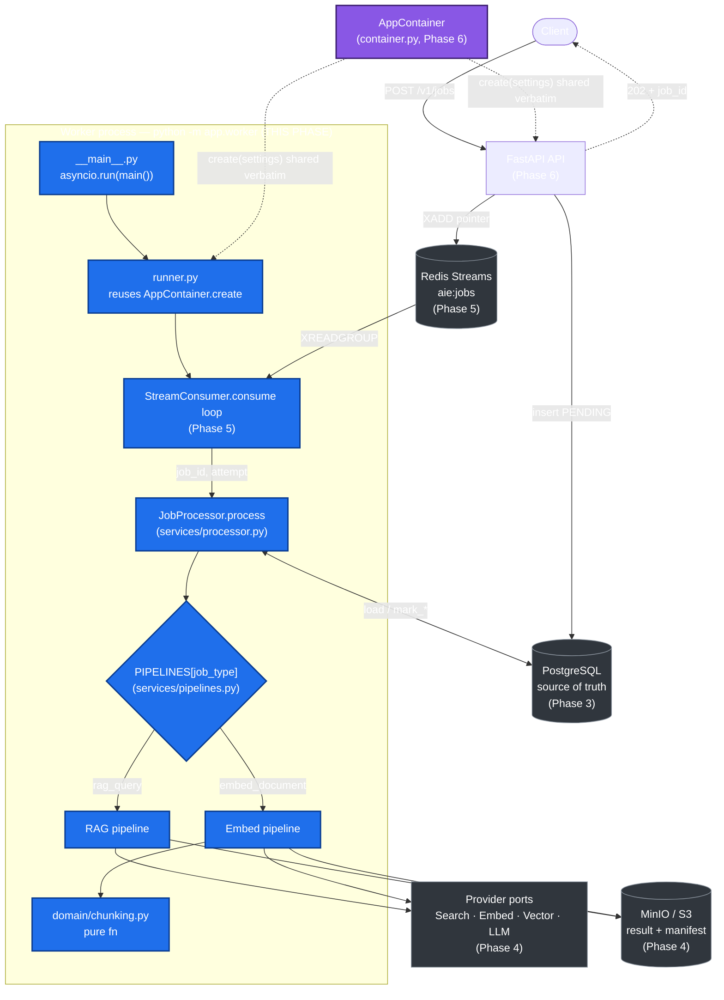
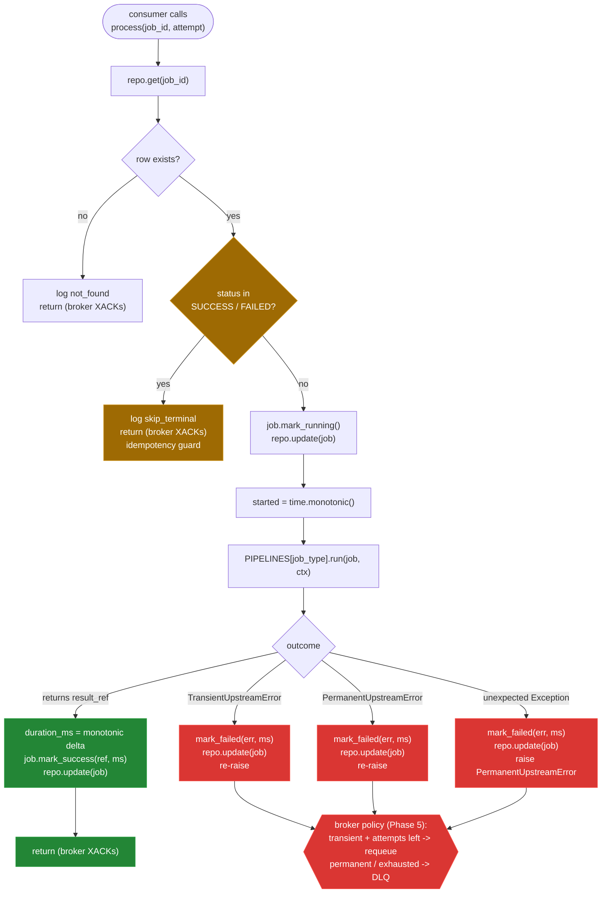
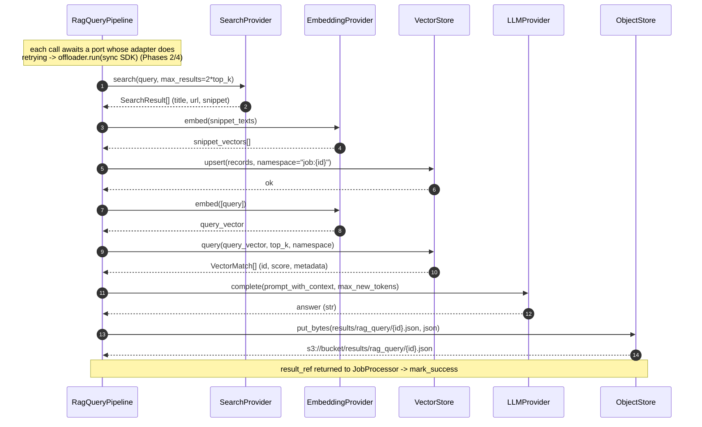
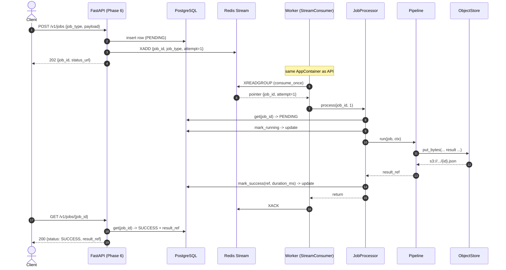
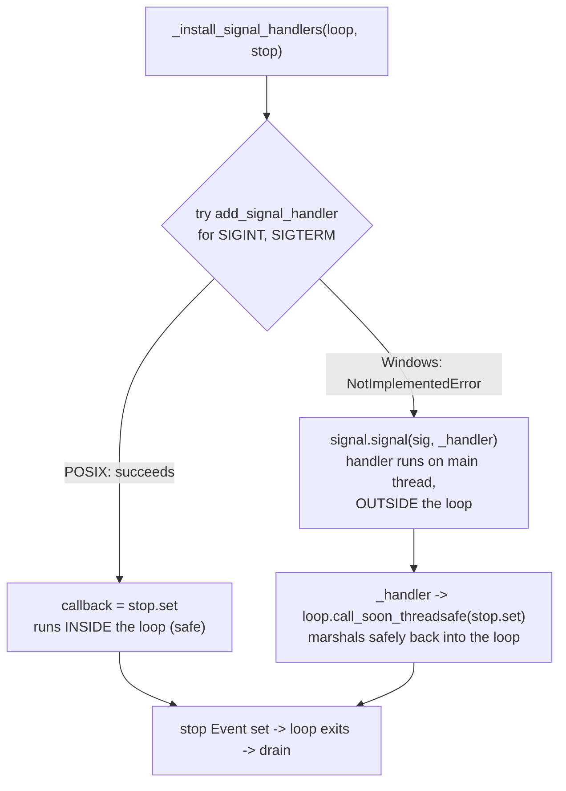

# Phase 7 — Worker Process & Pipelines

> **Part of:** [Asynchronous AI Serving Engine](../implementation-plan.md) · [Problem Statement](../problem-statement.md)
> **Status:** Planned (greenfield) · **Depends on:** [Phase 1](phase-1-scaffold-toolchain-domain.md), [Phase 2](phase-2-concurrency-retry-ports.md), [Phase 3](phase-3-persistence-sqlalchemy-alembic.md), [Phase 4](phase-4-object-store-providers.md), [Phase 5](phase-5-redis-streams-broker.md), [Phase 6](phase-6-composition-root-fastapi-api.md) · **Unlocks:** [Phase 8](phase-8-containerization-compose.md)
> **Delivers:** A standalone, signal-aware worker process (`python -m app.worker`) that **reuses the identical `AppContainer` composition root as the API**, drains a Redis Streams queue through a `JobProcessor`, and executes two end-to-end inference pipelines (`rag_query`, `embed_document`) that exercise all five provider ports plus the object store — all provable with deterministic, clock-free tests using fakes.
> **Primary skills applied:** async-python-patterns, rag-implementation, embedding-strategies, vector-database-engineer, python-pro, powershell-windows, python-testing-patterns, docs-architect, mermaid-expert.

---

## Table of Contents

1. [Overview & Objectives](#1-overview--objectives)
2. [Where This Fits](#2-where-this-fits)
3. [Prerequisites & Inputs](#3-prerequisites--inputs)
4. [Deliverables](#4-deliverables)
5. [Design Decisions & Rationale](#5-design-decisions--rationale)
6. [Detailed Implementation](#6-detailed-implementation)
7. [Flow & Sequence Diagrams](#7-flow--sequence-diagrams)
8. [Configuration & Environment](#8-configuration--environment)
9. [Testing Strategy](#9-testing-strategy)
10. [Verification & Exit-Criteria Mapping](#10-verification--exit-criteria-mapping)
11. [Windows & Cross-Platform Notes](#11-windows--cross-platform-notes)
12. [Common Pitfalls & Troubleshooting](#12-common-pitfalls--troubleshooting)
13. [Definition of Done](#13-definition-of-done)
14. [References & Further Reading](#14-references--further-reading)
15. [Navigation](#15-navigation)

---

## 1. Overview & Objectives

Phases 1–6 built every component the engine needs **except the consumer side of the queue**. The API (Phase 6) accepts a job, writes a `PENDING` row to PostgreSQL, pushes a *pointer* message onto the Redis Stream, and returns `202 Accepted` in milliseconds. Nothing yet pulls those pointers back off the stream and *does the work*. Phase 7 closes that loop.

This phase delivers the **execution half** of the decoupled processing workflow described in the spec's §3.III ("Phase 2 — Orchestration: background workers pull jobs from Redis, execute non-blocking adapter calls sequentially, upload outputs to the S3-compatible engine, and update status to Success or Failed"). Concretely, after Phase 7 the system can run a worker process that:

1. **Boots from the exact same composition root as the API.** This is the architectural keystone of the whole project — see [§5](#5-design-decisions--rationale) and the [!IMPORTANT] callouts throughout. The worker calls `AppContainer.create(settings)` — the *same function* the FastAPI lifespan calls — so a single, audited wiring path produces the engine, session factory, Redis client, sized thread-pool offloader, object store, queue, and provider bundle (fakes by default, real SDKs when keys are present). There is **no second DI graph**, no worker-specific singletons, and no risk of the worker and API drifting apart.
2. **Runs the Redis Streams consume loop** built in Phase 5, bound to a `JobProcessor` callback, with semaphore backpressure and `XAUTOCLAIM` orphan reclaim.
3. **Shuts down gracefully** on `SIGINT`/`SIGTERM`, draining in-flight jobs before closing resources — on **both** Linux containers (primary `loop.add_signal_handler` path) and Windows dev boxes (the `signal.signal` + `KeyboardInterrupt` fallback path, because `add_signal_handler` raises `NotImplementedError` on the Windows Proactor loop).
4. **Processes each job** through `JobProcessor.process(job_id, attempt)`: load the row → idempotency guard (ack-and-skip if already terminal) → `mark_running()` → dispatch to the pipeline registry → `mark_success(result_ref, duration_ms)` or re-raise to the broker's retry/DLQ logic. Every transition is persisted.
5. **Executes two pipelines** through a `PIPELINES[JobType]` registry:
   - `rag_query` — search → embed snippets → vector upsert → embed query → vector query → LLM complete → write result JSON to the object store. This **exercises all five provider ports plus the object store sequentially**, which is the spec's headline "decoupled processing workflow" demonstrated end to end.
   - `embed_document` — chunk (a pure, deterministic function in `domain/chunking.py`) → embed → vector upsert → write a manifest JSON to the object store.

### Concrete objectives

| # | Objective | Done when |
|---|-----------|-----------|
| O1 | Worker reuses `AppContainer.create` verbatim | `runner.py` imports `AppContainer` from `app.container` and calls `create(settings)` / `aclose()`; no provider/engine/redis is constructed inside `worker/` |
| O2 | `python -m app.worker` boots and drains | `__main__.py` calls `asyncio.run(main())`; loop runs `consume_once()` repeatedly until the stop `Event` is set |
| O3 | Cross-platform graceful shutdown | Linux uses `add_signal_handler`; Windows falls back to `signal.signal` + `loop.call_soon_threadsafe(stop.set)` + a `KeyboardInterrupt` drain path |
| O4 | `JobProcessor` enforces the full lifecycle | `PENDING → RUNNING → SUCCESS` on success; idempotency guard ack-and-skips terminal rows; failures re-raise so the broker retries/DLQs |
| O5 | Both pipelines run on fakes with zero keys/cloud | `rag_query` and `embed_document` produce deterministic artifact bytes in the fake object store |
| O6 | Deterministic, clock-free tests | Processor lifecycle + artifact-bytes tests, pipeline **port-call-order** tests via recording fakes, and an integration end-to-end test — none measure wall-clock time |

> [!IMPORTANT]
> **The single most important evaluation signal in this phase** is that the worker reuses the identical `AppContainer` composition root as the API. A reviewer should be able to open `src/app/worker/runner.py`, see `from app.container import AppContainer`, see `await AppContainer.create(settings)`, and immediately understand that the API and worker share *one* wiring path. If you find yourself constructing an engine, a Redis client, or a provider anywhere under `src/app/worker/`, stop — that logic belongs in `container.py` (Phase 6) and is a regression.

---

## 2. Where This Fits

Phase 7 lights up the **worker process** and the **services that orchestrate work** — the right-hand execution arm of the architecture. The API arm (left) was built in Phase 6; both arms converge on the same `AppContainer` and the same ports/adapters underneath.



**Connection to prior phases.** The worker is glue: it does not introduce a new I/O technology. It binds the **consumer** (Phase 5) to the **processor** (this phase), which dispatches into **pipelines** (this phase) that call the **provider ports and object store** (Phase 4) and persist through the **repository** (Phase 3). Every external call still routes through the injected `SyncOffloader` and `tenacity` retry built in Phase 2, because the pipelines receive those collaborators *from the container* rather than importing SDKs directly.

**Connection to the next phase.** Phase 8 containerizes exactly the artifact this phase produces. The Dockerfile runs the *same image* two ways: `uvicorn app.api.app:create_app --factory` for the API and `python -m app.worker` for the worker. Compose sets `stop_grace_period: 30s` on the worker service so the Linux `SIGTERM` drain path (built here) has time to finish in-flight jobs. The graceful-shutdown contract designed in this phase is what makes that container behave well under `docker compose down`.

---

## 3. Prerequisites & Inputs

Everything below must exist before Phase 7 starts. Each item names the producing phase so you can trace it.

| Input | From | Why Phase 7 needs it |
|-------|------|----------------------|
| `AppContainer` dataclass with `async create(settings)` / `aclose()` | [Phase 6](phase-6-composition-root-fastapi-api.md) | The worker's `runner.py` calls these **verbatim** — the whole point of the phase |
| `Settings` (`AIE_` env prefix, `BrokerSettings`, `RetrySettings`, zero-cloud redirect) | [Phase 1](phase-1-scaffold-toolchain-domain.md) | Worker reads the same config object the API reads |
| `InferenceJob` domain entity + `JobStatus` / `JobType` + transition methods (`mark_running`, `mark_success`, `mark_failed`) | [Phase 1](phase-1-scaffold-toolchain-domain.md) | `JobProcessor` drives the entity through its state machine |
| `InvalidTransition`, `TransientUpstreamError`, `PermanentUpstreamError` exceptions | [Phase 1](phase-1-scaffold-toolchain-domain.md) | Idempotency guard + error classification |
| `SyncOffloader` port + `ThreadOffloader` + `RecordingOffloader` spy | [Phase 2](phase-2-concurrency-retry-ports.md) | Pipelines call providers that offload through it; tests assert offloading without measuring time |
| `retrying(settings)` → `AsyncRetrying` factory | [Phase 2](phase-2-concurrency-retry-ports.md) | Adapters retry transient failures; tests count attempts with `base_delay_s=0` |
| All ports: `JobRepository`, `JobQueue`, `ObjectStore`, `EmbeddingProvider`, `LLMProvider`, `VectorStore`, `SearchProvider` | [Phase 2](phase-2-concurrency-retry-ports.md) | The processor and pipelines depend only on these `Protocol`s, never on adapters |
| `JobRepository` adapter (`add`/`get`/`update`) over SQLAlchemy async | [Phase 3](phase-3-persistence-sqlalchemy-alembic.md) | Load the row, persist each transition |
| Provider fakes (`FakeEmbedding`, `FakeVectorStore`, `FakeLLM`, `FakeSearch`) + `S3ObjectStore` | [Phase 4](phase-4-object-store-providers.md) | The default zero-key execution path and the integration target |
| `StreamConsumer` with `consume_once()` test seam + `StreamProducer` | [Phase 5](phase-5-redis-streams-broker.md) | The loop the worker runs; the producer the test uses to enqueue |

> [!NOTE]
> Phase 7 **adds two new files to existing packages** (`domain/chunking.py`, and the two service modules) and **two new files in a new package** (`worker/`). It does *not* modify the container, ports, adapters, or broker beyond wiring the processor callback into the consumer. If you discover you need to change a port signature, that is a signal the earlier phase under-specified it — fix it there and note it, rather than working around it in the worker.

---

## 4. Deliverables

| File | Type | Purpose |
|------|------|---------|
| `src/app/worker/__init__.py` | new | Marks the worker package. Empty (no logic). |
| `src/app/worker/__main__.py` | new | `python -m app.worker` entrypoint. Loads `Settings`, calls `asyncio.run(main())`. |
| `src/app/worker/runner.py` | new | **Reuses `AppContainer.create`.** Builds the container, constructs the `StreamConsumer` bound to `JobProcessor`, installs the stop `Event` (cross-platform), runs the consume loop, drains, `aclose()`. |
| `src/app/services/__init__.py` | changed | Export `JobProcessor`, `PIPELINES`. |
| `src/app/services/processor.py` | new | `JobProcessor.process(job_id, attempt)`: load → idempotency guard → `mark_running` → pipeline → `mark_success` / re-raise. |
| `src/app/services/pipelines.py` | new | `PipelineContext`, `Pipeline` protocol, `rag_query` + `embed_document` pipelines, the `PIPELINES` registry. |
| `src/app/domain/chunking.py` | new | Pure, deterministic `chunk_text(text, size, overlap)` function — no I/O, unit-tested in isolation. |
| `tests/unit/test_chunking.py` | new | Property-style + boundary unit tests for the pure chunker. |
| `tests/unit/test_processor.py` | new | Lifecycle (`PENDING→RUNNING→SUCCESS`), artifact bytes, idempotency ack-and-skip, error→re-raise path. All with fakes, clock-free. |
| `tests/unit/test_pipelines.py` | new | **Port call-order** assertions via recording fakes for both pipelines + artifact-shape checks. |
| `tests/integration/test_worker_end_to_end.py` | new | Real Redis (`fakeredis` or service) + sqlite/PG: producer enqueues → `consume_once()` → row terminal + artifact present. Marked `integration`. |
| `tests/support/recording_providers.py` | changed/new | Recording fakes that append a shared `calls` log so tests can assert ordering across ports. |

> [!TIP]
> Keep `worker/__main__.py` *tiny*. The temptation is to put boot logic there because `python -m app.worker` "is the worker." Resist it: `__main__.py` is just the process launcher (`asyncio.run`), and `runner.py` holds the testable `async def main()` and `async def run_worker(container, settings, stop)`. That split lets you unit-test the run loop with an injected container and a pre-set stop `Event` — no subprocess, no signals.

---

## 5. Design Decisions & Rationale

| Decision | Choice | Why | Rejected alternative |
|----------|--------|-----|----------------------|
| **Worker wiring** | Reuse `AppContainer.create` verbatim | One audited DI graph; API and worker can never drift; zero-leak `aclose()` proven once covers both | A separate `WorkerContainer` or module-level globals → two graphs to keep in sync, double the leak surface |
| **Entrypoint** | `python -m app.worker` via `asyncio.run(main())` | Standard, framework-free, identical in container and locally; no Celery/arq CLI | A bespoke CLI framework (click/typer) → unnecessary dependency for a single command |
| **Stop signal transport** | `asyncio.Event` set from a signal handler | Decouples "OS said stop" from "loop should exit"; the loop polls the Event between `consume_once()` iterations | Cancelling the loop task directly → loses in-flight drain; harder to test |
| **Linux shutdown** | `loop.add_signal_handler(SIGINT/SIGTERM, stop.set)` | The asyncio-native, race-free path; callback runs *in* the loop | Bare `signal.signal` on Linux → callback can't safely touch the loop |
| **Windows shutdown** | `try: add_signal_handler … except NotImplementedError:` → `signal.signal` + `loop.call_soon_threadsafe(stop.set)` + `KeyboardInterrupt` drain | `add_signal_handler` raises `NotImplementedError` on the Windows Proactor loop (documented); `signal.signal` fires on a different thread, so we *must* marshal back with `call_soon_threadsafe` | Pretending signals work the same on Windows → `NotImplementedError` at startup, or a handler that touches the loop unsafely |
| **Message semantics** | Stream message = pointer `{job_id, job_type, attempt}`; PG is source of truth | Small messages; the processor always re-reads the authoritative row, enabling the idempotency guard | Fat messages carrying the payload → stale data, no single source of truth, larger streams |
| **Idempotency** | Ack-and-skip if the loaded row is already terminal | At-least-once delivery (XAUTOCLAIM reclaim, redelivery) means a job can arrive twice; we must be safe to re-process | Exactly-once delivery → not achievable with Redis Streams; would be a false promise |
| **Pipeline dispatch** | `PIPELINES: dict[JobType, Pipeline]` registry | Open/closed: add a job type by registering a pipeline, no `if/elif` in the processor | A big `match job_type` in the processor → processor knows every pipeline, violates separation |
| **Pipeline ↔ provider coupling** | Pipelines receive a `PipelineContext` of **ports** | Pipelines stay pure-ish orchestration; swap fakes/real adapters with zero pipeline changes; deterministic tests | Pipelines importing SDK clients → un-testable without network, breaks hexagonal boundary |
| **Chunking** | Pure function `chunk_text` in `domain/` | Deterministic, no I/O, trivially unit-tested; lives in the domain because it's business logic, not an adapter | A method on an embedding adapter → entangles a pure algorithm with I/O and retries |
| **Duration measurement** | `time.monotonic()` deltas, stored as `duration_ms` | Monotonic clock is immune to wall-clock jumps/NTP; correct for *measuring elapsed time* | `time.time()` → can go backwards; `datetime.now()` → wrong tool for durations |
| **Failure handling in processor** | Persist `mark_failed` context if needed, then **re-raise** to the broker | The broker (Phase 5) owns retry/DLQ policy; the processor must not swallow the exception | Processor deciding retry vs DLQ → duplicates broker logic, two places to get backoff wrong |

> [!IMPORTANT]
> **Composition-root reuse, stated once more, plainly.** The API's FastAPI lifespan (Phase 6) does `container = await AppContainer.create(settings)` and stashes it on `app.state`. The worker's `runner.py` does the *same call* and holds it in a local. Same `Settings`, same `create`, same `aclose`. The provider bundle inside the container is chosen the same way for both processes — fakes unless keys are configured. This is not a coincidence of similar code; it is *literally the same function*, imported from `app.container`. Make this obvious in the code and call it out in the README (Phase 9).

> [!WARNING]
> A subtle but real failure mode: building the container **outside** `asyncio.run`. `AppContainer.create` is `async` (it opens an async engine, pings Redis, may `ensure_bucket`), and it installs a sized `ThreadPoolExecutor` as the running loop's default executor via `loop.set_default_executor(...)`. That call needs a *running loop*. So the container must be created **inside** `main()` (which runs under `asyncio.run`), never at import time or in `__main__`'s module body.

---

## 6. Detailed Implementation

This section walks every deliverable file. Code is grounded in real, current APIs (verified against the official asyncio, tenacity, huggingface-hub, and Pinecone docs — see [§14](#14-references--further-reading)). Imports assume the package layout from the implementation plan.

### 6.1 `src/app/domain/chunking.py` — pure deterministic chunker

**Purpose & responsibilities.** Split a document into overlapping character windows for embedding. Pure: same input → same output, no I/O, no randomness, no clock. It lives in `domain/` because *how we chunk* is a business rule, not an integration concern.

```python
"""Deterministic text chunking — a pure domain function (no I/O, no clock).

Used by the ``embed_document`` pipeline. Kept pure so it is trivially
unit-testable in isolation and produces identical chunks on every run,
which is what makes the embedding pipeline's artifacts deterministic.
"""

from __future__ import annotations

from dataclasses import dataclass


@dataclass(frozen=True, slots=True)
class Chunk:
    """One contiguous slice of the source document.

    ``index`` is the chunk's ordinal position (0-based); ``start``/``end``
    are character offsets into the original text (``end`` exclusive).
    """

    index: int
    start: int
    end: int
    text: str


def chunk_text(text: str, *, size: int = 512, overlap: int = 64) -> list[Chunk]:
    """Split ``text`` into overlapping windows of ``size`` characters.

    Each window starts ``size - overlap`` characters after the previous one,
    so adjacent chunks share ``overlap`` characters of context. The final
    window is whatever remains and may be shorter than ``size``.

    Determinism: this function performs no I/O, uses no clock, and contains
    no randomness — the same arguments always yield the same chunk list.

    Args:
        text: The source document.
        size: Window length in characters. Must be > 0.
        overlap: Characters shared between adjacent windows. Must satisfy
            ``0 <= overlap < size`` (otherwise the stride would not advance).

    Returns:
        Chunks in document order. An empty/whitespace-only string yields ``[]``.

    Raises:
        ValueError: If ``size <= 0`` or ``overlap`` is out of range.
    """
    if size <= 0:
        raise ValueError(f"size must be positive, got {size}")
    if not (0 <= overlap < size):
        raise ValueError(f"overlap must satisfy 0 <= overlap < size, got {overlap} (size={size})")

    stripped = text.strip()
    if not stripped:
        return []

    stride = size - overlap  # guaranteed >= 1 by the validation above
    chunks: list[Chunk] = []
    start = 0
    index = 0
    length = len(stripped)

    while start < length:
        end = min(start + size, length)
        chunks.append(Chunk(index=index, start=start, end=end, text=stripped[start:end]))
        if end == length:  # we just emitted the tail; stop (avoids a trailing empty window)
            break
        start += stride
        index += 1

    return chunks
```

**Walkthrough.**
- `stride = size - overlap` is the forward step. The validation guarantees `stride >= 1`, so the loop always advances and cannot spin forever (a classic chunker bug when `overlap >= size`).
- The `if end == length: break` after appending the tail prevents emitting a degenerate empty final chunk when the document length is an exact multiple of the stride.
- `text.strip()` is applied once up front so leading/trailing whitespace doesn't produce a chunk of pure spaces and offsets stay consistent.

> [!TIP]
> Resist adding token-based chunking (tiktoken/HF tokenizer) *here*. That would drag a tokenizer dependency and its I/O/version quirks into the pure domain, and it would make the function non-deterministic across tokenizer versions. Character chunking is deterministic and dependency-free; if a real deployment needs token chunking, implement it as a *provider adapter* behind a port, not in `domain/`.

> [!NOTE]
> The `embedding-strategies` guidance favors preserving semantic boundaries (sentences/sections) for retrieval quality. For a portfolio engine whose goal is to demonstrate the *architecture* (offloading, retries, hexagonal boundaries, deterministic tests), fixed-size character windows are the right call: they're provably deterministic and keep the spotlight on the engine, not on NLP heuristics. The function signature (`size`/`overlap`) leaves the door open to a smarter splitter later without changing callers.

### 6.2 `src/app/services/pipelines.py` — pipeline registry + the two pipelines

**Purpose & responsibilities.** Define what "doing the work" *is* for each `JobType`, expressed purely as orchestration over **ports**. A pipeline never imports an SDK; it receives a `PipelineContext` carrying the provider ports and the object store, all sourced from the `AppContainer`. The `rag_query` pipeline is the spec's showcase: it touches **all five provider ports plus the object store, sequentially**.

```python
"""Inference pipelines: orchestration over ports, one per JobType.

A pipeline is pure orchestration — it calls ports (search, embed, vector,
LLM, object store) in a deterministic order and returns a storage reference
to the artifact it wrote. It never imports an SDK and never offloads or
retries directly: those concerns live inside the adapters the ports point
to (Phase 2/4). That keeps pipelines synchronous-looking, easy to read, and
trivially testable with fakes.
"""

from __future__ import annotations

import json
from dataclasses import dataclass
from typing import Protocol

from app.domain.chunking import chunk_text
from app.domain.models import InferenceJob, JobType
from app.ports.object_store import ObjectStore
from app.ports.providers import (
    EmbeddingProvider,
    LLMProvider,
    SearchProvider,
    VectorStore,
)


@dataclass(slots=True)
class PipelineContext:
    """The ports a pipeline may use, supplied by the AppContainer.

    Holding ports (not adapters) here is the hexagonal boundary in action:
    the container injects fakes by default and real SDK adapters when keys
    are configured, and the pipeline code is identical either way.
    """

    search: SearchProvider
    embedding: EmbeddingProvider
    vector_store: VectorStore
    llm: LLMProvider
    object_store: ObjectStore  # bucket is bound inside the adapter (no bucket field here)


class Pipeline(Protocol):
    """Structural contract every pipeline satisfies.

    ``run`` returns a storage reference (e.g. ``s3://bucket/key``) to the
    artifact produced, which the JobProcessor records as the job's result.
    """

    async def run(self, job: InferenceJob, ctx: PipelineContext) -> str: ...


def _result_key(job: InferenceJob, suffix: str) -> str:
    """Deterministic object key for a job's artifact (no clock, no random).

    Using the job id keys the artifact predictably so tests can fetch and
    assert the exact bytes, and re-processing the same job overwrites rather
    than duplicating.
    """
    return f"results/{job.job_type.value}/{job.id}{suffix}"


def _rag_prompt(query: str, context: list[str]) -> str:
    """Fold retrieved context into a single grounded prompt for the LLM port.

    The ``LLMProvider.complete`` port takes a single ``prompt`` (no separate
    context arg), so RAG grounding is the pipeline's job: we build the prompt
    here and the adapter just completes it.
    """
    if not context:
        return query
    context_block = "\n\n".join(context)
    return f"Context:\n{context_block}\n\nQuestion: {query}\n\nAnswer:"


class RagQueryPipeline:
    """RAG over the configured providers.

    Order (and this order is asserted in tests):
        1. search(query)                  -> candidate snippets
        2. embedding.embed(snippets)      -> snippet vectors
        3. vector_store.upsert(...)       -> index the snippets
        4. embedding.embed([query])       -> query vector
        5. vector_store.query(qvec, k)    -> nearest snippet ids
        6. llm.complete(query, context)   -> grounded answer
        7. object_store.put_bytes(json)   -> persist the result artifact

    This single method exercises all five provider ports plus the object
    store sequentially — the spec's "decoupled processing workflow" shown
    end to end.
    """

    async def run(self, job: InferenceJob, ctx: PipelineContext) -> str:
        payload = job.payload
        query: str = payload["query"]
        top_k: int = int(payload.get("top_k", 3))

        # 1. Retrieve candidate documents from the search provider.
        snippets = await ctx.search.search(query, max_results=top_k * 2)
        snippet_texts = [s["snippet"] for s in snippets]  # SearchResult is a TypedDict

        # 2. Embed the retrieved snippets so we can index them.
        snippet_vectors = await ctx.embedding.embed(snippet_texts) if snippet_texts else []

        # 3. Upsert snippet vectors into the vector store (namespaced by job).
        namespace = f"job:{job.id}"
        records = [
            (f"snip:{i}", vec, {"text": text})
            for i, (vec, text) in enumerate(zip(snippet_vectors, snippet_texts))
        ]
        if records:
            await ctx.vector_store.upsert(records, namespace=namespace)

        # 4. Embed the query itself.
        (query_vector,) = await ctx.embedding.embed([query])

        # 5. Retrieve the nearest snippets for the query.
        matches = (
            await ctx.vector_store.query(query_vector, top_k=top_k, namespace=namespace)
            if records
            else []
        )
        # VectorMatch is a TypedDict; the snippet text was stored in metadata at upsert.
        context_texts = [
            str(m["metadata"]["text"]) for m in matches if "text" in m["metadata"]
        ]

        # 6. Ask the LLM to answer. The port takes a single prompt, so we fold
        #    the retrieved context into the prompt (RAG grounding) here.
        prompt = _rag_prompt(query, context_texts)
        answer = await ctx.llm.complete(prompt, max_new_tokens=512)

        # 7. Persist the structured result as a JSON artifact in object storage.
        result = {
            "job_id": str(job.id),
            "query": query,
            "answer": answer,
            "context": context_texts,
            "retrieved_ids": [m["id"] for m in matches],
        }
        body = json.dumps(result, indent=2, sort_keys=True).encode("utf-8")
        return await ctx.object_store.put_bytes(
            _result_key(job, ".json"), body, content_type="application/json"
        )


class EmbedDocumentPipeline:
    """Chunk a document, embed the chunks, index them, and write a manifest.

    Order (asserted in tests):
        1. chunk_text(document)           -> deterministic Chunk list (pure)
        2. embedding.embed(chunk_texts)   -> chunk vectors
        3. vector_store.upsert(...)       -> index the chunks
        4. object_store.put_bytes(json)   -> manifest artifact
    """

    async def run(self, job: InferenceJob, ctx: PipelineContext) -> str:
        payload = job.payload
        document: str = payload["text"]  # EmbedDocumentPayload field (Phase 6 schema)
        doc_id: str = str(payload.get("document_id", job.id))
        size = int(payload.get("chunk_size", 512))
        overlap = int(payload.get("chunk_overlap", 64))

        # 1. Pure, deterministic chunking (no I/O) — see domain/chunking.py.
        chunks = chunk_text(document, size=size, overlap=overlap)

        # 2. Embed every chunk in one offloaded batch call.
        vectors = await ctx.embedding.embed([c.text for c in chunks]) if chunks else []

        # 3. Index the chunk vectors under a per-document namespace.
        namespace = f"doc:{doc_id}"
        records = [
            (f"{doc_id}:chunk:{c.index}", vec, {"chunk_index": c.index, "start": c.start, "end": c.end})
            for c, vec in zip(chunks, vectors)
        ]
        if records:
            await ctx.vector_store.upsert(records, namespace=namespace)

        # 4. Write a manifest describing what was indexed (the artifact).
        manifest = {
            "job_id": str(job.id),
            "document_id": doc_id,
            "chunk_count": len(chunks),
            "namespace": namespace,
            "chunks": [{"index": c.index, "start": c.start, "end": c.end} for c in chunks],
        }
        body = json.dumps(manifest, indent=2, sort_keys=True).encode("utf-8")
        return await ctx.object_store.put_bytes(
            _result_key(job, "-manifest.json"), body, content_type="application/json"
        )


# The registry: dispatch a JobType to its pipeline. Adding a new job type is
# a one-line registration here — the JobProcessor never grows an if/elif.
PIPELINES: dict[JobType, Pipeline] = {
    JobType.RAG_QUERY: RagQueryPipeline(),
    JobType.EMBED_DOCUMENT: EmbedDocumentPipeline(),
}
```

**Walkthrough & rationale.**
- **Ports only.** `PipelineContext` holds `SearchProvider`, `EmbeddingProvider`, `VectorStore`, `LLMProvider`, `ObjectStore` — all `typing.Protocol`s from Phase 2. The pipeline body is identical whether the container injected `FakeLLM` or the real HF `InferenceClient` adapter. This is the hexagonal payoff.
- **The `await`s are the offload/retry boundaries.** Each `await ctx.embedding.embed(...)` lands in an adapter whose method is `retrying → offloader.run(sdk_call)` (Phase 4). The pipeline doesn't know or care; it just awaits. So "non-blocking I/O at every external boundary" is satisfied *structurally* by routing every external touch through a port.
- **Deterministic keys.** `_result_key` derives the object key from the job id, with no timestamp or random suffix. That makes the artifact location predictable (tests fetch exact bytes) and makes re-processing idempotent at the storage layer (overwrite, not duplicate).
- **Empty-input guards.** `if snippet_texts`, `if records`, `if chunks` keep the pipelines correct when search returns nothing or a document is tiny — we never call `embed([])` or `upsert([])` needlessly, and we never index when there's nothing to index.
- **`sort_keys=True`** on the JSON dump makes the serialized bytes deterministic regardless of dict insertion order, so artifact-byte assertions in tests are stable.

> [!NOTE]
> The exact port signatures (Phases 2/4, **locked**): `search.search(query, *, max_results=...) -> list[SearchResult]` (TypedDict `{title,url,snippet}`); `embedding.embed(list[str]) -> list[list[float]]`; `vector_store.upsert(list[tuple[id, values, metadata]], *, namespace=...)` / `query(vector, *, top_k=, namespace=) -> list[VectorMatch]` (TypedDict `{id,score,metadata}`); `llm.complete(prompt, *, max_new_tokens=) -> str` (**no `context` arg** — fold context into the prompt); `object_store.put_bytes(key, data, *, content_type=) -> ref` (bucket bound at construction). The value objects are **TypedDicts**, so read fields with `["..."]`, not attributes.

### 6.3 `src/app/services/processor.py` — the JobProcessor

**Purpose & responsibilities.** The unit of work the consumer invokes per message. It owns the **job lifecycle and the idempotency guard**, delegates the actual work to a pipeline, times it with a monotonic clock, and persists every transition. On failure it re-raises so the broker (Phase 5) applies its retry/DLQ policy — the processor never decides retry vs DLQ itself.

```python
"""JobProcessor — drives one job through its lifecycle.

Invoked by the StreamConsumer (Phase 5) with a job id and the delivery's
attempt number. Responsibilities:
  * load the authoritative row from PostgreSQL (source of truth),
  * idempotency guard: ack-and-skip if the job is already terminal,
  * transition PENDING -> RUNNING and persist,
  * dispatch to PIPELINES[job_type] and time it with time.monotonic(),
  * on success: mark_success(result_ref, duration_ms) and persist,
  * on failure: persist failure context and re-raise so the broker
    applies retry/DLQ policy.
"""

from __future__ import annotations

import time
from uuid import UUID

import structlog

from app.adapters.broker.messages import JobMessage
from app.domain.exceptions import (
    JobNotFound,
    PermanentUpstreamError,
    TransientUpstreamError,
)
from app.domain.models import JobStatus
from app.ports.repository import JobRepository
from app.services.pipelines import PIPELINES, PipelineContext

logger = structlog.get_logger(__name__)


class JobProcessor:
    """Process a single job by id. Holds collaborators, not state."""

    def __init__(self, repository: JobRepository, ctx: PipelineContext) -> None:
        self._repo = repository
        self._ctx = ctx

    async def __call__(self, message: JobMessage) -> None:
        """Dispatch entry point used by the StreamConsumer (Phase 5).

        The consumer's ``JobProcessor`` Protocol is ``__call__(message)``; we
        unpack the pointer and delegate to ``process`` (which the unit tests
        call directly with a job id + attempt).
        """
        await self.process(message.job_id, message.attempt)

    async def process(self, job_id: UUID, attempt: int) -> None:
        """Process the job identified by ``job_id``.

        ``attempt`` is the broker's delivery attempt (1-based), carried in
        the stream pointer. It is recorded for observability; the *decision*
        to retry or DLQ belongs to the broker, not here.

        Returns normally on success or on an idempotent skip (the broker
        will XACK). Raises on failure so the broker can retry or DLQ.
        """
        log = logger.bind(job_id=job_id, attempt=attempt)

        # --- Load the authoritative row (PG is the single source of truth) ---
        try:
            job = await self._repo.get(job_id)
        except JobNotFound:
            # The pointer references a row that does not exist. Nothing to do;
            # returning lets the broker XACK and drop the phantom message.
            log.warning("job.not_found")
            return

        # --- Idempotency guard (at-least-once delivery is expected) ----------
        # Redis Streams + XAUTOCLAIM reclaim can deliver the same job twice.
        # If it already reached a terminal state, ack-and-skip: do NOT re-run
        # the pipeline or re-write artifacts.
        if job.status in (JobStatus.SUCCESS, JobStatus.FAILED):
            log.info("job.skip_terminal", status=job.status.value)
            return

        # --- Transition to RUNNING and persist before doing any work --------
        job.mark_running()  # raises InvalidTransition if not from PENDING
        await self._repo.update(job)
        log.info("job.running")

        started = time.monotonic()  # monotonic: correct for measuring elapsed time
        try:
            pipeline = PIPELINES[job.job_type]
            result_ref = await pipeline.run(job, self._ctx)
        except (TransientUpstreamError, PermanentUpstreamError) as exc:
            # Record the failure context, then re-raise. The broker decides:
            # transient + attempts remaining -> requeue; permanent/exhausted -> DLQ.
            duration_ms = int((time.monotonic() - started) * 1000)
            job.mark_failed(error=f"{type(exc).__name__}: {exc}", duration_ms=duration_ms)
            await self._repo.update(job)
            log.warning("job.failed", error=str(exc), kind=type(exc).__name__, duration_ms=duration_ms)
            raise
        except Exception as exc:  # noqa: BLE001 - defensive: unexpected pipeline bug
            # Treat unknown errors as permanent so they head to the DLQ rather
            # than retrying forever. Still re-raise to hand control to the broker.
            duration_ms = int((time.monotonic() - started) * 1000)
            job.mark_failed(error=f"unexpected: {type(exc).__name__}: {exc}", duration_ms=duration_ms)
            await self._repo.update(job)
            log.error("job.failed_unexpected", error=str(exc), duration_ms=duration_ms)
            raise PermanentUpstreamError(str(exc)) from exc

        # --- Success: record the artifact ref and elapsed time --------------
        duration_ms = int((time.monotonic() - started) * 1000)
        job.mark_success(result_ref=result_ref, duration_ms=duration_ms)
        await self._repo.update(job)
        log.info("job.success", result_ref=result_ref, duration_ms=duration_ms)
```

**Walkthrough & rationale.**
- **Load-then-guard order is mandatory.** We `get` the row *before* doing anything, then check `status in (SUCCESS, FAILED)`. Because the stream message is only a pointer, the row is always the truth — a redelivered terminal job is detected and skipped here. This is the at-least-once → effectively-once bridge.
- **Persist on every edge.** `mark_running` → `update`, success → `update`, failure → `update`. A crash between any two steps leaves a consistent, inspectable row, and redelivery re-enters `process`, re-reads the row, and either resumes (if still `RUNNING`/`PENDING`) or skips (if terminal). (Whether a stuck `RUNNING` row is retried is governed by the broker's reclaim + the entity's transition rules; `mark_running` from `RUNNING` raising `InvalidTransition` is acceptable and surfaces a genuine logic bug.)
- **Monotonic timing.** `time.monotonic()` is the correct clock for *durations*: it never goes backward and is unaffected by NTP/wall-clock changes. `duration_ms` is computed in every exit path (success, transient fail, unexpected fail) so the row always carries a measured elapsed time.
- **Re-raise, don't decide.** Transient/permanent errors are recorded and re-raised. The consumer's per-message handler (Phase 5) catches them and applies the policy: transient with attempts left → XACK + re-XADD `attempt+1` + row back to `PENDING`; permanent or exhausted → DLQ + XACK + `FAILED`. The processor stays policy-free, so backoff/DLQ logic lives in exactly one place.
- **Unknown exceptions → permanent.** A bug in pipeline code shouldn't retry forever. We wrap unexpected exceptions as `PermanentUpstreamError` so the broker DLQs them, while logging the original for debugging.

> [!IMPORTANT]
> The processor depends only on `JobRepository` (port) and a `PipelineContext` of ports. It imports **no adapter, no FastAPI, no Redis, no SDK**. That is what lets the unit test in [§9](#9-testing-strategy) drive the entire lifecycle with fakes and assert the produced artifact bytes — no Docker, no network, no clock.

> [!WARNING]
> Do not `XACK` inside the processor. Acking is the consumer's job and must happen *after* `process` returns (success path) or after the consumer's failure handler has requeued/DLQ'd (failure path). If the processor acked on entry, a crash mid-pipeline would lose the job. The processor's contract is simply: *return* = safe to ack; *raise* = hand to the broker.

### 6.4 `src/app/worker/runner.py` — the run loop that reuses the composition root

**Purpose & responsibilities.** The heart of the phase. `runner.py` (1) builds the `AppContainer` via the **shared** `create`, (2) constructs the `StreamConsumer` bound to a `JobProcessor`, (3) installs a cross-platform stop `Event`, (4) runs the consume loop until stop, (5) drains in-flight tasks, and (6) `aclose()`s the container.

```python
"""Worker runner — reuses the AppContainer composition root verbatim.

This is the architectural keystone of the project: the worker boots from the
SAME ``AppContainer.create(settings)`` the FastAPI lifespan uses (Phase 6).
There is exactly one DI graph; the API and the worker share it. Nothing here
constructs an engine, a Redis client, an object store, or a provider — those
all come pre-wired from the container.
"""

from __future__ import annotations

import asyncio
import signal
import sys

import structlog

from app.adapters.broker.consumer import StreamConsumer
from app.adapters.broker.keys import BrokerKeys
from app.container import AppContainer
from app.core.config import Settings
from app.services.pipelines import PipelineContext
from app.services.processor import JobProcessor

logger = structlog.get_logger(__name__)


def _install_signal_handlers(loop: asyncio.AbstractEventLoop, stop: asyncio.Event) -> None:
    """Wire SIGINT/SIGTERM to set the stop Event, cross-platform.

    Linux: ``loop.add_signal_handler`` runs the callback *inside* the loop,
    so it can safely touch ``stop`` (an asyncio primitive).

    Windows: ``add_signal_handler`` raises ``NotImplementedError`` on the
    Proactor event loop (documented platform limitation). We fall back to
    ``signal.signal``, whose handler runs on the main thread *outside* the
    loop — so it must marshal back into the loop with
    ``loop.call_soon_threadsafe`` to set ``stop`` safely.
    """
    try:
        # --- Primary path (POSIX): asyncio-native signal handling -----------
        for sig in (signal.SIGINT, signal.SIGTERM):
            loop.add_signal_handler(sig, stop.set)
        logger.info("signals.installed", mode="add_signal_handler")
    except NotImplementedError:
        # --- Fallback path (Windows Proactor loop) --------------------------
        # signal.signal handlers fire on the main thread, NOT inside the loop,
        # so we cannot call stop.set() directly (it touches loop internals).
        # call_soon_threadsafe is the documented, thread-safe bridge back in.
        def _handler(signum: int, frame: object) -> None:  # noqa: ARG001 - signal API shape
            loop.call_soon_threadsafe(stop.set)

        for sig in (signal.SIGINT, signal.SIGTERM):
            signal.signal(sig, _handler)
        logger.info("signals.installed", mode="signal.signal", platform=sys.platform)


async def run_worker(container: AppContainer, settings: Settings, stop: asyncio.Event) -> None:
    """Run the consume loop until ``stop`` is set, then drain and stop cleanly.

    The container is injected (already created and not yet closed). ``stop``
    is injected too, so tests can pre-set it and assert the loop exits without
    relying on signals or sleeps.
    """
    # Build the per-job processor from the container's pre-wired ports.
    # NOTE: every collaborator below comes FROM the container — nothing new
    # is constructed here. This is the composition-root reuse, made literal.
    ctx = PipelineContext(
        search=container.providers.search,
        embedding=container.providers.embedding,
        vector_store=container.providers.vector_store,
        llm=container.providers.llm,
        object_store=container.object_store,
    )
    processor = JobProcessor(repository=container.repository, ctx=ctx)

    # StreamConsumer (Phase 5) owns the loop, backpressure, reclaim, ACK/retry/DLQ,
    # and the graceful drain. We just supply collaborators and the stop Event.
    consumer = StreamConsumer(
        redis=container.redis,
        keys=BrokerKeys.from_settings(settings.broker),
        settings=settings.broker,
        repository=container.repository,
        processor=processor,            # consumer calls processor(message) -> __call__
        producer=container.queue,       # the StreamProducer (republish / DLQ)
    )
    await consumer.start()  # idempotent XGROUP CREATE ... MKSTREAM

    logger.info("worker.started", concurrency=settings.broker.worker_concurrency)
    # run() loops consume_once() until stop is set, then drains in-flight tasks in
    # its finally — the per-iteration consume_once stays the deterministic seam.
    await consumer.run(stop)
    logger.info("worker.stopped")


async def main() -> None:
    """Entry coroutine: load settings, build the shared container, run, close.

    Must run under ``asyncio.run`` because ``AppContainer.create`` installs a
    sized ThreadPoolExecutor as the running loop's default executor and opens
    async resources — both need a running loop.
    """
    settings = Settings()  # reads AIE_* env; applies the zero-cloud redirect
    loop = asyncio.get_running_loop()
    stop = asyncio.Event()
    _install_signal_handlers(loop, stop)

    # >>> Composition-root reuse: the SAME call the FastAPI lifespan makes. <<<
    container = await AppContainer.create(settings)
    try:
        await run_worker(container, settings, stop)
    except KeyboardInterrupt:
        # Windows: a Ctrl+C between iterations can surface as KeyboardInterrupt
        # despite our handler. consumer.run()'s finally has already drained
        # in-flight work; nothing to do here but fall through to aclose().
        logger.info("worker.keyboard_interrupt")
    finally:
        # Symmetric, reverse-order teardown — the SAME aclose the API uses.
        await container.aclose()
        logger.info("worker.closed")
```

**Walkthrough & rationale.**
- **`from app.container import AppContainer` + `await AppContainer.create(settings)`** is the line a reviewer looks for. It is *the same* construction the API lifespan performs. The `>>> ... <<<` comment makes it unmissable.
- **`run_worker` takes the container and `stop` as parameters.** This is deliberate testability: a unit test can build an all-fakes container, pre-set `stop`, and call `run_worker` directly — no signals, no subprocess, no clock. (See [§9](#9-testing-strategy).)
- **`processor` (the `JobProcessor` instance) is passed as the consumer's `processor`.** The consumer (Phase 5) calls `processor(message)` per decoded pointer; `JobProcessor.__call__(message)` unpacks `(job_id, attempt)` and delegates to `process`. The broker never imports services — it just calls the structural `JobProcessor` Protocol.
- **`consumer.run(stop)` owns the loop.** Phase 5's `run` is `while not stop.is_set(): await consume_once()` then drains in its `finally`. Keeping the per-iteration `consume_once` as the documented test seam means `block_ms` bounds how long one iteration parks on `XREADGROUP`, so after `stop.set()` the loop exits within `block_ms`.
- **The drain lives inside `consumer.run`'s `finally` (Phase 5).** On *every* exit (stop, exception, cancellation) it awaits the consumer's tracked in-flight task set so jobs mid-flight when stop arrived finish (or are acked/requeued) before teardown. This is what `stop_grace_period: 30s` (Phase 8 compose) protects.
- **`KeyboardInterrupt` handling.** On Windows a `Ctrl+C` can bubble up as `KeyboardInterrupt` between iterations even with our handler installed. By the time it reaches `main`, `consumer.run`'s `finally` has already drained in-flight work, so we just log and fall through to `aclose()` — no re-entry, no second container.
- **`aclose()` in the outer `finally`** is the same reverse-order teardown the API uses (Phase 6 proved zero leaks for it). Reusing it means the worker's leak-freedom is already covered by the container's leak test.

> [!IMPORTANT]
> There is exactly **one** `await AppContainer.create` and **one** `aclose`, and `run_worker` is called once (no re-entry). Creating the container twice would double resources and is a bug; the single create/aclose pair is the whole point of composition-root reuse.

> [!CAUTION]
> `signal.signal` and `loop.add_signal_handler` both require the **main thread**. `main()` runs on the main thread under `asyncio.run`, so this is satisfied. If you ever move worker startup off the main thread (don't), signal installation will raise `ValueError: signal only works in main thread`. Keep the entrypoint on the main thread.

### 6.5 `src/app/worker/__main__.py` — the process entrypoint

**Purpose & responsibilities.** Make `python -m app.worker` work. It is intentionally tiny: configure logging, then `asyncio.run(main())`. All testable logic lives in `runner.py`.

```python
"""``python -m app.worker`` entrypoint.

Deliberately minimal: configure logging, then run the runner's ``main()``
coroutine under asyncio.run. Everything testable lives in ``runner.py``.
"""

from __future__ import annotations

import asyncio

from app.core.logging import configure_logging
from app.worker.runner import main


def run() -> None:
    """Synchronous shim: set up logging and drive the async entrypoint."""
    configure_logging()  # structlog setup from Phase 1
    # asyncio.run creates a fresh event loop, runs main() to completion, and
    # closes the loop — the recommended top-level entrypoint for asyncio apps.
    asyncio.run(main())


if __name__ == "__main__":
    run()
```

**Walkthrough.**
- `asyncio.run(main())` is the canonical top-level driver: it creates a new event loop, runs the coroutine, and closes the loop on exit (including on exceptions). It must not be called when a loop is already running — which is never the case for a fresh process.
- `configure_logging()` runs *before* `asyncio.run` so even container-construction logs are formatted. It is sync (structlog config), so it's fine in the module-level `run()`.
- The `if __name__ == "__main__":` guard makes `python -m app.worker` resolve to `__main__.py`'s `run()`. (Python runs the package's `__main__` submodule for `-m <package>`.)

> [!NOTE]
> Phase 8's Dockerfile sets the worker command to exactly `python -m app.worker`. Because `runner.main()` builds the container with the same `Settings()` the API uses, the only difference between the API container and the worker container is the command — the image, the wiring, and the code are identical.

### 6.6 `tests/support/recording_providers.py` — ordering-aware fakes

**Purpose & responsibilities.** Provide fakes that (a) return deterministic data so pipelines run, and (b) append to a *shared* `calls` list so a test can assert the **exact cross-port call order** without any clock or network. These extend the plain fakes from Phase 4 with a recording side-effect.

```python
"""Recording provider fakes for deterministic, clock-free pipeline tests.

Each fake appends a ``(port, method)`` tuple to a shared ``calls`` log before
returning canned, deterministic data. Tests assert the ordering of that log
to prove a pipeline touched the ports in the right sequence — no timing, no
network, fully reproducible.
"""

from __future__ import annotations

from dataclasses import dataclass, field

from app.ports.providers import SearchResult, VectorMatch


@dataclass
class CallLog:
    """Shared, ordered record of port interactions across all fakes."""

    calls: list[tuple[str, str]] = field(default_factory=list)

    def record(self, port: str, method: str) -> None:
        self.calls.append((port, method))

    def methods(self) -> list[tuple[str, str]]:
        return list(self.calls)


class RecordingSearch:
    def __init__(self, log: CallLog, corpus: list[str] | None = None) -> None:
        self._log = log
        self._corpus = corpus or ["alpha doc", "beta doc", "gamma doc"]

    async def search(self, query: str, *, max_results: int) -> list[SearchResult]:
        self._log.record("search", "search")
        # Deterministic: first ``max_results`` corpus entries as SearchResult dicts.
        return [
            SearchResult(title=f"doc {i}", url=f"https://example.test/{i}", snippet=t)
            for i, t in enumerate(self._corpus[:max_results])
        ]


class RecordingEmbedding:
    def __init__(self, log: CallLog, dim: int = 8) -> None:
        self._log = log
        self.dim = dim  # public — the EmbeddingProvider port exposes `dim`

    async def embed(self, texts: list[str]) -> list[list[float]]:
        self._log.record("embedding", "embed")
        # Seeded vector derived from the text content (stable within a run; the
        # tests assert call order / artifact JSON, not vector values).
        return [[float((hash(t) >> i) & 0xFF) for i in range(self.dim)] for t in texts]


class RecordingVectorStore:
    def __init__(self, log: CallLog) -> None:
        self._log = log
        self._store: dict[str, list[tuple[str, list[float], dict[str, object]]]] = {}

    async def upsert(
        self, records: list[tuple[str, list[float], dict[str, object]]], *, namespace: str
    ) -> None:
        self._log.record("vector_store", "upsert")
        self._store.setdefault(namespace, []).extend(records)

    async def query(
        self, vector: list[float], *, top_k: int, namespace: str
    ) -> list[VectorMatch]:
        self._log.record("vector_store", "query")
        items = self._store.get(namespace, [])[:top_k]
        return [VectorMatch(id=rid, score=1.0, metadata=meta) for rid, _vec, meta in items]


class RecordingLLM:
    def __init__(self, log: CallLog) -> None:
        self._log = log

    async def complete(self, prompt: str, *, max_new_tokens: int) -> str:
        self._log.record("llm", "complete")
        # Echo a bounded slice of the prompt so tests assert deterministically.
        return f"answer: {prompt[:48]}"


class RecordingObjectStore:
    def __init__(self, log: CallLog, bucket: str = "aie-artifacts") -> None:
        self._log = log
        self.bucket = bucket  # bound at construction, like the real S3ObjectStore
        self.objects: dict[str, bytes] = {}

    async def put_bytes(
        self, key: str, data: bytes, *, content_type: str = "application/octet-stream"
    ) -> str:
        self._log.record("object_store", "put_bytes")
        self.objects[key] = data
        return f"s3://{self.bucket}/{key}"

    async def get_bytes(self, key: str) -> bytes:
        self._log.record("object_store", "get_bytes")
        return self.objects[key]

    async def ensure_bucket(self) -> None:
        return None

    async def bucket_exists(self) -> bool:
        return True
```

**Walkthrough.**
- A single `CallLog` instance is shared across all fakes, so its `calls` list captures the *interleaved, ordered* sequence of every port touch across the whole pipeline run. Asserting on `log.methods()` is how the pipeline test proves call order deterministically.
- Every fake returns data derived purely from its inputs (corpus slices, hash-seeded vectors, echoed context). No `random`, no `time` — so artifact bytes and call sequences are identical on every run and every machine.
- These conform structurally to the Phase 2 provider `Protocol`s; mypy `--strict` checks that at the injection site (the `PipelineContext`), so a drifted signature is a type error, not a runtime surprise.

> [!TIP]
> Recording *call order* (not arguments, not timing) is the deterministic way to test orchestration. It answers the question that actually matters for a pipeline — *did we do the steps in the right sequence?* — without coupling the test to vector values or wall-clock latency.

---

## 7. Flow & Sequence Diagrams

### 7.1 `JobProcessor.process` — control flow (idempotency + success/fail branches)



### 7.2 `rag_query` pipeline — sequence across the five ports + object store



> [!NOTE]
> The sequence touches **Search → Embedding → Vector → Embedding → Vector → LLM → ObjectStore** — every one of the five provider ports (Search, Embedding used twice, Vector used twice, LLM) plus the object store, in a single pass. That is the "execute non-blocking adapter calls sequentially, upload outputs to the S3-compatible engine" requirement from the spec, realized concretely.

### 7.3 Worker lifecycle — boot, run, signal, drain, close

```mermaid
stateDiagram-v2
    [*] --> Booting
    Booting --> Wiring: asyncio.run(main())
    Wiring --> Consuming: AppContainer.create(settings)\n+ StreamConsumer(processor=processor)\n+ install signal handlers
    Consuming --> Consuming: consume_once()\n(while not stop.is_set())
    Consuming --> Draining: SIGINT/SIGTERM -> stop.set()\n(Linux: add_signal_handler;\nWindows: signal.signal + call_soon_threadsafe)
    Consuming --> Draining: KeyboardInterrupt (Windows) -> stop.set()
    Draining --> Closing: consumer.drain()\n(await in-flight tasks)
    Closing --> [*]: container.aclose()\n(reverse-order teardown)
```



### 7.4 End-to-end happy path (API enqueue → worker success)



---

## 8. Configuration & Environment

Phase 7 introduces **no new infrastructure** and only a handful of pipeline knobs (read from the job payload, not env). The worker consumes settings already defined in Phase 1 (`Settings`, `BrokerSettings`, `RetrySettings`, `ObjectStoreSettings`). The table lists the env vars the worker *reads at runtime* and the payload fields the pipelines honor.

| Env var | Default | Used by | Notes |
|---------|---------|---------|-------|
| `AIE_ENV` | `dev` | `Settings`, zero-cloud redirect | `dev`/`test` force MinIO + path-style; the worker inherits this exactly as the API does |
| `AIE_BROKER__STREAM` | `aie:jobs` | `StreamConsumer` | Stream key the worker reads (`__` is the pydantic nested delimiter) |
| `AIE_BROKER__GROUP` | `aie-workers` | `StreamConsumer` | Consumer group; `ensure_group()` creates it idempotently |
| `AIE_BROKER__DLQ` | `aie:jobs:dlq` | broker failure path | Where exhausted/permanent jobs land |
| `AIE_BROKER__WORKER_CONCURRENCY` | `8` | `StreamConsumer` semaphore | Max in-flight `process` tasks → backpressure on `XREADGROUP count` |
| `AIE_BROKER__BLOCK_MS` | `5000` | `consume_once` | Upper bound on how long one iteration parks; also the max stop-to-exit latency |
| `AIE_BROKER__RECLAIM_IDLE_MS` | `60000` | `XAUTOCLAIM` | Orphan reclaim threshold for crashed-worker messages |
| `AIE_BROKER__MAX_ATTEMPTS` | `3` | broker retry/DLQ | Deliveries beyond this go to the DLQ; carried as `attempt` in the pointer |
| `AIE_RETRY__BASE_DELAY_S` | `0.2` (tests: `0`) | adapters' `tenacity` | Tests set `0` so retries don't sleep; assert attempt **count**, not time |
| `AIE_RETRY__MAX_ATTEMPTS` | `3` | adapters' `tenacity` | Per-call SDK retry attempts (distinct from broker delivery attempts) |
| `AIE_OFFLOAD_MAX_WORKERS` | `32` | container's `ThreadPoolExecutor` | Sized pool installed as the loop default executor; the worker gets it via the shared container |
| `AIE_OBJECT_STORE__BUCKET` | `aie-artifacts` | pipelines' `put_bytes` | Bucket the result/manifest artifacts are written to |
| `AIE_DATABASE_URL` | `postgresql+asyncpg://…` | repository | Same DB the API writes; the worker reads/updates the same rows |
| `AIE_REDIS_URL` | `redis://localhost:6379/0` | container's redis | Same broker the API publishes to |

**Payload fields honored by pipelines (not env):**

| JobType | Field | Default | Meaning |
|---------|-------|---------|---------|
| `rag_query` | `query` | *(required)* | The user question |
| `rag_query` | `top_k` | `3` | Number of context snippets to retrieve |
| `embed_document` | `text` | *(required)* | Raw text to chunk + embed |
| `embed_document` | `document_id` | `job.id` | Namespacing key for the vectors/manifest |
| `embed_document` | `chunk_size` | `512` | Passed to `chunk_text(size=...)` |
| `embed_document` | `chunk_overlap` | `64` | Passed to `chunk_text(overlap=...)` |

> [!IMPORTANT]
> There is **no separate worker config block**. The worker's behavior is fully determined by the *same* `Settings` the API loads. If you reach for an `AIE_WORKER__*` group, ask whether the setting really differs between API and worker — almost always it doesn't, and adding one undermines the "one config, one container" story.

> [!TIP]
> For the zero-key local demo (Phase 7 manual verify), set nothing. Defaults give you `dev` environment → MinIO redirect, fakes for all providers (no `AIE_HF_TOKEN`/`AIE_PINECONE_API_KEY`), and the worker drains `aie:jobs` against local Redis. `uv run poe worker` in one terminal, `uv run poe api` in another, POST a `rag_query`, watch it reach `SUCCESS` and the JSON land in the MinIO console at `:9001`.

---

## 9. Testing Strategy

Every test below is **deterministic and clock-free**. We never `sleep`, never assert on elapsed time, and never hit the network in unit tests. We prove behavior through (1) fakes that return canned data, (2) a shared `CallLog` for ordering, (3) attempt **counting** with `base_delay_s=0`, and (4) a pre-set `asyncio.Event` to drive shutdown. The one integration test uses real Redis (or `fakeredis`) + sqlite/PG and is gated behind the `integration` marker.

### 9.1 `tests/unit/test_chunking.py` — the pure function

```python
"""Unit tests for the pure chunker. No fixtures, no I/O — just math."""

import pytest

from app.domain.chunking import Chunk, chunk_text


def test_empty_and_whitespace_yield_no_chunks() -> None:
    assert chunk_text("") == []
    assert chunk_text("   \n\t ") == []


def test_short_text_is_single_chunk() -> None:
    chunks = chunk_text("hello world", size=512, overlap=64)
    assert len(chunks) == 1
    assert chunks[0] == Chunk(index=0, start=0, end=11, text="hello world")


def test_windows_overlap_by_exact_amount() -> None:
    text = "abcdefghij"  # length 10
    chunks = chunk_text(text, size=4, overlap=1)  # stride = 3
    # starts: 0,3,6,9 -> windows: abcd, defg, ghij, j
    assert [c.text for c in chunks] == ["abcd", "defg", "ghij", "j"]
    assert [(c.start, c.end) for c in chunks] == [(0, 4), (3, 7), (6, 10), (9, 10)]


def test_no_trailing_empty_chunk_on_exact_multiple() -> None:
    text = "abcdef"  # length 6
    chunks = chunk_text(text, size=3, overlap=0)  # stride = 3 -> abc, def, (no empty)
    assert [c.text for c in chunks] == ["abc", "def"]


def test_indices_are_sequential_and_cover_text() -> None:
    text = "x" * 100
    chunks = chunk_text(text, size=30, overlap=10)
    assert [c.index for c in chunks] == list(range(len(chunks)))
    assert chunks[0].start == 0
    assert chunks[-1].end == 100  # last chunk reaches the end


@pytest.mark.parametrize("size,overlap", [(0, 0), (-1, 0), (10, 10), (10, 11), (5, -1)])
def test_invalid_params_raise(size: int, overlap: int) -> None:
    with pytest.raises(ValueError):
        chunk_text("some text", size=size, overlap=overlap)


def test_determinism_same_input_same_output() -> None:
    text = "the quick brown fox jumps over the lazy dog " * 5
    assert chunk_text(text, size=40, overlap=8) == chunk_text(text, size=40, overlap=8)
```

### 9.2 `tests/unit/test_processor.py` — lifecycle, artifact bytes, idempotency, error path

```python
"""Unit tests for JobProcessor with fakes. Clock-free, network-free.

Proves: PENDING->RUNNING->SUCCESS lifecycle, the exact artifact bytes the
pipeline wrote, the idempotency ack-and-skip on a terminal row, and that a
TransientUpstreamError re-raises (so the broker can retry) while the row is
marked FAILED.
"""

from __future__ import annotations

import json
import uuid

import pytest

from app.domain.exceptions import JobNotFound, TransientUpstreamError
from app.domain.models import InferenceJob, JobStatus, JobType
from app.services.pipelines import PipelineContext
from app.services.processor import JobProcessor
from tests.support.recording_providers import (
    CallLog,
    RecordingEmbedding,
    RecordingLLM,
    RecordingObjectStore,
    RecordingSearch,
    RecordingVectorStore,
)


class InMemoryRepo:
    """Minimal JobRepository fake backed by a dict (structural conformance)."""

    def __init__(self, jobs: dict[uuid.UUID, InferenceJob] | None = None) -> None:
        self._jobs = jobs or {}

    async def add(self, job: InferenceJob) -> None:
        self._jobs[job.id] = job

    async def get(self, job_id: uuid.UUID) -> InferenceJob:
        try:
            return self._jobs[job_id]      # raises JobNotFound, like the real repo
        except KeyError:
            raise JobNotFound(job_id) from None

    async def update(self, job: InferenceJob) -> None:
        self._jobs[job.id] = job


def _ctx(log: CallLog, store: RecordingObjectStore) -> PipelineContext:
    return PipelineContext(
        search=RecordingSearch(log),
        embedding=RecordingEmbedding(log),
        vector_store=RecordingVectorStore(log),
        llm=RecordingLLM(log),
        object_store=store,
    )


def _pending(job_type: JobType, payload: dict) -> InferenceJob:
    return InferenceJob(
        id=uuid.uuid4(),
        job_type=job_type,
        status=JobStatus.PENDING,
        payload=payload,
    )


async def test_rag_query_full_lifecycle_and_artifact_bytes() -> None:
    log = CallLog()
    store = RecordingObjectStore(log)
    job = _pending(JobType.RAG_QUERY, {"query": "what is hexagonal architecture?", "top_k": 2})
    repo = InMemoryRepo({job.id: job})
    processor = JobProcessor(repository=repo, ctx=_ctx(log, store))

    await processor.process(job.id, attempt=1)

    # Status reached SUCCESS via RUNNING (transition methods enforce the order).
    stored = await repo.get(job.id)
    assert stored is not None
    assert stored.status is JobStatus.SUCCESS
    assert stored.result_ref == f"s3://aie-artifacts/results/rag_query/{job.id}.json"
    assert stored.duration_ms is not None  # measured, not asserted on a value

    # The exact artifact bytes the pipeline produced are inspectable.
    body = store.objects[f"results/rag_query/{job.id}.json"]
    parsed = json.loads(body)
    assert parsed["job_id"] == str(job.id)
    assert parsed["query"] == "what is hexagonal architecture?"
    assert parsed["answer"].startswith("answer:")


async def test_embed_document_writes_manifest() -> None:
    log = CallLog()
    store = RecordingObjectStore(log)
    job = _pending(
        JobType.EMBED_DOCUMENT,
        {"text": "x" * 1000, "document_id": "doc-7", "chunk_size": 300, "chunk_overlap": 50},
    )
    repo = InMemoryRepo({job.id: job})
    processor = JobProcessor(repository=repo, ctx=_ctx(log, store))

    await processor.process(job.id, attempt=1)

    stored = await repo.get(job.id)
    assert stored is not None and stored.status is JobStatus.SUCCESS
    manifest = json.loads(store.objects[f"results/embed_document/{job.id}-manifest.json"])
    assert manifest["document_id"] == "doc-7"
    assert manifest["chunk_count"] == len(manifest["chunks"]) > 0
    assert manifest["namespace"] == "doc:doc-7"


async def test_idempotency_skips_terminal_job() -> None:
    log = CallLog()
    store = RecordingObjectStore(log)
    job = _pending(JobType.RAG_QUERY, {"query": "already done"})
    job.mark_running()
    job.mark_success(result_ref="s3://aie-artifacts/old.json", duration_ms=5)  # already SUCCESS
    repo = InMemoryRepo({job.id: job})
    processor = JobProcessor(repository=repo, ctx=_ctx(log, store))

    await processor.process(job.id, attempt=2)  # redelivery

    # No pipeline work happened: the call log is empty and no new artifact wrote.
    assert log.methods() == []
    assert store.objects == {}
    stored = await repo.get(job.id)
    assert stored is not None and stored.result_ref == "s3://aie-artifacts/old.json"  # unchanged


async def test_missing_row_returns_without_error() -> None:
    log = CallLog()
    store = RecordingObjectStore(log)
    processor = JobProcessor(repository=InMemoryRepo(), ctx=_ctx(log, store))
    # No row for this id -> returns (broker will XACK the phantom), no raise.
    await processor.process(uuid.uuid4(), attempt=1)
    assert log.methods() == []


async def test_transient_failure_marks_failed_and_reraises() -> None:
    log = CallLog()
    store = RecordingObjectStore(log)

    class BoomLLM:
        async def complete(self, prompt: str, *, max_new_tokens: int) -> str:
            raise TransientUpstreamError("upstream 503")

    job = _pending(JobType.RAG_QUERY, {"query": "trigger failure", "top_k": 1})
    repo = InMemoryRepo({job.id: job})
    ctx = _ctx(log, store)
    ctx.llm = BoomLLM()  # type: ignore[assignment]  # swap in the failing port
    processor = JobProcessor(repository=repo, ctx=ctx)

    with pytest.raises(TransientUpstreamError):  # re-raised to the broker
        await processor.process(job.id, attempt=1)

    stored = await repo.get(job.id)
    assert stored is not None
    assert stored.status is JobStatus.FAILED
    assert "TransientUpstreamError" in (stored.error or "")
```

> [!IMPORTANT]
> Notice what is **never** asserted: a sleep, a deadline, or a specific `duration_ms` value. We assert `duration_ms is not None` (it was measured) and that the *status sequence* and *artifact bytes* are correct. That is the deterministic-testing discipline the spec's exit criteria demand.

### 9.3 `tests/unit/test_pipelines.py` — port call order via recording fakes

```python
"""Unit tests asserting the exact port-call ORDER of each pipeline.

The shared CallLog captures (port, method) tuples in the order they happened.
We assert that ordering directly — the deterministic way to verify
orchestration without timing or network.
"""

from __future__ import annotations

import uuid

from app.domain.models import InferenceJob, JobStatus, JobType
from app.services.pipelines import (
    EmbedDocumentPipeline,
    PipelineContext,
    RagQueryPipeline,
)
from tests.support.recording_providers import (
    CallLog,
    RecordingEmbedding,
    RecordingLLM,
    RecordingObjectStore,
    RecordingSearch,
    RecordingVectorStore,
)


def _job(job_type: JobType, payload: dict) -> InferenceJob:
    return InferenceJob(id=uuid.uuid4(), job_type=job_type, status=JobStatus.RUNNING, payload=payload)


def _ctx(log: CallLog) -> PipelineContext:
    return PipelineContext(
        search=RecordingSearch(log),
        embedding=RecordingEmbedding(log),
        vector_store=RecordingVectorStore(log),
        llm=RecordingLLM(log),
        object_store=RecordingObjectStore(log),
    )


async def test_rag_query_calls_all_five_ports_in_order() -> None:
    log = CallLog()
    job = _job(JobType.RAG_QUERY, {"query": "q", "top_k": 2})
    ref = await RagQueryPipeline().run(job, _ctx(log))

    assert log.methods() == [
        ("search", "search"),
        ("embedding", "embed"),       # embed snippets
        ("vector_store", "upsert"),   # index snippets
        ("embedding", "embed"),       # embed query
        ("vector_store", "query"),    # retrieve
        ("llm", "complete"),          # answer
        ("object_store", "put_bytes"),  # persist result
    ]
    assert ref == f"s3://aie-artifacts/results/rag_query/{job.id}.json"


async def test_embed_document_calls_ports_in_order() -> None:
    log = CallLog()
    job = _job(JobType.EMBED_DOCUMENT, {"text": "y" * 700, "document_id": "d1"})
    ref = await EmbedDocumentPipeline().run(job, _ctx(log))

    # chunk_text is pure (no port) -> not in the log; the I/O order is:
    assert log.methods() == [
        ("embedding", "embed"),
        ("vector_store", "upsert"),
        ("object_store", "put_bytes"),
    ]
    assert ref == f"s3://aie-artifacts/results/embed_document/{job.id}-manifest.json"


async def test_rag_query_handles_empty_search_gracefully() -> None:
    log = CallLog()
    # Corpus of size 0 -> search returns nothing; pipeline must still finish
    # (embed query, skip upsert/query, call LLM with empty context, persist).
    job = _job(JobType.RAG_QUERY, {"query": "q", "top_k": 1})
    ctx = _ctx(log)
    ctx.search = RecordingSearch(log, corpus=[])  # type: ignore[assignment]
    await RagQueryPipeline().run(job, ctx)

    methods = log.methods()
    assert ("search", "search") in methods
    assert ("embedding", "embed") in methods  # query still embedded
    assert ("llm", "complete") in methods
    assert ("object_store", "put_bytes") in methods
    # No upsert/query happened because there were no snippets to index.
    assert ("vector_store", "upsert") not in methods
    assert ("vector_store", "query") not in methods
```

### 9.4 `tests/integration/test_worker_end_to_end.py` — the real loop

```python
"""End-to-end: produce a pointer, run ONE consume iteration, assert terminal.

Marked `integration` because it uses a real Redis interface (fakeredis.aioredis
is acceptable here) and the repository. It exercises the SAME container-built
processor the production worker uses. Still clock-free: we drive a single
consume_once() and a pre-set stop Event rather than sleeping.
"""

from __future__ import annotations

import json

import pytest

from app.adapters.broker.consumer import StreamConsumer
from app.adapters.broker.keys import BrokerKeys
from app.domain.models import JobStatus, JobType
from app.services.pipelines import PipelineContext
from app.services.processor import JobProcessor

pytestmark = pytest.mark.integration


async def test_enqueue_then_consume_reaches_success(
    integration_container,  # fixture: AppContainer.create(test_settings) with fakes
) -> None:
    container = integration_container
    settings = container.settings

    # 1. Insert a PENDING row through the repository (as the API would).
    from app.domain.models import InferenceJob
    import uuid

    job = InferenceJob(
        id=uuid.uuid4(),
        job_type=JobType.RAG_QUERY,
        status=JobStatus.PENDING,
        payload={"query": "integration question", "top_k": 2},
    )
    await container.repository.add(job)

    # 2. Publish the pointer onto the real stream (the JobQueue port == producer).
    await container.queue.publish(job)

    # 3. Build the SAME processor the worker builds, bind it, consume once.
    ctx = PipelineContext(
        search=container.providers.search,
        embedding=container.providers.embedding,
        vector_store=container.providers.vector_store,
        llm=container.providers.llm,
        object_store=container.object_store,
    )
    consumer = StreamConsumer(
        redis=container.redis,
        keys=BrokerKeys.from_settings(settings.broker),
        settings=settings.broker,
        repository=container.repository,
        processor=JobProcessor(repository=container.repository, ctx=ctx),
        producer=container.queue,
    )
    await consumer.start()
    await consumer.consume_once()   # process exactly one delivery
    await consumer.drain()          # let the spawned task finish deterministically

    # 4. Assert the authoritative row is terminal and the artifact exists.
    stored = await container.repository.get(job.id)
    assert stored is not None and stored.status is JobStatus.SUCCESS
    assert stored.result_ref == f"s3://{settings.object_store.bucket}/results/rag_query/{job.id}.json"

    body = await container.object_store.get_bytes(f"results/rag_query/{job.id}.json")
    assert json.loads(body)["query"] == "integration question"
```

> [!NOTE]
> The integration test deliberately uses `consume_once()` + `drain()` rather than spinning the full `while not stop.is_set()` loop. This keeps it deterministic: exactly one delivery is processed, then in-flight work is awaited, then assertions run. The full loop is exercised by the `run_worker` unit test below, which pre-sets `stop` so the loop runs zero or one iterations and exits.

### 9.5 `run_worker` shutdown unit test (no signals, no sleep)

```python
"""Drive run_worker with a pre-set stop Event to prove clean exit + drain."""

import asyncio

from app.worker.runner import run_worker


async def test_run_worker_exits_when_stop_preset(all_fakes_container) -> None:
    container = all_fakes_container
    stop = asyncio.Event()
    stop.set()  # already requested -> loop body should not run; drain + return

    # Should return promptly without hanging and without raising.
    await asyncio.wait_for(
        run_worker(container, container.settings, stop), timeout=5.0
    )
    # (wait_for here is a test watchdog against a hang, NOT a behavioral clock
    #  assertion — the loop exits because stop.is_set() is True, not by timeout.)
```

> [!TIP]
> The `asyncio.wait_for(..., timeout=5.0)` is a *watchdog*, not a timing assertion: it fails the test if `run_worker` hangs, but the worker exits because `stop.is_set()` is `True`, deterministically, well under the timeout. This is the accepted way to guard async tests against hangs without making them clock-dependent.

### Test inventory

| Test file | Tier | Infra | Proves |
|-----------|------|-------|--------|
| `test_chunking.py` | unit | none | Pure chunker: boundaries, overlap, determinism, validation |
| `test_processor.py` | unit | none (fakes) | Lifecycle PENDING→RUNNING→SUCCESS, artifact bytes, idempotency skip, error re-raise |
| `test_pipelines.py` | unit | none (recording fakes) | Exact cross-port call order for both pipelines + empty-input handling |
| `test_worker_end_to_end.py` | integration | Redis (+ sqlite/PG) | Producer→consume_once→terminal row + artifact, via the container-built processor |
| `run_worker` shutdown test | unit | none (fakes) | Loop exits on pre-set stop; drains; no hang |

---

## 10. Verification & Exit-Criteria Mapping

| Spec exit criterion | How this phase proves it | Command / test file |
|---------------------|--------------------------|---------------------|
| **Deterministic concurrency gates** (no clock-time async tests) | Processor + pipeline tests use fakes and a `CallLog`; the only `await asyncio.wait_for` is a hang watchdog, not a timing assertion; retries (in adapters) count attempts with `base_delay_s=0` | `uv run poe test` → `tests/unit/test_{processor,pipelines,chunking}.py` |
| **Zero-cloud isolation** (dev redirects to MinIO; runs with no keys) | The worker boots the same container as the API; with no `AIE_HF_TOKEN`/`AIE_PINECONE_API_KEY` it uses fakes and the redirected MinIO object store; the manual demo writes a real artifact to MinIO with zero keys | manual: `poe up` + `poe api` + `poe worker`; artifact visible at MinIO console `:9001` |
| **Zero resource leaking** (clean open/close) | The worker uses the *same* `AppContainer.aclose()` the API uses, already covered by the Phase 6 leak test; the worker always reaches `aclose()` via the outer `finally` | inherited from `tests/unit/test_container_lifecycle.py` (Phase 6) + worker `finally` |
| **Decoupled execution → Success/Failed in PG** | End-to-end test: enqueue → consume → row is `SUCCESS` with `result_ref`; error-path test marks `FAILED` and re-raises to the broker | `uv run poe test-int` → `tests/integration/test_worker_end_to_end.py`; `test_processor.py::test_transient_failure_marks_failed_and_reraises` |
| **Non-blocking I/O at every boundary** | Pipelines touch externals only through ports whose adapters do `retrying → offloader.run` (Phases 2/4); the worker installs the sized executor via the shared container | structural — `services/pipelines.py` imports zero SDKs; covered by Phase 4 per-adapter offload-invariant tests |
| **Composition-root reuse (project keystone)** | `runner.py` imports `AppContainer` and calls `create`/`aclose`; nothing under `worker/` constructs infra/providers | code review + `run_worker` unit test using a container-built processor |

**One-line verify (quality gate):**

```powershell
uv run poe check   # ruff (lint+format-check) -> mypy --strict -> pytest -m "not integration"
```

**Integration verify (needs infra up):**

```powershell
uv run poe up           # postgres + redis + minio (Phase 3 compose), then in another shell:
uv run poe test-int     # pytest -m integration  (includes test_worker_end_to_end.py)
```

**Manual zero-key demo (the money shot for interviews):**

```powershell
uv run poe up                      # infra only
uv run poe migrate                 # alembic upgrade head
# Terminal A:
uv run poe api                     # uvicorn --factory
# Terminal B:
uv run poe worker                  # python -m app.worker  <-- same container as the API
# Terminal C: submit a job, then poll
$body = '{"job_type":"rag_query","payload":{"query":"what does the worker reuse?","top_k":3}}'
$r = Invoke-RestMethod -Method Post -Uri http://localhost:8000/v1/jobs -ContentType application/json -Body $body -Headers @{ "X-API-Key" = "dev-key" }
Invoke-RestMethod -Method Get -Uri "http://localhost:8000/v1/jobs/$($r.job_id)" -Headers @{ "X-API-Key" = "dev-key" }
# -> status SUCCESS, result_ref s3://aie-artifacts/results/rag_query/<id>.json
# Open http://localhost:9001 (MinIO console) to see the JSON artifact. Zero cloud keys used.
```

> [!NOTE]
> The manual demo is intentionally *not* a pytest test. Driving uvicorn + a worker + HTTP polling to a terminal state would introduce wall-clock waits, which violates the "no flaky clock-dependent async integration tests" exit criterion. The deterministic equivalent is `test_worker_end_to_end.py` (one `consume_once()` + `drain()`); the manual script is for human/demo verification only.

---

## 11. Windows & Cross-Platform Notes

This phase contains the project's headline Windows gotcha, so this section is detailed.

### 11.1 `add_signal_handler` raises `NotImplementedError` on Windows

The official asyncio platform docs state plainly: *"`loop.add_signal_handler()` and `loop.remove_signal_handler()` are not supported"* on Windows — for **both** the `ProactorEventLoop` (the Windows default since 3.8, which this project stays on) and the `SelectorEventLoop`. Calling it raises `NotImplementedError` at startup.

Our `_install_signal_handlers` (see [§6.4](#64-srcappworkerrunnerpy--the-run-loop-that-reuses-the-composition-root)) handles this with an explicit `try/except NotImplementedError`:



| Aspect | Linux (Proactor not used; `add_signal_handler` available) | Windows (Proactor; fallback) |
|--------|-----------------------------------------------------------|------------------------------|
| Install API | `loop.add_signal_handler(sig, stop.set)` | `signal.signal(sig, handler)` (after `NotImplementedError`) |
| Where the callback runs | Inside the event loop | On the main thread, outside the loop |
| How `stop` is set | Directly (`stop.set`) — safe, runs in-loop | Indirectly via `loop.call_soon_threadsafe(stop.set)` — the thread-safe bridge |
| `SIGTERM` from `docker stop` | Delivered; drain runs; `stop_grace_period: 30s` (Phase 8) | n/a (containers are Linux) |
| `Ctrl+C` | Delivered as `SIGINT` to the handler | May also surface as `KeyboardInterrupt` between iterations → caught in `main()`, funneled to the same drain path |

> [!WARNING]
> Do **not** call `stop.set()` directly from a `signal.signal` handler on Windows. That handler runs outside the loop on the main thread; touching an `asyncio.Event` from there races with the loop. `loop.call_soon_threadsafe(stop.set)` is the *only* documented-safe way to poke the loop from a signal handler. Our fallback uses exactly that.

> [!IMPORTANT]
> `signal.signal` and `add_signal_handler` both require the **main thread**. Because the worker's `main()` runs under `asyncio.run` on the main thread, this holds. Don't spawn the worker from a non-main thread.

### 11.2 Stay on the default `ProactorEventLoop`

Per the plan's Windows-gotchas list, the worker stays on the default `ProactorEventLoop`: both `asyncpg` and `redis-py` asyncio work on it (this is a key reason the project chose `asyncpg`). We do **not** switch to `WindowsSelectorEventLoopPolicy`; doing so would cap sockets at 512 and is unnecessary here.

### 11.3 `KeyboardInterrupt` drain path

On Windows, a `Ctrl+C` arriving while the loop is parked can propagate as a `KeyboardInterrupt` despite the installed handler. `main()` wraps the run in `try/except KeyboardInterrupt`, sets `stop`, and re-enters `run_worker` so the interrupt resolves through the normal drain rather than aborting an in-flight job. The container is still closed in the outer `finally`.

### 11.4 `uvloop` is not used by the worker

`uvloop` is unavailable on Windows. The plan handles this for the API by relying on `uvicorn[standard]`'s marker (which skips uvloop locally and enables it inside Linux containers automatically). The worker, however, is launched via `python -m app.worker` — not uvicorn — so it uses the default event loop on **both** Windows and Linux and never imports `uvloop`. That is intentional and fine: the worker is I/O-bound on Redis/PG/offloaded SDK calls, not loop-throughput-bound, so the absence of uvloop has negligible impact. The behavior is therefore identical across platforms.

### 11.5 Path with a space + line endings

The repo path contains a space (`Study supply`). All PowerShell demo commands quote paths and use named volumes (Phase 3) rather than bind mounts to avoid path-with-space issues on Docker Desktop. CRLF is neutralized by `.gitattributes eol=lf` + ruff `line-ending = "lf"` (Phase 1), so the worker source is LF regardless of platform.

> [!TIP]
> When you `poe worker` on Windows and press `Ctrl+C`, you should see the log line `worker.draining` then `worker.drained` then `worker.closed`. If instead you see a raw traceback ending in `NotImplementedError`, your `try/except` around `add_signal_handler` is missing or catching the wrong exception type — it must catch `NotImplementedError` specifically.

---

## 12. Common Pitfalls & Troubleshooting

| Symptom | Likely cause | Fix |
|---------|--------------|-----|
| `NotImplementedError` at worker startup on Windows | `add_signal_handler` called without the `try/except NotImplementedError` fallback | Wrap signal install exactly as in [§6.4](#64-srcappworkerrunnerpy--the-run-loop-that-reuses-the-composition-root); catch `NotImplementedError`, fall back to `signal.signal` + `call_soon_threadsafe` |
| `RuntimeError: no running event loop` during container build | `AppContainer.create` called outside `asyncio.run` (e.g. in `__main__` body or at import) | Create the container *inside* `main()`; `__main__` only calls `asyncio.run(main())` |
| Worker hangs on `Ctrl+C`, never drains | Signal handler sets `stop` but the loop is parked in a long `XREADGROUP block` | Bound `block_ms` (default 5000); after `stop.set()` the loop exits within one `block_ms`. Lower it if needed |
| Same job processed twice (duplicate artifact) | Idempotency guard missing or placed *after* `mark_running` | Guard must run *immediately after* `repo.get`, before `mark_running`; skip if status is terminal |
| Job stuck in `RUNNING` forever | Worker crashed mid-pipeline; no reclaim, or reclaim threshold too high | Phase 5 `XAUTOCLAIM` with `reclaim_idle_ms` reclaims orphaned messages; ensure the worker actually crashed (the row stays `RUNNING` by design until reclaim re-delivers) |
| `InvalidTransition` raised in processor | A redelivered job that's `RUNNING` re-enters and `mark_running` is called again | Acceptable signal of a logic bug if it leaks; the idempotency guard only skips *terminal* rows by design. If reclaim of `RUNNING` jobs is desired, add a `RUNNING→PENDING` requeue in the broker before re-delivery (Phase 5) |
| Pipeline `KeyError: 'query'` | Payload missing a required field that the API schema should have rejected | The API's pydantic discriminated union (Phase 6) validates payloads at ingestion; if this fires, the schema and the pipeline's expected fields drifted — re-align them |
| Artifact bytes differ run-to-run | Non-deterministic JSON (no `sort_keys`) or a fake using `random`/`time` | Use `json.dumps(..., sort_keys=True)`; ensure fakes derive output purely from inputs (no clock/random) |
| `mypy --strict` error at `PipelineContext(...)` | A provider fake/adapter signature drifted from the port `Protocol` | Fix the adapter/fake to match the port; structural typing means the error points at the injection site |
| Worker processes nothing | Consumer group not created, or wrong stream/group names | `ensure_group()` runs `XGROUP CREATE ... MKSTREAM` swallowing `BUSYGROUP`; verify `AIE_BROKER__STREAM`/`GROUP` match the producer's |
| `duration_ms` is negative or zero unexpectedly | Used `time.time()` (wall clock) instead of `time.monotonic()` | Use `time.monotonic()` deltas — monotonic never goes backward |
| Container not closed → leaked connections on worker exit | An early `return`/exception bypassed `aclose()` | `aclose()` must be in the outermost `finally` of `main()` so it runs on every exit path |

> [!CAUTION]
> If you ever "fix" a duplicate-processing bug by deleting messages from the stream or skipping `XACK`, stop. The correct fix is the **idempotency guard** in `JobProcessor` (skip terminal rows) plus correct ack semantics in the consumer (ack on return, requeue/DLQ on raise). Tampering with delivery to mask a missing guard will lose jobs under load.

---

## 13. Definition of Done

- [ ] `src/app/worker/runner.py` imports `AppContainer` from `app.container` and calls `await AppContainer.create(settings)` / `await container.aclose()` — **no engine, Redis client, object store, or provider is constructed under `src/app/worker/`**.
- [ ] `python -m app.worker` boots, logs `worker.started`, drains `aie:jobs`, and on `Ctrl+C`/`SIGTERM` logs `worker.draining` → `worker.drained` → `worker.closed`.
- [ ] `_install_signal_handlers` uses the primary `loop.add_signal_handler` path and a `try/except NotImplementedError` fallback to `signal.signal` + `loop.call_soon_threadsafe(stop.set)`; `main()` has a `KeyboardInterrupt` drain path.
- [ ] `JobProcessor.process` loads the row, ack-and-skips terminal rows (idempotency), `mark_running` → pipeline → `mark_success(result_ref, duration_ms)` with `time.monotonic()`, and re-raises on failure after `mark_failed`.
- [ ] `PIPELINES[JobType]` registry maps `rag_query` and `embed_document` to pipelines that orchestrate **only ports** (no SDK imports in `pipelines.py`).
- [ ] `rag_query` calls Search → Embedding → Vector(upsert) → Embedding → Vector(query) → LLM → ObjectStore, in that order (asserted in `test_pipelines.py`).
- [ ] `embed_document` calls `chunk_text` (pure) → Embedding → Vector(upsert) → ObjectStore.
- [ ] `domain/chunking.py` is pure (no I/O/clock/random), validated by `test_chunking.py` (boundaries, overlap, determinism, invalid-param errors).
- [ ] `test_processor.py` proves the full lifecycle, the exact artifact bytes, the idempotency skip, and the error→re-raise→`FAILED` path — all clock-free.
- [ ] `test_pipelines.py` proves cross-port call order via the shared `CallLog`.
- [ ] `test_worker_end_to_end.py` (marked `integration`) enqueues, runs `consume_once()` + `drain()`, and asserts a terminal `SUCCESS` row + the artifact in the object store.
- [ ] `uv run poe check` is green (ruff + mypy `--strict` + unit tests).
- [ ] `uv run poe test-int` is green with infra up.
- [ ] Manual zero-key demo reaches `SUCCESS` and writes a visible artifact to MinIO with no provider keys configured.

---

## 14. References & Further Reading

**asyncio (event loop, signals, threads, runner)**
- [`asyncio` event loop — `add_signal_handler`, `call_soon_threadsafe`, `set_default_executor`, `run_in_executor`](https://docs.python.org/3/library/asyncio-eventloop.html) — `add_signal_handler`/`remove_signal_handler` are Unix-only (raise `NotImplementedError` on Windows); `call_soon_threadsafe` is the thread-safe bridge for scheduling from another thread.
- [`asyncio` platform support](https://docs.python.org/3/library/asyncio-platforms.html) — explicit statement that `add_signal_handler`/`remove_signal_handler` are *not supported* on Windows (both Proactor and Selector loops); `ProactorEventLoop` is the Windows default.
- [`asyncio.run` / `asyncio.Runner`](https://docs.python.org/3/library/asyncio-runner.html) — the recommended top-level entrypoint; creates and closes the loop.
- [`asyncio.to_thread`](https://docs.python.org/3/library/asyncio-task.html#asyncio.to_thread) — high-level offload to the default `ThreadPoolExecutor` (the `ThreadOffloader` from Phase 2 wraps this).
- [`asyncio.Event`](https://docs.python.org/3/library/asyncio-sync.html#asyncio.Event) — the stop primitive driving graceful shutdown.

**Standard library**
- [`signal` — `signal.signal`, `SIGINT`, `SIGTERM`](https://docs.python.org/3/library/signal.html) — handlers run on the main thread; Windows supports a limited signal set.
- [`time.monotonic`](https://docs.python.org/3/library/time.html#time.monotonic) — monotonic clock for measuring elapsed time (immune to wall-clock changes).

**Retry**
- [tenacity — async retrying (`AsyncRetrying` async-iterator pattern)](https://tenacity.readthedocs.io/en/latest/index.html#async-and-retry) — `async for attempt in AsyncRetrying(...): with attempt:`; `reraise=True` re-raises the last exception.
- [tenacity API — `wait_exponential_jitter`, `stop_after_attempt`, `retry_if_exception_type`](https://tenacity.readthedocs.io/en/latest/api.html).

**Provider SDKs (real adapters; fakes are the default)**
- [Hugging Face `InferenceClient` — `feature_extraction` (→ `np.ndarray`), `chat_completion` (→ `.choices[0].message.content`), `text_generation`](https://huggingface.co/docs/huggingface_hub/en/package_reference/inference_client).
- [Pinecone Python SDK — `Pinecone(api_key=...)`, `pc.Index(...)`, `index.upsert(vectors=[{id, values, metadata}])`, `index.query(vector=..., top_k=..., namespace=..., include_metadata=True)` (synchronous by default)](https://docs.pinecone.io/reference/python-sdk).
- [`ddgs` (DuckDuckGo search) — the search provider's real adapter](https://pypi.org/project/ddgs/).
- [boto3 S3 client](https://boto3.amazonaws.com/v1/documentation/api/latest/reference/services/s3.html) — used by `S3ObjectStore` through the offloader (Phase 4).

**Framework & infra**
- [Redis Streams — consumer groups (`XADD`/`XREADGROUP`/`XACK`/`XAUTOCLAIM`)](https://redis.io/docs/latest/develop/data-types/streams/) — the broker semantics the worker drives (Phase 5).
- [redis-py asyncio](https://redis.readthedocs.io/en/stable/examples/asyncio_examples.html) — the async Redis client the consumer uses.
- [pytest-asyncio](https://pytest-asyncio.readthedocs.io/) — `asyncio_mode = "auto"`; async tests without per-function markers.
- [Docker Compose `stop_grace_period`](https://docs.docker.com/reference/compose-file/services/#stop_grace_period) — gives the worker's `SIGTERM` drain time (set to `30s` in Phase 8).

---

## 15. Navigation

| ← Previous | Index | Next → |
|-----------|-------|--------|
| [Phase 6 — Composition Root & FastAPI API](phase-6-composition-root-fastapi-api.md) | [All phases](README.md) | [Phase 8 — Containerization & Compose](phase-8-containerization-compose.md) |
