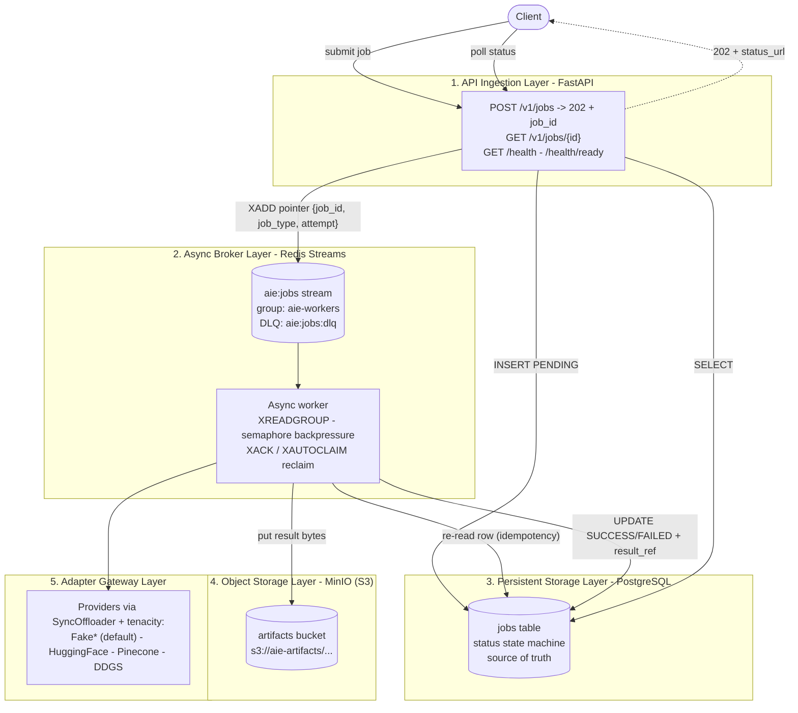

# Asynchronous AI Serving Engine

[](https://github.com/Darthvader-29/async-llm-inference/actions/workflows/ci.yml)


A production-grade, **framework-agnostic** engine that decouples the *ingestion*
of AI inference jobs (FastAPI → `202 Accepted` in milliseconds) from their
*execution* (async workers pulling from Redis Streams). Built on **Hexagonal
(Ports & Adapters)** principles: the core never imports a web framework, every
blocking SDK call is offloaded off the event loop, every network boundary
retries with backoff, and the entire system runs **with zero cloud keys** thanks
to in-process fakes and a local MinIO / PostgreSQL / Redis stack.

---

## Architecture



**The decoupling in one sentence:** the API does the absolute minimum on the
request path — insert a `PENDING` row and publish a *pointer* — then returns
`202` immediately; all the slow, blocking work happens later in the worker.

---

## Ports & Adapters

The core defines **ports** as `typing.Protocol` (structural typing — adapters
conform without importing the abstraction). Each port has a deterministic
**fake** (the dev/test/demo default, zero keys) and a **real** adapter that
activates only when credentials are configured.

| Port (Protocol)    | Real adapter                            | Fake / test double          | Backing tech         |
|--------------------|-----------------------------------------|-----------------------------|----------------------|
| `SyncOffloader`    | `ThreadOffloader` (`asyncio.to_thread`) | `RecordingOffloader` spy    | thread pool executor |
| `JobRepository`    | `SqlAlchemyJobRepository`               | (SQLite via aiosqlite)      | PostgreSQL / asyncpg |
| `JobQueue`         | `StreamProducer`                        | `fakeredis.aioredis`        | Redis Streams        |
| `ObjectStore`      | `S3ObjectStore` (boto3)                 | (real MinIO in int. tests)  | MinIO / S3           |
| `EmbeddingProvider`| `HuggingFaceEmbedding`                  | `FakeEmbedding`             | HF Inference API     |
| `LLMProvider`      | `HuggingFaceLLM`                        | `FakeLLM`                   | HF Inference API     |
| `VectorStore`      | `PineconeVectorStore`                   | `FakeVectorStore`           | Pinecone             |
| `SearchProvider`   | `DdgsSearch`                            | `FakeSearch`                | DuckDuckGo (ddgs)    |

> Adapters never touch their SDK except through `offloader.run(...)`, and every
> call is wrapped by `tenacity` retry on `TransientUpstreamError`. See
> [Phase 2](Docs/phases/phase-2-concurrency-retry-ports.md) and
> [Phase 4](Docs/phases/phase-4-object-store-providers.md).

---

## Quickstart

Requires [`uv`](https://docs.astral.sh/uv/getting-started/installation/), Docker
(Desktop on Windows), and Python 3.12+. **No cloud keys needed** — fakes are the
default.

### Option A — host dev loop (API + worker run on the host)

```bash
# 1. Install dependencies into a project virtualenv from the lockfile
uv sync

# 2. Start infrastructure (Postgres + Redis + MinIO + bucket) and run migrations
uv run poe up        # docker compose up -d postgres redis minio createbuckets
uv run poe migrate   # alembic upgrade head

# 3. Run the API and the worker (two terminals)
uv run poe api       # FastAPI on http://localhost:8000  (docs at /docs)
uv run poe worker    # async worker consuming the Redis stream
```

### Option B — full stack in containers (one command)

```bash
cp .env.example .env                 # PWSH: Copy-Item .env.example .env
docker compose up --build -d --wait  # infra -> migrate -> api + worker, gated on healthchecks
```

`--wait` blocks until every service is healthy (or a dependency fails) — real
readiness, not a fixed sleep. Tear down with `docker compose down`
(add `-v` to also delete the data volumes).

### Submit a job and watch it complete (zero external keys)

```bash
# Submit a RAG query (returns 202 + a job_id immediately)
curl -s -X POST http://localhost:8000/v1/jobs \
  -H "X-API-Key: local-dev-key" \
  -H "Content-Type: application/json" \
  -d '{"payload": {"job_type": "rag_query", "query": "What is hexagonal architecture?", "top_k": 3}}'

# Poll the status until it reads "success"; result_ref points into MinIO.
curl -s http://localhost:8000/v1/jobs/<job_id> -H "X-API-Key: local-dev-key"
```

On Windows, run the end-to-end smoke demo instead: `uv run poe smoke`
(`pwsh -File scripts/smoke.ps1`) — it POSTs a `rag_query`, then polls to a
terminal status. Inspect stored artifacts in the MinIO console at
**http://localhost:9001** (default dev credentials `minioadmin` / `minioadmin`).

> The example API key is `local-dev-key` — it must match `AIE_API_KEYS` in your
> `.env` (the `.env.example` default), or the request returns `401`.

---

## Design Decisions

### 1. Offloading is proven by a spy, not a stopwatch
Every adapter receives a `SyncOffloader` port. The production implementation,
`ThreadOffloader`, is a thin pass-through to `asyncio.to_thread`; the composition
root installs a sized `ThreadPoolExecutor` as the loop's default executor, so a
single code path satisfies both the spec's letter ("offload via `to_thread`") and
the need for a bounded pool. In tests we inject a `RecordingOffloader` that
records each call's `fn.__qualname__` and arguments and runs it inline. This lets
us assert *"the boto3 call was routed through the offloader"* **deterministically,
without measuring time** — no flaky "did coroutine A interleave with B?" timing
tests. (See `tests/support/offloader.py`, `tests/unit/adapters/test_offload_invariant.py`.)

### 2. Redis Streams (custom worker), not Celery/arq
We implement a small async worker directly on Redis Streams
(`XADD` / `XREADGROUP` / `XACK` / `XAUTOCLAIM`) with semaphore-bounded
backpressure, rather than adopting Celery or arq. Why: (a) it keeps the
dependency surface and operational model small and fully inspectable;
(b) consumer groups give us at-least-once delivery, orphan reclaim, and a natural
dead-letter path; (c) a single `consume_once()` method is a clean, deterministic
test seam we can drive exactly once against `fakeredis` — no broker daemon, no
beat scheduler, no opaque framework lifecycle to mock. Celery would have hidden
the very mechanics (ack, reclaim, backpressure) this project exists to
demonstrate.

### 3. Stream messages are pointers; Postgres is the source of truth
A stream entry carries only `{job_id, job_type, attempt}` — never the payload.
The full request, status, result reference, and error live in PostgreSQL. This
keeps the stream tiny and makes delivery semantics simple: because delivery is
at-least-once, the processor re-reads the row and an **idempotency guard** acks
and skips any job already in a terminal state. The database, not the queue, is
the arbiter of truth — so a redelivered or reclaimed message can never corrupt
state or double-charge an upstream provider.

### 4. Zero-cloud isolation by default
A Pydantic `model_validator` forces object storage to local MinIO
(`http://localhost:9000`, path-style) whenever `AIE_ENV != prod` and no S3
endpoint is configured. Inside containers, compose sets the endpoint explicitly
to the `minio` service name (`http://minio:9000`) — so the same code never
touches real AWS during dev, tests, or CI.

---

## Exit Criteria → Tests

Every claim the engine makes is backed by a concrete, deterministic test:

| Spec exit criterion | Proven by (test file) | Phase |
|---------------------|------------------------|-------|
| Deterministic concurrency gates (no clock-dependent async tests) | `tests/unit/test_concurrency.py`, `tests/unit/adapters/test_offload_invariant.py`, `tests/unit/test_retry.py` | 2, 4 |
| Zero-cloud isolation (dev auto-redirects S3 → MinIO) | `tests/unit/test_config.py` (redirect validator) | 1 |
| Zero resource leaking (clean startup/teardown) | `tests/unit/test_container_lifecycle.py`, `tests/integration/test_lifespan_pool.py` (`pool.checkedout() == 0`) | 6 |
| 202 ingestion in ms (no inline pipeline work) | `tests/unit/api/test_jobs.py` | 6 |
| `to_thread` + backoff at every boundary | `tests/unit/adapters/test_offload_invariant.py` (parametrized per method) | 4 |
| Decoupled processing (consume → adapters → S3 → status) | `tests/unit/test_processor.py`, `tests/unit/test_pipelines.py`, `tests/integration/test_worker_end_to_end.py` | 7 |
| At-least-once delivery is safe (redelivery/reclaim) | `tests/unit/broker/test_consumer_idempotency.py`, `tests/unit/broker/test_consumer_retry_dlq.py`, `tests/integration/test_broker_redis.py` | 5 |

Run the fast suite (no infra): `uv run poe test`.
Run integration (needs Docker): `uv run poe up && uv run poe migrate && uv run poe test-int`.

---

## Toolchain & Tasks

Python **3.12+**, managed with **uv**; tasks via **poethepoet** (`uv run poe <task>`);
lint/format **ruff**; types **mypy --strict**; tests **pytest + pytest-asyncio**.

| Task | What it does |
|------|--------------|
| `uv run poe check` | Local quality gate — lint + format-check + typecheck + fast tests (mirrors CI) |
| `uv run poe fmt` / `fmt-check` | Auto-format / verify formatting |
| `uv run poe lint` / `lint-fix` | Ruff lint / lint with safe fixes |
| `uv run poe typecheck` | `mypy src tests` |
| `uv run poe test` / `test-int` / `test-all` | Fast suite / integration suite / everything |
| `uv run poe up` / `down` / `down-v` | Infra up (infra only) / down / down + delete volumes |
| `uv run poe migrate` | `alembic upgrade head` |
| `uv run poe api` / `worker` | Run the API / the worker |
| `uv run poe smoke` | End-to-end smoke demo (`scripts/smoke.ps1`) |

List everything with `uv run poe --help`.

**Two test tiers.** Unit tests are the default and run with **zero network/Docker**
(sqlite via `aiosqlite`, `fakeredis.aioredis`, in-process fakes). Integration
tests require live infra and are gated behind the `integration` pytest marker.

---

## Project Layout

```
src/app/
├── container.py                 # AppContainer composition root (shared API + worker)
├── core/        config, concurrency (ThreadOffloader), retry, logging
├── domain/      models (InferenceJob state machine), chunking, exceptions
├── ports/       offloader, repository, queue, object_store, providers (Protocols)
├── adapters/    persistence/ broker/ object_store/ providers/
├── services/    ingestion, processor, pipelines
├── api/         app (factory + lifespan), dependencies, auth, schemas, routes/
└── worker/      __main__, runner
migrations/  (alembic async)   tests/{unit,integration,support}
docker/Dockerfile   docker-compose.yml   .github/workflows/ci.yml   scripts/smoke.ps1
```

The build plan and the full design rationale live in
[`Docs/implementation-plan.md`](Docs/implementation-plan.md) and the nine
per-phase documents under [`Docs/phases/`](Docs/phases/).
